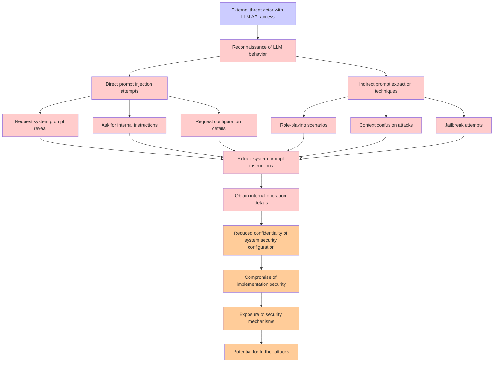

# Attack Tree: LLM07 System Prompt Leakage

**Threat ID**: 04330dd9-b830-45ae-8dcb-6149919ea8f0
**Statement**: An external threat actor who can interact with the LLM API can employ carefully crafted queries, which leads to extracting system prompt instructions and internal operation details, resulting in reduced confidentiality of system security configuration and implementation

## Attack Tree Diagram

## MITRE ATT&CK Mapping

This attack tree has been mapped to MITRE ATT&CK techniques:

### Request configuration details

- **Technique**: [T1012](https://attack.mitre.org/techniques/T1012/) - Query Registry
- **Tactic**: Discovery
- **Similarity Score**: 68.56%

### Direct prompt injection attempts

- **Technique**: [T1141](https://attack.mitre.org/techniques/T1141/) - Input Prompt
- **Tactic**: Credential Access
- **Similarity Score**: 50.36%

### Compromise of implementation security

- **Technique**: [T1211](https://attack.mitre.org/techniques/T1211/) - Exploitation for Defense Evasion
- **Tactic**: Defense Evasion
- **Similarity Score**: 65.07%
- **Mitigations (4):**
  - 🛡️ **Exploit Protection**
    Deploy capabilities that detect, block, and mitigate conditions indicative of software exploits. These capabilities aim ...
  - 🛡️ **Update Software**
    Software updates ensure systems are protected against known vulnerabilities by applying patches and upgrades provided by...
  - 🛡️ **Threat Intelligence Program**
    A Threat Intelligence Program enables organizations to proactively identify, analyze, and act on cyber threats by levera...
  - *1 more mitigation(s) available*

### Exposure of security mechanisms

- **Technique**: [T1211](https://attack.mitre.org/techniques/T1211/) - Exploitation for Defense Evasion
- **Tactic**: Defense Evasion
- **Similarity Score**: 75.00%
- **Mitigations (4):**
  - 🛡️ **Exploit Protection**
    Deploy capabilities that detect, block, and mitigate conditions indicative of software exploits. These capabilities aim ...
  - 🛡️ **Update Software**
    Software updates ensure systems are protected against known vulnerabilities by applying patches and upgrades provided by...
  - 🛡️ **Threat Intelligence Program**
    A Threat Intelligence Program enables organizations to proactively identify, analyze, and act on cyber threats by levera...
  - *1 more mitigation(s) available*

### Extract system prompt instructions

- **Technique**: [T1141](https://attack.mitre.org/techniques/T1141/) - Input Prompt
- **Tactic**: Credential Access
- **Similarity Score**: 48.20%

### Request system prompt reveal

- **Technique**: [T1082](https://attack.mitre.org/techniques/T1082/) - System Information Discovery
- **Tactic**: Discovery
- **Similarity Score**: 44.20%

### Reduced confidentiality of system security configuration

- **Technique**: [T1089](https://attack.mitre.org/techniques/T1089/) - Disabling Security Tools
- **Tactic**: Defense Evasion
- **Similarity Score**: 67.69%

### Potential for further attacks

- **Technique**: [T1584.005](https://attack.mitre.org/techniques/T1584/005/) - Botnet
- **Tactic**: Resource Development
- **Similarity Score**: 54.38%
- **Mitigations (1):**
  - 🛡️ **Pre-compromise**
    Pre-compromise mitigations involve proactive measures and defenses implemented to prevent adversaries from successfully ...

### Context confusion attacks

- **Technique**: [T1036](https://attack.mitre.org/techniques/T1036/) - Masquerading
- **Tactic**: Defense Evasion
- **Similarity Score**: 46.19%
- **Mitigations (8):**
  - 🛡️ **Audit**
    Auditing is the process of recording activity and systematically reviewing and analyzing the activity and system configu...
  - 🛡️ **User Account Management**
    User Account Management involves implementing and enforcing policies for the lifecycle of user accounts, including creat...
  - 🛡️ **User Training**
    User Training involves educating employees and contractors on recognizing, reporting, and preventing cyber threats that ...
  - *5 more mitigation(s) available*

### Role-playing scenarios

- **Technique**: [T1591.004](https://attack.mitre.org/techniques/T1591/004/) - Identify Roles
- **Tactic**: Reconnaissance
- **Similarity Score**: 33.84%
- **Mitigations (1):**
  - 🛡️ **Pre-compromise**
    Pre-compromise mitigations involve proactive measures and defenses implemented to prevent adversaries from successfully ...

### Ask for internal instructions

- **Technique**: [T1652](https://attack.mitre.org/techniques/T1652/) - Device Driver Discovery
- **Tactic**: Discovery
- **Similarity Score**: 37.35%

### Indirect prompt extraction techniques

- **Technique**: [T1115](https://attack.mitre.org/techniques/T1115/) - Clipboard Data
- **Tactic**: Collection
- **Similarity Score**: 37.43%

### Jailbreak attempts

- **Technique**: [T1601.002](https://attack.mitre.org/techniques/T1601/002/) - Downgrade System Image
- **Tactic**: Defense Evasion
- **Similarity Score**: 40.73%
- **Mitigations (6):**
  - 🛡️ **Multi-factor Authentication**
    Multi-Factor Authentication (MFA) enhances security by requiring users to provide at least two forms of verification to ...
  - 🛡️ **Code Signing**
    Code Signing is a security process that ensures the authenticity and integrity of software by digitally signing executab...
  - 🛡️ **Credential Access Protection**
    Credential Access Protection focuses on implementing measures to prevent adversaries from obtaining credentials, such as...
  - *3 more mitigation(s) available*

### Obtain internal operation details

- **Technique**: [T1057](https://attack.mitre.org/techniques/T1057/) - Process Discovery
- **Tactic**: Discovery
- **Similarity Score**: 57.80%

### External threat actor with LLM API access

- **Technique**: [T1059.009](https://attack.mitre.org/techniques/T1059/009/) - Cloud API
- **Tactic**: Execution
- **Similarity Score**: 40.95%
- **Mitigations (2):**
  - 🛡️ **Execution Prevention**
    Prevent the execution of unauthorized or malicious code on systems by implementing application control, script blocking,...
  - 🛡️ **Privileged Account Management**
    Privileged Account Management focuses on implementing policies, controls, and tools to securely manage privileged accoun...

### Reconnaissance of LLM behavior

- **Technique**: [T1177](https://attack.mitre.org/techniques/T1177/) - LSASS Driver
- **Tactic**: Execution, Persistence
- **Similarity Score**: 42.78%

*Total technique mappings: 16 | Mitigations found: 26*

## Attack Path Analysis

Review this attack tree to:
1. Identify critical attack paths
2. Implement appropriate security controls
3. Monitor for indicators
4. Develop incident response procedures

---
*Generated by ThreatForest*
