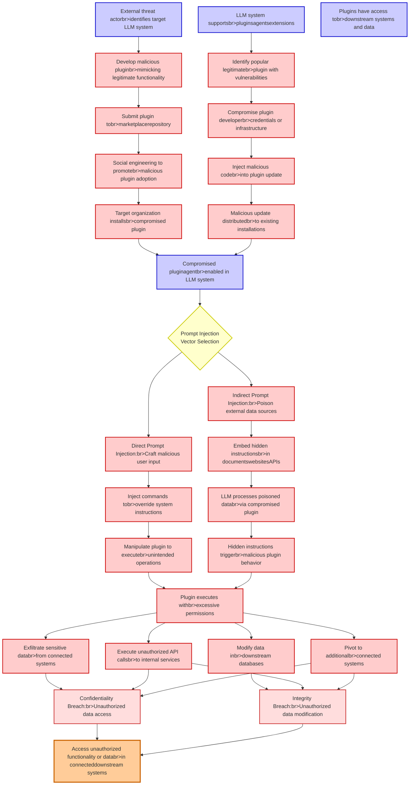

# Attack Tree: LLM01 Prompt Injection, LLM06 Excessive Agency

**Threat ID**: 0a054002-03d9-41cb-8b1d-1c9492c3fbb6
**Statement**: An external threat actor who enables compromised LLM plugins or agents in an LLM system can manipulate it via indirect or direct prompt injection, which leads to access unauthorized functionality or data, resulting in reduced confidentiality and/or integrity of connected and downstream systems and data

## Attack Tree Diagram

## MITRE ATT&CK Mapping

This attack tree has been mapped to MITRE ATT&CK techniques:

### Submit plugin tobr>marketplacerepository

- **Technique**: [T1213.003](https://attack.mitre.org/techniques/T1213/003/) - Code Repositories
- **Tactic**: Collection
- **Similarity Score**: 49.39%
- **Mitigations (4):**
  - 🛡️ **User Training**
    User Training involves educating employees and contractors on recognizing, reporting, and preventing cyber threats that ...
  - 🛡️ **Audit**
    Auditing is the process of recording activity and systematically reviewing and analyzing the activity and system configu...
  - 🛡️ **User Account Management**
    User Account Management involves implementing and enforcing policies for the lifecycle of user accounts, including creat...
  - *1 more mitigation(s) available*

### Access unauthorized functionality or databr>in connecteddownstream systems

- **Technique**: [T1029](https://attack.mitre.org/techniques/T1029/) - Scheduled Transfer
- **Tactic**: Exfiltration
- **Similarity Score**: 58.44%
- **Mitigations (1):**
  - 🛡️ **Network Intrusion Prevention**
    Use intrusion detection signatures to block traffic at network boundaries.

### Exfiltrate sensitive databr>from connected systems

- **Technique**: [T1020](https://attack.mitre.org/techniques/T1020/) - Automated Exfiltration
- **Tactic**: Exfiltration
- **Similarity Score**: 79.78%

### Direct Prompt Injection:br>Craft malicious user input

- **Technique**: [T1674](https://attack.mitre.org/techniques/T1674/) - Input Injection
- **Tactic**: Execution
- **Similarity Score**: 56.83%
- **Mitigations (2):**
  - 🛡️ **Limit Hardware Installation**
    Prevent unauthorized users or groups from installing or using hardware, such as external drives, peripheral devices, or ...
  - 🛡️ **Execution Prevention**
    Prevent the execution of unauthorized or malicious code on systems by implementing application control, script blocking,...

### Identify popular legitimatebr>plugin with vulnerabilities

- **Technique**: [T1595.002](https://attack.mitre.org/techniques/T1595/002/) - Vulnerability Scanning
- **Tactic**: Reconnaissance
- **Similarity Score**: 56.43%
- **Mitigations (1):**
  - 🛡️ **Pre-compromise**
    Pre-compromise mitigations involve proactive measures and defenses implemented to prevent adversaries from successfully ...

### Confidentiality Breach:br>Unauthorized data access

- **Technique**: [T1565.002](https://attack.mitre.org/techniques/T1565/002/) - Transmitted Data Manipulation
- **Tactic**: Impact
- **Similarity Score**: 61.21%
- **Mitigations (1):**
  - 🛡️ **Encrypt Sensitive Information**
    Protect sensitive information at rest, in transit, and during processing by using strong encryption algorithms. Encrypti...

### Social engineering to promotebr>malicious plugin adoption

- **Technique**: [T1587.001](https://attack.mitre.org/techniques/T1587/001/) - Malware
- **Tactic**: Resource Development
- **Similarity Score**: 54.72%
- **Mitigations (1):**
  - 🛡️ **Pre-compromise**
    Pre-compromise mitigations involve proactive measures and defenses implemented to prevent adversaries from successfully ...

### Plugin executes withbr>excessive permissions

- **Technique**: [T1548.006](https://attack.mitre.org/techniques/T1548/006/) - TCC Manipulation
- **Tactic**: Defense Evasion, Privilege Escalation
- **Similarity Score**: 75.37%
- **Mitigations (3):**
  - 🛡️ **Privileged Account Management**
    Privileged Account Management focuses on implementing policies, controls, and tools to securely manage privileged accoun...
  - 🛡️ **Audit**
    Auditing is the process of recording activity and systematically reviewing and analyzing the activity and system configu...
  - 🛡️ **Restrict File and Directory Permissions**
    Restricting file and directory permissions involves setting access controls at the file system level to limit which user...

### Manipulate plugin to executebr>unintended operations

- **Technique**: [T1202](https://attack.mitre.org/techniques/T1202/) - Indirect Command Execution
- **Tactic**: Defense Evasion
- **Similarity Score**: 44.10%

### Malicious update distributedbr>to existing installations

- **Technique**: [T1017](https://attack.mitre.org/techniques/T1017/) - Application Deployment Software
- **Tactic**: Lateral Movement
- **Similarity Score**: 51.45%

### Pivot to additionalbr>connected systems

- **Technique**: [T1018](https://attack.mitre.org/techniques/T1018/) - Remote System Discovery
- **Tactic**: Discovery
- **Similarity Score**: 48.96%

### LLM system supportsbr>pluginsagentsextensions

- **Technique**: [T1546.006](https://attack.mitre.org/techniques/T1546/006/) - LC_LOAD_DYLIB Addition
- **Tactic**: Privilege Escalation, Persistence
- **Similarity Score**: 56.04%
- **Mitigations (3):**
  - 🛡️ **Audit**
    Auditing is the process of recording activity and systematically reviewing and analyzing the activity and system configu...
  - 🛡️ **Execution Prevention**
    Prevent the execution of unauthorized or malicious code on systems by implementing application control, script blocking,...
  - 🛡️ **Code Signing**
    Code Signing is a security process that ensures the authenticity and integrity of software by digitally signing executab...

### External threat actorbr>identifies target LLM system

- **Technique**: [T1082](https://attack.mitre.org/techniques/T1082/) - System Information Discovery
- **Tactic**: Discovery
- **Similarity Score**: 56.39%

### Compromised pluginagentbr>enabled in LLM system

- **Technique**: [T1547.006](https://attack.mitre.org/techniques/T1547/006/) - Kernel Modules and Extensions
- **Tactic**: Persistence, Privilege Escalation
- **Similarity Score**: 65.90%
- **Mitigations (4):**
  - 🛡️ **Privileged Account Management**
    Privileged Account Management focuses on implementing policies, controls, and tools to securely manage privileged accoun...
  - 🛡️ **User Account Management**
    User Account Management involves implementing and enforcing policies for the lifecycle of user accounts, including creat...
  - 🛡️ **Antivirus/Antimalware**
    Antivirus/Antimalware solutions utilize signatures, heuristics, and behavioral analysis to detect, block, and remediate ...
  - *1 more mitigation(s) available*

### LLM processes poisoned databr>via compromised plugin

- **Technique**: [T1565.003](https://attack.mitre.org/techniques/T1565/003/) - Runtime Data Manipulation
- **Tactic**: Impact
- **Similarity Score**: 46.76%
- **Mitigations (2):**
  - 🛡️ **Network Segmentation**
    Network segmentation involves dividing a network into smaller, isolated segments to control and limit the flow of traffi...
  - 🛡️ **Restrict File and Directory Permissions**
    Restricting file and directory permissions involves setting access controls at the file system level to limit which user...

### Integrity Breach:br>Unauthorized data modification

- **Technique**: [T1565.001](https://attack.mitre.org/techniques/T1565/001/) - Stored Data Manipulation
- **Tactic**: Impact
- **Similarity Score**: 72.66%
- **Mitigations (3):**
  - 🛡️ **Restrict File and Directory Permissions**
    Restricting file and directory permissions involves setting access controls at the file system level to limit which user...
  - 🛡️ **Remote Data Storage**
    Remote Data Storage focuses on moving critical data, such as security logs and sensitive files, to secure, off-host loca...
  - 🛡️ **Encrypt Sensitive Information**
    Protect sensitive information at rest, in transit, and during processing by using strong encryption algorithms. Encrypti...

### Plugins have access tobr>downstream systems and data

- **Technique**: [T1074.001](https://attack.mitre.org/techniques/T1074/001/) - Local Data Staging
- **Tactic**: Collection
- **Similarity Score**: 68.59%

### Inject commands tobr>override system instructions

- **Technique**: [T1547.006](https://attack.mitre.org/techniques/T1547/006/) - Kernel Modules and Extensions
- **Tactic**: Persistence, Privilege Escalation
- **Similarity Score**: 56.69%
- **Mitigations (4):**
  - 🛡️ **Privileged Account Management**
    Privileged Account Management focuses on implementing policies, controls, and tools to securely manage privileged accoun...
  - 🛡️ **User Account Management**
    User Account Management involves implementing and enforcing policies for the lifecycle of user accounts, including creat...
  - 🛡️ **Antivirus/Antimalware**
    Antivirus/Antimalware solutions utilize signatures, heuristics, and behavioral analysis to detect, block, and remediate ...
  - *1 more mitigation(s) available*

### Indirect Prompt Injection:br>Poison external data sources

- **Technique**: [T1559.002](https://attack.mitre.org/techniques/T1559/002/) - Dynamic Data Exchange
- **Tactic**: Execution
- **Similarity Score**: 48.61%
- **Mitigations (4):**
  - 🛡️ **Behavior Prevention on Endpoint**
    Behavior Prevention on Endpoint refers to the use of technologies and strategies to detect and block potentially malicio...
  - 🛡️ **Application Isolation and Sandboxing**
    Application Isolation and Sandboxing refers to the technique of restricting the execution of code to a controlled and is...
  - 🛡️ **Software Configuration**
    Software configuration refers to making security-focused adjustments to the settings of applications, middleware, databa...
  - *1 more mitigation(s) available*

### Modify data inbr>downstream databases

- **Technique**: [T1492](https://attack.mitre.org/techniques/T1492/) - Stored Data Manipulation
- **Tactic**: Impact
- **Similarity Score**: 76.08%

### Embed hidden instructionsbr>in documentswebsitesAPIs

- **Technique**: [T1223](https://attack.mitre.org/techniques/T1223/) - Compiled HTML File
- **Tactic**: Defense Evasion, Execution
- **Similarity Score**: 63.94%

### Execute unauthorized API callsbr>to internal services

- **Technique**: [T1035](https://attack.mitre.org/techniques/T1035/) - Service Execution
- **Tactic**: Execution
- **Similarity Score**: 51.92%

### Inject malicious codebr>into plugin update

- **Technique**: [T1554](https://attack.mitre.org/techniques/T1554/) - Compromise Host Software Binary
- **Tactic**: Persistence
- **Similarity Score**: 52.43%
- **Mitigations (1):**
  - 🛡️ **Code Signing**
    Code Signing is a security process that ensures the authenticity and integrity of software by digitally signing executab...

### Target organization installsbr>compromised plugin

- **Technique**: [T1118](https://attack.mitre.org/techniques/T1118/) - InstallUtil
- **Tactic**: Defense Evasion, Execution
- **Similarity Score**: 59.41%

### Develop malicious pluginbr>mimicking legitimate functionality

- **Technique**: [T1176](https://attack.mitre.org/techniques/T1176/) - Software Extensions
- **Tactic**: Persistence
- **Similarity Score**: 54.23%
- **Mitigations (5):**
  - 🛡️ **Limit Software Installation**
    Prevent users or groups from installing unauthorized or unapproved software to reduce the risk of introducing malicious ...
  - 🛡️ **Audit**
    Auditing is the process of recording activity and systematically reviewing and analyzing the activity and system configu...
  - 🛡️ **User Training**
    User Training involves educating employees and contractors on recognizing, reporting, and preventing cyber threats that ...
  - *2 more mitigation(s) available*

### Hidden instructions triggerbr>malicious plugin behavior

- **Technique**: [T1117](https://attack.mitre.org/techniques/T1117/) - Regsvr32
- **Tactic**: Defense Evasion, Execution
- **Similarity Score**: 50.15%

### Compromise plugin developerbr>credentials or infrastructure

- **Technique**: [T1556.003](https://attack.mitre.org/techniques/T1556/003/) - Pluggable Authentication Modules
- **Tactic**: Credential Access, Defense Evasion, Persistence
- **Similarity Score**: 75.73%
- **Mitigations (2):**
  - 🛡️ **Multi-factor Authentication**
    Multi-Factor Authentication (MFA) enhances security by requiring users to provide at least two forms of verification to ...
  - 🛡️ **Privileged Account Management**
    Privileged Account Management focuses on implementing policies, controls, and tools to securely manage privileged accoun...

*Total technique mappings: 27 | Mitigations found: 41*

## Attack Path Analysis

Review this attack tree to:
1. Identify critical attack paths
2. Implement appropriate security controls
3. Monitor for indicators
4. Develop incident response procedures

---
*Generated by ThreatForest*
