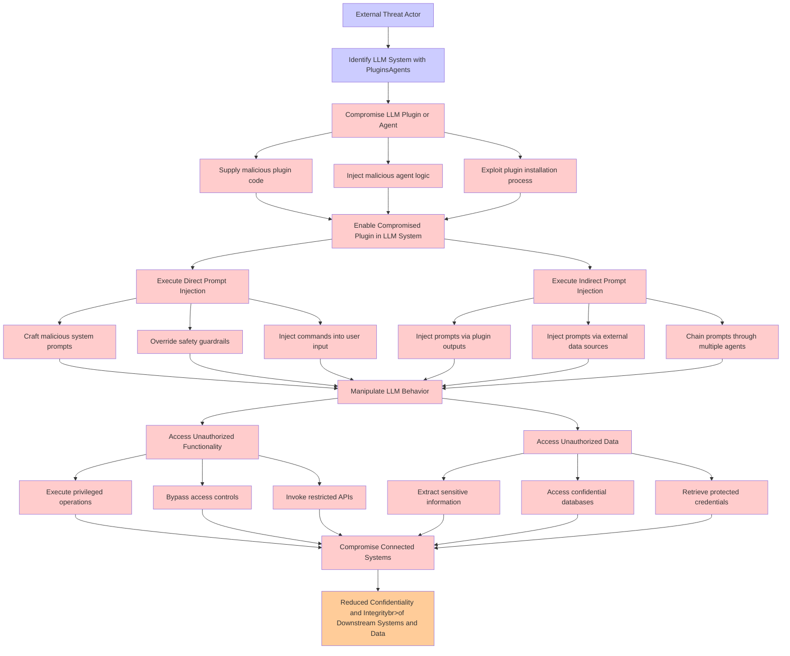

# Attack Tree: LLM01 Prompt Injection, LLM06 Excessive Agency

**Threat ID**: 0a054002-03d9-41cb-8b1d-1c9492c3fbb6
**Statement**: An external threat actor who enables compromised LLM plugins or agents in an LLM system can manipulate it via indirect or direct prompt injection, which leads to access unauthorized functionality or data, resulting in reduced confidentiality and/or integrity of connected and downstream systems and data

## Attack Tree Diagram

## MITRE ATT&CK Mapping

This attack tree has been mapped to MITRE ATT&CK techniques:

### Supply malicious plugin code

- **Technique**: [T1176](https://attack.mitre.org/techniques/T1176/) - Software Extensions
- **Tactic**: Persistence
- **Similarity Score**: 55.35%
- **Mitigations (5):**
  - 🛡️ **Limit Software Installation**
    Prevent users or groups from installing unauthorized or unapproved software to reduce the risk of introducing malicious ...
  - 🛡️ **Audit**
    Auditing is the process of recording activity and systematically reviewing and analyzing the activity and system configu...
  - 🛡️ **User Training**
    User Training involves educating employees and contractors on recognizing, reporting, and preventing cyber threats that ...
  - *2 more mitigation(s) available*

### Access Unauthorized Data

- **Technique**: [T1530](https://attack.mitre.org/techniques/T1530/) - Data from Cloud Storage
- **Tactic**: Collection
- **Similarity Score**: 57.45%
- **Mitigations (6):**
  - 🛡️ **User Account Management**
    User Account Management involves implementing and enforcing policies for the lifecycle of user accounts, including creat...
  - 🛡️ **Encrypt Sensitive Information**
    Protect sensitive information at rest, in transit, and during processing by using strong encryption algorithms. Encrypti...
  - 🛡️ **Restrict File and Directory Permissions**
    Restricting file and directory permissions involves setting access controls at the file system level to limit which user...
  - *3 more mitigation(s) available*

### Craft malicious system prompts

- **Technique**: [T1141](https://attack.mitre.org/techniques/T1141/) - Input Prompt
- **Tactic**: Credential Access
- **Similarity Score**: 58.41%

### Access confidential databases

- **Technique**: [T1213.006](https://attack.mitre.org/techniques/T1213/006/) - Databases
- **Tactic**: Collection
- **Similarity Score**: 66.62%
- **Mitigations (5):**
  - 🛡️ **User Training**
    User Training involves educating employees and contractors on recognizing, reporting, and preventing cyber threats that ...
  - 🛡️ **Encrypt Sensitive Information**
    Protect sensitive information at rest, in transit, and during processing by using strong encryption algorithms. Encrypti...
  - 🛡️ **Software Configuration**
    Software configuration refers to making security-focused adjustments to the settings of applications, middleware, databa...
  - *2 more mitigation(s) available*

### Exploit plugin installation process

- **Technique**: [T1218.004](https://attack.mitre.org/techniques/T1218/004/) - InstallUtil
- **Tactic**: Defense Evasion
- **Similarity Score**: 60.85%
- **Mitigations (2):**
  - 🛡️ **Execution Prevention**
    Prevent the execution of unauthorized or malicious code on systems by implementing application control, script blocking,...
  - 🛡️ **Disable or Remove Feature or Program**
    Disable or remove unnecessary and potentially vulnerable software, features, or services to reduce the attack surface an...

### Inject prompts via plugin outputs

- **Technique**: [T1141](https://attack.mitre.org/techniques/T1141/) - Input Prompt
- **Tactic**: Credential Access
- **Similarity Score**: 48.41%

### Execute privileged operations

- **Technique**: [T1548.002](https://attack.mitre.org/techniques/T1548/002/) - Bypass User Account Control
- **Tactic**: Privilege Escalation, Defense Evasion
- **Similarity Score**: 73.48%
- **Mitigations (4):**
  - 🛡️ **Update Software**
    Software updates ensure systems are protected against known vulnerabilities by applying patches and upgrades provided by...
  - 🛡️ **Audit**
    Auditing is the process of recording activity and systematically reviewing and analyzing the activity and system configu...
  - 🛡️ **User Account Control**
    User Account Control (UAC) is a security feature in Microsoft Windows that prevents unauthorized changes to the operatin...
  - *1 more mitigation(s) available*

### Inject prompts via external data sources

- **Technique**: [T1559.002](https://attack.mitre.org/techniques/T1559/002/) - Dynamic Data Exchange
- **Tactic**: Execution
- **Similarity Score**: 49.29%
- **Mitigations (4):**
  - 🛡️ **Behavior Prevention on Endpoint**
    Behavior Prevention on Endpoint refers to the use of technologies and strategies to detect and block potentially malicio...
  - 🛡️ **Application Isolation and Sandboxing**
    Application Isolation and Sandboxing refers to the technique of restricting the execution of code to a controlled and is...
  - 🛡️ **Software Configuration**
    Software configuration refers to making security-focused adjustments to the settings of applications, middleware, databa...
  - *1 more mitigation(s) available*

### External Threat Actor

- **Technique**: [T1588.001](https://attack.mitre.org/techniques/T1588/001/) - Malware
- **Tactic**: Resource Development
- **Similarity Score**: 41.53%
- **Mitigations (1):**
  - 🛡️ **Pre-compromise**
    Pre-compromise mitigations involve proactive measures and defenses implemented to prevent adversaries from successfully ...

### Compromise LLM Plugin or Agent

- **Technique**: [T1177](https://attack.mitre.org/techniques/T1177/) - LSASS Driver
- **Tactic**: Execution, Persistence
- **Similarity Score**: 51.77%

### Invoke restricted APIs

- **Technique**: [T1106](https://attack.mitre.org/techniques/T1106/) - Native API
- **Tactic**: Execution
- **Similarity Score**: 49.16%
- **Mitigations (2):**
  - 🛡️ **Execution Prevention**
    Prevent the execution of unauthorized or malicious code on systems by implementing application control, script blocking,...
  - 🛡️ **Behavior Prevention on Endpoint**
    Behavior Prevention on Endpoint refers to the use of technologies and strategies to detect and block potentially malicio...

### Reduced Confidentiality and Integritybr>of Downstream Systems and Data

- **Technique**: [T1486](https://attack.mitre.org/techniques/T1486/) - Data Encrypted for Impact
- **Tactic**: Impact
- **Similarity Score**: 69.26%
- **Mitigations (2):**
  - 🛡️ **Behavior Prevention on Endpoint**
    Behavior Prevention on Endpoint refers to the use of technologies and strategies to detect and block potentially malicio...
  - 🛡️ **Data Backup**
    Data Backup involves taking and securely storing backups of data from end-user systems and critical servers. It ensures ...

### Chain prompts through multiple agents

- **Technique**: [T1059.003](https://attack.mitre.org/techniques/T1059/003/) - Windows Command Shell
- **Tactic**: Execution
- **Similarity Score**: 48.09%
- **Mitigations (1):**
  - 🛡️ **Execution Prevention**
    Prevent the execution of unauthorized or malicious code on systems by implementing application control, script blocking,...

### Retrieve protected credentials

- **Technique**: [T1552](https://attack.mitre.org/techniques/T1552/) - Unsecured Credentials
- **Tactic**: Credential Access
- **Similarity Score**: 80.66%
- **Mitigations (11):**
  - 🛡️ **Encrypt Sensitive Information**
    Protect sensitive information at rest, in transit, and during processing by using strong encryption algorithms. Encrypti...
  - 🛡️ **Update Software**
    Software updates ensure systems are protected against known vulnerabilities by applying patches and upgrades provided by...
  - 🛡️ **User Training**
    User Training involves educating employees and contractors on recognizing, reporting, and preventing cyber threats that ...
  - *8 more mitigation(s) available*

### Override safety guardrails

- **Technique**: [T1480](https://attack.mitre.org/techniques/T1480/) - Execution Guardrails
- **Tactic**: Defense Evasion
- **Similarity Score**: 52.89%
- **Mitigations (1):**
  - 🛡️ **Do Not Mitigate**
    The Do Not Mitigate category highlights scenarios where attempting to mitigate a specific technique may inadvertently in...

### Enable Compromised Plugin in LLM System

- **Technique**: [T1117](https://attack.mitre.org/techniques/T1117/) - Regsvr32
- **Tactic**: Defense Evasion, Execution
- **Similarity Score**: 54.05%

### Compromise Connected Systems

- **Technique**: [T1092](https://attack.mitre.org/techniques/T1092/) - Communication Through Removable Media
- **Tactic**: Command And Control
- **Similarity Score**: 56.40%
- **Mitigations (2):**
  - 🛡️ **Disable or Remove Feature or Program**
    Disable or remove unnecessary and potentially vulnerable software, features, or services to reduce the attack surface an...
  - 🛡️ **Operating System Configuration**
    Operating System Configuration involves adjusting system settings and hardening the default configurations of an operati...

### Manipulate LLM Behavior

- **Technique**: [T1177](https://attack.mitre.org/techniques/T1177/) - LSASS Driver
- **Tactic**: Execution, Persistence
- **Similarity Score**: 50.82%

### Execute Indirect Prompt Injection

- **Technique**: [T1059](https://attack.mitre.org/techniques/T1059/) - Command and Scripting Interpreter
- **Tactic**: Execution
- **Similarity Score**: 49.14%
- **Mitigations (9):**
  - 🛡️ **Limit Software Installation**
    Prevent users or groups from installing unauthorized or unapproved software to reduce the risk of introducing malicious ...
  - 🛡️ **Code Signing**
    Code Signing is a security process that ensures the authenticity and integrity of software by digitally signing executab...
  - 🛡️ **Disable or Remove Feature or Program**
    Disable or remove unnecessary and potentially vulnerable software, features, or services to reduce the attack surface an...
  - *6 more mitigation(s) available*

### Inject malicious agent logic

- **Technique**: [T1218.013](https://attack.mitre.org/techniques/T1218/013/) - Mavinject
- **Tactic**: Defense Evasion
- **Similarity Score**: 48.85%
- **Mitigations (2):**
  - 🛡️ **Disable or Remove Feature or Program**
    Disable or remove unnecessary and potentially vulnerable software, features, or services to reduce the attack surface an...
  - 🛡️ **Execution Prevention**
    Prevent the execution of unauthorized or malicious code on systems by implementing application control, script blocking,...

### Bypass access controls

- **Technique**: [T1548](https://attack.mitre.org/techniques/T1548/) - Abuse Elevation Control Mechanism
- **Tactic**: Privilege Escalation, Defense Evasion
- **Similarity Score**: 63.04%
- **Mitigations (8):**
  - 🛡️ **Execution Prevention**
    Prevent the execution of unauthorized or malicious code on systems by implementing application control, script blocking,...
  - 🛡️ **Operating System Configuration**
    Operating System Configuration involves adjusting system settings and hardening the default configurations of an operati...
  - 🛡️ **Update Software**
    Software updates ensure systems are protected against known vulnerabilities by applying patches and upgrades provided by...
  - *5 more mitigation(s) available*

### Access Unauthorized Functionality

- **Technique**: [T1021.003](https://attack.mitre.org/techniques/T1021/003/) - Distributed Component Object Model
- **Tactic**: Lateral Movement
- **Similarity Score**: 55.50%
- **Mitigations (4):**
  - 🛡️ **Disable or Remove Feature or Program**
    Disable or remove unnecessary and potentially vulnerable software, features, or services to reduce the attack surface an...
  - 🛡️ **Application Isolation and Sandboxing**
    Application Isolation and Sandboxing refers to the technique of restricting the execution of code to a controlled and is...
  - 🛡️ **Network Segmentation**
    Network segmentation involves dividing a network into smaller, isolated segments to control and limit the flow of traffi...
  - *1 more mitigation(s) available*

### Extract sensitive information

- **Technique**: [T1048](https://attack.mitre.org/techniques/T1048/) - Exfiltration Over Alternative Protocol
- **Tactic**: Exfiltration
- **Similarity Score**: 55.81%
- **Mitigations (6):**
  - 🛡️ **Network Segmentation**
    Network segmentation involves dividing a network into smaller, isolated segments to control and limit the flow of traffi...
  - 🛡️ **Data Loss Prevention**
    Data Loss Prevention (DLP) involves implementing strategies and technologies to identify, categorize, monitor, and contr...
  - 🛡️ **Filter Network Traffic**
    Employ network appliances and endpoint software to filter ingress, egress, and lateral network traffic. This includes pr...
  - *3 more mitigation(s) available*

### Inject commands into user input

- **Technique**: [T1674](https://attack.mitre.org/techniques/T1674/) - Input Injection
- **Tactic**: Execution
- **Similarity Score**: 61.21%
- **Mitigations (2):**
  - 🛡️ **Limit Hardware Installation**
    Prevent unauthorized users or groups from installing or using hardware, such as external drives, peripheral devices, or ...
  - 🛡️ **Execution Prevention**
    Prevent the execution of unauthorized or malicious code on systems by implementing application control, script blocking,...

### Identify LLM System with PluginsAgents

- **Technique**: [T1082](https://attack.mitre.org/techniques/T1082/) - System Information Discovery
- **Tactic**: Discovery
- **Similarity Score**: 60.04%

### Execute Direct Prompt Injection

- **Technique**: [T1059](https://attack.mitre.org/techniques/T1059/) - Command and Scripting Interpreter
- **Tactic**: Execution
- **Similarity Score**: 50.52%
- **Mitigations (9):**
  - 🛡️ **Limit Software Installation**
    Prevent users or groups from installing unauthorized or unapproved software to reduce the risk of introducing malicious ...
  - 🛡️ **Code Signing**
    Code Signing is a security process that ensures the authenticity and integrity of software by digitally signing executab...
  - 🛡️ **Disable or Remove Feature or Program**
    Disable or remove unnecessary and potentially vulnerable software, features, or services to reduce the attack surface an...
  - *6 more mitigation(s) available*

*Total technique mappings: 26 | Mitigations found: 86*

## Attack Path Analysis

Review this attack tree to:
1. Identify critical attack paths
2. Implement appropriate security controls
3. Monitor for indicators
4. Develop incident response procedures

---
*Generated by ThreatForest*
