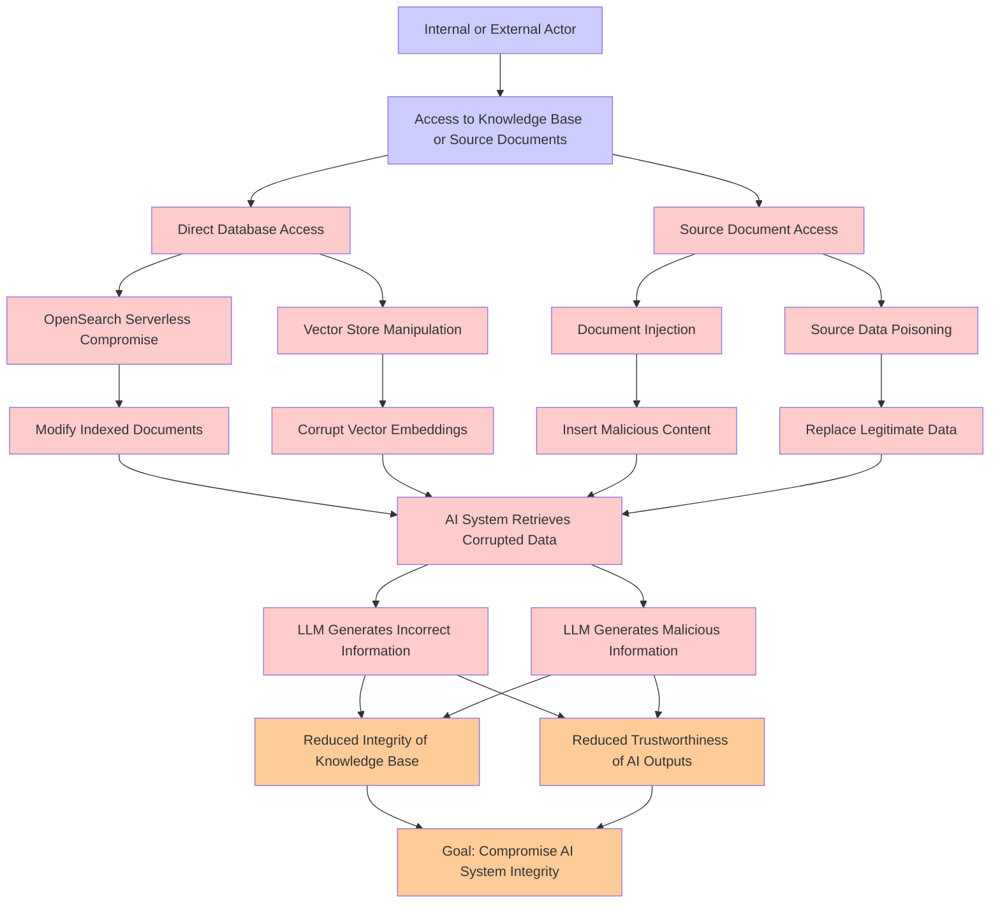

# Attack Tree: LLM08 VectorEmbedding Weakness

**Threat ID**: 12c09063-e456-445d-adee-5b84840fa213
**Statement**: An internal or external actor with access to the knowledge base or its source documents can corrupt or manipulate the RAG knowledge base (e.g. Amazon OpenSearch Serverless, Internet lookup), which leads to AI system providing incorrect or malicious information, resulting in reduced integrity and/or trustworthiness of AI system's knowledge base and outputs.

## Attack Tree Diagram

## MITRE ATT&CK Mapping

This attack tree has been mapped to MITRE ATT&CK techniques:

### Replace Legitimate Data

- **Technique**: [T1565.002](https://attack.mitre.org/techniques/T1565/002/) - Transmitted Data Manipulation
- **Tactic**: Impact
- **Similarity Score**: 65.55%
- **Mitigations (1):**
  - 🛡️ **Encrypt Sensitive Information**
    Protect sensitive information at rest, in transit, and during processing by using strong encryption algorithms. Encrypti...

### LLM Generates Incorrect Information

- **Technique**: [T1161](https://attack.mitre.org/techniques/T1161/) - LC_LOAD_DYLIB Addition
- **Tactic**: Persistence
- **Similarity Score**: 36.39%

### OpenSearch Serverless Compromise

- **Technique**: [T1593.002](https://attack.mitre.org/techniques/T1593/002/) - Search Engines
- **Tactic**: Reconnaissance
- **Similarity Score**: 65.41%
- **Mitigations (1):**
  - 🛡️ **Pre-compromise**
    Pre-compromise mitigations involve proactive measures and defenses implemented to prevent adversaries from successfully ...

### Internal or External Actor

- **Technique**: [T1104](https://attack.mitre.org/techniques/T1104/) - Multi-Stage Channels
- **Tactic**: Command And Control
- **Similarity Score**: 37.17%
- **Mitigations (1):**
  - 🛡️ **Network Intrusion Prevention**
    Use intrusion detection signatures to block traffic at network boundaries.

### Insert Malicious Content

- **Technique**: [T1204.004](https://attack.mitre.org/techniques/T1204/004/) - Malicious Copy and Paste
- **Tactic**: Execution
- **Similarity Score**: 55.72%
- **Mitigations (3):**
  - 🛡️ **Execution Prevention**
    Prevent the execution of unauthorized or malicious code on systems by implementing application control, script blocking,...
  - 🛡️ **Network Intrusion Prevention**
    Use intrusion detection signatures to block traffic at network boundaries.
  - 🛡️ **Restrict Web-Based Content**
    Restricting web-based content involves enforcing policies and technologies that limit access to potentially malicious we...

### Goal: Compromise AI System Integrity

- **Technique**: [T1601.001](https://attack.mitre.org/techniques/T1601/001/) - Patch System Image
- **Tactic**: Defense Evasion
- **Similarity Score**: 58.21%
- **Mitigations (6):**
  - 🛡️ **Boot Integrity**
    Boot Integrity ensures that a system starts securely by verifying the integrity of its boot process, operating system, a...
  - 🛡️ **Code Signing**
    Code Signing is a security process that ensures the authenticity and integrity of software by digitally signing executab...
  - 🛡️ **Credential Access Protection**
    Credential Access Protection focuses on implementing measures to prevent adversaries from obtaining credentials, such as...
  - *3 more mitigation(s) available*

### LLM Generates Malicious Information

- **Technique**: [T1027.004](https://attack.mitre.org/techniques/T1027/004/) - Compile After Delivery
- **Tactic**: Defense Evasion
- **Similarity Score**: 40.71%

### Vector Store Manipulation

- **Technique**: [T1027.011](https://attack.mitre.org/techniques/T1027/011/) - Fileless Storage
- **Tactic**: Defense Evasion
- **Similarity Score**: 48.18%
- **Mitigations (1):**
  - 🛡️ **Audit**
    Auditing is the process of recording activity and systematically reviewing and analyzing the activity and system configu...

### Document Injection

- **Technique**: [T1221](https://attack.mitre.org/techniques/T1221/) - Template Injection
- **Tactic**: Defense Evasion
- **Similarity Score**: 65.12%
- **Mitigations (4):**
  - 🛡️ **Antivirus/Antimalware**
    Antivirus/Antimalware solutions utilize signatures, heuristics, and behavioral analysis to detect, block, and remediate ...
  - 🛡️ **Network Intrusion Prevention**
    Use intrusion detection signatures to block traffic at network boundaries.
  - 🛡️ **User Training**
    User Training involves educating employees and contractors on recognizing, reporting, and preventing cyber threats that ...
  - *1 more mitigation(s) available*

### Modify Indexed Documents

- **Technique**: [T1492](https://attack.mitre.org/techniques/T1492/) - Stored Data Manipulation
- **Tactic**: Impact
- **Similarity Score**: 53.03%

### Corrupt Vector Embeddings

- **Technique**: [T1027.009](https://attack.mitre.org/techniques/T1027/009/) - Embedded Payloads
- **Tactic**: Defense Evasion
- **Similarity Score**: 52.32%
- **Mitigations (2):**
  - 🛡️ **Antivirus/Antimalware**
    Antivirus/Antimalware solutions utilize signatures, heuristics, and behavioral analysis to detect, block, and remediate ...
  - 🛡️ **Behavior Prevention on Endpoint**
    Behavior Prevention on Endpoint refers to the use of technologies and strategies to detect and block potentially malicio...

### Reduced Integrity of Knowledge Base

- **Technique**: [T1565.001](https://attack.mitre.org/techniques/T1565/001/) - Stored Data Manipulation
- **Tactic**: Impact
- **Similarity Score**: 55.22%
- **Mitigations (3):**
  - 🛡️ **Restrict File and Directory Permissions**
    Restricting file and directory permissions involves setting access controls at the file system level to limit which user...
  - 🛡️ **Remote Data Storage**
    Remote Data Storage focuses on moving critical data, such as security logs and sensitive files, to secure, off-host loca...
  - 🛡️ **Encrypt Sensitive Information**
    Protect sensitive information at rest, in transit, and during processing by using strong encryption algorithms. Encrypti...

### Reduced Trustworthiness of AI Outputs

- **Technique**: [T1588.007](https://attack.mitre.org/techniques/T1588/007/) - Artificial Intelligence
- **Tactic**: Resource Development
- **Similarity Score**: 51.45%
- **Mitigations (1):**
  - 🛡️ **Pre-compromise**
    Pre-compromise mitigations involve proactive measures and defenses implemented to prevent adversaries from successfully ...

### Source Document Access

- **Technique**: [T1213.001](https://attack.mitre.org/techniques/T1213/001/) - Confluence
- **Tactic**: Collection
- **Similarity Score**: 56.02%
- **Mitigations (3):**
  - 🛡️ **User Training**
    User Training involves educating employees and contractors on recognizing, reporting, and preventing cyber threats that ...
  - 🛡️ **Audit**
    Auditing is the process of recording activity and systematically reviewing and analyzing the activity and system configu...
  - 🛡️ **User Account Management**
    User Account Management involves implementing and enforcing policies for the lifecycle of user accounts, including creat...

### AI System Retrieves Corrupted Data

- **Technique**: [T1074.001](https://attack.mitre.org/techniques/T1074/001/) - Local Data Staging
- **Tactic**: Collection
- **Similarity Score**: 63.78%

### Access to Knowledge Base or Source Documents

- **Technique**: [T1213.001](https://attack.mitre.org/techniques/T1213/001/) - Confluence
- **Tactic**: Collection
- **Similarity Score**: 75.07%
- **Mitigations (3):**
  - 🛡️ **User Training**
    User Training involves educating employees and contractors on recognizing, reporting, and preventing cyber threats that ...
  - 🛡️ **Audit**
    Auditing is the process of recording activity and systematically reviewing and analyzing the activity and system configu...
  - 🛡️ **User Account Management**
    User Account Management involves implementing and enforcing policies for the lifecycle of user accounts, including creat...

### Source Data Poisoning

- **Technique**: [T1565.002](https://attack.mitre.org/techniques/T1565/002/) - Transmitted Data Manipulation
- **Tactic**: Impact
- **Similarity Score**: 60.58%
- **Mitigations (1):**
  - 🛡️ **Encrypt Sensitive Information**
    Protect sensitive information at rest, in transit, and during processing by using strong encryption algorithms. Encrypti...

### Direct Database Access

- **Technique**: [T1213.006](https://attack.mitre.org/techniques/T1213/006/) - Databases
- **Tactic**: Collection
- **Similarity Score**: 54.48%
- **Mitigations (5):**
  - 🛡️ **User Training**
    User Training involves educating employees and contractors on recognizing, reporting, and preventing cyber threats that ...
  - 🛡️ **Encrypt Sensitive Information**
    Protect sensitive information at rest, in transit, and during processing by using strong encryption algorithms. Encrypti...
  - 🛡️ **Software Configuration**
    Software configuration refers to making security-focused adjustments to the settings of applications, middleware, databa...
  - *2 more mitigation(s) available*

*Total technique mappings: 18 | Mitigations found: 35*

## Attack Path Analysis

Review this attack tree to:
1. Identify critical attack paths
2. Implement appropriate security controls
3. Monitor for indicators
4. Develop incident response procedures

---
*Generated by ThreatForest*
