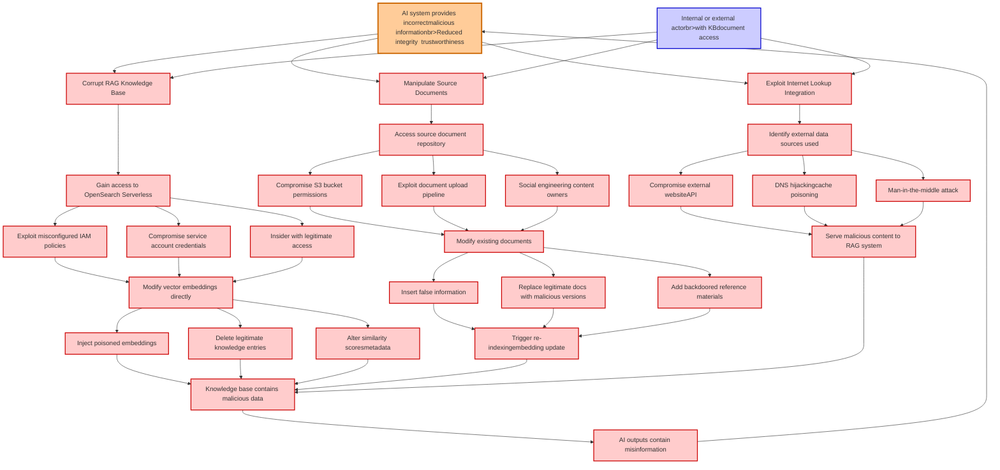

# Attack Tree: LLM08 VectorEmbedding Weakness

**Threat ID**: 12c09063-e456-445d-adee-5b84840fa213
**Statement**: An internal or external actor with access to the knowledge base or its source documents can corrupt or manipulate the RAG knowledge base (e.g. Amazon OpenSearch Serverless, Internet lookup), which leads to AI system providing incorrect or malicious information, resulting in reduced integrity and/or trustworthiness of AI system's knowledge base and outputs.

## Attack Tree Diagram

## MITRE ATT&CK Mapping

This attack tree has been mapped to MITRE ATT&CK techniques:

### Social engineering content owners

- **Technique**: [T1585](https://attack.mitre.org/techniques/T1585/) - Establish Accounts
- **Tactic**: Resource Development
- **Similarity Score**: 60.19%
- **Mitigations (1):**
  - 🛡️ **Pre-compromise**
    Pre-compromise mitigations involve proactive measures and defenses implemented to prevent adversaries from successfully ...

### DNS hijackingcache poisoning

- **Technique**: [T1568.001](https://attack.mitre.org/techniques/T1568/001/) - Fast Flux DNS
- **Tactic**: Command And Control
- **Similarity Score**: 72.55%

### Internal or external actorbr>with KBdocument access

- **Technique**: [T1059.010](https://attack.mitre.org/techniques/T1059/010/) - AutoHotKey & AutoIT
- **Tactic**: Execution
- **Similarity Score**: 46.90%
- **Mitigations (1):**
  - 🛡️ **Execution Prevention**
    Prevent the execution of unauthorized or malicious code on systems by implementing application control, script blocking,...

### Exploit document upload pipeline

- **Technique**: [T1608.001](https://attack.mitre.org/techniques/T1608/001/) - Upload Malware
- **Tactic**: Resource Development
- **Similarity Score**: 53.95%
- **Mitigations (1):**
  - 🛡️ **Pre-compromise**
    Pre-compromise mitigations involve proactive measures and defenses implemented to prevent adversaries from successfully ...

### Delete legitimate knowledge entries

- **Technique**: [T1070.004](https://attack.mitre.org/techniques/T1070/004/) - File Deletion
- **Tactic**: Defense Evasion
- **Similarity Score**: 66.93%

### Identify external data sources used

- **Technique**: [T1213.006](https://attack.mitre.org/techniques/T1213/006/) - Databases
- **Tactic**: Collection
- **Similarity Score**: 68.71%
- **Mitigations (5):**
  - 🛡️ **User Training**
    User Training involves educating employees and contractors on recognizing, reporting, and preventing cyber threats that ...
  - 🛡️ **Encrypt Sensitive Information**
    Protect sensitive information at rest, in transit, and during processing by using strong encryption algorithms. Encrypti...
  - 🛡️ **Software Configuration**
    Software configuration refers to making security-focused adjustments to the settings of applications, middleware, databa...
  - *2 more mitigation(s) available*

### Add backdoored reference materials

- **Technique**: [T1221](https://attack.mitre.org/techniques/T1221/) - Template Injection
- **Tactic**: Defense Evasion
- **Similarity Score**: 47.95%
- **Mitigations (4):**
  - 🛡️ **Antivirus/Antimalware**
    Antivirus/Antimalware solutions utilize signatures, heuristics, and behavioral analysis to detect, block, and remediate ...
  - 🛡️ **Network Intrusion Prevention**
    Use intrusion detection signatures to block traffic at network boundaries.
  - 🛡️ **User Training**
    User Training involves educating employees and contractors on recognizing, reporting, and preventing cyber threats that ...
  - *1 more mitigation(s) available*

### AI outputs contain misinformation

- **Technique**: [T1588.007](https://attack.mitre.org/techniques/T1588/007/) - Artificial Intelligence
- **Tactic**: Resource Development
- **Similarity Score**: 45.89%
- **Mitigations (1):**
  - 🛡️ **Pre-compromise**
    Pre-compromise mitigations involve proactive measures and defenses implemented to prevent adversaries from successfully ...

### AI system provides incorrectmalicious informationbr>Reduced integrity  trustworthiness

- **Technique**: [T1565.003](https://attack.mitre.org/techniques/T1565/003/) - Runtime Data Manipulation
- **Tactic**: Impact
- **Similarity Score**: 51.16%
- **Mitigations (2):**
  - 🛡️ **Network Segmentation**
    Network segmentation involves dividing a network into smaller, isolated segments to control and limit the flow of traffi...
  - 🛡️ **Restrict File and Directory Permissions**
    Restricting file and directory permissions involves setting access controls at the file system level to limit which user...

### Corrupt RAG Knowledge Base

- **Technique**: [T1213.001](https://attack.mitre.org/techniques/T1213/001/) - Confluence
- **Tactic**: Collection
- **Similarity Score**: 59.94%
- **Mitigations (3):**
  - 🛡️ **User Training**
    User Training involves educating employees and contractors on recognizing, reporting, and preventing cyber threats that ...
  - 🛡️ **Audit**
    Auditing is the process of recording activity and systematically reviewing and analyzing the activity and system configu...
  - 🛡️ **User Account Management**
    User Account Management involves implementing and enforcing policies for the lifecycle of user accounts, including creat...

### Exploit misconfigured IAM policies

- **Technique**: [T1484.001](https://attack.mitre.org/techniques/T1484/001/) - Group Policy Modification
- **Tactic**: Defense Evasion, Privilege Escalation
- **Similarity Score**: 61.46%
- **Mitigations (2):**
  - 🛡️ **Audit**
    Auditing is the process of recording activity and systematically reviewing and analyzing the activity and system configu...
  - 🛡️ **User Account Management**
    User Account Management involves implementing and enforcing policies for the lifecycle of user accounts, including creat...

### Compromise service account credentials

- **Technique**: [T1078.003](https://attack.mitre.org/techniques/T1078/003/) - Local Accounts
- **Tactic**: Defense Evasion, Persistence, Privilege Escalation, Initial Access
- **Similarity Score**: 78.89%
- **Mitigations (4):**
  - 🛡️ **Privileged Account Management**
    Privileged Account Management focuses on implementing policies, controls, and tools to securely manage privileged accoun...
  - 🛡️ **Multi-factor Authentication**
    Multi-Factor Authentication (MFA) enhances security by requiring users to provide at least two forms of verification to ...
  - 🛡️ **Password Policies**
    Set and enforce secure password policies for accounts to reduce the likelihood of unauthorized access. Strong password p...
  - *1 more mitigation(s) available*

### Insert false information

- **Technique**: [T1598.003](https://attack.mitre.org/techniques/T1598/003/) - Spearphishing Link
- **Tactic**: Reconnaissance
- **Similarity Score**: 56.75%
- **Mitigations (2):**
  - 🛡️ **User Training**
    User Training involves educating employees and contractors on recognizing, reporting, and preventing cyber threats that ...
  - 🛡️ **Software Configuration**
    Software configuration refers to making security-focused adjustments to the settings of applications, middleware, databa...

### Manipulate Source Documents

- **Technique**: [T1221](https://attack.mitre.org/techniques/T1221/) - Template Injection
- **Tactic**: Defense Evasion
- **Similarity Score**: 57.47%
- **Mitigations (4):**
  - 🛡️ **Antivirus/Antimalware**
    Antivirus/Antimalware solutions utilize signatures, heuristics, and behavioral analysis to detect, block, and remediate ...
  - 🛡️ **Network Intrusion Prevention**
    Use intrusion detection signatures to block traffic at network boundaries.
  - 🛡️ **User Training**
    User Training involves educating employees and contractors on recognizing, reporting, and preventing cyber threats that ...
  - *1 more mitigation(s) available*

### Compromise S3 bucket permissions

- **Technique**: [T1537](https://attack.mitre.org/techniques/T1537/) - Transfer Data to Cloud Account
- **Tactic**: Exfiltration
- **Similarity Score**: 60.87%
- **Mitigations (4):**
  - 🛡️ **Data Loss Prevention**
    Data Loss Prevention (DLP) involves implementing strategies and technologies to identify, categorize, monitor, and contr...
  - 🛡️ **User Account Management**
    User Account Management involves implementing and enforcing policies for the lifecycle of user accounts, including creat...
  - 🛡️ **Software Configuration**
    Software configuration refers to making security-focused adjustments to the settings of applications, middleware, databa...
  - *1 more mitigation(s) available*

### Man-in-the-middle attack

- **Technique**: [T1102.003](https://attack.mitre.org/techniques/T1102/003/) - One-Way Communication
- **Tactic**: Command And Control
- **Similarity Score**: 53.90%
- **Mitigations (2):**
  - 🛡️ **Restrict Web-Based Content**
    Restricting web-based content involves enforcing policies and technologies that limit access to potentially malicious we...
  - 🛡️ **Network Intrusion Prevention**
    Use intrusion detection signatures to block traffic at network boundaries.

### Gain access to OpenSearch Serverless

- **Technique**: [T1593.002](https://attack.mitre.org/techniques/T1593/002/) - Search Engines
- **Tactic**: Reconnaissance
- **Similarity Score**: 56.35%
- **Mitigations (1):**
  - 🛡️ **Pre-compromise**
    Pre-compromise mitigations involve proactive measures and defenses implemented to prevent adversaries from successfully ...

### Knowledge base contains malicious data

- **Technique**: [T1213](https://attack.mitre.org/techniques/T1213/) - Data from Information Repositories
- **Tactic**: Collection
- **Similarity Score**: 67.98%
- **Mitigations (7):**
  - 🛡️ **Multi-factor Authentication**
    Multi-Factor Authentication (MFA) enhances security by requiring users to provide at least two forms of verification to ...
  - 🛡️ **Out-of-Band Communications Channel**
    Establish secure out-of-band communication channels to ensure the continuity of critical communications during security ...
  - 🛡️ **User Training**
    User Training involves educating employees and contractors on recognizing, reporting, and preventing cyber threats that ...
  - *4 more mitigation(s) available*

### Alter similarity scoresmetadata

- **Technique**: [T1494](https://attack.mitre.org/techniques/T1494/) - Runtime Data Manipulation
- **Tactic**: Impact
- **Similarity Score**: 36.90%

### Trigger re-indexingembedding update

- **Technique**: [T1070.010](https://attack.mitre.org/techniques/T1070/010/) - Relocate Malware
- **Tactic**: Defense Evasion
- **Similarity Score**: 57.69%

### Inject poisoned embeddings

- **Technique**: [T1027.009](https://attack.mitre.org/techniques/T1027/009/) - Embedded Payloads
- **Tactic**: Defense Evasion
- **Similarity Score**: 54.37%
- **Mitigations (2):**
  - 🛡️ **Antivirus/Antimalware**
    Antivirus/Antimalware solutions utilize signatures, heuristics, and behavioral analysis to detect, block, and remediate ...
  - 🛡️ **Behavior Prevention on Endpoint**
    Behavior Prevention on Endpoint refers to the use of technologies and strategies to detect and block potentially malicio...

### Access source document repository

- **Technique**: [T1213.001](https://attack.mitre.org/techniques/T1213/001/) - Confluence
- **Tactic**: Collection
- **Similarity Score**: 66.17%
- **Mitigations (3):**
  - 🛡️ **User Training**
    User Training involves educating employees and contractors on recognizing, reporting, and preventing cyber threats that ...
  - 🛡️ **Audit**
    Auditing is the process of recording activity and systematically reviewing and analyzing the activity and system configu...
  - 🛡️ **User Account Management**
    User Account Management involves implementing and enforcing policies for the lifecycle of user accounts, including creat...

### Modify vector embeddings directly

- **Technique**: [T1027.009](https://attack.mitre.org/techniques/T1027/009/) - Embedded Payloads
- **Tactic**: Defense Evasion
- **Similarity Score**: 49.57%
- **Mitigations (2):**
  - 🛡️ **Antivirus/Antimalware**
    Antivirus/Antimalware solutions utilize signatures, heuristics, and behavioral analysis to detect, block, and remediate ...
  - 🛡️ **Behavior Prevention on Endpoint**
    Behavior Prevention on Endpoint refers to the use of technologies and strategies to detect and block potentially malicio...

### Insider with legitimate access

- **Technique**: [T1650](https://attack.mitre.org/techniques/T1650/) - Acquire Access
- **Tactic**: Resource Development
- **Similarity Score**: 58.98%
- **Mitigations (1):**
  - 🛡️ **Pre-compromise**
    Pre-compromise mitigations involve proactive measures and defenses implemented to prevent adversaries from successfully ...

### Modify existing documents

- **Technique**: [T1565.003](https://attack.mitre.org/techniques/T1565/003/) - Runtime Data Manipulation
- **Tactic**: Impact
- **Similarity Score**: 59.99%
- **Mitigations (2):**
  - 🛡️ **Network Segmentation**
    Network segmentation involves dividing a network into smaller, isolated segments to control and limit the flow of traffi...
  - 🛡️ **Restrict File and Directory Permissions**
    Restricting file and directory permissions involves setting access controls at the file system level to limit which user...

### Serve malicious content to RAG system

- **Technique**: [T1505.003](https://attack.mitre.org/techniques/T1505/003/) - Web Shell
- **Tactic**: Persistence
- **Similarity Score**: 57.05%
- **Mitigations (2):**
  - 🛡️ **Disable or Remove Feature or Program**
    Disable or remove unnecessary and potentially vulnerable software, features, or services to reduce the attack surface an...
  - 🛡️ **User Account Management**
    User Account Management involves implementing and enforcing policies for the lifecycle of user accounts, including creat...

### Compromise external websiteAPI

- **Technique**: [T1100](https://attack.mitre.org/techniques/T1100/) - Web Shell
- **Tactic**: Persistence, Privilege Escalation
- **Similarity Score**: 64.54%

### Replace legitimate docs with malicious versions

- **Technique**: [T1221](https://attack.mitre.org/techniques/T1221/) - Template Injection
- **Tactic**: Defense Evasion
- **Similarity Score**: 54.11%
- **Mitigations (4):**
  - 🛡️ **Antivirus/Antimalware**
    Antivirus/Antimalware solutions utilize signatures, heuristics, and behavioral analysis to detect, block, and remediate ...
  - 🛡️ **Network Intrusion Prevention**
    Use intrusion detection signatures to block traffic at network boundaries.
  - 🛡️ **User Training**
    User Training involves educating employees and contractors on recognizing, reporting, and preventing cyber threats that ...
  - *1 more mitigation(s) available*

### Exploit Internet Lookup Integration

- **Technique**: [T1596.001](https://attack.mitre.org/techniques/T1596/001/) - DNS/Passive DNS
- **Tactic**: Reconnaissance
- **Similarity Score**: 57.54%
- **Mitigations (1):**
  - 🛡️ **Pre-compromise**
    Pre-compromise mitigations involve proactive measures and defenses implemented to prevent adversaries from successfully ...

*Total technique mappings: 29 | Mitigations found: 61*

## Attack Path Analysis

Review this attack tree to:
1. Identify critical attack paths
2. Implement appropriate security controls
3. Monitor for indicators
4. Develop incident response procedures

---
*Generated by ThreatForest*
