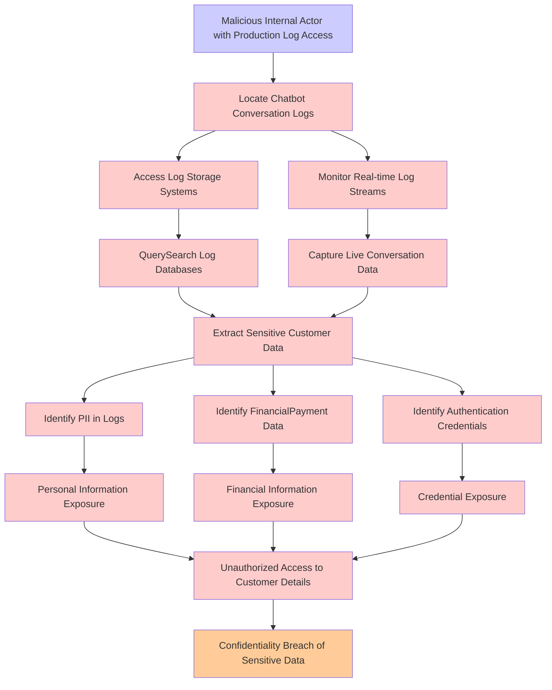

# Attack Tree: LLM02 SensitiveInfo Disclosure

**Threat ID**: 26ae875e-296d-4151-99a9-dbd6287d851a
**Statement**: A malicious internal actor who has access to production logs can read sensitive customer information contained in chatbot conversation logs, which leads to unauthorized exposure of personal customer details, resulting in reduced confidentiality of impacted individuals and sensitive data

## Attack Tree Diagram

## MITRE ATT&CK Mapping

This attack tree has been mapped to MITRE ATT&CK techniques:

### Malicious Internal Actor with Production Log Access

- **Technique**: [T1654](https://attack.mitre.org/techniques/T1654/) - Log Enumeration
- **Tactic**: Discovery
- **Similarity Score**: 70.56%
- **Mitigations (1):**
  - 🛡️ **User Account Management**
    User Account Management involves implementing and enforcing policies for the lifecycle of user accounts, including creat...

### Locate Chatbot Conversation Logs

- **Technique**: [T1213.005](https://attack.mitre.org/techniques/T1213/005/) - Messaging Applications
- **Tactic**: Collection
- **Similarity Score**: 60.54%
- **Mitigations (3):**
  - 🛡️ **User Training**
    User Training involves educating employees and contractors on recognizing, reporting, and preventing cyber threats that ...
  - 🛡️ **Audit**
    Auditing is the process of recording activity and systematically reviewing and analyzing the activity and system configu...
  - 🛡️ **Out-of-Band Communications Channel**
    Establish secure out-of-band communication channels to ensure the continuity of critical communications during security ...

### QuerySearch Log Databases

- **Technique**: [T1654](https://attack.mitre.org/techniques/T1654/) - Log Enumeration
- **Tactic**: Discovery
- **Similarity Score**: 73.62%
- **Mitigations (1):**
  - 🛡️ **User Account Management**
    User Account Management involves implementing and enforcing policies for the lifecycle of user accounts, including creat...

### Access Log Storage Systems

- **Technique**: [T1654](https://attack.mitre.org/techniques/T1654/) - Log Enumeration
- **Tactic**: Discovery
- **Similarity Score**: 72.72%
- **Mitigations (1):**
  - 🛡️ **User Account Management**
    User Account Management involves implementing and enforcing policies for the lifecycle of user accounts, including creat...

### Identify Authentication Credentials

- **Technique**: [T1555.004](https://attack.mitre.org/techniques/T1555/004/) - Windows Credential Manager
- **Tactic**: Credential Access
- **Similarity Score**: 77.33%
- **Mitigations (1):**
  - 🛡️ **Disable or Remove Feature or Program**
    Disable or remove unnecessary and potentially vulnerable software, features, or services to reduce the attack surface an...

### Personal Information Exposure

- **Technique**: [T1593.001](https://attack.mitre.org/techniques/T1593/001/) - Social Media
- **Tactic**: Reconnaissance
- **Similarity Score**: 72.70%
- **Mitigations (1):**
  - 🛡️ **Pre-compromise**
    Pre-compromise mitigations involve proactive measures and defenses implemented to prevent adversaries from successfully ...

### Extract Sensitive Customer Data

- **Technique**: [T1048](https://attack.mitre.org/techniques/T1048/) - Exfiltration Over Alternative Protocol
- **Tactic**: Exfiltration
- **Similarity Score**: 62.88%
- **Mitigations (6):**
  - 🛡️ **Network Segmentation**
    Network segmentation involves dividing a network into smaller, isolated segments to control and limit the flow of traffi...
  - 🛡️ **Data Loss Prevention**
    Data Loss Prevention (DLP) involves implementing strategies and technologies to identify, categorize, monitor, and contr...
  - 🛡️ **Filter Network Traffic**
    Employ network appliances and endpoint software to filter ingress, egress, and lateral network traffic. This includes pr...
  - *3 more mitigation(s) available*

### Credential Exposure

- **Technique**: [T1556](https://attack.mitre.org/techniques/T1556/) - Modify Authentication Process
- **Tactic**: Credential Access, Defense Evasion, Persistence
- **Similarity Score**: 71.14%
- **Mitigations (9):**
  - 🛡️ **Restrict Registry Permissions**
    Restricting registry permissions involves configuring access control settings for sensitive registry keys and hives to e...
  - 🛡️ **Multi-factor Authentication**
    Multi-Factor Authentication (MFA) enhances security by requiring users to provide at least two forms of verification to ...
  - 🛡️ **Password Policies**
    Set and enforce secure password policies for accounts to reduce the likelihood of unauthorized access. Strong password p...
  - *6 more mitigation(s) available*

### Identify PII in Logs

- **Technique**: [T1654](https://attack.mitre.org/techniques/T1654/) - Log Enumeration
- **Tactic**: Discovery
- **Similarity Score**: 55.88%
- **Mitigations (1):**
  - 🛡️ **User Account Management**
    User Account Management involves implementing and enforcing policies for the lifecycle of user accounts, including creat...

### Identify FinancialPayment Data

- **Technique**: [T1213.006](https://attack.mitre.org/techniques/T1213/006/) - Databases
- **Tactic**: Collection
- **Similarity Score**: 44.95%
- **Mitigations (5):**
  - 🛡️ **User Training**
    User Training involves educating employees and contractors on recognizing, reporting, and preventing cyber threats that ...
  - 🛡️ **Encrypt Sensitive Information**
    Protect sensitive information at rest, in transit, and during processing by using strong encryption algorithms. Encrypti...
  - 🛡️ **Software Configuration**
    Software configuration refers to making security-focused adjustments to the settings of applications, middleware, databa...
  - *2 more mitigation(s) available*

### Capture Live Conversation Data

- **Technique**: [T1125](https://attack.mitre.org/techniques/T1125/) - Video Capture
- **Tactic**: Collection
- **Similarity Score**: 64.31%

### Monitor Real-time Log Streams

- **Technique**: [T1654](https://attack.mitre.org/techniques/T1654/) - Log Enumeration
- **Tactic**: Discovery
- **Similarity Score**: 65.49%
- **Mitigations (1):**
  - 🛡️ **User Account Management**
    User Account Management involves implementing and enforcing policies for the lifecycle of user accounts, including creat...

### Confidentiality Breach of Sensitive Data

- **Technique**: [T1565.002](https://attack.mitre.org/techniques/T1565/002/) - Transmitted Data Manipulation
- **Tactic**: Impact
- **Similarity Score**: 62.56%
- **Mitigations (1):**
  - 🛡️ **Encrypt Sensitive Information**
    Protect sensitive information at rest, in transit, and during processing by using strong encryption algorithms. Encrypti...

### Unauthorized Access to Customer Details

- **Technique**: [T1213.004](https://attack.mitre.org/techniques/T1213/004/) - Customer Relationship Management Software
- **Tactic**: Collection
- **Similarity Score**: 74.77%
- **Mitigations (4):**
  - 🛡️ **User Account Management**
    User Account Management involves implementing and enforcing policies for the lifecycle of user accounts, including creat...
  - 🛡️ **User Training**
    User Training involves educating employees and contractors on recognizing, reporting, and preventing cyber threats that ...
  - 🛡️ **Software Configuration**
    Software configuration refers to making security-focused adjustments to the settings of applications, middleware, databa...
  - *1 more mitigation(s) available*

### Financial Information Exposure

- **Technique**: [T1591.002](https://attack.mitre.org/techniques/T1591/002/) - Business Relationships
- **Tactic**: Reconnaissance
- **Similarity Score**: 69.70%
- **Mitigations (1):**
  - 🛡️ **Pre-compromise**
    Pre-compromise mitigations involve proactive measures and defenses implemented to prevent adversaries from successfully ...

*Total technique mappings: 15 | Mitigations found: 36*

## Attack Path Analysis

Review this attack tree to:
1. Identify critical attack paths
2. Implement appropriate security controls
3. Monitor for indicators
4. Develop incident response procedures

---
*Generated by ThreatForest*
