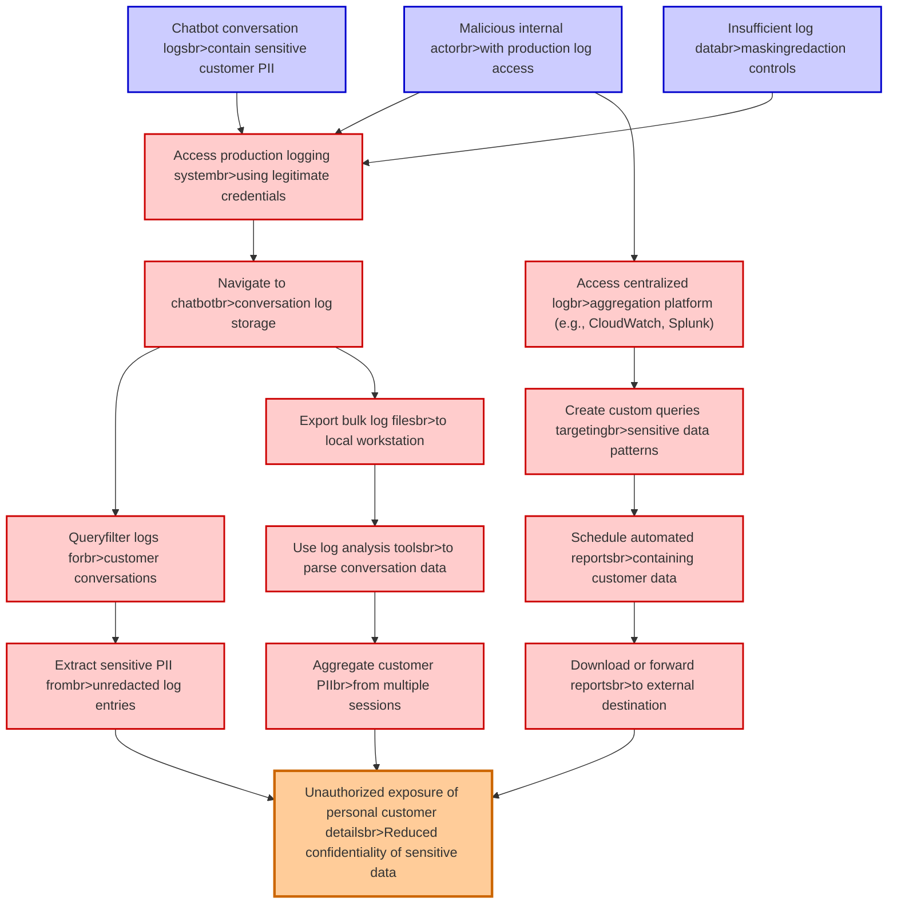

# Attack Tree: LLM02 SensitiveInfo Disclosure

**Threat ID**: 26ae875e-296d-4151-99a9-dbd6287d851a
**Statement**: A malicious internal actor who has access to production logs can read sensitive customer information contained in chatbot conversation logs, which leads to unauthorized exposure of personal customer details, resulting in reduced confidentiality of impacted individuals and sensitive data

## Attack Tree Diagram

## MITRE ATT&CK Mapping

This attack tree has been mapped to MITRE ATT&CK techniques:

### Aggregate customer PIIbr>from multiple sessions

- **Technique**: [T1033](https://attack.mitre.org/techniques/T1033/) - System Owner/User Discovery
- **Tactic**: Discovery
- **Similarity Score**: 54.38%

### Create custom queries targetingbr>sensitive data patterns

- **Technique**: [T1593.002](https://attack.mitre.org/techniques/T1593/002/) - Search Engines
- **Tactic**: Reconnaissance
- **Similarity Score**: 62.28%
- **Mitigations (1):**
  - 🛡️ **Pre-compromise**
    Pre-compromise mitigations involve proactive measures and defenses implemented to prevent adversaries from successfully ...

### Access production logging systembr>using legitimate credentials

- **Technique**: [T1056.003](https://attack.mitre.org/techniques/T1056/003/) - Web Portal Capture
- **Tactic**: Collection, Credential Access
- **Similarity Score**: 64.20%
- **Mitigations (1):**
  - 🛡️ **Privileged Account Management**
    Privileged Account Management focuses on implementing policies, controls, and tools to securely manage privileged accoun...

### Unauthorized exposure of personal customer detailsbr>Reduced confidentiality of sensitive data

- **Technique**: [T1213.004](https://attack.mitre.org/techniques/T1213/004/) - Customer Relationship Management Software
- **Tactic**: Collection
- **Similarity Score**: 65.93%
- **Mitigations (4):**
  - 🛡️ **User Account Management**
    User Account Management involves implementing and enforcing policies for the lifecycle of user accounts, including creat...
  - 🛡️ **User Training**
    User Training involves educating employees and contractors on recognizing, reporting, and preventing cyber threats that ...
  - 🛡️ **Software Configuration**
    Software configuration refers to making security-focused adjustments to the settings of applications, middleware, databa...
  - *1 more mitigation(s) available*

### Malicious internal actorbr>with production log access

- **Technique**: [T1654](https://attack.mitre.org/techniques/T1654/) - Log Enumeration
- **Tactic**: Discovery
- **Similarity Score**: 68.11%
- **Mitigations (1):**
  - 🛡️ **User Account Management**
    User Account Management involves implementing and enforcing policies for the lifecycle of user accounts, including creat...

### Insufficient log databr>maskingredaction controls

- **Technique**: [T1562.008](https://attack.mitre.org/techniques/T1562/008/) - Disable or Modify Cloud Logs
- **Tactic**: Defense Evasion
- **Similarity Score**: 69.70%
- **Mitigations (1):**
  - 🛡️ **User Account Management**
    User Account Management involves implementing and enforcing policies for the lifecycle of user accounts, including creat...

### Chatbot conversation logsbr>contain sensitive customer PII

- **Technique**: [T1552.008](https://attack.mitre.org/techniques/T1552/008/) - Chat Messages
- **Tactic**: Credential Access
- **Similarity Score**: 56.32%
- **Mitigations (2):**
  - 🛡️ **Audit**
    Auditing is the process of recording activity and systematically reviewing and analyzing the activity and system configu...
  - 🛡️ **User Training**
    User Training involves educating employees and contractors on recognizing, reporting, and preventing cyber threats that ...

### Navigate to chatbotbr>conversation log storage

- **Technique**: [T1552.008](https://attack.mitre.org/techniques/T1552/008/) - Chat Messages
- **Tactic**: Credential Access
- **Similarity Score**: 58.55%
- **Mitigations (2):**
  - 🛡️ **Audit**
    Auditing is the process of recording activity and systematically reviewing and analyzing the activity and system configu...
  - 🛡️ **User Training**
    User Training involves educating employees and contractors on recognizing, reporting, and preventing cyber threats that ...

### Extract sensitive PII frombr>unredacted log entries

- **Technique**: [T1654](https://attack.mitre.org/techniques/T1654/) - Log Enumeration
- **Tactic**: Discovery
- **Similarity Score**: 67.63%
- **Mitigations (1):**
  - 🛡️ **User Account Management**
    User Account Management involves implementing and enforcing policies for the lifecycle of user accounts, including creat...

### Download or forward reportsbr>to external destination

- **Technique**: [T1048](https://attack.mitre.org/techniques/T1048/) - Exfiltration Over Alternative Protocol
- **Tactic**: Exfiltration
- **Similarity Score**: 52.30%
- **Mitigations (6):**
  - 🛡️ **Network Segmentation**
    Network segmentation involves dividing a network into smaller, isolated segments to control and limit the flow of traffi...
  - 🛡️ **Data Loss Prevention**
    Data Loss Prevention (DLP) involves implementing strategies and technologies to identify, categorize, monitor, and contr...
  - 🛡️ **Filter Network Traffic**
    Employ network appliances and endpoint software to filter ingress, egress, and lateral network traffic. This includes pr...
  - *3 more mitigation(s) available*

### Queryfilter logs forbr>customer conversations

- **Technique**: [T1654](https://attack.mitre.org/techniques/T1654/) - Log Enumeration
- **Tactic**: Discovery
- **Similarity Score**: 56.08%
- **Mitigations (1):**
  - 🛡️ **User Account Management**
    User Account Management involves implementing and enforcing policies for the lifecycle of user accounts, including creat...

### Schedule automated reportsbr>containing customer data

- **Technique**: [T1591.003](https://attack.mitre.org/techniques/T1591/003/) - Identify Business Tempo
- **Tactic**: Reconnaissance
- **Similarity Score**: 41.23%
- **Mitigations (1):**
  - 🛡️ **Pre-compromise**
    Pre-compromise mitigations involve proactive measures and defenses implemented to prevent adversaries from successfully ...

### Access centralized logbr>aggregation platform (e.g., CloudWatch, Splunk)

- **Technique**: [T1654](https://attack.mitre.org/techniques/T1654/) - Log Enumeration
- **Tactic**: Discovery
- **Similarity Score**: 74.11%
- **Mitigations (1):**
  - 🛡️ **User Account Management**
    User Account Management involves implementing and enforcing policies for the lifecycle of user accounts, including creat...

### Export bulk log filesbr>to local workstation

- **Technique**: [T1074.001](https://attack.mitre.org/techniques/T1074/001/) - Local Data Staging
- **Tactic**: Collection
- **Similarity Score**: 60.01%

### Use log analysis toolsbr>to parse conversation data

- **Technique**: [T1213.005](https://attack.mitre.org/techniques/T1213/005/) - Messaging Applications
- **Tactic**: Collection
- **Similarity Score**: 53.11%
- **Mitigations (3):**
  - 🛡️ **User Training**
    User Training involves educating employees and contractors on recognizing, reporting, and preventing cyber threats that ...
  - 🛡️ **Audit**
    Auditing is the process of recording activity and systematically reviewing and analyzing the activity and system configu...
  - 🛡️ **Out-of-Band Communications Channel**
    Establish secure out-of-band communication channels to ensure the continuity of critical communications during security ...

*Total technique mappings: 15 | Mitigations found: 25*

## Attack Path Analysis

Review this attack tree to:
1. Identify critical attack paths
2. Implement appropriate security controls
3. Monitor for indicators
4. Develop incident response procedures

---
*Generated by ThreatForest*
