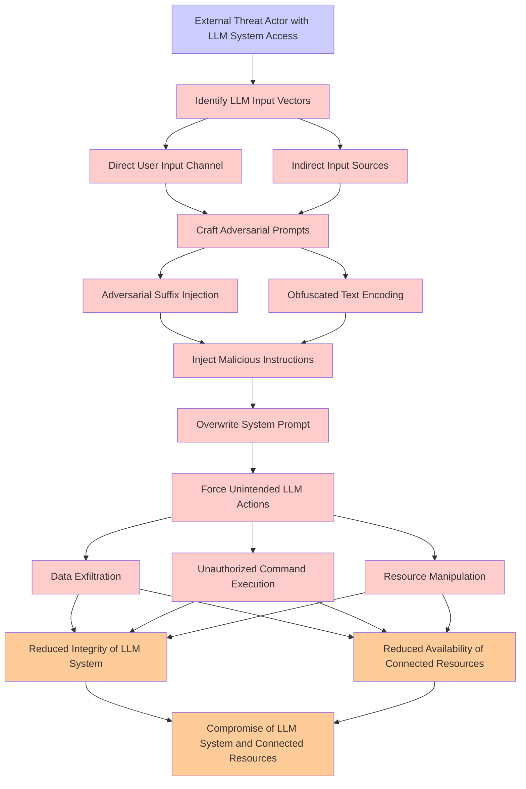

# Attack Tree: LLM01 Prompt Injection

**Threat ID**: 3c4b9ded-09ef-4bc1-8fdd-845009e1a273
**Statement**: An external threat actor with ability to interact with an LLM system can overwrite the system prompt with crafted prompts, including through adversarial suffixes and obfuscated text, which leads to force unintended actions from the LLM, resulting in reduced integrity and/or availability of LLM system and connected resources

## Attack Tree Diagram

## MITRE ATT&CK Mapping

This attack tree has been mapped to MITRE ATT&CK techniques:

### Force Unintended LLM Actions

- **Technique**: [T1218.009](https://attack.mitre.org/techniques/T1218/009/) - Regsvcs/Regasm
- **Tactic**: Defense Evasion
- **Similarity Score**: 55.73%
- **Mitigations (2):**
  - 🛡️ **Execution Prevention**
    Prevent the execution of unauthorized or malicious code on systems by implementing application control, script blocking,...
  - 🛡️ **Disable or Remove Feature or Program**
    Disable or remove unnecessary and potentially vulnerable software, features, or services to reduce the attack surface an...

### Data Exfiltration

- **Technique**: [T1020](https://attack.mitre.org/techniques/T1020/) - Automated Exfiltration
- **Tactic**: Exfiltration
- **Similarity Score**: 84.13%

### Resource Manipulation

- **Technique**: [T1564.009](https://attack.mitre.org/techniques/T1564/009/) - Resource Forking
- **Tactic**: Defense Evasion
- **Similarity Score**: 52.66%
- **Mitigations (1):**
  - 🛡️ **Application Developer Guidance**
    Application Developer Guidance focuses on providing developers with the knowledge, tools, and best practices needed to w...

### Reduced Integrity of LLM System

- **Technique**: [T1490](https://attack.mitre.org/techniques/T1490/) - Inhibit System Recovery
- **Tactic**: Impact
- **Similarity Score**: 59.49%
- **Mitigations (4):**
  - 🛡️ **Execution Prevention**
    Prevent the execution of unauthorized or malicious code on systems by implementing application control, script blocking,...
  - 🛡️ **Operating System Configuration**
    Operating System Configuration involves adjusting system settings and hardening the default configurations of an operati...
  - 🛡️ **User Account Management**
    User Account Management involves implementing and enforcing policies for the lifecycle of user accounts, including creat...
  - *1 more mitigation(s) available*

### Unauthorized Command Execution

- **Technique**: [T1202](https://attack.mitre.org/techniques/T1202/) - Indirect Command Execution
- **Tactic**: Defense Evasion
- **Similarity Score**: 71.59%

### Compromise of LLM System and Connected Resources

- **Technique**: [T1547.008](https://attack.mitre.org/techniques/T1547/008/) - LSASS Driver
- **Tactic**: Persistence, Privilege Escalation
- **Similarity Score**: 53.76%
- **Mitigations (3):**
  - 🛡️ **Privileged Process Integrity**
    Privileged Process Integrity focuses on defending highly privileged processes (e.g., system services, antivirus, or auth...
  - 🛡️ **Credential Access Protection**
    Credential Access Protection focuses on implementing measures to prevent adversaries from obtaining credentials, such as...
  - 🛡️ **Restrict Library Loading**
    Restricting library loading involves implementing security controls to ensure that only trusted and verified libraries (...

### Identify LLM Input Vectors

- **Technique**: [T1652](https://attack.mitre.org/techniques/T1652/) - Device Driver Discovery
- **Tactic**: Discovery
- **Similarity Score**: 39.12%

### Reduced Availability of Connected Resources

- **Technique**: [T1499.003](https://attack.mitre.org/techniques/T1499/003/) - Application Exhaustion Flood
- **Tactic**: Impact
- **Similarity Score**: 64.39%
- **Mitigations (1):**
  - 🛡️ **Filter Network Traffic**
    Employ network appliances and endpoint software to filter ingress, egress, and lateral network traffic. This includes pr...

### External Threat Actor with LLM System Access

- **Technique**: [T1177](https://attack.mitre.org/techniques/T1177/) - LSASS Driver
- **Tactic**: Execution, Persistence
- **Similarity Score**: 53.50%

### Direct User Input Channel

- **Technique**: [T1674](https://attack.mitre.org/techniques/T1674/) - Input Injection
- **Tactic**: Execution
- **Similarity Score**: 57.25%
- **Mitigations (2):**
  - 🛡️ **Limit Hardware Installation**
    Prevent unauthorized users or groups from installing or using hardware, such as external drives, peripheral devices, or ...
  - 🛡️ **Execution Prevention**
    Prevent the execution of unauthorized or malicious code on systems by implementing application control, script blocking,...

### Adversarial Suffix Injection

- **Technique**: [T1036.002](https://attack.mitre.org/techniques/T1036/002/) - Right-to-Left Override
- **Tactic**: Defense Evasion
- **Similarity Score**: 47.92%

### Craft Adversarial Prompts

- **Technique**: [T1056.002](https://attack.mitre.org/techniques/T1056/002/) - GUI Input Capture
- **Tactic**: Collection, Credential Access
- **Similarity Score**: 56.50%
- **Mitigations (1):**
  - 🛡️ **User Training**
    User Training involves educating employees and contractors on recognizing, reporting, and preventing cyber threats that ...

### Indirect Input Sources

- **Technique**: [T1674](https://attack.mitre.org/techniques/T1674/) - Input Injection
- **Tactic**: Execution
- **Similarity Score**: 42.28%
- **Mitigations (2):**
  - 🛡️ **Limit Hardware Installation**
    Prevent unauthorized users or groups from installing or using hardware, such as external drives, peripheral devices, or ...
  - 🛡️ **Execution Prevention**
    Prevent the execution of unauthorized or malicious code on systems by implementing application control, script blocking,...

### Overwrite System Prompt

- **Technique**: [T1070.003](https://attack.mitre.org/techniques/T1070/003/) - Clear Command History
- **Tactic**: Defense Evasion
- **Similarity Score**: 50.23%
- **Mitigations (3):**
  - 🛡️ **Remote Data Storage**
    Remote Data Storage focuses on moving critical data, such as security logs and sensitive files, to secure, off-host loca...
  - 🛡️ **Restrict File and Directory Permissions**
    Restricting file and directory permissions involves setting access controls at the file system level to limit which user...
  - 🛡️ **Environment Variable Permissions**
    Restrict the modification of environment variables to authorized users and processes by enforcing strict permissions and...

### Obfuscated Text Encoding

- **Technique**: [T1132.001](https://attack.mitre.org/techniques/T1132/001/) - Standard Encoding
- **Tactic**: Command And Control
- **Similarity Score**: 84.84%
- **Mitigations (1):**
  - 🛡️ **Network Intrusion Prevention**
    Use intrusion detection signatures to block traffic at network boundaries.

### Inject Malicious Instructions

- **Technique**: [T1218.013](https://attack.mitre.org/techniques/T1218/013/) - Mavinject
- **Tactic**: Defense Evasion
- **Similarity Score**: 64.74%
- **Mitigations (2):**
  - 🛡️ **Disable or Remove Feature or Program**
    Disable or remove unnecessary and potentially vulnerable software, features, or services to reduce the attack surface an...
  - 🛡️ **Execution Prevention**
    Prevent the execution of unauthorized or malicious code on systems by implementing application control, script blocking,...

*Total technique mappings: 16 | Mitigations found: 22*

## Attack Path Analysis

Review this attack tree to:
1. Identify critical attack paths
2. Implement appropriate security controls
3. Monitor for indicators
4. Develop incident response procedures

---
*Generated by ThreatForest*
