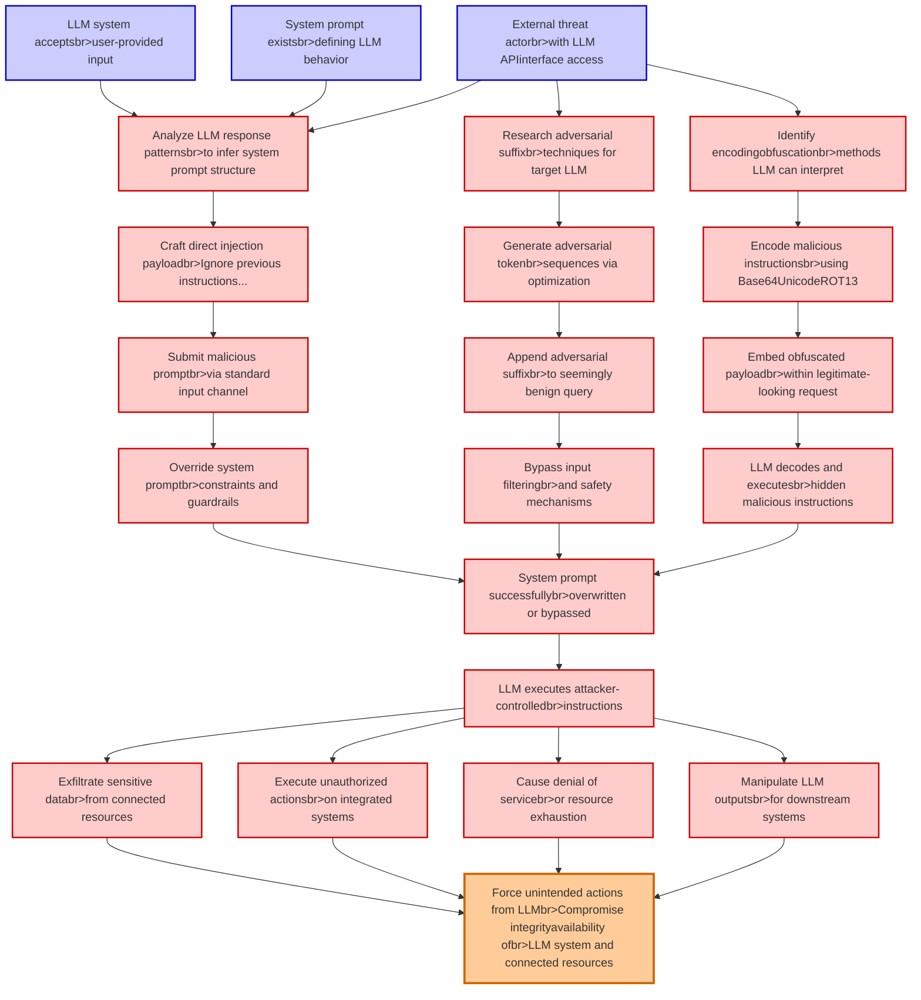

# Attack Tree: LLM01 Prompt Injection

**Threat ID**: 3c4b9ded-09ef-4bc1-8fdd-845009e1a273
**Statement**: An external threat actor with ability to interact with an LLM system can overwrite the system prompt with crafted prompts, including through adversarial suffixes and obfuscated text, which leads to force unintended actions from the LLM, resulting in reduced integrity and/or availability of LLM system and connected resources

## Attack Tree Diagram

## MITRE ATT&CK Mapping

This attack tree has been mapped to MITRE ATT&CK techniques:

### Override system promptbr>constraints and guardrails

- **Technique**: [T1141](https://attack.mitre.org/techniques/T1141/) - Input Prompt
- **Tactic**: Credential Access
- **Similarity Score**: 58.10%

### LLM decodes and executesbr>hidden malicious instructions

- **Technique**: [T1027.016](https://attack.mitre.org/techniques/T1027/016/) - Junk Code Insertion
- **Tactic**: Defense Evasion
- **Similarity Score**: 68.09%
- **Mitigations (1):**
  - 🛡️ **Antivirus/Antimalware**
    Antivirus/Antimalware solutions utilize signatures, heuristics, and behavioral analysis to detect, block, and remediate ...

### Embed obfuscated payloadbr>within legitimate-looking request

- **Technique**: [T1132.002](https://attack.mitre.org/techniques/T1132/002/) - Non-Standard Encoding
- **Tactic**: Command And Control
- **Similarity Score**: 72.36%
- **Mitigations (1):**
  - 🛡️ **Network Intrusion Prevention**
    Use intrusion detection signatures to block traffic at network boundaries.

### Execute unauthorized actionsbr>on integrated systems

- **Technique**: [T1514](https://attack.mitre.org/techniques/T1514/) - Elevated Execution with Prompt
- **Tactic**: Privilege Escalation
- **Similarity Score**: 58.86%

### Exfiltrate sensitive databr>from connected resources

- **Technique**: [T1567.002](https://attack.mitre.org/techniques/T1567/002/) - Exfiltration to Cloud Storage
- **Tactic**: Exfiltration
- **Similarity Score**: 81.28%
- **Mitigations (1):**
  - 🛡️ **Restrict Web-Based Content**
    Restricting web-based content involves enforcing policies and technologies that limit access to potentially malicious we...

### Append adversarial suffixbr>to seemingly benign query

- **Technique**: [T1595.003](https://attack.mitre.org/techniques/T1595/003/) - Wordlist Scanning
- **Tactic**: Reconnaissance
- **Similarity Score**: 34.01%
- **Mitigations (2):**
  - 🛡️ **Disable or Remove Feature or Program**
    Disable or remove unnecessary and potentially vulnerable software, features, or services to reduce the attack surface an...
  - 🛡️ **Pre-compromise**
    Pre-compromise mitigations involve proactive measures and defenses implemented to prevent adversaries from successfully ...

### System prompt existsbr>defining LLM behavior

- **Technique**: [T1177](https://attack.mitre.org/techniques/T1177/) - LSASS Driver
- **Tactic**: Execution, Persistence
- **Similarity Score**: 48.01%

### Manipulate LLM outputsbr>for downstream systems

- **Technique**: [T1059.008](https://attack.mitre.org/techniques/T1059/008/) - Network Device CLI
- **Tactic**: Execution
- **Similarity Score**: 43.53%
- **Mitigations (3):**
  - 🛡️ **Execution Prevention**
    Prevent the execution of unauthorized or malicious code on systems by implementing application control, script blocking,...
  - 🛡️ **Privileged Account Management**
    Privileged Account Management focuses on implementing policies, controls, and tools to securely manage privileged accoun...
  - 🛡️ **User Account Management**
    User Account Management involves implementing and enforcing policies for the lifecycle of user accounts, including creat...

### System prompt successfullybr>overwritten or bypassed

- **Technique**: [T1070.003](https://attack.mitre.org/techniques/T1070/003/) - Clear Command History
- **Tactic**: Defense Evasion
- **Similarity Score**: 60.68%
- **Mitigations (3):**
  - 🛡️ **Remote Data Storage**
    Remote Data Storage focuses on moving critical data, such as security logs and sensitive files, to secure, off-host loca...
  - 🛡️ **Restrict File and Directory Permissions**
    Restricting file and directory permissions involves setting access controls at the file system level to limit which user...
  - 🛡️ **Environment Variable Permissions**
    Restrict the modification of environment variables to authorized users and processes by enforcing strict permissions and...

### Encode malicious instructionsbr>using Base64UnicodeROT13

- **Technique**: [T1132.001](https://attack.mitre.org/techniques/T1132/001/) - Standard Encoding
- **Tactic**: Command And Control
- **Similarity Score**: 75.21%
- **Mitigations (1):**
  - 🛡️ **Network Intrusion Prevention**
    Use intrusion detection signatures to block traffic at network boundaries.

### Generate adversarial tokenbr>sequences via optimization

- **Technique**: [T1111](https://attack.mitre.org/techniques/T1111/) - Multi-Factor Authentication Interception
- **Tactic**: Credential Access
- **Similarity Score**: 49.12%
- **Mitigations (1):**
  - 🛡️ **User Training**
    User Training involves educating employees and contractors on recognizing, reporting, and preventing cyber threats that ...

### Analyze LLM response patternsbr>to infer system prompt structure

- **Technique**: [T1141](https://attack.mitre.org/techniques/T1141/) - Input Prompt
- **Tactic**: Credential Access
- **Similarity Score**: 41.87%

### Craft direct injection payloadbr>Ignore previous instructions...

- **Technique**: [T1027.009](https://attack.mitre.org/techniques/T1027/009/) - Embedded Payloads
- **Tactic**: Defense Evasion
- **Similarity Score**: 54.24%
- **Mitigations (2):**
  - 🛡️ **Antivirus/Antimalware**
    Antivirus/Antimalware solutions utilize signatures, heuristics, and behavioral analysis to detect, block, and remediate ...
  - 🛡️ **Behavior Prevention on Endpoint**
    Behavior Prevention on Endpoint refers to the use of technologies and strategies to detect and block potentially malicio...

### LLM system acceptsbr>user-provided input

- **Technique**: [T1015](https://attack.mitre.org/techniques/T1015/) - Accessibility Features
- **Tactic**: Persistence, Privilege Escalation
- **Similarity Score**: 40.73%

### Identify encodingobfuscationbr>methods LLM can interpret

- **Technique**: [T1132.001](https://attack.mitre.org/techniques/T1132/001/) - Standard Encoding
- **Tactic**: Command And Control
- **Similarity Score**: 74.72%
- **Mitigations (1):**
  - 🛡️ **Network Intrusion Prevention**
    Use intrusion detection signatures to block traffic at network boundaries.

### LLM executes attacker-controlledbr>instructions

- **Technique**: [T1177](https://attack.mitre.org/techniques/T1177/) - LSASS Driver
- **Tactic**: Execution, Persistence
- **Similarity Score**: 50.03%

### Bypass input filteringbr>and safety mechanisms

- **Technique**: [T1674](https://attack.mitre.org/techniques/T1674/) - Input Injection
- **Tactic**: Execution
- **Similarity Score**: 46.18%
- **Mitigations (2):**
  - 🛡️ **Limit Hardware Installation**
    Prevent unauthorized users or groups from installing or using hardware, such as external drives, peripheral devices, or ...
  - 🛡️ **Execution Prevention**
    Prevent the execution of unauthorized or malicious code on systems by implementing application control, script blocking,...

### Force unintended actions from LLMbr>Compromise integrityavailability ofbr>LLM system and connected resources

- **Technique**: [T1542.003](https://attack.mitre.org/techniques/T1542/003/) - Bootkit
- **Tactic**: Persistence, Defense Evasion
- **Similarity Score**: 57.74%
- **Mitigations (2):**
  - 🛡️ **Boot Integrity**
    Boot Integrity ensures that a system starts securely by verifying the integrity of its boot process, operating system, a...
  - 🛡️ **Privileged Account Management**
    Privileged Account Management focuses on implementing policies, controls, and tools to securely manage privileged accoun...

### Research adversarial suffixbr>techniques for target LLM

- **Technique**: [T1588.007](https://attack.mitre.org/techniques/T1588/007/) - Artificial Intelligence
- **Tactic**: Resource Development
- **Similarity Score**: 53.01%
- **Mitigations (1):**
  - 🛡️ **Pre-compromise**
    Pre-compromise mitigations involve proactive measures and defenses implemented to prevent adversaries from successfully ...

### Cause denial of servicebr>or resource exhaustion

- **Technique**: [T1499.003](https://attack.mitre.org/techniques/T1499/003/) - Application Exhaustion Flood
- **Tactic**: Impact
- **Similarity Score**: 83.69%
- **Mitigations (1):**
  - 🛡️ **Filter Network Traffic**
    Employ network appliances and endpoint software to filter ingress, egress, and lateral network traffic. This includes pr...

### External threat actorbr>with LLM APIinterface access

- **Technique**: [T1021.003](https://attack.mitre.org/techniques/T1021/003/) - Distributed Component Object Model
- **Tactic**: Lateral Movement
- **Similarity Score**: 51.30%
- **Mitigations (4):**
  - 🛡️ **Disable or Remove Feature or Program**
    Disable or remove unnecessary and potentially vulnerable software, features, or services to reduce the attack surface an...
  - 🛡️ **Application Isolation and Sandboxing**
    Application Isolation and Sandboxing refers to the technique of restricting the execution of code to a controlled and is...
  - 🛡️ **Network Segmentation**
    Network segmentation involves dividing a network into smaller, isolated segments to control and limit the flow of traffi...
  - *1 more mitigation(s) available*

### Submit malicious promptbr>via standard input channel

- **Technique**: [T1056](https://attack.mitre.org/techniques/T1056/) - Input Capture
- **Tactic**: Collection, Credential Access
- **Similarity Score**: 66.48%

*Total technique mappings: 22 | Mitigations found: 26*

## Attack Path Analysis

Review this attack tree to:
1. Identify critical attack paths
2. Implement appropriate security controls
3. Monitor for indicators
4. Develop incident response procedures

---
*Generated by ThreatForest*
