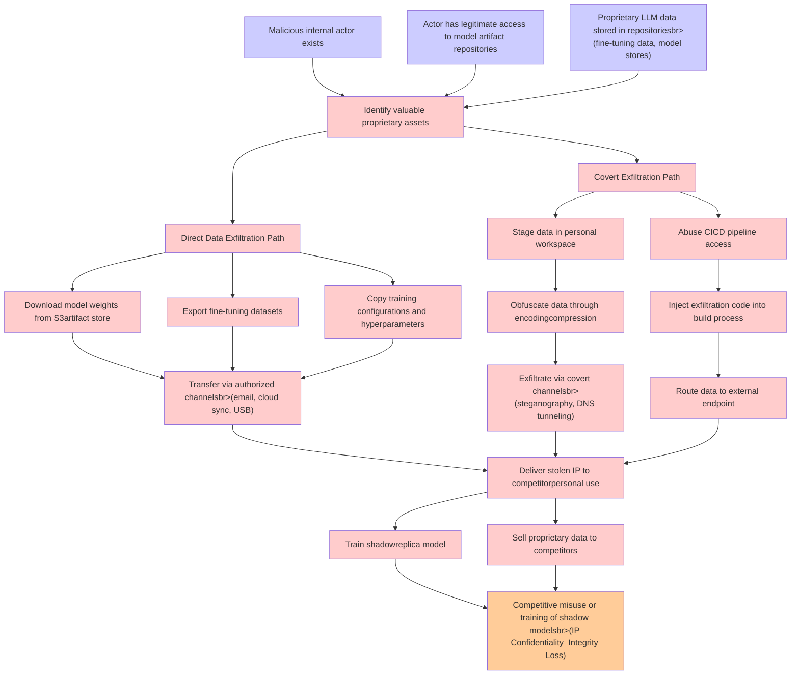

# Attack Tree: LLM03 Supply Chain, LLM02 SensitiveInfo Disclosure

**Threat ID**: 463f80c0-9786-4cfb-a3fb-30cc07f47ae1
**Statement**: A malicious internal actor with access to model artifact repositories (for example, fine tuning data, model stores) can exfiltrate proprietary LLM data, which leads to competitive misuse or training of shadow models, resulting in reduced confidentiality and/or integrity of intellectual property

## Attack Tree Diagram

## MITRE ATT&CK Mapping

This attack tree has been mapped to MITRE ATT&CK techniques:

### Route data to external endpoint

- **Technique**: [T1090.002](https://attack.mitre.org/techniques/T1090/002/) - External Proxy
- **Tactic**: Command And Control
- **Similarity Score**: 56.18%
- **Mitigations (1):**
  - 🛡️ **Network Intrusion Prevention**
    Use intrusion detection signatures to block traffic at network boundaries.

### Inject exfiltration code into build process

- **Technique**: [T1127.001](https://attack.mitre.org/techniques/T1127/001/) - MSBuild
- **Tactic**: Defense Evasion
- **Similarity Score**: 67.78%
- **Mitigations (2):**
  - 🛡️ **Disable or Remove Feature or Program**
    Disable or remove unnecessary and potentially vulnerable software, features, or services to reduce the attack surface an...
  - 🛡️ **Execution Prevention**
    Prevent the execution of unauthorized or malicious code on systems by implementing application control, script blocking,...

### Exfiltrate via covert channelsbr>(steganography, DNS tunneling)

- **Technique**: [T1048.003](https://attack.mitre.org/techniques/T1048/003/) - Exfiltration Over Unencrypted Non-C2 Protocol
- **Tactic**: Exfiltration
- **Similarity Score**: 76.06%
- **Mitigations (4):**
  - 🛡️ **Network Intrusion Prevention**
    Use intrusion detection signatures to block traffic at network boundaries.
  - 🛡️ **Data Loss Prevention**
    Data Loss Prevention (DLP) involves implementing strategies and technologies to identify, categorize, monitor, and contr...
  - 🛡️ **Filter Network Traffic**
    Employ network appliances and endpoint software to filter ingress, egress, and lateral network traffic. This includes pr...
  - *1 more mitigation(s) available*

### Obfuscate data through encodingcompression

- **Technique**: [T1027.013](https://attack.mitre.org/techniques/T1027/013/) - Encrypted/Encoded File
- **Tactic**: Defense Evasion
- **Similarity Score**: 86.08%
- **Mitigations (2):**
  - 🛡️ **Antivirus/Antimalware**
    Antivirus/Antimalware solutions utilize signatures, heuristics, and behavioral analysis to detect, block, and remediate ...
  - 🛡️ **Behavior Prevention on Endpoint**
    Behavior Prevention on Endpoint refers to the use of technologies and strategies to detect and block potentially malicio...

### Actor has legitimate access to model artifact repositories

- **Technique**: [T1213.003](https://attack.mitre.org/techniques/T1213/003/) - Code Repositories
- **Tactic**: Collection
- **Similarity Score**: 48.51%
- **Mitigations (4):**
  - 🛡️ **User Training**
    User Training involves educating employees and contractors on recognizing, reporting, and preventing cyber threats that ...
  - 🛡️ **Audit**
    Auditing is the process of recording activity and systematically reviewing and analyzing the activity and system configu...
  - 🛡️ **User Account Management**
    User Account Management involves implementing and enforcing policies for the lifecycle of user accounts, including creat...
  - *1 more mitigation(s) available*

### Sell proprietary data to competitors

- **Technique**: [T1597.002](https://attack.mitre.org/techniques/T1597/002/) - Purchase Technical Data
- **Tactic**: Reconnaissance
- **Similarity Score**: 57.47%
- **Mitigations (1):**
  - 🛡️ **Pre-compromise**
    Pre-compromise mitigations involve proactive measures and defenses implemented to prevent adversaries from successfully ...

### Covert Exfiltration Path

- **Technique**: [T1567.002](https://attack.mitre.org/techniques/T1567/002/) - Exfiltration to Cloud Storage
- **Tactic**: Exfiltration
- **Similarity Score**: 74.80%
- **Mitigations (1):**
  - 🛡️ **Restrict Web-Based Content**
    Restricting web-based content involves enforcing policies and technologies that limit access to potentially malicious we...

### Export fine-tuning datasets

- **Technique**: [T1074.002](https://attack.mitre.org/techniques/T1074/002/) - Remote Data Staging
- **Tactic**: Collection
- **Similarity Score**: 55.66%

### Deliver stolen IP to competitorpersonal use

- **Technique**: [T1583](https://attack.mitre.org/techniques/T1583/) - Acquire Infrastructure
- **Tactic**: Resource Development
- **Similarity Score**: 65.34%
- **Mitigations (1):**
  - 🛡️ **Pre-compromise**
    Pre-compromise mitigations involve proactive measures and defenses implemented to prevent adversaries from successfully ...

### Malicious internal actor exists

- **Technique**: [T1559.001](https://attack.mitre.org/techniques/T1559/001/) - Component Object Model
- **Tactic**: Execution
- **Similarity Score**: 39.50%
- **Mitigations (2):**
  - 🛡️ **Privileged Account Management**
    Privileged Account Management focuses on implementing policies, controls, and tools to securely manage privileged accoun...
  - 🛡️ **Application Isolation and Sandboxing**
    Application Isolation and Sandboxing refers to the technique of restricting the execution of code to a controlled and is...

### Stage data in personal workspace

- **Technique**: [T1074.001](https://attack.mitre.org/techniques/T1074/001/) - Local Data Staging
- **Tactic**: Collection
- **Similarity Score**: 64.00%

### Download model weights from S3artifact store

- **Technique**: [T1048](https://attack.mitre.org/techniques/T1048/) - Exfiltration Over Alternative Protocol
- **Tactic**: Exfiltration
- **Similarity Score**: 44.73%
- **Mitigations (6):**
  - 🛡️ **Network Segmentation**
    Network segmentation involves dividing a network into smaller, isolated segments to control and limit the flow of traffi...
  - 🛡️ **Data Loss Prevention**
    Data Loss Prevention (DLP) involves implementing strategies and technologies to identify, categorize, monitor, and contr...
  - 🛡️ **Filter Network Traffic**
    Employ network appliances and endpoint software to filter ingress, egress, and lateral network traffic. This includes pr...
  - *3 more mitigation(s) available*

### Competitive misuse or training of shadow modelsbr>(IP Confidentiality  Integrity Loss)

- **Technique**: [T1665](https://attack.mitre.org/techniques/T1665/) - Hide Infrastructure
- **Tactic**: Command And Control
- **Similarity Score**: 62.57%

### Identify valuable proprietary assets

- **Technique**: [T1213](https://attack.mitre.org/techniques/T1213/) - Data from Information Repositories
- **Tactic**: Collection
- **Similarity Score**: 50.86%
- **Mitigations (7):**
  - 🛡️ **Multi-factor Authentication**
    Multi-Factor Authentication (MFA) enhances security by requiring users to provide at least two forms of verification to ...
  - 🛡️ **Out-of-Band Communications Channel**
    Establish secure out-of-band communication channels to ensure the continuity of critical communications during security ...
  - 🛡️ **User Training**
    User Training involves educating employees and contractors on recognizing, reporting, and preventing cyber threats that ...
  - *4 more mitigation(s) available*

### Direct Data Exfiltration Path

- **Technique**: [T1020](https://attack.mitre.org/techniques/T1020/) - Automated Exfiltration
- **Tactic**: Exfiltration
- **Similarity Score**: 84.23%

### Proprietary LLM data stored in repositoriesbr>(fine-tuning data, model stores)

- **Technique**: [T1602](https://attack.mitre.org/techniques/T1602/) - Data from Configuration Repository
- **Tactic**: Collection
- **Similarity Score**: 60.33%
- **Mitigations (6):**
  - 🛡️ **Update Software**
    Software updates ensure systems are protected against known vulnerabilities by applying patches and upgrades provided by...
  - 🛡️ **Software Configuration**
    Software configuration refers to making security-focused adjustments to the settings of applications, middleware, databa...
  - 🛡️ **Network Segmentation**
    Network segmentation involves dividing a network into smaller, isolated segments to control and limit the flow of traffi...
  - *3 more mitigation(s) available*

### Transfer via authorized channelsbr>(email, cloud sync, USB)

- **Technique**: [T1570](https://attack.mitre.org/techniques/T1570/) - Lateral Tool Transfer
- **Tactic**: Lateral Movement
- **Similarity Score**: 69.59%
- **Mitigations (2):**
  - 🛡️ **Filter Network Traffic**
    Employ network appliances and endpoint software to filter ingress, egress, and lateral network traffic. This includes pr...
  - 🛡️ **Network Intrusion Prevention**
    Use intrusion detection signatures to block traffic at network boundaries.

### Abuse CICD pipeline access

- **Technique**: [T1677](https://attack.mitre.org/techniques/T1677/) - Poisoned Pipeline Execution
- **Tactic**: Execution
- **Similarity Score**: 48.30%
- **Mitigations (2):**
  - 🛡️ **User Account Management**
    User Account Management involves implementing and enforcing policies for the lifecycle of user accounts, including creat...
  - 🛡️ **Software Configuration**
    Software configuration refers to making security-focused adjustments to the settings of applications, middleware, databa...

### Copy training configurations and hyperparameters

- **Technique**: [T1074.002](https://attack.mitre.org/techniques/T1074/002/) - Remote Data Staging
- **Tactic**: Collection
- **Similarity Score**: 40.71%

### Train shadowreplica model

- **Technique**: [T1099](https://attack.mitre.org/techniques/T1099/) - Timestomp
- **Tactic**: Defense Evasion
- **Similarity Score**: 31.76%

*Total technique mappings: 20 | Mitigations found: 41*

## Attack Path Analysis

Review this attack tree to:
1. Identify critical attack paths
2. Implement appropriate security controls
3. Monitor for indicators
4. Develop incident response procedures

---
*Generated by ThreatForest*
