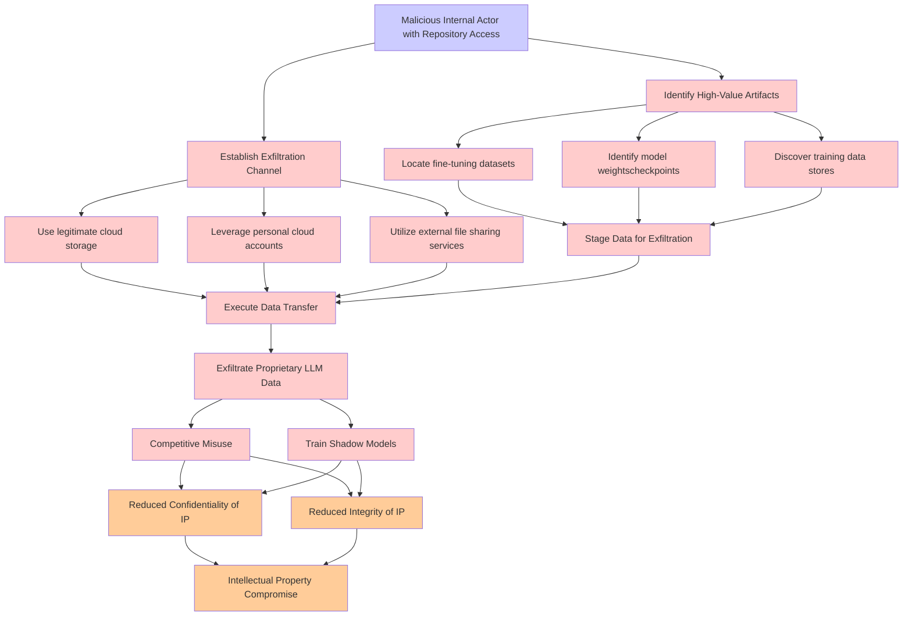

# Attack Tree: LLM03 Supply Chain, LLM02 SensitiveInfo Disclosure

**Threat ID**: 463f80c0-9786-4cfb-a3fb-30cc07f47ae1
**Statement**: A malicious internal actor with access to model artifact repositories (for example, fine tuning data, model stores) can exfiltrate proprietary LLM data, which leads to competitive misuse or training of shadow models, resulting in reduced confidentiality and/or integrity of intellectual property

## Attack Tree Diagram

## MITRE ATT&CK Mapping

This attack tree has been mapped to MITRE ATT&CK techniques:

### Reduced Confidentiality of IP

- **Technique**: [T1665](https://attack.mitre.org/techniques/T1665/) - Hide Infrastructure
- **Tactic**: Command And Control
- **Similarity Score**: 70.83%

### Leverage personal cloud accounts

- **Technique**: [T1585.003](https://attack.mitre.org/techniques/T1585/003/) - Cloud Accounts
- **Tactic**: Resource Development
- **Similarity Score**: 85.25%
- **Mitigations (1):**
  - 🛡️ **Pre-compromise**
    Pre-compromise mitigations involve proactive measures and defenses implemented to prevent adversaries from successfully ...

### Exfiltrate Proprietary LLM Data

- **Technique**: [T1560.001](https://attack.mitre.org/techniques/T1560/001/) - Archive via Utility
- **Tactic**: Collection
- **Similarity Score**: 69.06%
- **Mitigations (1):**
  - 🛡️ **Audit**
    Auditing is the process of recording activity and systematically reviewing and analyzing the activity and system configu...

### Competitive Misuse

- **Technique**: [T1650](https://attack.mitre.org/techniques/T1650/) - Acquire Access
- **Tactic**: Resource Development
- **Similarity Score**: 46.13%
- **Mitigations (1):**
  - 🛡️ **Pre-compromise**
    Pre-compromise mitigations involve proactive measures and defenses implemented to prevent adversaries from successfully ...

### Establish Exfiltration Channel

- **Technique**: [T1041](https://attack.mitre.org/techniques/T1041/) - Exfiltration Over C2 Channel
- **Tactic**: Exfiltration
- **Similarity Score**: 77.21%
- **Mitigations (2):**
  - 🛡️ **Network Intrusion Prevention**
    Use intrusion detection signatures to block traffic at network boundaries.
  - 🛡️ **Data Loss Prevention**
    Data Loss Prevention (DLP) involves implementing strategies and technologies to identify, categorize, monitor, and contr...

### Locate fine-tuning datasets

- **Technique**: [T1602](https://attack.mitre.org/techniques/T1602/) - Data from Configuration Repository
- **Tactic**: Collection
- **Similarity Score**: 51.35%
- **Mitigations (6):**
  - 🛡️ **Update Software**
    Software updates ensure systems are protected against known vulnerabilities by applying patches and upgrades provided by...
  - 🛡️ **Software Configuration**
    Software configuration refers to making security-focused adjustments to the settings of applications, middleware, databa...
  - 🛡️ **Network Segmentation**
    Network segmentation involves dividing a network into smaller, isolated segments to control and limit the flow of traffi...
  - *3 more mitigation(s) available*

### Use legitimate cloud storage

- **Technique**: [T1530](https://attack.mitre.org/techniques/T1530/) - Data from Cloud Storage
- **Tactic**: Collection
- **Similarity Score**: 75.56%
- **Mitigations (6):**
  - 🛡️ **User Account Management**
    User Account Management involves implementing and enforcing policies for the lifecycle of user accounts, including creat...
  - 🛡️ **Encrypt Sensitive Information**
    Protect sensitive information at rest, in transit, and during processing by using strong encryption algorithms. Encrypti...
  - 🛡️ **Restrict File and Directory Permissions**
    Restricting file and directory permissions involves setting access controls at the file system level to limit which user...
  - *3 more mitigation(s) available*

### Execute Data Transfer

- **Technique**: [T1570](https://attack.mitre.org/techniques/T1570/) - Lateral Tool Transfer
- **Tactic**: Lateral Movement
- **Similarity Score**: 69.63%
- **Mitigations (2):**
  - 🛡️ **Filter Network Traffic**
    Employ network appliances and endpoint software to filter ingress, egress, and lateral network traffic. This includes pr...
  - 🛡️ **Network Intrusion Prevention**
    Use intrusion detection signatures to block traffic at network boundaries.

### Intellectual Property Compromise

- **Technique**: [T1588](https://attack.mitre.org/techniques/T1588/) - Obtain Capabilities
- **Tactic**: Resource Development
- **Similarity Score**: 58.13%
- **Mitigations (1):**
  - 🛡️ **Pre-compromise**
    Pre-compromise mitigations involve proactive measures and defenses implemented to prevent adversaries from successfully ...

### Malicious Internal Actor with Repository Access

- **Technique**: [T1677](https://attack.mitre.org/techniques/T1677/) - Poisoned Pipeline Execution
- **Tactic**: Execution
- **Similarity Score**: 55.72%
- **Mitigations (2):**
  - 🛡️ **User Account Management**
    User Account Management involves implementing and enforcing policies for the lifecycle of user accounts, including creat...
  - 🛡️ **Software Configuration**
    Software configuration refers to making security-focused adjustments to the settings of applications, middleware, databa...

### Utilize external file sharing services

- **Technique**: [T1570](https://attack.mitre.org/techniques/T1570/) - Lateral Tool Transfer
- **Tactic**: Lateral Movement
- **Similarity Score**: 66.71%
- **Mitigations (2):**
  - 🛡️ **Filter Network Traffic**
    Employ network appliances and endpoint software to filter ingress, egress, and lateral network traffic. This includes pr...
  - 🛡️ **Network Intrusion Prevention**
    Use intrusion detection signatures to block traffic at network boundaries.

### Identify High-Value Artifacts

- **Technique**: [T1070](https://attack.mitre.org/techniques/T1070/) - Indicator Removal
- **Tactic**: Defense Evasion
- **Similarity Score**: 48.51%
- **Mitigations (3):**
  - 🛡️ **Encrypt Sensitive Information**
    Protect sensitive information at rest, in transit, and during processing by using strong encryption algorithms. Encrypti...
  - 🛡️ **Remote Data Storage**
    Remote Data Storage focuses on moving critical data, such as security logs and sensitive files, to secure, off-host loca...
  - 🛡️ **Restrict File and Directory Permissions**
    Restricting file and directory permissions involves setting access controls at the file system level to limit which user...

### Stage Data for Exfiltration

- **Technique**: [T1074](https://attack.mitre.org/techniques/T1074/) - Data Staged
- **Tactic**: Collection
- **Similarity Score**: 83.66%

### Reduced Integrity of IP

- **Technique**: [T1498](https://attack.mitre.org/techniques/T1498/) - Network Denial of Service
- **Tactic**: Impact
- **Similarity Score**: 65.72%
- **Mitigations (1):**
  - 🛡️ **Filter Network Traffic**
    Employ network appliances and endpoint software to filter ingress, egress, and lateral network traffic. This includes pr...

### Discover training data stores

- **Technique**: [T1213.006](https://attack.mitre.org/techniques/T1213/006/) - Databases
- **Tactic**: Collection
- **Similarity Score**: 62.96%
- **Mitigations (5):**
  - 🛡️ **User Training**
    User Training involves educating employees and contractors on recognizing, reporting, and preventing cyber threats that ...
  - 🛡️ **Encrypt Sensitive Information**
    Protect sensitive information at rest, in transit, and during processing by using strong encryption algorithms. Encrypti...
  - 🛡️ **Software Configuration**
    Software configuration refers to making security-focused adjustments to the settings of applications, middleware, databa...
  - *2 more mitigation(s) available*

### Identify model weightscheckpoints

- **Technique**: [T1497.001](https://attack.mitre.org/techniques/T1497/001/) - System Checks
- **Tactic**: Defense Evasion, Discovery
- **Similarity Score**: 42.13%

*Total technique mappings: 16 | Mitigations found: 33*

## Attack Path Analysis

Review this attack tree to:
1. Identify critical attack paths
2. Implement appropriate security controls
3. Monitor for indicators
4. Develop incident response procedures

---
*Generated by ThreatForest*
