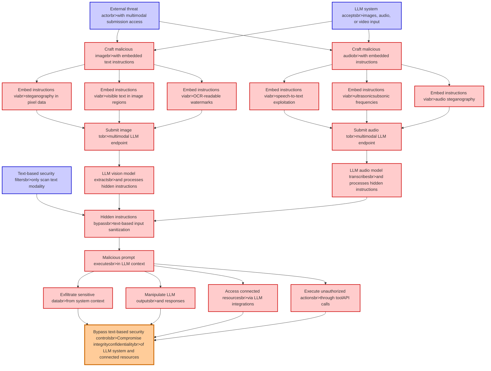

# Attack Tree: LLM01 Prompt Injection

**Threat ID**: 58541b72-e462-4042-bb21-e82ae89f8a07
**Statement**: An external threat actor who can submit multimodal content to an LLM system can embed hidden instructions in non-text modalities (images, audio), which leads to bypassing text-based security controls, resulting in reduced integrity and/or confidentiality of LLM system and connected resources

## Attack Tree Diagram

## MITRE ATT&CK Mapping

This attack tree has been mapped to MITRE ATT&CK techniques:

### Embed instructions viabr>ultrasonicsubsonic frequencies

- **Technique**: [T1123](https://attack.mitre.org/techniques/T1123/) - Audio Capture
- **Tactic**: Collection
- **Similarity Score**: 37.08%

### Hidden instructions bypassbr>text-based input sanitization

- **Technique**: [T1027.010](https://attack.mitre.org/techniques/T1027/010/) - Command Obfuscation
- **Tactic**: Defense Evasion
- **Similarity Score**: 56.39%
- **Mitigations (2):**
  - 🛡️ **Behavior Prevention on Endpoint**
    Behavior Prevention on Endpoint refers to the use of technologies and strategies to detect and block potentially malicio...
  - 🛡️ **Antivirus/Antimalware**
    Antivirus/Antimalware solutions utilize signatures, heuristics, and behavioral analysis to detect, block, and remediate ...

### LLM audio model transcribesbr>and processes hidden instructions

- **Technique**: [T1123](https://attack.mitre.org/techniques/T1123/) - Audio Capture
- **Tactic**: Collection
- **Similarity Score**: 53.74%

### Exfiltrate sensitive databr>from system context

- **Technique**: [T1074.001](https://attack.mitre.org/techniques/T1074/001/) - Local Data Staging
- **Tactic**: Collection
- **Similarity Score**: 77.80%

### Embed instructions viabr>speech-to-text exploitation

- **Technique**: [T1123](https://attack.mitre.org/techniques/T1123/) - Audio Capture
- **Tactic**: Collection
- **Similarity Score**: 42.35%

### LLM vision model extractsbr>and processes hidden instructions

- **Technique**: [T1622](https://attack.mitre.org/techniques/T1622/) - Debugger Evasion
- **Tactic**: Defense Evasion, Discovery
- **Similarity Score**: 44.54%

### LLM system acceptsbr>images, audio, or video input

- **Technique**: [T1125](https://attack.mitre.org/techniques/T1125/) - Video Capture
- **Tactic**: Collection
- **Similarity Score**: 49.93%

### Malicious prompt executesbr>in LLM context

- **Technique**: [T1202](https://attack.mitre.org/techniques/T1202/) - Indirect Command Execution
- **Tactic**: Defense Evasion
- **Similarity Score**: 60.02%

### Embed instructions viabr>OCR-readable watermarks

- **Technique**: [T1027.003](https://attack.mitre.org/techniques/T1027/003/) - Steganography
- **Tactic**: Defense Evasion
- **Similarity Score**: 59.17%

### Craft malicious imagebr>with embedded text instructions

- **Technique**: [T1027.003](https://attack.mitre.org/techniques/T1027/003/) - Steganography
- **Tactic**: Defense Evasion
- **Similarity Score**: 50.48%

### Embed instructions viabr>steganography in pixel data

- **Technique**: [T1027.003](https://attack.mitre.org/techniques/T1027/003/) - Steganography
- **Tactic**: Defense Evasion
- **Similarity Score**: 78.92%

### Embed instructions viabr>visible text in image regions

- **Technique**: [T1027.003](https://attack.mitre.org/techniques/T1027/003/) - Steganography
- **Tactic**: Defense Evasion
- **Similarity Score**: 48.10%

### Embed instructions viabr>audio steganography

- **Technique**: [T1027.003](https://attack.mitre.org/techniques/T1027/003/) - Steganography
- **Tactic**: Defense Evasion
- **Similarity Score**: 59.19%

### Craft malicious audiobr>with embedded instructions

- **Technique**: [T1123](https://attack.mitre.org/techniques/T1123/) - Audio Capture
- **Tactic**: Collection
- **Similarity Score**: 58.78%

### Manipulate LLM outputsbr>and responses

- **Technique**: [T1036.002](https://attack.mitre.org/techniques/T1036/002/) - Right-to-Left Override
- **Tactic**: Defense Evasion
- **Similarity Score**: 40.79%

### Access connected resourcesbr>via LLM integrations

- **Technique**: [T1218.003](https://attack.mitre.org/techniques/T1218/003/) - CMSTP
- **Tactic**: Defense Evasion
- **Similarity Score**: 43.97%
- **Mitigations (2):**
  - 🛡️ **Execution Prevention**
    Prevent the execution of unauthorized or malicious code on systems by implementing application control, script blocking,...
  - 🛡️ **Disable or Remove Feature or Program**
    Disable or remove unnecessary and potentially vulnerable software, features, or services to reduce the attack surface an...

### Execute unauthorized actionsbr>through toolAPI calls

- **Technique**: [T1514](https://attack.mitre.org/techniques/T1514/) - Elevated Execution with Prompt
- **Tactic**: Privilege Escalation
- **Similarity Score**: 54.89%

### Bypass text-based security controlsbr>Compromise integrityconfidentialitybr>of LLM system and connected resources

- **Technique**: [T1177](https://attack.mitre.org/techniques/T1177/) - LSASS Driver
- **Tactic**: Execution, Persistence
- **Similarity Score**: 66.88%

### Text-based security filtersbr>only scan text modality

- **Technique**: [T1174](https://attack.mitre.org/techniques/T1174/) - Password Filter DLL
- **Tactic**: Credential Access
- **Similarity Score**: 44.84%

### Submit image tobr>multimodal LLM endpoint

- **Technique**: [T1204.003](https://attack.mitre.org/techniques/T1204/003/) - Malicious Image
- **Tactic**: Execution
- **Similarity Score**: 40.17%
- **Mitigations (4):**
  - 🛡️ **Code Signing**
    Code Signing is a security process that ensures the authenticity and integrity of software by digitally signing executab...
  - 🛡️ **Network Intrusion Prevention**
    Use intrusion detection signatures to block traffic at network boundaries.
  - 🛡️ **User Training**
    User Training involves educating employees and contractors on recognizing, reporting, and preventing cyber threats that ...
  - *1 more mitigation(s) available*

### Submit audio tobr>multimodal LLM endpoint

- **Technique**: [T1123](https://attack.mitre.org/techniques/T1123/) - Audio Capture
- **Tactic**: Collection
- **Similarity Score**: 62.34%

### External threat actorbr>with multimodal submission access

- **Technique**: [T1608](https://attack.mitre.org/techniques/T1608/) - Stage Capabilities
- **Tactic**: Resource Development
- **Similarity Score**: 44.09%
- **Mitigations (1):**
  - 🛡️ **Pre-compromise**
    Pre-compromise mitigations involve proactive measures and defenses implemented to prevent adversaries from successfully ...

*Total technique mappings: 22 | Mitigations found: 9*

## Attack Path Analysis

Review this attack tree to:
1. Identify critical attack paths
2. Implement appropriate security controls
3. Monitor for indicators
4. Develop incident response procedures

---
*Generated by ThreatForest*
