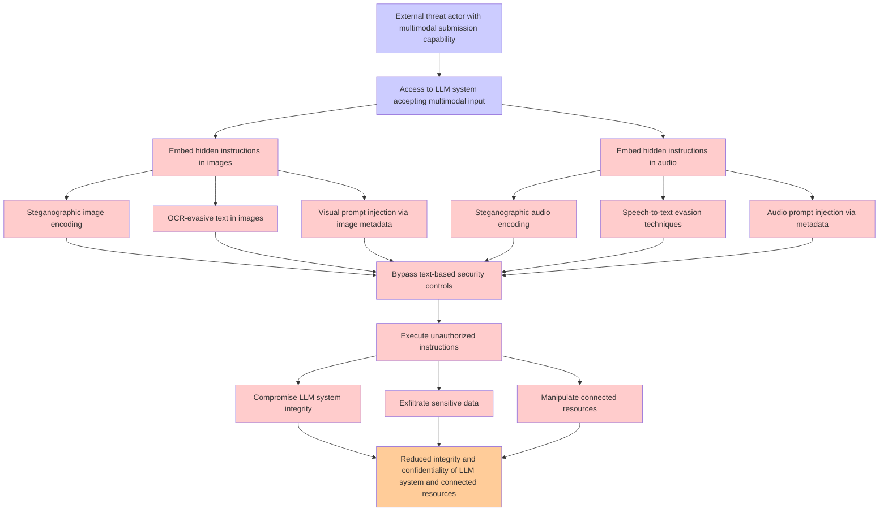

# Attack Tree: LLM01 Prompt Injection

**Threat ID**: 58541b72-e462-4042-bb21-e82ae89f8a07
**Statement**: An external threat actor who can submit multimodal content to an LLM system can embed hidden instructions in non-text modalities (images, audio), which leads to bypassing text-based security controls, resulting in reduced integrity and/or confidentiality of LLM system and connected resources

## Attack Tree Diagram

## MITRE ATT&CK Mapping

This attack tree has been mapped to MITRE ATT&CK techniques:

### Steganographic image encoding

- **Technique**: [T1027.003](https://attack.mitre.org/techniques/T1027/003/) - Steganography
- **Tactic**: Defense Evasion
- **Similarity Score**: 81.45%

### Reduced integrity and confidentiality of LLM system and connected resources

- **Technique**: [T1486](https://attack.mitre.org/techniques/T1486/) - Data Encrypted for Impact
- **Tactic**: Impact
- **Similarity Score**: 53.33%
- **Mitigations (2):**
  - 🛡️ **Behavior Prevention on Endpoint**
    Behavior Prevention on Endpoint refers to the use of technologies and strategies to detect and block potentially malicio...
  - 🛡️ **Data Backup**
    Data Backup involves taking and securely storing backups of data from end-user systems and critical servers. It ensures ...

### Access to LLM system accepting multimodal input

- **Technique**: [T1674](https://attack.mitre.org/techniques/T1674/) - Input Injection
- **Tactic**: Execution
- **Similarity Score**: 52.10%
- **Mitigations (2):**
  - 🛡️ **Limit Hardware Installation**
    Prevent unauthorized users or groups from installing or using hardware, such as external drives, peripheral devices, or ...
  - 🛡️ **Execution Prevention**
    Prevent the execution of unauthorized or malicious code on systems by implementing application control, script blocking,...

### Compromise LLM system integrity

- **Technique**: [T1542.003](https://attack.mitre.org/techniques/T1542/003/) - Bootkit
- **Tactic**: Persistence, Defense Evasion
- **Similarity Score**: 58.58%
- **Mitigations (2):**
  - 🛡️ **Boot Integrity**
    Boot Integrity ensures that a system starts securely by verifying the integrity of its boot process, operating system, a...
  - 🛡️ **Privileged Account Management**
    Privileged Account Management focuses on implementing policies, controls, and tools to securely manage privileged accoun...

### Embed hidden instructions in audio

- **Technique**: [T1123](https://attack.mitre.org/techniques/T1123/) - Audio Capture
- **Tactic**: Collection
- **Similarity Score**: 55.50%

### Bypass text-based security controls

- **Technique**: [T1089](https://attack.mitre.org/techniques/T1089/) - Disabling Security Tools
- **Tactic**: Defense Evasion
- **Similarity Score**: 53.89%

### Visual prompt injection via image metadata

- **Technique**: [T1612](https://attack.mitre.org/techniques/T1612/) - Build Image on Host
- **Tactic**: Defense Evasion
- **Similarity Score**: 49.45%
- **Mitigations (4):**
  - 🛡️ **Limit Access to Resource Over Network**
    Restrict access to network resources, such as file shares, remote systems, and services, to only those users, accounts, ...
  - 🛡️ **Privileged Account Management**
    Privileged Account Management focuses on implementing policies, controls, and tools to securely manage privileged accoun...
  - 🛡️ **Network Segmentation**
    Network segmentation involves dividing a network into smaller, isolated segments to control and limit the flow of traffi...
  - *1 more mitigation(s) available*

### Speech-to-text evasion techniques

- **Technique**: [T1001](https://attack.mitre.org/techniques/T1001/) - Data Obfuscation
- **Tactic**: Command And Control
- **Similarity Score**: 47.39%
- **Mitigations (1):**
  - 🛡️ **Network Intrusion Prevention**
    Use intrusion detection signatures to block traffic at network boundaries.

### Audio prompt injection via metadata

- **Technique**: [T1123](https://attack.mitre.org/techniques/T1123/) - Audio Capture
- **Tactic**: Collection
- **Similarity Score**: 51.38%

### Manipulate connected resources

- **Technique**: [T1133](https://attack.mitre.org/techniques/T1133/) - External Remote Services
- **Tactic**: Persistence, Initial Access
- **Similarity Score**: 49.04%
- **Mitigations (5):**
  - 🛡️ **Restrict Web-Based Content**
    Restricting web-based content involves enforcing policies and technologies that limit access to potentially malicious we...
  - 🛡️ **Network Segmentation**
    Network segmentation involves dividing a network into smaller, isolated segments to control and limit the flow of traffi...
  - 🛡️ **Disable or Remove Feature or Program**
    Disable or remove unnecessary and potentially vulnerable software, features, or services to reduce the attack surface an...
  - *2 more mitigation(s) available*

### Exfiltrate sensitive data

- **Technique**: [T1560.001](https://attack.mitre.org/techniques/T1560/001/) - Archive via Utility
- **Tactic**: Collection
- **Similarity Score**: 78.47%
- **Mitigations (1):**
  - 🛡️ **Audit**
    Auditing is the process of recording activity and systematically reviewing and analyzing the activity and system configu...

### Embed hidden instructions in images

- **Technique**: [T1027.003](https://attack.mitre.org/techniques/T1027/003/) - Steganography
- **Tactic**: Defense Evasion
- **Similarity Score**: 61.68%

### Execute unauthorized instructions

- **Technique**: [T1202](https://attack.mitre.org/techniques/T1202/) - Indirect Command Execution
- **Tactic**: Defense Evasion
- **Similarity Score**: 66.08%

### Steganographic audio encoding

- **Technique**: [T1027.013](https://attack.mitre.org/techniques/T1027/013/) - Encrypted/Encoded File
- **Tactic**: Defense Evasion
- **Similarity Score**: 60.36%
- **Mitigations (2):**
  - 🛡️ **Antivirus/Antimalware**
    Antivirus/Antimalware solutions utilize signatures, heuristics, and behavioral analysis to detect, block, and remediate ...
  - 🛡️ **Behavior Prevention on Endpoint**
    Behavior Prevention on Endpoint refers to the use of technologies and strategies to detect and block potentially malicio...

### External threat actor with multimodal submission capability

- **Technique**: [T1566.001](https://attack.mitre.org/techniques/T1566/001/) - Spearphishing Attachment
- **Tactic**: Initial Access
- **Similarity Score**: 42.44%
- **Mitigations (7):**
  - 🛡️ **Antivirus/Antimalware**
    Antivirus/Antimalware solutions utilize signatures, heuristics, and behavioral analysis to detect, block, and remediate ...
  - 🛡️ **User Account Management**
    User Account Management involves implementing and enforcing policies for the lifecycle of user accounts, including creat...
  - 🛡️ **Audit**
    Auditing is the process of recording activity and systematically reviewing and analyzing the activity and system configu...
  - *4 more mitigation(s) available*

### OCR-evasive text in images

- **Technique**: [T1027.003](https://attack.mitre.org/techniques/T1027/003/) - Steganography
- **Tactic**: Defense Evasion
- **Similarity Score**: 50.33%

*Total technique mappings: 16 | Mitigations found: 26*

## Attack Path Analysis

Review this attack tree to:
1. Identify critical attack paths
2. Implement appropriate security controls
3. Monitor for indicators
4. Develop incident response procedures

---
*Generated by ThreatForest*
