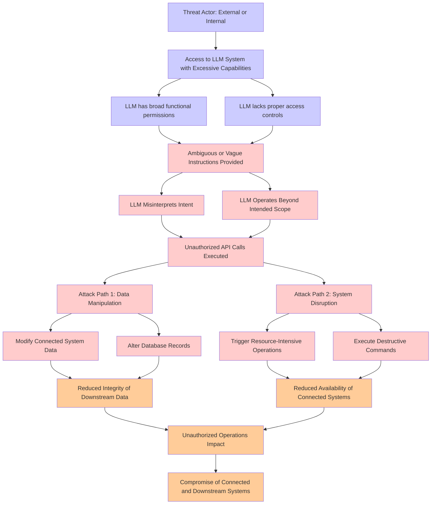

# Attack Tree: LLM06 Excessive Agency

**Threat ID**: 8b755706-59d2-41c4-9075-0013b92af39a
**Statement**: An external or internal threat actor who has access to an LLM system with excessive functional capabilities can abuse those capabilities when operating under ambiguous instructions, which leads to unauthorized operations, resulting in reduced integrity and/or availability of connected and downstream systems and data

## Attack Tree Diagram

## MITRE ATT&CK Mapping

This attack tree has been mapped to MITRE ATT&CK techniques:

### LLM lacks proper access controls

- **Technique**: [T1175](https://attack.mitre.org/techniques/T1175/) - Component Object Model and Distributed COM
- **Tactic**: Lateral Movement, Execution
- **Similarity Score**: 55.56%

### Reduced Integrity of Downstream Data

- **Technique**: [T1485](https://attack.mitre.org/techniques/T1485/) - Data Destruction
- **Tactic**: Impact
- **Similarity Score**: 71.13%
- **Mitigations (3):**
  - 🛡️ **Multi-factor Authentication**
    Multi-Factor Authentication (MFA) enhances security by requiring users to provide at least two forms of verification to ...
  - 🛡️ **Data Backup**
    Data Backup involves taking and securely storing backups of data from end-user systems and critical servers. It ensures ...
  - 🛡️ **User Account Management**
    User Account Management involves implementing and enforcing policies for the lifecycle of user accounts, including creat...

### Unauthorized API Calls Executed

- **Technique**: [T1059.009](https://attack.mitre.org/techniques/T1059/009/) - Cloud API
- **Tactic**: Execution
- **Similarity Score**: 46.92%
- **Mitigations (2):**
  - 🛡️ **Execution Prevention**
    Prevent the execution of unauthorized or malicious code on systems by implementing application control, script blocking,...
  - 🛡️ **Privileged Account Management**
    Privileged Account Management focuses on implementing policies, controls, and tools to securely manage privileged accoun...

### Trigger Resource-Intensive Operations

- **Technique**: [T1496](https://attack.mitre.org/techniques/T1496/) - Resource Hijacking
- **Tactic**: Impact
- **Similarity Score**: 65.38%

### Access to LLM System with Excessive Capabilities

- **Technique**: [T1177](https://attack.mitre.org/techniques/T1177/) - LSASS Driver
- **Tactic**: Execution, Persistence
- **Similarity Score**: 51.67%

### Execute Destructive Commands

- **Technique**: [T1485](https://attack.mitre.org/techniques/T1485/) - Data Destruction
- **Tactic**: Impact
- **Similarity Score**: 76.93%
- **Mitigations (3):**
  - 🛡️ **Multi-factor Authentication**
    Multi-Factor Authentication (MFA) enhances security by requiring users to provide at least two forms of verification to ...
  - 🛡️ **Data Backup**
    Data Backup involves taking and securely storing backups of data from end-user systems and critical servers. It ensures ...
  - 🛡️ **User Account Management**
    User Account Management involves implementing and enforcing policies for the lifecycle of user accounts, including creat...

### LLM Misinterprets Intent

- **Technique**: [T1149](https://attack.mitre.org/techniques/T1149/) - LC_MAIN Hijacking
- **Tactic**: Defense Evasion
- **Similarity Score**: 50.45%

### Compromise of Connected and Downstream Systems

- **Technique**: [T1599](https://attack.mitre.org/techniques/T1599/) - Network Boundary Bridging
- **Tactic**: Defense Evasion
- **Similarity Score**: 59.53%
- **Mitigations (5):**
  - 🛡️ **Multi-factor Authentication**
    Multi-Factor Authentication (MFA) enhances security by requiring users to provide at least two forms of verification to ...
  - 🛡️ **Password Policies**
    Set and enforce secure password policies for accounts to reduce the likelihood of unauthorized access. Strong password p...
  - 🛡️ **Privileged Account Management**
    Privileged Account Management focuses on implementing policies, controls, and tools to securely manage privileged accoun...
  - *2 more mitigation(s) available*

### Alter Database Records

- **Technique**: [T1492](https://attack.mitre.org/techniques/T1492/) - Stored Data Manipulation
- **Tactic**: Impact
- **Similarity Score**: 68.50%

### Threat Actor: External or Internal

- **Technique**: [T1587.001](https://attack.mitre.org/techniques/T1587/001/) - Malware
- **Tactic**: Resource Development
- **Similarity Score**: 50.31%
- **Mitigations (1):**
  - 🛡️ **Pre-compromise**
    Pre-compromise mitigations involve proactive measures and defenses implemented to prevent adversaries from successfully ...

### Unauthorized Operations Impact

- **Technique**: [T1548.006](https://attack.mitre.org/techniques/T1548/006/) - TCC Manipulation
- **Tactic**: Defense Evasion, Privilege Escalation
- **Similarity Score**: 53.37%
- **Mitigations (3):**
  - 🛡️ **Privileged Account Management**
    Privileged Account Management focuses on implementing policies, controls, and tools to securely manage privileged accoun...
  - 🛡️ **Audit**
    Auditing is the process of recording activity and systematically reviewing and analyzing the activity and system configu...
  - 🛡️ **Restrict File and Directory Permissions**
    Restricting file and directory permissions involves setting access controls at the file system level to limit which user...

### Modify Connected System Data

- **Technique**: [T1601.001](https://attack.mitre.org/techniques/T1601/001/) - Patch System Image
- **Tactic**: Defense Evasion
- **Similarity Score**: 65.71%
- **Mitigations (6):**
  - 🛡️ **Boot Integrity**
    Boot Integrity ensures that a system starts securely by verifying the integrity of its boot process, operating system, a...
  - 🛡️ **Code Signing**
    Code Signing is a security process that ensures the authenticity and integrity of software by digitally signing executab...
  - 🛡️ **Credential Access Protection**
    Credential Access Protection focuses on implementing measures to prevent adversaries from obtaining credentials, such as...
  - *3 more mitigation(s) available*

### Attack Path 1: Data Manipulation

- **Technique**: [T1565.002](https://attack.mitre.org/techniques/T1565/002/) - Transmitted Data Manipulation
- **Tactic**: Impact
- **Similarity Score**: 67.43%
- **Mitigations (1):**
  - 🛡️ **Encrypt Sensitive Information**
    Protect sensitive information at rest, in transit, and during processing by using strong encryption algorithms. Encrypti...

### Attack Path 2: System Disruption

- **Technique**: [T1499](https://attack.mitre.org/techniques/T1499/) - Endpoint Denial of Service
- **Tactic**: Impact
- **Similarity Score**: 60.20%
- **Mitigations (1):**
  - 🛡️ **Filter Network Traffic**
    Employ network appliances and endpoint software to filter ingress, egress, and lateral network traffic. This includes pr...

### Ambiguous or Vague Instructions Provided

- **Technique**: [T1598.003](https://attack.mitre.org/techniques/T1598/003/) - Spearphishing Link
- **Tactic**: Reconnaissance
- **Similarity Score**: 37.71%
- **Mitigations (2):**
  - 🛡️ **User Training**
    User Training involves educating employees and contractors on recognizing, reporting, and preventing cyber threats that ...
  - 🛡️ **Software Configuration**
    Software configuration refers to making security-focused adjustments to the settings of applications, middleware, databa...

### LLM Operates Beyond Intended Scope

- **Technique**: [T1177](https://attack.mitre.org/techniques/T1177/) - LSASS Driver
- **Tactic**: Execution, Persistence
- **Similarity Score**: 41.11%

### Reduced Availability of Connected Systems

- **Technique**: [T1499.004](https://attack.mitre.org/techniques/T1499/004/) - Application or System Exploitation
- **Tactic**: Impact
- **Similarity Score**: 61.87%
- **Mitigations (1):**
  - 🛡️ **Filter Network Traffic**
    Employ network appliances and endpoint software to filter ingress, egress, and lateral network traffic. This includes pr...

### LLM has broad functional permissions

- **Technique**: [T1574.005](https://attack.mitre.org/techniques/T1574/005/) - Executable Installer File Permissions Weakness
- **Tactic**: Persistence, Privilege Escalation, Defense Evasion
- **Similarity Score**: 71.00%
- **Mitigations (3):**
  - 🛡️ **Audit**
    Auditing is the process of recording activity and systematically reviewing and analyzing the activity and system configu...
  - 🛡️ **User Account Control**
    User Account Control (UAC) is a security feature in Microsoft Windows that prevents unauthorized changes to the operatin...
  - 🛡️ **User Account Management**
    User Account Management involves implementing and enforcing policies for the lifecycle of user accounts, including creat...

*Total technique mappings: 18 | Mitigations found: 31*

## Attack Path Analysis

Review this attack tree to:
1. Identify critical attack paths
2. Implement appropriate security controls
3. Monitor for indicators
4. Develop incident response procedures

---
*Generated by ThreatForest*
