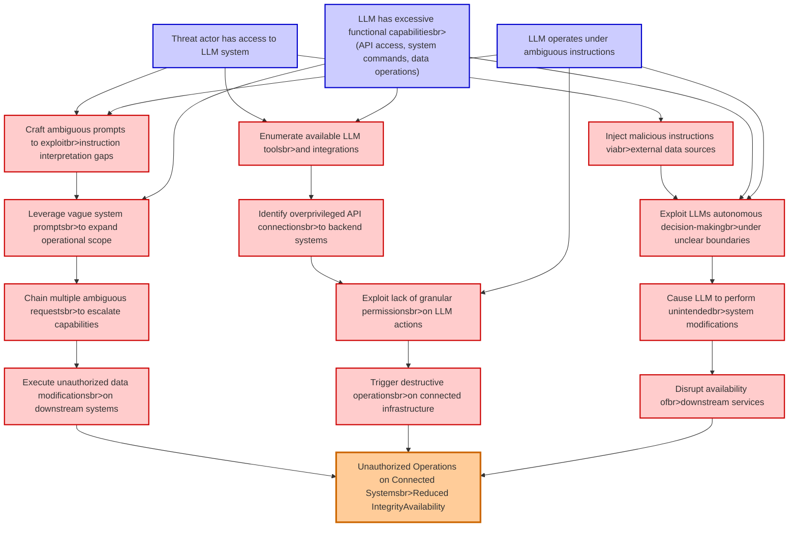

# Attack Tree: LLM06 Excessive Agency

**Threat ID**: 8b755706-59d2-41c4-9075-0013b92af39a
**Statement**: An external or internal threat actor who has access to an LLM system with excessive functional capabilities can abuse those capabilities when operating under ambiguous instructions, which leads to unauthorized operations, resulting in reduced integrity and/or availability of connected and downstream systems and data

## Attack Tree Diagram

## MITRE ATT&CK Mapping

This attack tree has been mapped to MITRE ATT&CK techniques:

### Identify overprivileged API connectionsbr>to backend systems

- **Technique**: [T1049](https://attack.mitre.org/techniques/T1049/) - System Network Connections Discovery
- **Tactic**: Discovery
- **Similarity Score**: 60.49%

### Exploit lack of granular permissionsbr>on LLM actions

- **Technique**: [T1548.006](https://attack.mitre.org/techniques/T1548/006/) - TCC Manipulation
- **Tactic**: Defense Evasion, Privilege Escalation
- **Similarity Score**: 77.72%
- **Mitigations (3):**
  - 🛡️ **Privileged Account Management**
    Privileged Account Management focuses on implementing policies, controls, and tools to securely manage privileged accoun...
  - 🛡️ **Audit**
    Auditing is the process of recording activity and systematically reviewing and analyzing the activity and system configu...
  - 🛡️ **Restrict File and Directory Permissions**
    Restricting file and directory permissions involves setting access controls at the file system level to limit which user...

### Trigger destructive operationsbr>on connected infrastructure

- **Technique**: [T1561](https://attack.mitre.org/techniques/T1561/) - Disk Wipe
- **Tactic**: Impact
- **Similarity Score**: 63.57%
- **Mitigations (1):**
  - 🛡️ **Data Backup**
    Data Backup involves taking and securely storing backups of data from end-user systems and critical servers. It ensures ...

### Enumerate available LLM toolsbr>and integrations

- **Technique**: [T1574.004](https://attack.mitre.org/techniques/T1574/004/) - Dylib Hijacking
- **Tactic**: Persistence, Privilege Escalation, Defense Evasion
- **Similarity Score**: 36.54%
- **Mitigations (1):**
  - 🛡️ **Restrict File and Directory Permissions**
    Restricting file and directory permissions involves setting access controls at the file system level to limit which user...

### Inject malicious instructions viabr>external data sources

- **Technique**: [T1559.002](https://attack.mitre.org/techniques/T1559/002/) - Dynamic Data Exchange
- **Tactic**: Execution
- **Similarity Score**: 52.57%
- **Mitigations (4):**
  - 🛡️ **Behavior Prevention on Endpoint**
    Behavior Prevention on Endpoint refers to the use of technologies and strategies to detect and block potentially malicio...
  - 🛡️ **Application Isolation and Sandboxing**
    Application Isolation and Sandboxing refers to the technique of restricting the execution of code to a controlled and is...
  - 🛡️ **Software Configuration**
    Software configuration refers to making security-focused adjustments to the settings of applications, middleware, databa...
  - *1 more mitigation(s) available*

### Unauthorized Operations on Connected Systemsbr>Reduced IntegrityAvailability

- **Technique**: [T1668](https://attack.mitre.org/techniques/T1668/) - Exclusive Control
- **Tactic**: Persistence
- **Similarity Score**: 65.05%

### Exploit LLMs autonomous decision-makingbr>under unclear boundaries

- **Technique**: [T1480](https://attack.mitre.org/techniques/T1480/) - Execution Guardrails
- **Tactic**: Defense Evasion
- **Similarity Score**: 47.35%
- **Mitigations (1):**
  - 🛡️ **Do Not Mitigate**
    The Do Not Mitigate category highlights scenarios where attempting to mitigate a specific technique may inadvertently in...

### Threat actor has access to LLM system

- **Technique**: [T1177](https://attack.mitre.org/techniques/T1177/) - LSASS Driver
- **Tactic**: Execution, Persistence
- **Similarity Score**: 45.39%

### LLM operates under ambiguous instructions

- **Technique**: [T1149](https://attack.mitre.org/techniques/T1149/) - LC_MAIN Hijacking
- **Tactic**: Defense Evasion
- **Similarity Score**: 50.63%

### LLM has excessive functional capabilitiesbr>(API access, system commands, data operations)

- **Technique**: [T1574.005](https://attack.mitre.org/techniques/T1574/005/) - Executable Installer File Permissions Weakness
- **Tactic**: Persistence, Privilege Escalation, Defense Evasion
- **Similarity Score**: 49.91%
- **Mitigations (3):**
  - 🛡️ **Audit**
    Auditing is the process of recording activity and systematically reviewing and analyzing the activity and system configu...
  - 🛡️ **User Account Control**
    User Account Control (UAC) is a security feature in Microsoft Windows that prevents unauthorized changes to the operatin...
  - 🛡️ **User Account Management**
    User Account Management involves implementing and enforcing policies for the lifecycle of user accounts, including creat...

### Leverage vague system promptsbr>to expand operational scope

- **Technique**: [T1202](https://attack.mitre.org/techniques/T1202/) - Indirect Command Execution
- **Tactic**: Defense Evasion
- **Similarity Score**: 54.76%

### Chain multiple ambiguous requestsbr>to escalate capabilities

- **Technique**: [T1548](https://attack.mitre.org/techniques/T1548/) - Abuse Elevation Control Mechanism
- **Tactic**: Privilege Escalation, Defense Evasion
- **Similarity Score**: 42.62%
- **Mitigations (8):**
  - 🛡️ **Execution Prevention**
    Prevent the execution of unauthorized or malicious code on systems by implementing application control, script blocking,...
  - 🛡️ **Operating System Configuration**
    Operating System Configuration involves adjusting system settings and hardening the default configurations of an operati...
  - 🛡️ **Update Software**
    Software updates ensure systems are protected against known vulnerabilities by applying patches and upgrades provided by...
  - *5 more mitigation(s) available*

### Craft ambiguous prompts to exploitbr>instruction interpretation gaps

- **Technique**: [T1202](https://attack.mitre.org/techniques/T1202/) - Indirect Command Execution
- **Tactic**: Defense Evasion
- **Similarity Score**: 46.64%

### Cause LLM to perform unintendedbr>system modifications

- **Technique**: [T1601](https://attack.mitre.org/techniques/T1601/) - Modify System Image
- **Tactic**: Defense Evasion
- **Similarity Score**: 61.76%
- **Mitigations (6):**
  - 🛡️ **Multi-factor Authentication**
    Multi-Factor Authentication (MFA) enhances security by requiring users to provide at least two forms of verification to ...
  - 🛡️ **Password Policies**
    Set and enforce secure password policies for accounts to reduce the likelihood of unauthorized access. Strong password p...
  - 🛡️ **Credential Access Protection**
    Credential Access Protection focuses on implementing measures to prevent adversaries from obtaining credentials, such as...
  - *3 more mitigation(s) available*

### Execute unauthorized data modificationsbr>on downstream systems

- **Technique**: [T1565.002](https://attack.mitre.org/techniques/T1565/002/) - Transmitted Data Manipulation
- **Tactic**: Impact
- **Similarity Score**: 60.41%
- **Mitigations (1):**
  - 🛡️ **Encrypt Sensitive Information**
    Protect sensitive information at rest, in transit, and during processing by using strong encryption algorithms. Encrypti...

### Disrupt availability ofbr>downstream services

- **Technique**: [T1489](https://attack.mitre.org/techniques/T1489/) - Service Stop
- **Tactic**: Impact
- **Similarity Score**: 64.88%
- **Mitigations (5):**
  - 🛡️ **Network Segmentation**
    Network segmentation involves dividing a network into smaller, isolated segments to control and limit the flow of traffi...
  - 🛡️ **User Account Management**
    User Account Management involves implementing and enforcing policies for the lifecycle of user accounts, including creat...
  - 🛡️ **Out-of-Band Communications Channel**
    Establish secure out-of-band communication channels to ensure the continuity of critical communications during security ...
  - *2 more mitigation(s) available*

*Total technique mappings: 16 | Mitigations found: 33*

## Attack Path Analysis

Review this attack tree to:
1. Identify critical attack paths
2. Implement appropriate security controls
3. Monitor for indicators
4. Develop incident response procedures

---
*Generated by ThreatForest*
