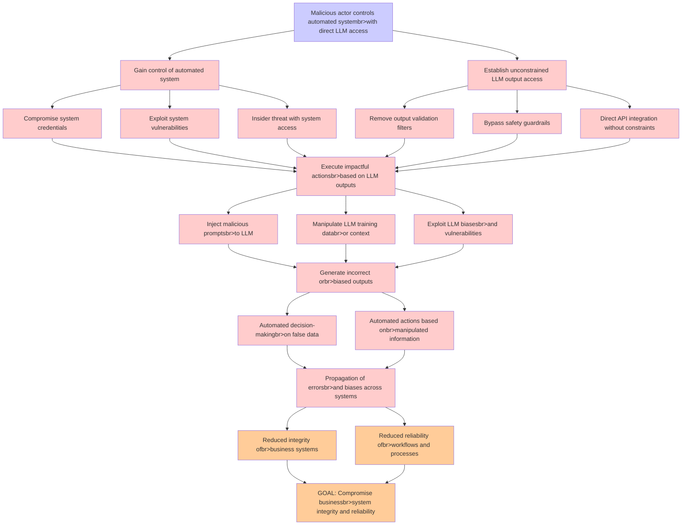

# Attack Tree: LLM09 Misinformation

**Threat ID**: 8c24eec4-40be-4f17-888d-f22d37b39724
**Statement**: A malicious actor who controls an automated system with direct access to unconstrained LLM outputs can execute impactful actions or make critical decisions based on potentially incorrect, biased, or manipulated data, which leads to automated propagation of errors or biases, resulting in reduced integrity and/or reliability of business systems and workflows

## Attack Tree Diagram

## MITRE ATT&CK Mapping

This attack tree has been mapped to MITRE ATT&CK techniques:

### Establish unconstrained LLM output access

- **Technique**: [T1177](https://attack.mitre.org/techniques/T1177/) - LSASS Driver
- **Tactic**: Execution, Persistence
- **Similarity Score**: 47.52%

### Gain control of automated system

- **Technique**: [T1072](https://attack.mitre.org/techniques/T1072/) - Software Deployment Tools
- **Tactic**: Execution, Lateral Movement
- **Similarity Score**: 54.12%
- **Mitigations (10):**
  - 🛡️ **User Account Management**
    User Account Management involves implementing and enforcing policies for the lifecycle of user accounts, including creat...
  - 🛡️ **Active Directory Configuration**
    Implement robust Active Directory (AD) configurations using group policies to secure user accounts, control access, and ...
  - 🛡️ **Update Software**
    Software updates ensure systems are protected against known vulnerabilities by applying patches and upgrades provided by...
  - *7 more mitigation(s) available*

### Manipulate LLM training databr>or context

- **Technique**: [T1588.007](https://attack.mitre.org/techniques/T1588/007/) - Artificial Intelligence
- **Tactic**: Resource Development
- **Similarity Score**: 32.91%
- **Mitigations (1):**
  - 🛡️ **Pre-compromise**
    Pre-compromise mitigations involve proactive measures and defenses implemented to prevent adversaries from successfully ...

### Propagation of errorsbr>and biases across systems

- **Technique**: [T1562.011](https://attack.mitre.org/techniques/T1562/011/) - Spoof Security Alerting
- **Tactic**: Defense Evasion
- **Similarity Score**: 36.81%
- **Mitigations (1):**
  - 🛡️ **Execution Prevention**
    Prevent the execution of unauthorized or malicious code on systems by implementing application control, script blocking,...

### Malicious actor controls automated systembr>with direct LLM access

- **Technique**: [T1177](https://attack.mitre.org/techniques/T1177/) - LSASS Driver
- **Tactic**: Execution, Persistence
- **Similarity Score**: 64.38%

### Reduced reliability ofbr>workflows and processes

- **Technique**: [T1562.001](https://attack.mitre.org/techniques/T1562/001/) - Disable or Modify Tools
- **Tactic**: Defense Evasion
- **Similarity Score**: 49.77%
- **Mitigations (5):**
  - 🛡️ **Execution Prevention**
    Prevent the execution of unauthorized or malicious code on systems by implementing application control, script blocking,...
  - 🛡️ **Restrict Registry Permissions**
    Restricting registry permissions involves configuring access control settings for sensitive registry keys and hives to e...
  - 🛡️ **User Account Management**
    User Account Management involves implementing and enforcing policies for the lifecycle of user accounts, including creat...
  - *2 more mitigation(s) available*

### Remove output validation filters

- **Technique**: [T1070](https://attack.mitre.org/techniques/T1070/) - Indicator Removal
- **Tactic**: Defense Evasion
- **Similarity Score**: 38.02%
- **Mitigations (3):**
  - 🛡️ **Encrypt Sensitive Information**
    Protect sensitive information at rest, in transit, and during processing by using strong encryption algorithms. Encrypti...
  - 🛡️ **Remote Data Storage**
    Remote Data Storage focuses on moving critical data, such as security logs and sensitive files, to secure, off-host loca...
  - 🛡️ **Restrict File and Directory Permissions**
    Restricting file and directory permissions involves setting access controls at the file system level to limit which user...

### Reduced integrity ofbr>business systems

- **Technique**: [T1565.001](https://attack.mitre.org/techniques/T1565/001/) - Stored Data Manipulation
- **Tactic**: Impact
- **Similarity Score**: 65.25%
- **Mitigations (3):**
  - 🛡️ **Restrict File and Directory Permissions**
    Restricting file and directory permissions involves setting access controls at the file system level to limit which user...
  - 🛡️ **Remote Data Storage**
    Remote Data Storage focuses on moving critical data, such as security logs and sensitive files, to secure, off-host loca...
  - 🛡️ **Encrypt Sensitive Information**
    Protect sensitive information at rest, in transit, and during processing by using strong encryption algorithms. Encrypti...

### Generate incorrect orbr>biased outputs

- **Technique**: [T1054](https://attack.mitre.org/techniques/T1054/) - Indicator Blocking
- **Tactic**: Defense Evasion
- **Similarity Score**: 31.48%

### Insider threat with system access

- **Technique**: [T1199](https://attack.mitre.org/techniques/T1199/) - Trusted Relationship
- **Tactic**: Initial Access
- **Similarity Score**: 59.10%
- **Mitigations (3):**
  - 🛡️ **Multi-factor Authentication**
    Multi-Factor Authentication (MFA) enhances security by requiring users to provide at least two forms of verification to ...
  - 🛡️ **User Account Management**
    User Account Management involves implementing and enforcing policies for the lifecycle of user accounts, including creat...
  - 🛡️ **Network Segmentation**
    Network segmentation involves dividing a network into smaller, isolated segments to control and limit the flow of traffi...

### Direct API integration without constraints

- **Technique**: [T1106](https://attack.mitre.org/techniques/T1106/) - Native API
- **Tactic**: Execution
- **Similarity Score**: 40.81%
- **Mitigations (2):**
  - 🛡️ **Execution Prevention**
    Prevent the execution of unauthorized or malicious code on systems by implementing application control, script blocking,...
  - 🛡️ **Behavior Prevention on Endpoint**
    Behavior Prevention on Endpoint refers to the use of technologies and strategies to detect and block potentially malicio...

### Compromise system credentials

- **Technique**: [T1556.003](https://attack.mitre.org/techniques/T1556/003/) - Pluggable Authentication Modules
- **Tactic**: Credential Access, Defense Evasion, Persistence
- **Similarity Score**: 78.07%
- **Mitigations (2):**
  - 🛡️ **Multi-factor Authentication**
    Multi-Factor Authentication (MFA) enhances security by requiring users to provide at least two forms of verification to ...
  - 🛡️ **Privileged Account Management**
    Privileged Account Management focuses on implementing policies, controls, and tools to securely manage privileged accoun...

### Automated actions based onbr>manipulated information

- **Technique**: [T1565](https://attack.mitre.org/techniques/T1565/) - Data Manipulation
- **Tactic**: Impact
- **Similarity Score**: 56.72%
- **Mitigations (4):**
  - 🛡️ **Encrypt Sensitive Information**
    Protect sensitive information at rest, in transit, and during processing by using strong encryption algorithms. Encrypti...
  - 🛡️ **Remote Data Storage**
    Remote Data Storage focuses on moving critical data, such as security logs and sensitive files, to secure, off-host loca...
  - 🛡️ **Network Segmentation**
    Network segmentation involves dividing a network into smaller, isolated segments to control and limit the flow of traffi...
  - *1 more mitigation(s) available*

### GOAL: Compromise businessbr>system integrity and reliability

- **Technique**: [T1109](https://attack.mitre.org/techniques/T1109/) - Component Firmware
- **Tactic**: Defense Evasion, Persistence
- **Similarity Score**: 52.48%

### Exploit system vulnerabilities

- **Technique**: [T1211](https://attack.mitre.org/techniques/T1211/) - Exploitation for Defense Evasion
- **Tactic**: Defense Evasion
- **Similarity Score**: 68.43%
- **Mitigations (4):**
  - 🛡️ **Exploit Protection**
    Deploy capabilities that detect, block, and mitigate conditions indicative of software exploits. These capabilities aim ...
  - 🛡️ **Update Software**
    Software updates ensure systems are protected against known vulnerabilities by applying patches and upgrades provided by...
  - 🛡️ **Threat Intelligence Program**
    A Threat Intelligence Program enables organizations to proactively identify, analyze, and act on cyber threats by levera...
  - *1 more mitigation(s) available*

### Inject malicious promptsbr>to LLM

- **Technique**: [T1141](https://attack.mitre.org/techniques/T1141/) - Input Prompt
- **Tactic**: Credential Access
- **Similarity Score**: 48.63%

### Bypass safety guardrails

- **Technique**: [T1480](https://attack.mitre.org/techniques/T1480/) - Execution Guardrails
- **Tactic**: Defense Evasion
- **Similarity Score**: 45.39%
- **Mitigations (1):**
  - 🛡️ **Do Not Mitigate**
    The Do Not Mitigate category highlights scenarios where attempting to mitigate a specific technique may inadvertently in...

### Exploit LLM biasesbr>and vulnerabilities

- **Technique**: [T1587.004](https://attack.mitre.org/techniques/T1587/004/) - Exploits
- **Tactic**: Resource Development
- **Similarity Score**: 61.74%
- **Mitigations (1):**
  - 🛡️ **Pre-compromise**
    Pre-compromise mitigations involve proactive measures and defenses implemented to prevent adversaries from successfully ...

### Execute impactful actionsbr>based on LLM outputs

- **Technique**: [T1497.002](https://attack.mitre.org/techniques/T1497/002/) - User Activity Based Checks
- **Tactic**: Defense Evasion, Discovery
- **Similarity Score**: 42.52%

### Automated decision-makingbr>on false data

- **Technique**: [T1565](https://attack.mitre.org/techniques/T1565/) - Data Manipulation
- **Tactic**: Impact
- **Similarity Score**: 42.11%
- **Mitigations (4):**
  - 🛡️ **Encrypt Sensitive Information**
    Protect sensitive information at rest, in transit, and during processing by using strong encryption algorithms. Encrypti...
  - 🛡️ **Remote Data Storage**
    Remote Data Storage focuses on moving critical data, such as security logs and sensitive files, to secure, off-host loca...
  - 🛡️ **Network Segmentation**
    Network segmentation involves dividing a network into smaller, isolated segments to control and limit the flow of traffi...
  - *1 more mitigation(s) available*

*Total technique mappings: 20 | Mitigations found: 44*

## Attack Path Analysis

Review this attack tree to:
1. Identify critical attack paths
2. Implement appropriate security controls
3. Monitor for indicators
4. Develop incident response procedures

---
*Generated by ThreatForest*
