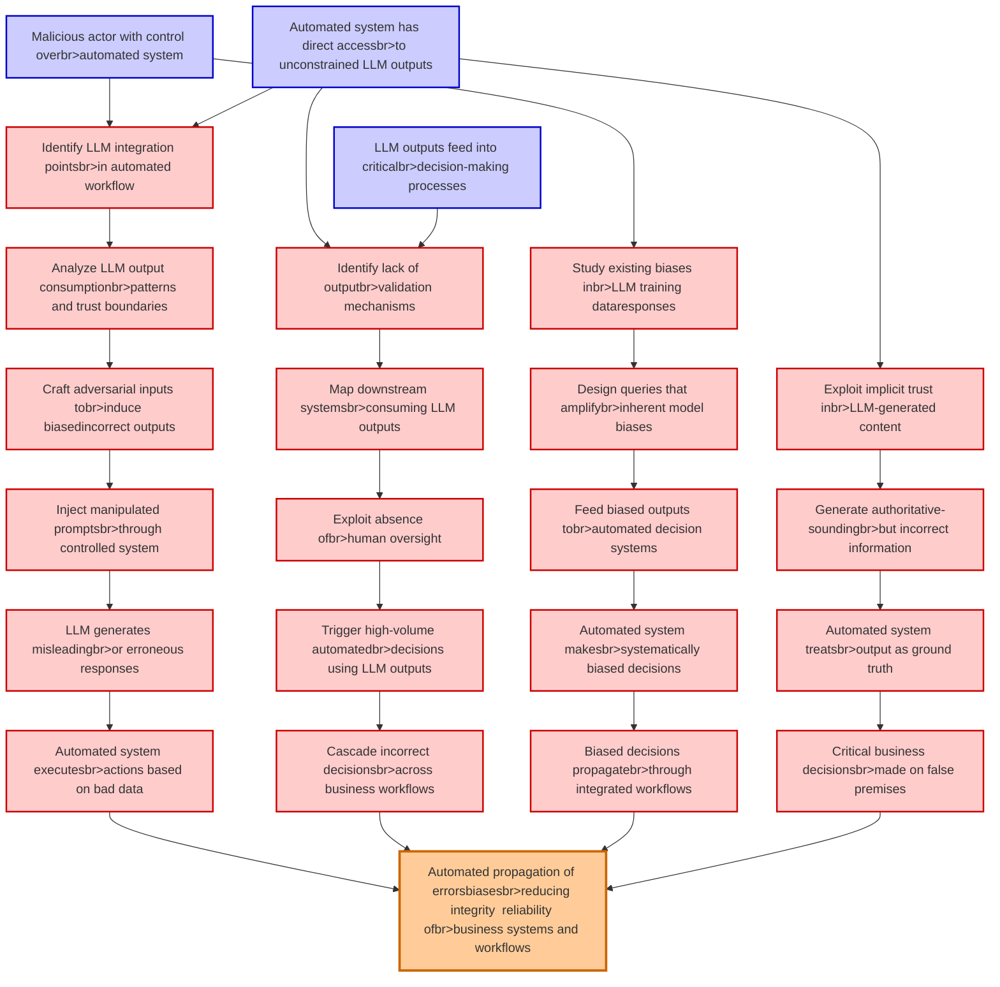

# Attack Tree: LLM09 Misinformation

**Threat ID**: 8c24eec4-40be-4f17-888d-f22d37b39724
**Statement**: A malicious actor who controls an automated system with direct access to unconstrained LLM outputs can execute impactful actions or make critical decisions based on potentially incorrect, biased, or manipulated data, which leads to automated propagation of errors or biases, resulting in reduced integrity and/or reliability of business systems and workflows

## Attack Tree Diagram

## MITRE ATT&CK Mapping

This attack tree has been mapped to MITRE ATT&CK techniques:

### Design queries that amplifybr>inherent model biases

- **Technique**: [T1498.002](https://attack.mitre.org/techniques/T1498/002/) - Reflection Amplification
- **Tactic**: Impact
- **Similarity Score**: 32.23%
- **Mitigations (1):**
  - 🛡️ **Filter Network Traffic**
    Employ network appliances and endpoint software to filter ingress, egress, and lateral network traffic. This includes pr...

### Craft adversarial inputs tobr>induce biasedincorrect outputs

- **Technique**: [T1588.007](https://attack.mitre.org/techniques/T1588/007/) - Artificial Intelligence
- **Tactic**: Resource Development
- **Similarity Score**: 48.43%
- **Mitigations (1):**
  - 🛡️ **Pre-compromise**
    Pre-compromise mitigations involve proactive measures and defenses implemented to prevent adversaries from successfully ...

### Critical business decisionsbr>made on false premises

- **Technique**: [T1565](https://attack.mitre.org/techniques/T1565/) - Data Manipulation
- **Tactic**: Impact
- **Similarity Score**: 53.75%
- **Mitigations (4):**
  - 🛡️ **Encrypt Sensitive Information**
    Protect sensitive information at rest, in transit, and during processing by using strong encryption algorithms. Encrypti...
  - 🛡️ **Remote Data Storage**
    Remote Data Storage focuses on moving critical data, such as security logs and sensitive files, to secure, off-host loca...
  - 🛡️ **Network Segmentation**
    Network segmentation involves dividing a network into smaller, isolated segments to control and limit the flow of traffi...
  - *1 more mitigation(s) available*

### Automated propagation of errorsbiasesbr>reducing integrity  reliability ofbr>business systems and workflows

- **Technique**: [T1565.001](https://attack.mitre.org/techniques/T1565/001/) - Stored Data Manipulation
- **Tactic**: Impact
- **Similarity Score**: 51.39%
- **Mitigations (3):**
  - 🛡️ **Restrict File and Directory Permissions**
    Restricting file and directory permissions involves setting access controls at the file system level to limit which user...
  - 🛡️ **Remote Data Storage**
    Remote Data Storage focuses on moving critical data, such as security logs and sensitive files, to secure, off-host loca...
  - 🛡️ **Encrypt Sensitive Information**
    Protect sensitive information at rest, in transit, and during processing by using strong encryption algorithms. Encrypti...

### Identify LLM integration pointsbr>in automated workflow

- **Technique**: [T1497.001](https://attack.mitre.org/techniques/T1497/001/) - System Checks
- **Tactic**: Defense Evasion, Discovery
- **Similarity Score**: 37.67%

### Analyze LLM output consumptionbr>patterns and trust boundaries

- **Technique**: [T1482](https://attack.mitre.org/techniques/T1482/) - Domain Trust Discovery
- **Tactic**: Discovery
- **Similarity Score**: 44.19%
- **Mitigations (2):**
  - 🛡️ **Audit**
    Auditing is the process of recording activity and systematically reviewing and analyzing the activity and system configu...
  - 🛡️ **Network Segmentation**
    Network segmentation involves dividing a network into smaller, isolated segments to control and limit the flow of traffi...

### Inject manipulated promptsbr>through controlled system

- **Technique**: [T1141](https://attack.mitre.org/techniques/T1141/) - Input Prompt
- **Tactic**: Credential Access
- **Similarity Score**: 64.43%

### Biased decisions propagatebr>through integrated workflows

- **Technique**: [T1565](https://attack.mitre.org/techniques/T1565/) - Data Manipulation
- **Tactic**: Impact
- **Similarity Score**: 41.03%
- **Mitigations (4):**
  - 🛡️ **Encrypt Sensitive Information**
    Protect sensitive information at rest, in transit, and during processing by using strong encryption algorithms. Encrypti...
  - 🛡️ **Remote Data Storage**
    Remote Data Storage focuses on moving critical data, such as security logs and sensitive files, to secure, off-host loca...
  - 🛡️ **Network Segmentation**
    Network segmentation involves dividing a network into smaller, isolated segments to control and limit the flow of traffi...
  - *1 more mitigation(s) available*

### Automated system treatsbr>output as ground truth

- **Technique**: [T1001.001](https://attack.mitre.org/techniques/T1001/001/) - Junk Data
- **Tactic**: Command And Control
- **Similarity Score**: 41.64%
- **Mitigations (1):**
  - 🛡️ **Network Intrusion Prevention**
    Use intrusion detection signatures to block traffic at network boundaries.

### Trigger high-volume automatedbr>decisions using LLM outputs

- **Technique**: [T1177](https://attack.mitre.org/techniques/T1177/) - LSASS Driver
- **Tactic**: Execution, Persistence
- **Similarity Score**: 35.91%

### Map downstream systemsbr>consuming LLM outputs

- **Technique**: [T1602.001](https://attack.mitre.org/techniques/T1602/001/) - SNMP (MIB Dump)
- **Tactic**: Collection
- **Similarity Score**: 40.85%
- **Mitigations (6):**
  - 🛡️ **Software Configuration**
    Software configuration refers to making security-focused adjustments to the settings of applications, middleware, databa...
  - 🛡️ **Update Software**
    Software updates ensure systems are protected against known vulnerabilities by applying patches and upgrades provided by...
  - 🛡️ **Encrypt Sensitive Information**
    Protect sensitive information at rest, in transit, and during processing by using strong encryption algorithms. Encrypti...
  - *3 more mitigation(s) available*

### Identify lack of outputbr>validation mechanisms

- **Technique**: [T1553.003](https://attack.mitre.org/techniques/T1553/003/) - SIP and Trust Provider Hijacking
- **Tactic**: Defense Evasion
- **Similarity Score**: 39.78%
- **Mitigations (3):**
  - 🛡️ **Execution Prevention**
    Prevent the execution of unauthorized or malicious code on systems by implementing application control, script blocking,...
  - 🛡️ **Restrict Registry Permissions**
    Restricting registry permissions involves configuring access control settings for sensitive registry keys and hives to e...
  - 🛡️ **Restrict File and Directory Permissions**
    Restricting file and directory permissions involves setting access controls at the file system level to limit which user...

### Generate authoritative-soundingbr>but incorrect information

- **Technique**: [T1557.001](https://attack.mitre.org/techniques/T1557/001/) - LLMNR/NBT-NS Poisoning and SMB Relay
- **Tactic**: Credential Access, Collection
- **Similarity Score**: 40.12%
- **Mitigations (4):**
  - 🛡️ **Disable or Remove Feature or Program**
    Disable or remove unnecessary and potentially vulnerable software, features, or services to reduce the attack surface an...
  - 🛡️ **Network Intrusion Prevention**
    Use intrusion detection signatures to block traffic at network boundaries.
  - 🛡️ **Network Segmentation**
    Network segmentation involves dividing a network into smaller, isolated segments to control and limit the flow of traffi...
  - *1 more mitigation(s) available*

### Automated system makesbr>systematically biased decisions

- **Technique**: [T1480](https://attack.mitre.org/techniques/T1480/) - Execution Guardrails
- **Tactic**: Defense Evasion
- **Similarity Score**: 36.07%
- **Mitigations (1):**
  - 🛡️ **Do Not Mitigate**
    The Do Not Mitigate category highlights scenarios where attempting to mitigate a specific technique may inadvertently in...

### Exploit implicit trust inbr>LLM-generated content

- **Technique**: [T1553](https://attack.mitre.org/techniques/T1553/) - Subvert Trust Controls
- **Tactic**: Defense Evasion
- **Similarity Score**: 70.20%
- **Mitigations (5):**
  - 🛡️ **Execution Prevention**
    Prevent the execution of unauthorized or malicious code on systems by implementing application control, script blocking,...
  - 🛡️ **Operating System Configuration**
    Operating System Configuration involves adjusting system settings and hardening the default configurations of an operati...
  - 🛡️ **Privileged Account Management**
    Privileged Account Management focuses on implementing policies, controls, and tools to securely manage privileged accoun...
  - *2 more mitigation(s) available*

### Exploit absence ofbr>human oversight

- **Technique**: [T1218.009](https://attack.mitre.org/techniques/T1218/009/) - Regsvcs/Regasm
- **Tactic**: Defense Evasion
- **Similarity Score**: 53.65%
- **Mitigations (2):**
  - 🛡️ **Execution Prevention**
    Prevent the execution of unauthorized or malicious code on systems by implementing application control, script blocking,...
  - 🛡️ **Disable or Remove Feature or Program**
    Disable or remove unnecessary and potentially vulnerable software, features, or services to reduce the attack surface an...

### Automated system has direct accessbr>to unconstrained LLM outputs

- **Technique**: [T1177](https://attack.mitre.org/techniques/T1177/) - LSASS Driver
- **Tactic**: Execution, Persistence
- **Similarity Score**: 36.97%

### Automated system executesbr>actions based on bad data

- **Technique**: [T1497.001](https://attack.mitre.org/techniques/T1497/001/) - System Checks
- **Tactic**: Defense Evasion, Discovery
- **Similarity Score**: 49.43%

### Malicious actor with control overbr>automated system

- **Technique**: [T1072](https://attack.mitre.org/techniques/T1072/) - Software Deployment Tools
- **Tactic**: Execution, Lateral Movement
- **Similarity Score**: 51.44%
- **Mitigations (10):**
  - 🛡️ **User Account Management**
    User Account Management involves implementing and enforcing policies for the lifecycle of user accounts, including creat...
  - 🛡️ **Active Directory Configuration**
    Implement robust Active Directory (AD) configurations using group policies to secure user accounts, control access, and ...
  - 🛡️ **Update Software**
    Software updates ensure systems are protected against known vulnerabilities by applying patches and upgrades provided by...
  - *7 more mitigation(s) available*

### LLM outputs feed into criticalbr>decision-making processes

- **Technique**: [T1562.011](https://attack.mitre.org/techniques/T1562/011/) - Spoof Security Alerting
- **Tactic**: Defense Evasion
- **Similarity Score**: 32.32%
- **Mitigations (1):**
  - 🛡️ **Execution Prevention**
    Prevent the execution of unauthorized or malicious code on systems by implementing application control, script blocking,...

### Cascade incorrect decisionsbr>across business workflows

- **Technique**: [T1565](https://attack.mitre.org/techniques/T1565/) - Data Manipulation
- **Tactic**: Impact
- **Similarity Score**: 40.80%
- **Mitigations (4):**
  - 🛡️ **Encrypt Sensitive Information**
    Protect sensitive information at rest, in transit, and during processing by using strong encryption algorithms. Encrypti...
  - 🛡️ **Remote Data Storage**
    Remote Data Storage focuses on moving critical data, such as security logs and sensitive files, to secure, off-host loca...
  - 🛡️ **Network Segmentation**
    Network segmentation involves dividing a network into smaller, isolated segments to control and limit the flow of traffi...
  - *1 more mitigation(s) available*

### LLM generates misleadingbr>or erroneous responses

- **Technique**: [T1161](https://attack.mitre.org/techniques/T1161/) - LC_LOAD_DYLIB Addition
- **Tactic**: Persistence
- **Similarity Score**: 39.57%

### Feed biased outputs tobr>automated decision systems

- **Technique**: [T1588.007](https://attack.mitre.org/techniques/T1588/007/) - Artificial Intelligence
- **Tactic**: Resource Development
- **Similarity Score**: 37.60%
- **Mitigations (1):**
  - 🛡️ **Pre-compromise**
    Pre-compromise mitigations involve proactive measures and defenses implemented to prevent adversaries from successfully ...

### Study existing biases inbr>LLM training dataresponses

- **Technique**: [T1588.007](https://attack.mitre.org/techniques/T1588/007/) - Artificial Intelligence
- **Tactic**: Resource Development
- **Similarity Score**: 33.78%
- **Mitigations (1):**
  - 🛡️ **Pre-compromise**
    Pre-compromise mitigations involve proactive measures and defenses implemented to prevent adversaries from successfully ...

*Total technique mappings: 24 | Mitigations found: 54*

## Attack Path Analysis

Review this attack tree to:
1. Identify critical attack paths
2. Implement appropriate security controls
3. Monitor for indicators
4. Develop incident response procedures

---
*Generated by ThreatForest*
