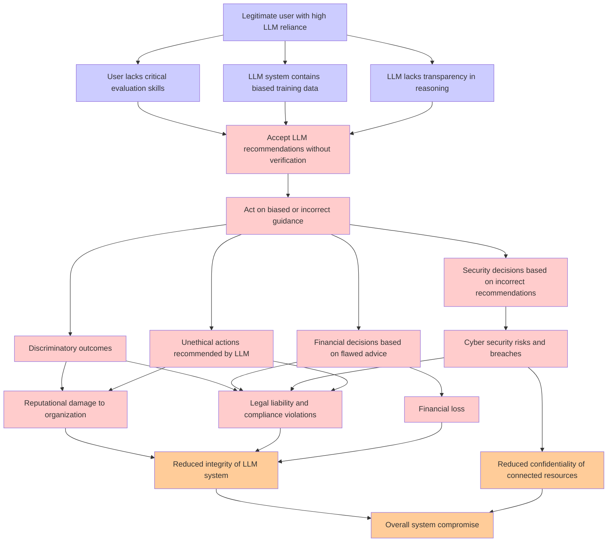

# Attack Tree: LLM09 Misinformation

**Threat ID**: b89e6369-cca5-43a1-a756-3587e52cf263
**Statement**: A legitimate user who is over reliant on LLM recommendation can accept biased, unethical, or incorrect guidance and advice, which leads to discriminatory outcomes, reputational damage, financial loss, legal issues or cyber risks, resulting in reduced integrity and/or confidentiality of LLM system and connected resources

## Attack Tree Diagram

## MITRE ATT&CK Mapping

This attack tree has been mapped to MITRE ATT&CK techniques:

### LLM system contains biased training data

- **Technique**: [T1588.007](https://attack.mitre.org/techniques/T1588/007/) - Artificial Intelligence
- **Tactic**: Resource Development
- **Similarity Score**: 31.55%
- **Mitigations (1):**
  - 🛡️ **Pre-compromise**
    Pre-compromise mitigations involve proactive measures and defenses implemented to prevent adversaries from successfully ...

### User lacks critical evaluation skills

- **Technique**: [T1204](https://attack.mitre.org/techniques/T1204/) - User Execution
- **Tactic**: Execution
- **Similarity Score**: 43.05%
- **Mitigations (6):**
  - 🛡️ **User Training**
    User Training involves educating employees and contractors on recognizing, reporting, and preventing cyber threats that ...
  - 🛡️ **Execution Prevention**
    Prevent the execution of unauthorized or malicious code on systems by implementing application control, script blocking,...
  - 🛡️ **Behavior Prevention on Endpoint**
    Behavior Prevention on Endpoint refers to the use of technologies and strategies to detect and block potentially malicio...
  - *3 more mitigation(s) available*

### Discriminatory outcomes

- **Technique**: [T1556.009](https://attack.mitre.org/techniques/T1556/009/) - Conditional Access Policies
- **Tactic**: Credential Access, Defense Evasion, Persistence
- **Similarity Score**: 32.45%
- **Mitigations (1):**
  - 🛡️ **User Account Management**
    User Account Management involves implementing and enforcing policies for the lifecycle of user accounts, including creat...

### Reduced confidentiality of connected resources

- **Technique**: [T1665](https://attack.mitre.org/techniques/T1665/) - Hide Infrastructure
- **Tactic**: Command And Control
- **Similarity Score**: 49.16%

### Legal liability and compliance violations

- **Technique**: [T1588](https://attack.mitre.org/techniques/T1588/) - Obtain Capabilities
- **Tactic**: Resource Development
- **Similarity Score**: 42.34%
- **Mitigations (1):**
  - 🛡️ **Pre-compromise**
    Pre-compromise mitigations involve proactive measures and defenses implemented to prevent adversaries from successfully ...

### LLM lacks transparency in reasoning

- **Technique**: [T1027.014](https://attack.mitre.org/techniques/T1027/014/) - Polymorphic Code
- **Tactic**: Defense Evasion
- **Similarity Score**: 40.19%
- **Mitigations (2):**
  - 🛡️ **Behavior Prevention on Endpoint**
    Behavior Prevention on Endpoint refers to the use of technologies and strategies to detect and block potentially malicio...
  - 🛡️ **Antivirus/Antimalware**
    Antivirus/Antimalware solutions utilize signatures, heuristics, and behavioral analysis to detect, block, and remediate ...

### Financial loss

- **Technique**: [T1657](https://attack.mitre.org/techniques/T1657/) - Financial Theft
- **Tactic**: Impact
- **Similarity Score**: 50.03%
- **Mitigations (2):**
  - 🛡️ **User Training**
    User Training involves educating employees and contractors on recognizing, reporting, and preventing cyber threats that ...
  - 🛡️ **User Account Management**
    User Account Management involves implementing and enforcing policies for the lifecycle of user accounts, including creat...

### Unethical actions recommended by LLM

- **Technique**: [T1587](https://attack.mitre.org/techniques/T1587/) - Develop Capabilities
- **Tactic**: Resource Development
- **Similarity Score**: 37.79%
- **Mitigations (1):**
  - 🛡️ **Pre-compromise**
    Pre-compromise mitigations involve proactive measures and defenses implemented to prevent adversaries from successfully ...

### Financial decisions based on flawed advice

- **Technique**: [T1657](https://attack.mitre.org/techniques/T1657/) - Financial Theft
- **Tactic**: Impact
- **Similarity Score**: 42.14%
- **Mitigations (2):**
  - 🛡️ **User Training**
    User Training involves educating employees and contractors on recognizing, reporting, and preventing cyber threats that ...
  - 🛡️ **User Account Management**
    User Account Management involves implementing and enforcing policies for the lifecycle of user accounts, including creat...

### Overall system compromise

- **Technique**: [T1195.003](https://attack.mitre.org/techniques/T1195/003/) - Compromise Hardware Supply Chain
- **Tactic**: Initial Access
- **Similarity Score**: 47.59%
- **Mitigations (1):**
  - 🛡️ **Boot Integrity**
    Boot Integrity ensures that a system starts securely by verifying the integrity of its boot process, operating system, a...

### Reduced integrity of LLM system

- **Technique**: [T1490](https://attack.mitre.org/techniques/T1490/) - Inhibit System Recovery
- **Tactic**: Impact
- **Similarity Score**: 59.49%
- **Mitigations (4):**
  - 🛡️ **Execution Prevention**
    Prevent the execution of unauthorized or malicious code on systems by implementing application control, script blocking,...
  - 🛡️ **Operating System Configuration**
    Operating System Configuration involves adjusting system settings and hardening the default configurations of an operati...
  - 🛡️ **User Account Management**
    User Account Management involves implementing and enforcing policies for the lifecycle of user accounts, including creat...
  - *1 more mitigation(s) available*

### Cyber security risks and breaches

- **Technique**: [T1588.006](https://attack.mitre.org/techniques/T1588/006/) - Vulnerabilities
- **Tactic**: Resource Development
- **Similarity Score**: 56.26%
- **Mitigations (1):**
  - 🛡️ **Pre-compromise**
    Pre-compromise mitigations involve proactive measures and defenses implemented to prevent adversaries from successfully ...

### Legitimate user with high LLM reliance

- **Technique**: [T1199](https://attack.mitre.org/techniques/T1199/) - Trusted Relationship
- **Tactic**: Initial Access
- **Similarity Score**: 50.85%
- **Mitigations (3):**
  - 🛡️ **Multi-factor Authentication**
    Multi-Factor Authentication (MFA) enhances security by requiring users to provide at least two forms of verification to ...
  - 🛡️ **User Account Management**
    User Account Management involves implementing and enforcing policies for the lifecycle of user accounts, including creat...
  - 🛡️ **Network Segmentation**
    Network segmentation involves dividing a network into smaller, isolated segments to control and limit the flow of traffi...

### Accept LLM recommendations without verification

- **Technique**: [T1587.002](https://attack.mitre.org/techniques/T1587/002/) - Code Signing Certificates
- **Tactic**: Resource Development
- **Similarity Score**: 44.84%
- **Mitigations (1):**
  - 🛡️ **Pre-compromise**
    Pre-compromise mitigations involve proactive measures and defenses implemented to prevent adversaries from successfully ...

### Reputational damage to organization

- **Technique**: [T1491.002](https://attack.mitre.org/techniques/T1491/002/) - External Defacement
- **Tactic**: Impact
- **Similarity Score**: 60.41%
- **Mitigations (1):**
  - 🛡️ **Data Backup**
    Data Backup involves taking and securely storing backups of data from end-user systems and critical servers. It ensures ...

### Security decisions based on incorrect recommendations

- **Technique**: [T1211](https://attack.mitre.org/techniques/T1211/) - Exploitation for Defense Evasion
- **Tactic**: Defense Evasion
- **Similarity Score**: 58.29%
- **Mitigations (4):**
  - 🛡️ **Exploit Protection**
    Deploy capabilities that detect, block, and mitigate conditions indicative of software exploits. These capabilities aim ...
  - 🛡️ **Update Software**
    Software updates ensure systems are protected against known vulnerabilities by applying patches and upgrades provided by...
  - 🛡️ **Threat Intelligence Program**
    A Threat Intelligence Program enables organizations to proactively identify, analyze, and act on cyber threats by levera...
  - *1 more mitigation(s) available*

### Act on biased or incorrect guidance

- **Technique**: [T1553](https://attack.mitre.org/techniques/T1553/) - Subvert Trust Controls
- **Tactic**: Defense Evasion
- **Similarity Score**: 40.87%
- **Mitigations (5):**
  - 🛡️ **Execution Prevention**
    Prevent the execution of unauthorized or malicious code on systems by implementing application control, script blocking,...
  - 🛡️ **Operating System Configuration**
    Operating System Configuration involves adjusting system settings and hardening the default configurations of an operati...
  - 🛡️ **Privileged Account Management**
    Privileged Account Management focuses on implementing policies, controls, and tools to securely manage privileged accoun...
  - *2 more mitigation(s) available*

*Total technique mappings: 17 | Mitigations found: 36*

## Attack Path Analysis

Review this attack tree to:
1. Identify critical attack paths
2. Implement appropriate security controls
3. Monitor for indicators
4. Develop incident response procedures

---
*Generated by ThreatForest*
