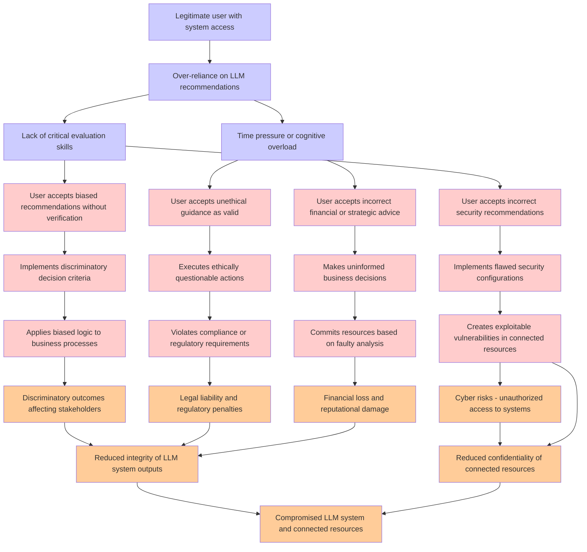

# Attack Tree: LLM09 Misinformation

**Threat ID**: b89e6369-cca5-43a1-a756-3587e52cf263
**Statement**: A legitimate user who is over reliant on LLM recommendation can accept biased, unethical, or incorrect guidance and advice, which leads to discriminatory outcomes, reputational damage, financial loss, legal issues or cyber risks, resulting in reduced integrity and/or confidentiality of LLM system and connected resources

## Attack Tree Diagram

## MITRE ATT&CK Mapping

This attack tree has been mapped to MITRE ATT&CK techniques:

### User accepts biased recommendations without verification

- **Technique**: [T1656](https://attack.mitre.org/techniques/T1656/) - Impersonation
- **Tactic**: Defense Evasion
- **Similarity Score**: 39.37%
- **Mitigations (2):**
  - 🛡️ **User Training**
    User Training involves educating employees and contractors on recognizing, reporting, and preventing cyber threats that ...
  - 🛡️ **Threat Intelligence Program**
    A Threat Intelligence Program enables organizations to proactively identify, analyze, and act on cyber threats by levera...

### Implements flawed security configurations

- **Technique**: [T1089](https://attack.mitre.org/techniques/T1089/) - Disabling Security Tools
- **Tactic**: Defense Evasion
- **Similarity Score**: 66.44%

### User accepts incorrect security recommendations

- **Technique**: [T1553](https://attack.mitre.org/techniques/T1553/) - Subvert Trust Controls
- **Tactic**: Defense Evasion
- **Similarity Score**: 54.97%
- **Mitigations (5):**
  - 🛡️ **Execution Prevention**
    Prevent the execution of unauthorized or malicious code on systems by implementing application control, script blocking,...
  - 🛡️ **Operating System Configuration**
    Operating System Configuration involves adjusting system settings and hardening the default configurations of an operati...
  - 🛡️ **Privileged Account Management**
    Privileged Account Management focuses on implementing policies, controls, and tools to securely manage privileged accoun...
  - *2 more mitigation(s) available*

### Time pressure or cognitive overload

- **Technique**: [T1678](https://attack.mitre.org/techniques/T1678/) - Delay Execution
- **Tactic**: Defense Evasion
- **Similarity Score**: 41.09%

### Lack of critical evaluation skills

- **Technique**: [T1595.002](https://attack.mitre.org/techniques/T1595/002/) - Vulnerability Scanning
- **Tactic**: Reconnaissance
- **Similarity Score**: 33.44%
- **Mitigations (1):**
  - 🛡️ **Pre-compromise**
    Pre-compromise mitigations involve proactive measures and defenses implemented to prevent adversaries from successfully ...

### Compromised LLM system and connected resources

- **Technique**: [T1215](https://attack.mitre.org/techniques/T1215/) - Kernel Modules and Extensions
- **Tactic**: Persistence
- **Similarity Score**: 49.70%

### Executes ethically questionable actions

- **Technique**: [T1656](https://attack.mitre.org/techniques/T1656/) - Impersonation
- **Tactic**: Defense Evasion
- **Similarity Score**: 37.62%
- **Mitigations (2):**
  - 🛡️ **User Training**
    User Training involves educating employees and contractors on recognizing, reporting, and preventing cyber threats that ...
  - 🛡️ **Threat Intelligence Program**
    A Threat Intelligence Program enables organizations to proactively identify, analyze, and act on cyber threats by levera...

### Applies biased logic to business processes

- **Technique**: [T1502](https://attack.mitre.org/techniques/T1502/) - Parent PID Spoofing
- **Tactic**: Defense Evasion, Privilege Escalation
- **Similarity Score**: 36.28%

### Commits resources based on faulty analysis

- **Technique**: [T1070.010](https://attack.mitre.org/techniques/T1070/010/) - Relocate Malware
- **Tactic**: Defense Evasion
- **Similarity Score**: 40.93%

### Legitimate user with system access

- **Technique**: [T1136.001](https://attack.mitre.org/techniques/T1136/001/) - Local Account
- **Tactic**: Persistence
- **Similarity Score**: 65.92%
- **Mitigations (2):**
  - 🛡️ **Multi-factor Authentication**
    Multi-Factor Authentication (MFA) enhances security by requiring users to provide at least two forms of verification to ...
  - 🛡️ **Privileged Account Management**
    Privileged Account Management focuses on implementing policies, controls, and tools to securely manage privileged accoun...

### User accepts unethical guidance as valid

- **Technique**: [T1553](https://attack.mitre.org/techniques/T1553/) - Subvert Trust Controls
- **Tactic**: Defense Evasion
- **Similarity Score**: 39.04%
- **Mitigations (5):**
  - 🛡️ **Execution Prevention**
    Prevent the execution of unauthorized or malicious code on systems by implementing application control, script blocking,...
  - 🛡️ **Operating System Configuration**
    Operating System Configuration involves adjusting system settings and hardening the default configurations of an operati...
  - 🛡️ **Privileged Account Management**
    Privileged Account Management focuses on implementing policies, controls, and tools to securely manage privileged accoun...
  - *2 more mitigation(s) available*

### Legal liability and regulatory penalties

- **Technique**: [T1588](https://attack.mitre.org/techniques/T1588/) - Obtain Capabilities
- **Tactic**: Resource Development
- **Similarity Score**: 43.19%
- **Mitigations (1):**
  - 🛡️ **Pre-compromise**
    Pre-compromise mitigations involve proactive measures and defenses implemented to prevent adversaries from successfully ...

### Cyber risks - unauthorized access to systems

- **Technique**: [T1650](https://attack.mitre.org/techniques/T1650/) - Acquire Access
- **Tactic**: Resource Development
- **Similarity Score**: 58.83%
- **Mitigations (1):**
  - 🛡️ **Pre-compromise**
    Pre-compromise mitigations involve proactive measures and defenses implemented to prevent adversaries from successfully ...

### Makes uninformed business decisions

- **Technique**: [T1591.002](https://attack.mitre.org/techniques/T1591/002/) - Business Relationships
- **Tactic**: Reconnaissance
- **Similarity Score**: 54.47%
- **Mitigations (1):**
  - 🛡️ **Pre-compromise**
    Pre-compromise mitigations involve proactive measures and defenses implemented to prevent adversaries from successfully ...

### Creates exploitable vulnerabilities in connected resources

- **Technique**: [T1190](https://attack.mitre.org/techniques/T1190/) - Exploit Public-Facing Application
- **Tactic**: Initial Access
- **Similarity Score**: 68.01%
- **Mitigations (8):**
  - 🛡️ **Application Isolation and Sandboxing**
    Application Isolation and Sandboxing refers to the technique of restricting the execution of code to a controlled and is...
  - 🛡️ **Filter Network Traffic**
    Employ network appliances and endpoint software to filter ingress, egress, and lateral network traffic. This includes pr...
  - 🛡️ **Network Segmentation**
    Network segmentation involves dividing a network into smaller, isolated segments to control and limit the flow of traffi...
  - *5 more mitigation(s) available*

### Financial loss and reputational damage

- **Technique**: [T1491.002](https://attack.mitre.org/techniques/T1491/002/) - External Defacement
- **Tactic**: Impact
- **Similarity Score**: 54.75%
- **Mitigations (1):**
  - 🛡️ **Data Backup**
    Data Backup involves taking and securely storing backups of data from end-user systems and critical servers. It ensures ...

### Reduced integrity of LLM system outputs

- **Technique**: [T1186](https://attack.mitre.org/techniques/T1186/) - Process Doppelgänging
- **Tactic**: Defense Evasion
- **Similarity Score**: 57.77%

### Discriminatory outcomes affecting stakeholders

- **Technique**: [T1591.004](https://attack.mitre.org/techniques/T1591/004/) - Identify Roles
- **Tactic**: Reconnaissance
- **Similarity Score**: 39.61%
- **Mitigations (1):**
  - 🛡️ **Pre-compromise**
    Pre-compromise mitigations involve proactive measures and defenses implemented to prevent adversaries from successfully ...

### Reduced confidentiality of connected resources

- **Technique**: [T1665](https://attack.mitre.org/techniques/T1665/) - Hide Infrastructure
- **Tactic**: Command And Control
- **Similarity Score**: 49.16%

### User accepts incorrect financial or strategic advice

- **Technique**: [T1657](https://attack.mitre.org/techniques/T1657/) - Financial Theft
- **Tactic**: Impact
- **Similarity Score**: 49.07%
- **Mitigations (2):**
  - 🛡️ **User Training**
    User Training involves educating employees and contractors on recognizing, reporting, and preventing cyber threats that ...
  - 🛡️ **User Account Management**
    User Account Management involves implementing and enforcing policies for the lifecycle of user accounts, including creat...

### Implements discriminatory decision criteria

- **Technique**: [T1556.009](https://attack.mitre.org/techniques/T1556/009/) - Conditional Access Policies
- **Tactic**: Credential Access, Defense Evasion, Persistence
- **Similarity Score**: 42.63%
- **Mitigations (1):**
  - 🛡️ **User Account Management**
    User Account Management involves implementing and enforcing policies for the lifecycle of user accounts, including creat...

### Violates compliance or regulatory requirements

- **Technique**: [T1587](https://attack.mitre.org/techniques/T1587/) - Develop Capabilities
- **Tactic**: Resource Development
- **Similarity Score**: 47.12%
- **Mitigations (1):**
  - 🛡️ **Pre-compromise**
    Pre-compromise mitigations involve proactive measures and defenses implemented to prevent adversaries from successfully ...

*Total technique mappings: 22 | Mitigations found: 34*

## Attack Path Analysis

Review this attack tree to:
1. Identify critical attack paths
2. Implement appropriate security controls
3. Monitor for indicators
4. Develop incident response procedures

---
*Generated by ThreatForest*
