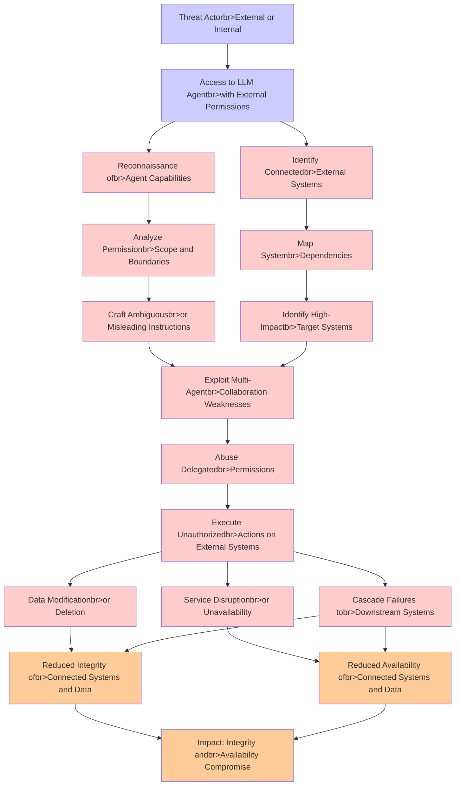

# Attack Tree: LLM06 Excessive Agency

**Threat ID**: c5119071-e818-4e18-82da-b1f9670cd138
**Statement**: An external or internal threat actor who has access to LLM agents granted permissions to access external systems can abuse those permissions, which leads to damage connected systems when operating under ambiguous instructions or in multi-agent collaborative environments, resulting in reduced integrity and/or availability of connected and downstream systems and data

## Attack Tree Diagram

## MITRE ATT&CK Mapping

This attack tree has been mapped to MITRE ATT&CK techniques:

### Identify High-Impactbr>Target Systems

- **Technique**: [T1595.002](https://attack.mitre.org/techniques/T1595/002/) - Vulnerability Scanning
- **Tactic**: Reconnaissance
- **Similarity Score**: 54.38%
- **Mitigations (1):**
  - 🛡️ **Pre-compromise**
    Pre-compromise mitigations involve proactive measures and defenses implemented to prevent adversaries from successfully ...

### Reduced Integrity ofbr>Connected Systems and Data

- **Technique**: [T1485](https://attack.mitre.org/techniques/T1485/) - Data Destruction
- **Tactic**: Impact
- **Similarity Score**: 65.96%
- **Mitigations (3):**
  - 🛡️ **Multi-factor Authentication**
    Multi-Factor Authentication (MFA) enhances security by requiring users to provide at least two forms of verification to ...
  - 🛡️ **Data Backup**
    Data Backup involves taking and securely storing backups of data from end-user systems and critical servers. It ensures ...
  - 🛡️ **User Account Management**
    User Account Management involves implementing and enforcing policies for the lifecycle of user accounts, including creat...

### Data Modificationbr>or Deletion

- **Technique**: [T1485](https://attack.mitre.org/techniques/T1485/) - Data Destruction
- **Tactic**: Impact
- **Similarity Score**: 84.07%
- **Mitigations (3):**
  - 🛡️ **Multi-factor Authentication**
    Multi-Factor Authentication (MFA) enhances security by requiring users to provide at least two forms of verification to ...
  - 🛡️ **Data Backup**
    Data Backup involves taking and securely storing backups of data from end-user systems and critical servers. It ensures ...
  - 🛡️ **User Account Management**
    User Account Management involves implementing and enforcing policies for the lifecycle of user accounts, including creat...

### Impact: Integrity andbr>Availability Compromise

- **Technique**: [T1499.004](https://attack.mitre.org/techniques/T1499/004/) - Application or System Exploitation
- **Tactic**: Impact
- **Similarity Score**: 50.88%
- **Mitigations (1):**
  - 🛡️ **Filter Network Traffic**
    Employ network appliances and endpoint software to filter ingress, egress, and lateral network traffic. This includes pr...

### Cascade Failures tobr>Downstream Systems

- **Technique**: [T1568](https://attack.mitre.org/techniques/T1568/) - Dynamic Resolution
- **Tactic**: Command And Control
- **Similarity Score**: 47.14%
- **Mitigations (2):**
  - 🛡️ **Network Intrusion Prevention**
    Use intrusion detection signatures to block traffic at network boundaries.
  - 🛡️ **Restrict Web-Based Content**
    Restricting web-based content involves enforcing policies and technologies that limit access to potentially malicious we...

### Access to LLM Agentbr>with External Permissions

- **Technique**: [T1574.005](https://attack.mitre.org/techniques/T1574/005/) - Executable Installer File Permissions Weakness
- **Tactic**: Persistence, Privilege Escalation, Defense Evasion
- **Similarity Score**: 59.03%
- **Mitigations (3):**
  - 🛡️ **Audit**
    Auditing is the process of recording activity and systematically reviewing and analyzing the activity and system configu...
  - 🛡️ **User Account Control**
    User Account Control (UAC) is a security feature in Microsoft Windows that prevents unauthorized changes to the operatin...
  - 🛡️ **User Account Management**
    User Account Management involves implementing and enforcing policies for the lifecycle of user accounts, including creat...

### Abuse Delegatedbr>Permissions

- **Technique**: [T1548.006](https://attack.mitre.org/techniques/T1548/006/) - TCC Manipulation
- **Tactic**: Defense Evasion, Privilege Escalation
- **Similarity Score**: 70.38%
- **Mitigations (3):**
  - 🛡️ **Privileged Account Management**
    Privileged Account Management focuses on implementing policies, controls, and tools to securely manage privileged accoun...
  - 🛡️ **Audit**
    Auditing is the process of recording activity and systematically reviewing and analyzing the activity and system configu...
  - 🛡️ **Restrict File and Directory Permissions**
    Restricting file and directory permissions involves setting access controls at the file system level to limit which user...

### Reconnaissance ofbr>Agent Capabilities

- **Technique**: [T1505.002](https://attack.mitre.org/techniques/T1505/002/) - Transport Agent
- **Tactic**: Persistence
- **Similarity Score**: 37.63%
- **Mitigations (3):**
  - 🛡️ **Privileged Account Management**
    Privileged Account Management focuses on implementing policies, controls, and tools to securely manage privileged accoun...
  - 🛡️ **Audit**
    Auditing is the process of recording activity and systematically reviewing and analyzing the activity and system configu...
  - 🛡️ **Code Signing**
    Code Signing is a security process that ensures the authenticity and integrity of software by digitally signing executab...

### Service Disruptionbr>or Unavailability

- **Technique**: [T1489](https://attack.mitre.org/techniques/T1489/) - Service Stop
- **Tactic**: Impact
- **Similarity Score**: 71.50%
- **Mitigations (5):**
  - 🛡️ **Network Segmentation**
    Network segmentation involves dividing a network into smaller, isolated segments to control and limit the flow of traffi...
  - 🛡️ **User Account Management**
    User Account Management involves implementing and enforcing policies for the lifecycle of user accounts, including creat...
  - 🛡️ **Out-of-Band Communications Channel**
    Establish secure out-of-band communication channels to ensure the continuity of critical communications during security ...
  - *2 more mitigation(s) available*

### Identify Connectedbr>External Systems

- **Technique**: [T1049](https://attack.mitre.org/techniques/T1049/) - System Network Connections Discovery
- **Tactic**: Discovery
- **Similarity Score**: 66.94%

### Threat Actorbr>External or Internal

- **Technique**: [T1480](https://attack.mitre.org/techniques/T1480/) - Execution Guardrails
- **Tactic**: Defense Evasion
- **Similarity Score**: 46.39%
- **Mitigations (1):**
  - 🛡️ **Do Not Mitigate**
    The Do Not Mitigate category highlights scenarios where attempting to mitigate a specific technique may inadvertently in...

### Analyze Permissionbr>Scope and Boundaries

- **Technique**: [T1069](https://attack.mitre.org/techniques/T1069/) - Permission Groups Discovery
- **Tactic**: Discovery
- **Similarity Score**: 69.63%

### Map Systembr>Dependencies

- **Technique**: [T1574.004](https://attack.mitre.org/techniques/T1574/004/) - Dylib Hijacking
- **Tactic**: Persistence, Privilege Escalation, Defense Evasion
- **Similarity Score**: 51.32%
- **Mitigations (1):**
  - 🛡️ **Restrict File and Directory Permissions**
    Restricting file and directory permissions involves setting access controls at the file system level to limit which user...

### Execute Unauthorizedbr>Actions on External Systems

- **Technique**: [T1514](https://attack.mitre.org/techniques/T1514/) - Elevated Execution with Prompt
- **Tactic**: Privilege Escalation
- **Similarity Score**: 50.33%

### Exploit Multi-Agentbr>Collaboration Weaknesses

- **Technique**: [T1021.003](https://attack.mitre.org/techniques/T1021/003/) - Distributed Component Object Model
- **Tactic**: Lateral Movement
- **Similarity Score**: 43.23%
- **Mitigations (4):**
  - 🛡️ **Disable or Remove Feature or Program**
    Disable or remove unnecessary and potentially vulnerable software, features, or services to reduce the attack surface an...
  - 🛡️ **Application Isolation and Sandboxing**
    Application Isolation and Sandboxing refers to the technique of restricting the execution of code to a controlled and is...
  - 🛡️ **Network Segmentation**
    Network segmentation involves dividing a network into smaller, isolated segments to control and limit the flow of traffi...
  - *1 more mitigation(s) available*

### Craft Ambiguousbr>or Misleading Instructions

- **Technique**: [T1036.002](https://attack.mitre.org/techniques/T1036/002/) - Right-to-Left Override
- **Tactic**: Defense Evasion
- **Similarity Score**: 47.40%

### Reduced Availability ofbr>Connected Systems and Data

- **Technique**: [T1029](https://attack.mitre.org/techniques/T1029/) - Scheduled Transfer
- **Tactic**: Exfiltration
- **Similarity Score**: 59.85%
- **Mitigations (1):**
  - 🛡️ **Network Intrusion Prevention**
    Use intrusion detection signatures to block traffic at network boundaries.

*Total technique mappings: 17 | Mitigations found: 31*

## Attack Path Analysis

Review this attack tree to:
1. Identify critical attack paths
2. Implement appropriate security controls
3. Monitor for indicators
4. Develop incident response procedures

---
*Generated by ThreatForest*
