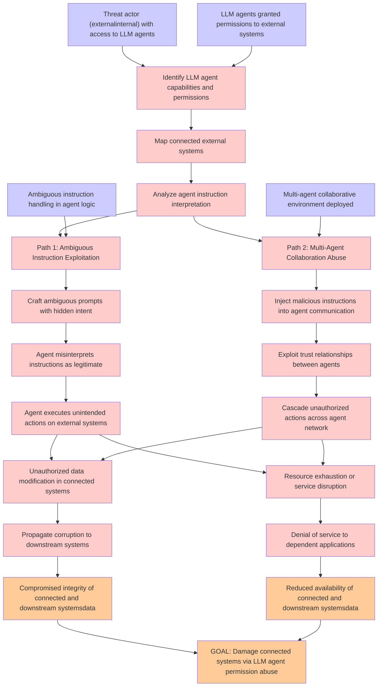

# Attack Tree: LLM06 Excessive Agency

**Threat ID**: c5119071-e818-4e18-82da-b1f9670cd138
**Statement**: An external or internal threat actor who has access to LLM agents granted permissions to access external systems can abuse those permissions, which leads to damage connected systems when operating under ambiguous instructions or in multi-agent collaborative environments, resulting in reduced integrity and/or availability of connected and downstream systems and data

## Attack Tree Diagram

## MITRE ATT&CK Mapping

This attack tree has been mapped to MITRE ATT&CK techniques:

### Path 2: Multi-Agent Collaboration Abuse

- **Technique**: [T1021.003](https://attack.mitre.org/techniques/T1021/003/) - Distributed Component Object Model
- **Tactic**: Lateral Movement
- **Similarity Score**: 45.52%
- **Mitigations (4):**
  - 🛡️ **Disable or Remove Feature or Program**
    Disable or remove unnecessary and potentially vulnerable software, features, or services to reduce the attack surface an...
  - 🛡️ **Application Isolation and Sandboxing**
    Application Isolation and Sandboxing refers to the technique of restricting the execution of code to a controlled and is...
  - 🛡️ **Network Segmentation**
    Network segmentation involves dividing a network into smaller, isolated segments to control and limit the flow of traffi...
  - *1 more mitigation(s) available*

### GOAL: Damage connected systems via LLM agent permission abuse

- **Technique**: [T1548.006](https://attack.mitre.org/techniques/T1548/006/) - TCC Manipulation
- **Tactic**: Defense Evasion, Privilege Escalation
- **Similarity Score**: 67.45%
- **Mitigations (3):**
  - 🛡️ **Privileged Account Management**
    Privileged Account Management focuses on implementing policies, controls, and tools to securely manage privileged accoun...
  - 🛡️ **Audit**
    Auditing is the process of recording activity and systematically reviewing and analyzing the activity and system configu...
  - 🛡️ **Restrict File and Directory Permissions**
    Restricting file and directory permissions involves setting access controls at the file system level to limit which user...

### Reduced availability of connected and downstream systemsdata

- **Technique**: [T1029](https://attack.mitre.org/techniques/T1029/) - Scheduled Transfer
- **Tactic**: Exfiltration
- **Similarity Score**: 60.00%
- **Mitigations (1):**
  - 🛡️ **Network Intrusion Prevention**
    Use intrusion detection signatures to block traffic at network boundaries.

### Identify LLM agent capabilities and permissions

- **Technique**: [T1069.001](https://attack.mitre.org/techniques/T1069/001/) - Local Groups
- **Tactic**: Discovery
- **Similarity Score**: 51.75%

### Denial of service to dependent applications

- **Technique**: [T1499.003](https://attack.mitre.org/techniques/T1499/003/) - Application Exhaustion Flood
- **Tactic**: Impact
- **Similarity Score**: 79.82%
- **Mitigations (1):**
  - 🛡️ **Filter Network Traffic**
    Employ network appliances and endpoint software to filter ingress, egress, and lateral network traffic. This includes pr...

### Unauthorized data modification in connected systems

- **Technique**: [T1565.002](https://attack.mitre.org/techniques/T1565/002/) - Transmitted Data Manipulation
- **Tactic**: Impact
- **Similarity Score**: 67.08%
- **Mitigations (1):**
  - 🛡️ **Encrypt Sensitive Information**
    Protect sensitive information at rest, in transit, and during processing by using strong encryption algorithms. Encrypti...

### Craft ambiguous prompts with hidden intent

- **Technique**: [T1141](https://attack.mitre.org/techniques/T1141/) - Input Prompt
- **Tactic**: Credential Access
- **Similarity Score**: 48.01%

### Ambiguous instruction handling in agent logic

- **Technique**: [T1059](https://attack.mitre.org/techniques/T1059/) - Command and Scripting Interpreter
- **Tactic**: Execution
- **Similarity Score**: 42.83%
- **Mitigations (9):**
  - 🛡️ **Limit Software Installation**
    Prevent users or groups from installing unauthorized or unapproved software to reduce the risk of introducing malicious ...
  - 🛡️ **Code Signing**
    Code Signing is a security process that ensures the authenticity and integrity of software by digitally signing executab...
  - 🛡️ **Disable or Remove Feature or Program**
    Disable or remove unnecessary and potentially vulnerable software, features, or services to reduce the attack surface an...
  - *6 more mitigation(s) available*

### Multi-agent collaborative environment deployed

- **Technique**: [T1072](https://attack.mitre.org/techniques/T1072/) - Software Deployment Tools
- **Tactic**: Execution, Lateral Movement
- **Similarity Score**: 51.88%
- **Mitigations (10):**
  - 🛡️ **User Account Management**
    User Account Management involves implementing and enforcing policies for the lifecycle of user accounts, including creat...
  - 🛡️ **Active Directory Configuration**
    Implement robust Active Directory (AD) configurations using group policies to secure user accounts, control access, and ...
  - 🛡️ **Update Software**
    Software updates ensure systems are protected against known vulnerabilities by applying patches and upgrades provided by...
  - *7 more mitigation(s) available*

### Cascade unauthorized actions across agent network

- **Technique**: [T1072](https://attack.mitre.org/techniques/T1072/) - Software Deployment Tools
- **Tactic**: Execution, Lateral Movement
- **Similarity Score**: 61.95%
- **Mitigations (10):**
  - 🛡️ **User Account Management**
    User Account Management involves implementing and enforcing policies for the lifecycle of user accounts, including creat...
  - 🛡️ **Active Directory Configuration**
    Implement robust Active Directory (AD) configurations using group policies to secure user accounts, control access, and ...
  - 🛡️ **Update Software**
    Software updates ensure systems are protected against known vulnerabilities by applying patches and upgrades provided by...
  - *7 more mitigation(s) available*

### Compromised integrity of connected and downstream systemsdata

- **Technique**: [T1074.001](https://attack.mitre.org/techniques/T1074/001/) - Local Data Staging
- **Tactic**: Collection
- **Similarity Score**: 64.46%

### Resource exhaustion or service disruption

- **Technique**: [T1496](https://attack.mitre.org/techniques/T1496/) - Resource Hijacking
- **Tactic**: Impact
- **Similarity Score**: 80.30%

### Threat actor (externalinternal) with access to LLM agents

- **Technique**: [T1072](https://attack.mitre.org/techniques/T1072/) - Software Deployment Tools
- **Tactic**: Execution, Lateral Movement
- **Similarity Score**: 37.98%
- **Mitigations (10):**
  - 🛡️ **User Account Management**
    User Account Management involves implementing and enforcing policies for the lifecycle of user accounts, including creat...
  - 🛡️ **Active Directory Configuration**
    Implement robust Active Directory (AD) configurations using group policies to secure user accounts, control access, and ...
  - 🛡️ **Update Software**
    Software updates ensure systems are protected against known vulnerabilities by applying patches and upgrades provided by...
  - *7 more mitigation(s) available*

### Agent executes unintended actions on external systems

- **Technique**: [T1505.002](https://attack.mitre.org/techniques/T1505/002/) - Transport Agent
- **Tactic**: Persistence
- **Similarity Score**: 46.23%
- **Mitigations (3):**
  - 🛡️ **Privileged Account Management**
    Privileged Account Management focuses on implementing policies, controls, and tools to securely manage privileged accoun...
  - 🛡️ **Audit**
    Auditing is the process of recording activity and systematically reviewing and analyzing the activity and system configu...
  - 🛡️ **Code Signing**
    Code Signing is a security process that ensures the authenticity and integrity of software by digitally signing executab...

### Analyze agent instruction interpretation

- **Technique**: [T1059](https://attack.mitre.org/techniques/T1059/) - Command and Scripting Interpreter
- **Tactic**: Execution
- **Similarity Score**: 33.84%
- **Mitigations (9):**
  - 🛡️ **Limit Software Installation**
    Prevent users or groups from installing unauthorized or unapproved software to reduce the risk of introducing malicious ...
  - 🛡️ **Code Signing**
    Code Signing is a security process that ensures the authenticity and integrity of software by digitally signing executab...
  - 🛡️ **Disable or Remove Feature or Program**
    Disable or remove unnecessary and potentially vulnerable software, features, or services to reduce the attack surface an...
  - *6 more mitigation(s) available*

### Exploit trust relationships between agents

- **Technique**: [T1484.002](https://attack.mitre.org/techniques/T1484/002/) - Trust Modification
- **Tactic**: Defense Evasion, Privilege Escalation
- **Similarity Score**: 59.64%
- **Mitigations (2):**
  - 🛡️ **Privileged Account Management**
    Privileged Account Management focuses on implementing policies, controls, and tools to securely manage privileged accoun...
  - 🛡️ **User Account Management**
    User Account Management involves implementing and enforcing policies for the lifecycle of user accounts, including creat...

### LLM agents granted permissions to external systems

- **Technique**: [T1199](https://attack.mitre.org/techniques/T1199/) - Trusted Relationship
- **Tactic**: Initial Access
- **Similarity Score**: 52.65%
- **Mitigations (3):**
  - 🛡️ **Multi-factor Authentication**
    Multi-Factor Authentication (MFA) enhances security by requiring users to provide at least two forms of verification to ...
  - 🛡️ **User Account Management**
    User Account Management involves implementing and enforcing policies for the lifecycle of user accounts, including creat...
  - 🛡️ **Network Segmentation**
    Network segmentation involves dividing a network into smaller, isolated segments to control and limit the flow of traffi...

### Agent misinterprets instructions as legitimate

- **Technique**: [T1505.002](https://attack.mitre.org/techniques/T1505/002/) - Transport Agent
- **Tactic**: Persistence
- **Similarity Score**: 44.30%
- **Mitigations (3):**
  - 🛡️ **Privileged Account Management**
    Privileged Account Management focuses on implementing policies, controls, and tools to securely manage privileged accoun...
  - 🛡️ **Audit**
    Auditing is the process of recording activity and systematically reviewing and analyzing the activity and system configu...
  - 🛡️ **Code Signing**
    Code Signing is a security process that ensures the authenticity and integrity of software by digitally signing executab...

### Inject malicious instructions into agent communication

- **Technique**: [T1071.005](https://attack.mitre.org/techniques/T1071/005/) - Publish/Subscribe Protocols
- **Tactic**: Command And Control
- **Similarity Score**: 55.46%
- **Mitigations (2):**
  - 🛡️ **Filter Network Traffic**
    Employ network appliances and endpoint software to filter ingress, egress, and lateral network traffic. This includes pr...
  - 🛡️ **Network Intrusion Prevention**
    Use intrusion detection signatures to block traffic at network boundaries.

### Propagate corruption to downstream systems

- **Technique**: [T1565.002](https://attack.mitre.org/techniques/T1565/002/) - Transmitted Data Manipulation
- **Tactic**: Impact
- **Similarity Score**: 44.64%
- **Mitigations (1):**
  - 🛡️ **Encrypt Sensitive Information**
    Protect sensitive information at rest, in transit, and during processing by using strong encryption algorithms. Encrypti...

### Path 1: Ambiguous Instruction Exploitation

- **Technique**: [T1034](https://attack.mitre.org/techniques/T1034/) - Path Interception
- **Tactic**: Persistence, Privilege Escalation
- **Similarity Score**: 65.96%

### Map connected external systems

- **Technique**: [T1018](https://attack.mitre.org/techniques/T1018/) - Remote System Discovery
- **Tactic**: Discovery
- **Similarity Score**: 71.54%

*Total technique mappings: 22 | Mitigations found: 72*

## Attack Path Analysis

Review this attack tree to:
1. Identify critical attack paths
2. Implement appropriate security controls
3. Monitor for indicators
4. Develop incident response procedures

---
*Generated by ThreatForest*
