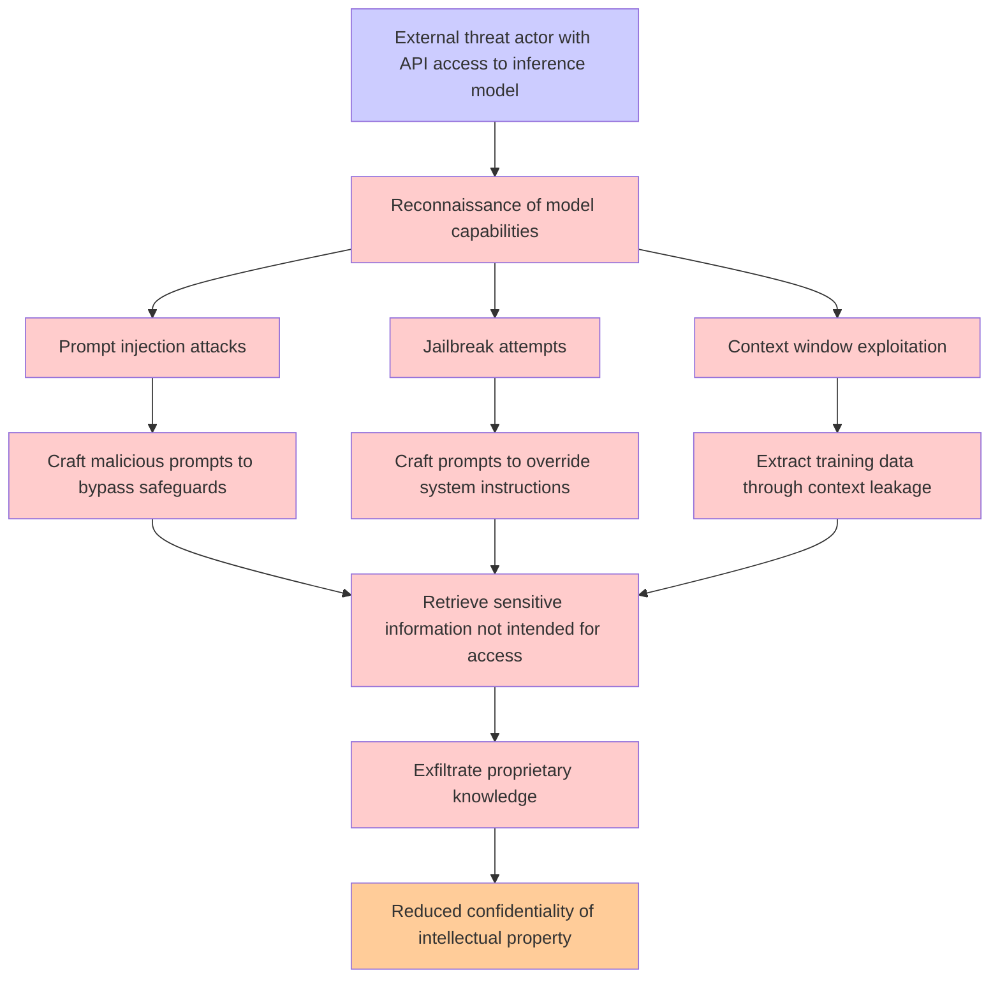

# Attack Tree: LLM02 SensitiveInfo Disclosure

**Threat ID**: ddb6a6d5-664e-4e34-bec0-09d4ff319f67
**Statement**: An external threat actor who uses carefully crafted queries to call inference model APIs can retrieve sensitive information that they were not intended to access, which leads to to exfiltration of proprietary knowledge, resulting in reduced confidentiality of intellectual property

## Attack Tree Diagram

## MITRE ATT&CK Mapping

This attack tree has been mapped to MITRE ATT&CK techniques:

### Craft malicious prompts to bypass safeguards

- **Technique**: [T1141](https://attack.mitre.org/techniques/T1141/) - Input Prompt
- **Tactic**: Credential Access
- **Similarity Score**: 52.19%

### Extract training data through context leakage

- **Technique**: [T1074](https://attack.mitre.org/techniques/T1074/) - Data Staged
- **Tactic**: Collection
- **Similarity Score**: 36.83%

### External threat actor with API access to inference model

- **Technique**: [T1588.007](https://attack.mitre.org/techniques/T1588/007/) - Artificial Intelligence
- **Tactic**: Resource Development
- **Similarity Score**: 30.33%
- **Mitigations (1):**
  - 🛡️ **Pre-compromise**
    Pre-compromise mitigations involve proactive measures and defenses implemented to prevent adversaries from successfully ...

### Craft prompts to override system instructions

- **Technique**: [T1548.004](https://attack.mitre.org/techniques/T1548/004/) - Elevated Execution with Prompt
- **Tactic**: Privilege Escalation, Defense Evasion
- **Similarity Score**: 48.41%
- **Mitigations (1):**
  - 🛡️ **Execution Prevention**
    Prevent the execution of unauthorized or malicious code on systems by implementing application control, script blocking,...

### Prompt injection attacks

- **Technique**: [T1659](https://attack.mitre.org/techniques/T1659/) - Content Injection
- **Tactic**: Initial Access, Command And Control
- **Similarity Score**: 48.48%
- **Mitigations (2):**
  - 🛡️ **Restrict Web-Based Content**
    Restricting web-based content involves enforcing policies and technologies that limit access to potentially malicious we...
  - 🛡️ **Encrypt Sensitive Information**
    Protect sensitive information at rest, in transit, and during processing by using strong encryption algorithms. Encrypti...

### Retrieve sensitive information not intended for access

- **Technique**: [T1213](https://attack.mitre.org/techniques/T1213/) - Data from Information Repositories
- **Tactic**: Collection
- **Similarity Score**: 69.84%
- **Mitigations (7):**
  - 🛡️ **Multi-factor Authentication**
    Multi-Factor Authentication (MFA) enhances security by requiring users to provide at least two forms of verification to ...
  - 🛡️ **Out-of-Band Communications Channel**
    Establish secure out-of-band communication channels to ensure the continuity of critical communications during security ...
  - 🛡️ **User Training**
    User Training involves educating employees and contractors on recognizing, reporting, and preventing cyber threats that ...
  - *4 more mitigation(s) available*

### Exfiltrate proprietary knowledge

- **Technique**: [T1567.001](https://attack.mitre.org/techniques/T1567/001/) - Exfiltration to Code Repository
- **Tactic**: Exfiltration
- **Similarity Score**: 72.46%
- **Mitigations (1):**
  - 🛡️ **Restrict Web-Based Content**
    Restricting web-based content involves enforcing policies and technologies that limit access to potentially malicious we...

### Context window exploitation

- **Technique**: [T1010](https://attack.mitre.org/techniques/T1010/) - Application Window Discovery
- **Tactic**: Discovery
- **Similarity Score**: 62.73%

### Jailbreak attempts

- **Technique**: [T1601.002](https://attack.mitre.org/techniques/T1601/002/) - Downgrade System Image
- **Tactic**: Defense Evasion
- **Similarity Score**: 40.73%
- **Mitigations (6):**
  - 🛡️ **Multi-factor Authentication**
    Multi-Factor Authentication (MFA) enhances security by requiring users to provide at least two forms of verification to ...
  - 🛡️ **Code Signing**
    Code Signing is a security process that ensures the authenticity and integrity of software by digitally signing executab...
  - 🛡️ **Credential Access Protection**
    Credential Access Protection focuses on implementing measures to prevent adversaries from obtaining credentials, such as...
  - *3 more mitigation(s) available*

### Reconnaissance of model capabilities

- **Technique**: [T1595.002](https://attack.mitre.org/techniques/T1595/002/) - Vulnerability Scanning
- **Tactic**: Reconnaissance
- **Similarity Score**: 57.30%
- **Mitigations (1):**
  - 🛡️ **Pre-compromise**
    Pre-compromise mitigations involve proactive measures and defenses implemented to prevent adversaries from successfully ...

### Reduced confidentiality of intellectual property

- **Technique**: [T1565](https://attack.mitre.org/techniques/T1565/) - Data Manipulation
- **Tactic**: Impact
- **Similarity Score**: 46.46%
- **Mitigations (4):**
  - 🛡️ **Encrypt Sensitive Information**
    Protect sensitive information at rest, in transit, and during processing by using strong encryption algorithms. Encrypti...
  - 🛡️ **Remote Data Storage**
    Remote Data Storage focuses on moving critical data, such as security logs and sensitive files, to secure, off-host loca...
  - 🛡️ **Network Segmentation**
    Network segmentation involves dividing a network into smaller, isolated segments to control and limit the flow of traffi...
  - *1 more mitigation(s) available*

*Total technique mappings: 11 | Mitigations found: 23*

## Attack Path Analysis

Review this attack tree to:
1. Identify critical attack paths
2. Implement appropriate security controls
3. Monitor for indicators
4. Develop incident response procedures

---
*Generated by ThreatForest*
