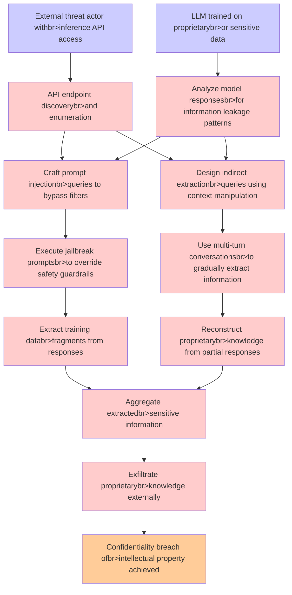

# Attack Tree: LLM02 SensitiveInfo Disclosure

**Threat ID**: ddb6a6d5-664e-4e34-bec0-09d4ff319f67
**Statement**: An external threat actor who uses carefully crafted queries to call inference model APIs can retrieve sensitive information that they were not intended to access, which leads to to exfiltration of proprietary knowledge, resulting in reduced confidentiality of intellectual property

## Attack Tree Diagram

## MITRE ATT&CK Mapping

This attack tree has been mapped to MITRE ATT&CK techniques:

### Execute jailbreak promptsbr>to override safety guardrails

- **Technique**: [T1089](https://attack.mitre.org/techniques/T1089/) - Disabling Security Tools
- **Tactic**: Defense Evasion
- **Similarity Score**: 58.11%

### Design indirect extractionbr>queries using context manipulation

- **Technique**: [T1005](https://attack.mitre.org/techniques/T1005/) - Data from Local System
- **Tactic**: Collection
- **Similarity Score**: 30.93%
- **Mitigations (1):**
  - 🛡️ **Data Loss Prevention**
    Data Loss Prevention (DLP) involves implementing strategies and technologies to identify, categorize, monitor, and contr...

### Analyze model responsesbr>for information leakage patterns

- **Technique**: [T1213](https://attack.mitre.org/techniques/T1213/) - Data from Information Repositories
- **Tactic**: Collection
- **Similarity Score**: 45.33%
- **Mitigations (7):**
  - 🛡️ **Multi-factor Authentication**
    Multi-Factor Authentication (MFA) enhances security by requiring users to provide at least two forms of verification to ...
  - 🛡️ **Out-of-Band Communications Channel**
    Establish secure out-of-band communication channels to ensure the continuity of critical communications during security ...
  - 🛡️ **User Training**
    User Training involves educating employees and contractors on recognizing, reporting, and preventing cyber threats that ...
  - *4 more mitigation(s) available*

### Exfiltrate proprietarybr>knowledge externally

- **Technique**: [T1567.003](https://attack.mitre.org/techniques/T1567/003/) - Exfiltration to Text Storage Sites
- **Tactic**: Exfiltration
- **Similarity Score**: 68.41%
- **Mitigations (1):**
  - 🛡️ **Restrict Web-Based Content**
    Restricting web-based content involves enforcing policies and technologies that limit access to potentially malicious we...

### Aggregate extractedbr>sensitive information

- **Technique**: [T1213.006](https://attack.mitre.org/techniques/T1213/006/) - Databases
- **Tactic**: Collection
- **Similarity Score**: 51.07%
- **Mitigations (5):**
  - 🛡️ **User Training**
    User Training involves educating employees and contractors on recognizing, reporting, and preventing cyber threats that ...
  - 🛡️ **Encrypt Sensitive Information**
    Protect sensitive information at rest, in transit, and during processing by using strong encryption algorithms. Encrypti...
  - 🛡️ **Software Configuration**
    Software configuration refers to making security-focused adjustments to the settings of applications, middleware, databa...
  - *2 more mitigation(s) available*

### LLM trained on proprietarybr>or sensitive data

- **Technique**: [T1588.007](https://attack.mitre.org/techniques/T1588/007/) - Artificial Intelligence
- **Tactic**: Resource Development
- **Similarity Score**: 40.79%
- **Mitigations (1):**
  - 🛡️ **Pre-compromise**
    Pre-compromise mitigations involve proactive measures and defenses implemented to prevent adversaries from successfully ...

### Craft prompt injectionbr>queries to bypass filters

- **Technique**: [T1174](https://attack.mitre.org/techniques/T1174/) - Password Filter DLL
- **Tactic**: Credential Access
- **Similarity Score**: 32.49%

### Confidentiality breach ofbr>intellectual property achieved

- **Technique**: [T1588](https://attack.mitre.org/techniques/T1588/) - Obtain Capabilities
- **Tactic**: Resource Development
- **Similarity Score**: 50.35%
- **Mitigations (1):**
  - 🛡️ **Pre-compromise**
    Pre-compromise mitigations involve proactive measures and defenses implemented to prevent adversaries from successfully ...

### API endpoint discoverybr>and enumeration

- **Technique**: [T1538](https://attack.mitre.org/techniques/T1538/) - Cloud Service Dashboard
- **Tactic**: Discovery
- **Similarity Score**: 51.29%
- **Mitigations (1):**
  - 🛡️ **User Account Management**
    User Account Management involves implementing and enforcing policies for the lifecycle of user accounts, including creat...

### Extract training databr>fragments from responses

- **Technique**: [T1048.003](https://attack.mitre.org/techniques/T1048/003/) - Exfiltration Over Unencrypted Non-C2 Protocol
- **Tactic**: Exfiltration
- **Similarity Score**: 47.18%
- **Mitigations (4):**
  - 🛡️ **Network Intrusion Prevention**
    Use intrusion detection signatures to block traffic at network boundaries.
  - 🛡️ **Data Loss Prevention**
    Data Loss Prevention (DLP) involves implementing strategies and technologies to identify, categorize, monitor, and contr...
  - 🛡️ **Filter Network Traffic**
    Employ network appliances and endpoint software to filter ingress, egress, and lateral network traffic. This includes pr...
  - *1 more mitigation(s) available*

### Reconstruct proprietarybr>knowledge from partial responses

- **Technique**: [T1595.003](https://attack.mitre.org/techniques/T1595/003/) - Wordlist Scanning
- **Tactic**: Reconnaissance
- **Similarity Score**: 35.83%
- **Mitigations (2):**
  - 🛡️ **Disable or Remove Feature or Program**
    Disable or remove unnecessary and potentially vulnerable software, features, or services to reduce the attack surface an...
  - 🛡️ **Pre-compromise**
    Pre-compromise mitigations involve proactive measures and defenses implemented to prevent adversaries from successfully ...

### External threat actor withbr>inference API access

- **Technique**: [T1480](https://attack.mitre.org/techniques/T1480/) - Execution Guardrails
- **Tactic**: Defense Evasion
- **Similarity Score**: 31.52%
- **Mitigations (1):**
  - 🛡️ **Do Not Mitigate**
    The Do Not Mitigate category highlights scenarios where attempting to mitigate a specific technique may inadvertently in...

### Use multi-turn conversationsbr>to gradually extract information

- **Technique**: [T1213.005](https://attack.mitre.org/techniques/T1213/005/) - Messaging Applications
- **Tactic**: Collection
- **Similarity Score**: 54.49%
- **Mitigations (3):**
  - 🛡️ **User Training**
    User Training involves educating employees and contractors on recognizing, reporting, and preventing cyber threats that ...
  - 🛡️ **Audit**
    Auditing is the process of recording activity and systematically reviewing and analyzing the activity and system configu...
  - 🛡️ **Out-of-Band Communications Channel**
    Establish secure out-of-band communication channels to ensure the continuity of critical communications during security ...

*Total technique mappings: 13 | Mitigations found: 27*

## Attack Path Analysis

Review this attack tree to:
1. Identify critical attack paths
2. Implement appropriate security controls
3. Monitor for indicators
4. Develop incident response procedures

---
*Generated by ThreatForest*
