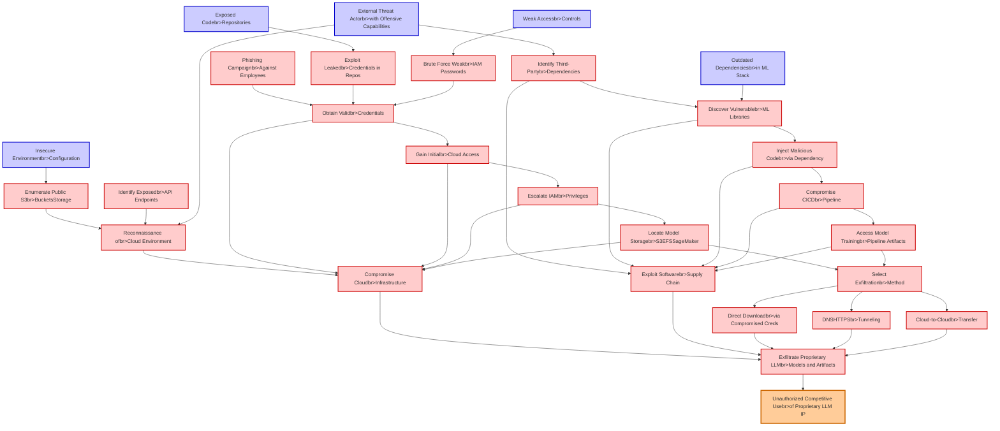

# Attack Tree: LLM03 Supply Chain, LLM10 Unbounded Consumption

**Threat ID**: e746ae8d-2840-4dd0-96a2-5d9656f7a62b
**Statement**: An external threat actor who can infiltrate insecure environments can exfiltrate proprietary LLM models and artifacts, which leads to unauthorized competitive use, resulting in reduced confidentiality of intellectual property

## Attack Tree Diagram

## MITRE ATT&CK Mapping

This attack tree has been mapped to MITRE ATT&CK techniques:

### Compromise Cloudbr>Infrastructure

- **Technique**: [T1562.007](https://attack.mitre.org/techniques/T1562/007/) - Disable or Modify Cloud Firewall
- **Tactic**: Defense Evasion
- **Similarity Score**: 64.47%
- **Mitigations (2):**
  - 🛡️ **Audit**
    Auditing is the process of recording activity and systematically reviewing and analyzing the activity and system configu...
  - 🛡️ **User Account Management**
    User Account Management involves implementing and enforcing policies for the lifecycle of user accounts, including creat...

### Escalate IAMbr>Privileges

- **Technique**: [T1548](https://attack.mitre.org/techniques/T1548/) - Abuse Elevation Control Mechanism
- **Tactic**: Privilege Escalation, Defense Evasion
- **Similarity Score**: 80.55%
- **Mitigations (8):**
  - 🛡️ **Execution Prevention**
    Prevent the execution of unauthorized or malicious code on systems by implementing application control, script blocking,...
  - 🛡️ **Operating System Configuration**
    Operating System Configuration involves adjusting system settings and hardening the default configurations of an operati...
  - 🛡️ **Update Software**
    Software updates ensure systems are protected against known vulnerabilities by applying patches and upgrades provided by...
  - *5 more mitigation(s) available*

### Identify Third-Partybr>Dependencies

- **Technique**: [T1518](https://attack.mitre.org/techniques/T1518/) - Software Discovery
- **Tactic**: Discovery
- **Similarity Score**: 49.87%

### Exposed Codebr>Repositories

- **Technique**: [T1213.003](https://attack.mitre.org/techniques/T1213/003/) - Code Repositories
- **Tactic**: Collection
- **Similarity Score**: 78.17%
- **Mitigations (4):**
  - 🛡️ **User Training**
    User Training involves educating employees and contractors on recognizing, reporting, and preventing cyber threats that ...
  - 🛡️ **Audit**
    Auditing is the process of recording activity and systematically reviewing and analyzing the activity and system configu...
  - 🛡️ **User Account Management**
    User Account Management involves implementing and enforcing policies for the lifecycle of user accounts, including creat...
  - *1 more mitigation(s) available*

### Compromise CICDbr>Pipeline

- **Technique**: [T1677](https://attack.mitre.org/techniques/T1677/) - Poisoned Pipeline Execution
- **Tactic**: Execution
- **Similarity Score**: 51.48%
- **Mitigations (2):**
  - 🛡️ **User Account Management**
    User Account Management involves implementing and enforcing policies for the lifecycle of user accounts, including creat...
  - 🛡️ **Software Configuration**
    Software configuration refers to making security-focused adjustments to the settings of applications, middleware, databa...

### Exfiltrate Proprietary LLMbr>Models and Artifacts

- **Technique**: [T1560.001](https://attack.mitre.org/techniques/T1560/001/) - Archive via Utility
- **Tactic**: Collection
- **Similarity Score**: 63.63%
- **Mitigations (1):**
  - 🛡️ **Audit**
    Auditing is the process of recording activity and systematically reviewing and analyzing the activity and system configu...

### Weak Accessbr>Controls

- **Technique**: [T1548](https://attack.mitre.org/techniques/T1548/) - Abuse Elevation Control Mechanism
- **Tactic**: Privilege Escalation, Defense Evasion
- **Similarity Score**: 55.64%
- **Mitigations (8):**
  - 🛡️ **Execution Prevention**
    Prevent the execution of unauthorized or malicious code on systems by implementing application control, script blocking,...
  - 🛡️ **Operating System Configuration**
    Operating System Configuration involves adjusting system settings and hardening the default configurations of an operati...
  - 🛡️ **Update Software**
    Software updates ensure systems are protected against known vulnerabilities by applying patches and upgrades provided by...
  - *5 more mitigation(s) available*

### Cloud-to-Cloudbr>Transfer

- **Technique**: [T1537](https://attack.mitre.org/techniques/T1537/) - Transfer Data to Cloud Account
- **Tactic**: Exfiltration
- **Similarity Score**: 77.87%
- **Mitigations (4):**
  - 🛡️ **Data Loss Prevention**
    Data Loss Prevention (DLP) involves implementing strategies and technologies to identify, categorize, monitor, and contr...
  - 🛡️ **User Account Management**
    User Account Management involves implementing and enforcing policies for the lifecycle of user accounts, including creat...
  - 🛡️ **Software Configuration**
    Software configuration refers to making security-focused adjustments to the settings of applications, middleware, databa...
  - *1 more mitigation(s) available*

### Unauthorized Competitive Usebr>of Proprietary LLM IP

- **Technique**: [T1599.001](https://attack.mitre.org/techniques/T1599/001/) - Network Address Translation Traversal
- **Tactic**: Defense Evasion
- **Similarity Score**: 63.92%
- **Mitigations (5):**
  - 🛡️ **Password Policies**
    Set and enforce secure password policies for accounts to reduce the likelihood of unauthorized access. Strong password p...
  - 🛡️ **Credential Access Protection**
    Credential Access Protection focuses on implementing measures to prevent adversaries from obtaining credentials, such as...
  - 🛡️ **Multi-factor Authentication**
    Multi-Factor Authentication (MFA) enhances security by requiring users to provide at least two forms of verification to ...
  - *2 more mitigation(s) available*

### Outdated Dependenciesbr>in ML Stack

- **Technique**: [T1204.005](https://attack.mitre.org/techniques/T1204/005/) - Malicious Library
- **Tactic**: Execution
- **Similarity Score**: 52.01%
- **Mitigations (3):**
  - 🛡️ **Limit Software Installation**
    Prevent users or groups from installing unauthorized or unapproved software to reduce the risk of introducing malicious ...
  - 🛡️ **Network Intrusion Prevention**
    Use intrusion detection signatures to block traffic at network boundaries.
  - 🛡️ **User Training**
    User Training involves educating employees and contractors on recognizing, reporting, and preventing cyber threats that ...

### External Threat Actorbr>with Offensive Capabilities

- **Technique**: [T1584.005](https://attack.mitre.org/techniques/T1584/005/) - Botnet
- **Tactic**: Resource Development
- **Similarity Score**: 54.09%
- **Mitigations (1):**
  - 🛡️ **Pre-compromise**
    Pre-compromise mitigations involve proactive measures and defenses implemented to prevent adversaries from successfully ...

### Obtain Validbr>Credentials

- **Technique**: [T1556.003](https://attack.mitre.org/techniques/T1556/003/) - Pluggable Authentication Modules
- **Tactic**: Credential Access, Defense Evasion, Persistence
- **Similarity Score**: 77.70%
- **Mitigations (2):**
  - 🛡️ **Multi-factor Authentication**
    Multi-Factor Authentication (MFA) enhances security by requiring users to provide at least two forms of verification to ...
  - 🛡️ **Privileged Account Management**
    Privileged Account Management focuses on implementing policies, controls, and tools to securely manage privileged accoun...

### Brute Force Weakbr>IAM Passwords

- **Technique**: [T1110.002](https://attack.mitre.org/techniques/T1110/002/) - Password Cracking
- **Tactic**: Credential Access
- **Similarity Score**: 86.99%
- **Mitigations (2):**
  - 🛡️ **Password Policies**
    Set and enforce secure password policies for accounts to reduce the likelihood of unauthorized access. Strong password p...
  - 🛡️ **Multi-factor Authentication**
    Multi-Factor Authentication (MFA) enhances security by requiring users to provide at least two forms of verification to ...

### Select Exfiltrationbr>Method

- **Technique**: [T1052](https://attack.mitre.org/techniques/T1052/) - Exfiltration Over Physical Medium
- **Tactic**: Exfiltration
- **Similarity Score**: 70.70%
- **Mitigations (3):**
  - 🛡️ **Data Loss Prevention**
    Data Loss Prevention (DLP) involves implementing strategies and technologies to identify, categorize, monitor, and contr...
  - 🛡️ **Limit Hardware Installation**
    Prevent unauthorized users or groups from installing or using hardware, such as external drives, peripheral devices, or ...
  - 🛡️ **Disable or Remove Feature or Program**
    Disable or remove unnecessary and potentially vulnerable software, features, or services to reduce the attack surface an...

### DNSHTTPSbr>Tunneling

- **Technique**: [T1572](https://attack.mitre.org/techniques/T1572/) - Protocol Tunneling
- **Tactic**: Command And Control
- **Similarity Score**: 81.40%
- **Mitigations (2):**
  - 🛡️ **Filter Network Traffic**
    Employ network appliances and endpoint software to filter ingress, egress, and lateral network traffic. This includes pr...
  - 🛡️ **Network Intrusion Prevention**
    Use intrusion detection signatures to block traffic at network boundaries.

### Direct Downloadbr>via Compromised Creds

- **Technique**: [T1105](https://attack.mitre.org/techniques/T1105/) - Ingress Tool Transfer
- **Tactic**: Command And Control
- **Similarity Score**: 63.18%
- **Mitigations (2):**
  - 🛡️ **Network Intrusion Prevention**
    Use intrusion detection signatures to block traffic at network boundaries.
  - 🛡️ **Filter Network Traffic**
    Employ network appliances and endpoint software to filter ingress, egress, and lateral network traffic. This includes pr...

### Phishing Campaignbr>Against Employees

- **Technique**: [T1598.001](https://attack.mitre.org/techniques/T1598/001/) - Spearphishing Service
- **Tactic**: Reconnaissance
- **Similarity Score**: 82.32%
- **Mitigations (1):**
  - 🛡️ **User Training**
    User Training involves educating employees and contractors on recognizing, reporting, and preventing cyber threats that ...

### Access Model Trainingbr>Pipeline Artifacts

- **Technique**: [T1677](https://attack.mitre.org/techniques/T1677/) - Poisoned Pipeline Execution
- **Tactic**: Execution
- **Similarity Score**: 51.72%
- **Mitigations (2):**
  - 🛡️ **User Account Management**
    User Account Management involves implementing and enforcing policies for the lifecycle of user accounts, including creat...
  - 🛡️ **Software Configuration**
    Software configuration refers to making security-focused adjustments to the settings of applications, middleware, databa...

### Exploit Leakedbr>Credentials in Repos

- **Technique**: [T1552](https://attack.mitre.org/techniques/T1552/) - Unsecured Credentials
- **Tactic**: Credential Access
- **Similarity Score**: 76.92%
- **Mitigations (11):**
  - 🛡️ **Encrypt Sensitive Information**
    Protect sensitive information at rest, in transit, and during processing by using strong encryption algorithms. Encrypti...
  - 🛡️ **Update Software**
    Software updates ensure systems are protected against known vulnerabilities by applying patches and upgrades provided by...
  - 🛡️ **User Training**
    User Training involves educating employees and contractors on recognizing, reporting, and preventing cyber threats that ...
  - *8 more mitigation(s) available*

### Discover Vulnerablebr>ML Libraries

- **Technique**: [T1595.002](https://attack.mitre.org/techniques/T1595/002/) - Vulnerability Scanning
- **Tactic**: Reconnaissance
- **Similarity Score**: 50.61%
- **Mitigations (1):**
  - 🛡️ **Pre-compromise**
    Pre-compromise mitigations involve proactive measures and defenses implemented to prevent adversaries from successfully ...

### Reconnaissance ofbr>Cloud Environment

- **Technique**: [T1580](https://attack.mitre.org/techniques/T1580/) - Cloud Infrastructure Discovery
- **Tactic**: Discovery
- **Similarity Score**: 60.67%
- **Mitigations (1):**
  - 🛡️ **User Account Management**
    User Account Management involves implementing and enforcing policies for the lifecycle of user accounts, including creat...

### Locate Model Storagebr>S3EFSSageMaker

- **Technique**: [T1680](https://attack.mitre.org/techniques/T1680/) - Local Storage Discovery
- **Tactic**: Discovery
- **Similarity Score**: 71.69%

### Insecure Environmentbr>Configuration

- **Technique**: [T1546.004](https://attack.mitre.org/techniques/T1546/004/) - Unix Shell Configuration Modification
- **Tactic**: Privilege Escalation, Persistence
- **Similarity Score**: 50.45%
- **Mitigations (1):**
  - 🛡️ **Restrict File and Directory Permissions**
    Restricting file and directory permissions involves setting access controls at the file system level to limit which user...

### Inject Malicious Codebr>via Dependency

- **Technique**: [T1218.013](https://attack.mitre.org/techniques/T1218/013/) - Mavinject
- **Tactic**: Defense Evasion
- **Similarity Score**: 65.10%
- **Mitigations (2):**
  - 🛡️ **Disable or Remove Feature or Program**
    Disable or remove unnecessary and potentially vulnerable software, features, or services to reduce the attack surface an...
  - 🛡️ **Execution Prevention**
    Prevent the execution of unauthorized or malicious code on systems by implementing application control, script blocking,...

### Gain Initialbr>Cloud Access

- **Technique**: [T1078.004](https://attack.mitre.org/techniques/T1078/004/) - Cloud Accounts
- **Tactic**: Defense Evasion, Persistence, Privilege Escalation, Initial Access
- **Similarity Score**: 65.47%
- **Mitigations (7):**
  - 🛡️ **Password Policies**
    Set and enforce secure password policies for accounts to reduce the likelihood of unauthorized access. Strong password p...
  - 🛡️ **Active Directory Configuration**
    Implement robust Active Directory (AD) configurations using group policies to secure user accounts, control access, and ...
  - 🛡️ **Privileged Account Management**
    Privileged Account Management focuses on implementing policies, controls, and tools to securely manage privileged accoun...
  - *4 more mitigation(s) available*

### Identify Exposedbr>API Endpoints

- **Technique**: [T1538](https://attack.mitre.org/techniques/T1538/) - Cloud Service Dashboard
- **Tactic**: Discovery
- **Similarity Score**: 51.15%
- **Mitigations (1):**
  - 🛡️ **User Account Management**
    User Account Management involves implementing and enforcing policies for the lifecycle of user accounts, including creat...

### Enumerate Public S3br>BucketsStorage

- **Technique**: [T1619](https://attack.mitre.org/techniques/T1619/) - Cloud Storage Object Discovery
- **Tactic**: Discovery
- **Similarity Score**: 77.12%
- **Mitigations (1):**
  - 🛡️ **User Account Management**
    User Account Management involves implementing and enforcing policies for the lifecycle of user accounts, including creat...

### Exploit Softwarebr>Supply Chain

- **Technique**: [T1195](https://attack.mitre.org/techniques/T1195/) - Supply Chain Compromise
- **Tactic**: Initial Access
- **Similarity Score**: 78.39%
- **Mitigations (6):**
  - 🛡️ **Boot Integrity**
    Boot Integrity ensures that a system starts securely by verifying the integrity of its boot process, operating system, a...
  - 🛡️ **Application Developer Guidance**
    Application Developer Guidance focuses on providing developers with the knowledge, tools, and best practices needed to w...
  - 🛡️ **Update Software**
    Software updates ensure systems are protected against known vulnerabilities by applying patches and upgrades provided by...
  - *3 more mitigation(s) available*

*Total technique mappings: 28 | Mitigations found: 83*

## Attack Path Analysis

Review this attack tree to:
1. Identify critical attack paths
2. Implement appropriate security controls
3. Monitor for indicators
4. Develop incident response procedures

---
*Generated by ThreatForest*
