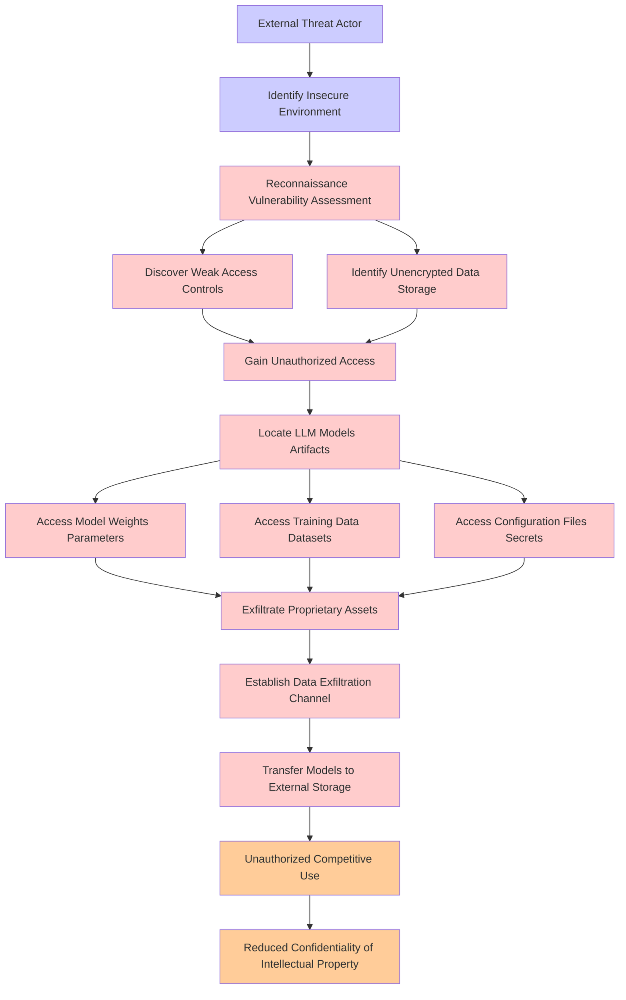

# Attack Tree: LLM03 Supply Chain, LLM10 Unbounded Consumption

**Threat ID**: e746ae8d-2840-4dd0-96a2-5d9656f7a62b
**Statement**: An external threat actor who can infiltrate insecure environments can exfiltrate proprietary LLM models and artifacts, which leads to unauthorized competitive use, resulting in reduced confidentiality of intellectual property

## Attack Tree Diagram

## MITRE ATT&CK Mapping

This attack tree has been mapped to MITRE ATT&CK techniques:

### Reduced Confidentiality of Intellectual Property

- **Technique**: [T1565](https://attack.mitre.org/techniques/T1565/) - Data Manipulation
- **Tactic**: Impact
- **Similarity Score**: 46.46%
- **Mitigations (4):**
  - 🛡️ **Encrypt Sensitive Information**
    Protect sensitive information at rest, in transit, and during processing by using strong encryption algorithms. Encrypti...
  - 🛡️ **Remote Data Storage**
    Remote Data Storage focuses on moving critical data, such as security logs and sensitive files, to secure, off-host loca...
  - 🛡️ **Network Segmentation**
    Network segmentation involves dividing a network into smaller, isolated segments to control and limit the flow of traffi...
  - *1 more mitigation(s) available*

### Access Training Data  Datasets

- **Technique**: [T1213](https://attack.mitre.org/techniques/T1213/) - Data from Information Repositories
- **Tactic**: Collection
- **Similarity Score**: 58.27%
- **Mitigations (7):**
  - 🛡️ **Multi-factor Authentication**
    Multi-Factor Authentication (MFA) enhances security by requiring users to provide at least two forms of verification to ...
  - 🛡️ **Out-of-Band Communications Channel**
    Establish secure out-of-band communication channels to ensure the continuity of critical communications during security ...
  - 🛡️ **User Training**
    User Training involves educating employees and contractors on recognizing, reporting, and preventing cyber threats that ...
  - *4 more mitigation(s) available*

### Exfiltrate Proprietary Assets

- **Technique**: [T1560.001](https://attack.mitre.org/techniques/T1560/001/) - Archive via Utility
- **Tactic**: Collection
- **Similarity Score**: 73.05%
- **Mitigations (1):**
  - 🛡️ **Audit**
    Auditing is the process of recording activity and systematically reviewing and analyzing the activity and system configu...

### Transfer Models to External Storage

- **Technique**: [T1074.001](https://attack.mitre.org/techniques/T1074/001/) - Local Data Staging
- **Tactic**: Collection
- **Similarity Score**: 68.84%

### Unauthorized Competitive Use

- **Technique**: [T1650](https://attack.mitre.org/techniques/T1650/) - Acquire Access
- **Tactic**: Resource Development
- **Similarity Score**: 55.05%
- **Mitigations (1):**
  - 🛡️ **Pre-compromise**
    Pre-compromise mitigations involve proactive measures and defenses implemented to prevent adversaries from successfully ...

### Establish Data Exfiltration Channel

- **Technique**: [T1041](https://attack.mitre.org/techniques/T1041/) - Exfiltration Over C2 Channel
- **Tactic**: Exfiltration
- **Similarity Score**: 84.51%
- **Mitigations (2):**
  - 🛡️ **Network Intrusion Prevention**
    Use intrusion detection signatures to block traffic at network boundaries.
  - 🛡️ **Data Loss Prevention**
    Data Loss Prevention (DLP) involves implementing strategies and technologies to identify, categorize, monitor, and contr...

### External Threat Actor

- **Technique**: [T1588.001](https://attack.mitre.org/techniques/T1588/001/) - Malware
- **Tactic**: Resource Development
- **Similarity Score**: 41.53%
- **Mitigations (1):**
  - 🛡️ **Pre-compromise**
    Pre-compromise mitigations involve proactive measures and defenses implemented to prevent adversaries from successfully ...

### Gain Unauthorized Access

- **Technique**: [T1108](https://attack.mitre.org/techniques/T1108/) - Redundant Access
- **Tactic**: Defense Evasion, Persistence
- **Similarity Score**: 62.95%

### Identify Unencrypted Data Storage

- **Technique**: [T1486](https://attack.mitre.org/techniques/T1486/) - Data Encrypted for Impact
- **Tactic**: Impact
- **Similarity Score**: 73.98%
- **Mitigations (2):**
  - 🛡️ **Behavior Prevention on Endpoint**
    Behavior Prevention on Endpoint refers to the use of technologies and strategies to detect and block potentially malicio...
  - 🛡️ **Data Backup**
    Data Backup involves taking and securely storing backups of data from end-user systems and critical servers. It ensures ...

### Discover Weak Access Controls

- **Technique**: [T1548.006](https://attack.mitre.org/techniques/T1548/006/) - TCC Manipulation
- **Tactic**: Defense Evasion, Privilege Escalation
- **Similarity Score**: 52.22%
- **Mitigations (3):**
  - 🛡️ **Privileged Account Management**
    Privileged Account Management focuses on implementing policies, controls, and tools to securely manage privileged accoun...
  - 🛡️ **Audit**
    Auditing is the process of recording activity and systematically reviewing and analyzing the activity and system configu...
  - 🛡️ **Restrict File and Directory Permissions**
    Restricting file and directory permissions involves setting access controls at the file system level to limit which user...

### Reconnaissance  Vulnerability Assessment

- **Technique**: [T1595.002](https://attack.mitre.org/techniques/T1595/002/) - Vulnerability Scanning
- **Tactic**: Reconnaissance
- **Similarity Score**: 78.73%
- **Mitigations (1):**
  - 🛡️ **Pre-compromise**
    Pre-compromise mitigations involve proactive measures and defenses implemented to prevent adversaries from successfully ...

### Identify Insecure Environment

- **Technique**: [T1497](https://attack.mitre.org/techniques/T1497/) - Virtualization/Sandbox Evasion
- **Tactic**: Defense Evasion, Discovery
- **Similarity Score**: 48.73%

### Access Configuration Files  Secrets

- **Technique**: [T1003.004](https://attack.mitre.org/techniques/T1003/004/) - LSA Secrets
- **Tactic**: Credential Access
- **Similarity Score**: 80.87%
- **Mitigations (3):**
  - 🛡️ **Password Policies**
    Set and enforce secure password policies for accounts to reduce the likelihood of unauthorized access. Strong password p...
  - 🛡️ **Privileged Account Management**
    Privileged Account Management focuses on implementing policies, controls, and tools to securely manage privileged accoun...
  - 🛡️ **User Training**
    User Training involves educating employees and contractors on recognizing, reporting, and preventing cyber threats that ...

### Locate LLM Models  Artifacts

- **Technique**: [T1518.002](https://attack.mitre.org/techniques/T1518/002/) - Backup Software Discovery
- **Tactic**: Discovery
- **Similarity Score**: 51.04%

*Total technique mappings: 14 | Mitigations found: 25*

## Attack Path Analysis

Review this attack tree to:
1. Identify critical attack paths
2. Implement appropriate security controls
3. Monitor for indicators
4. Develop incident response procedures

---
*Generated by ThreatForest*
