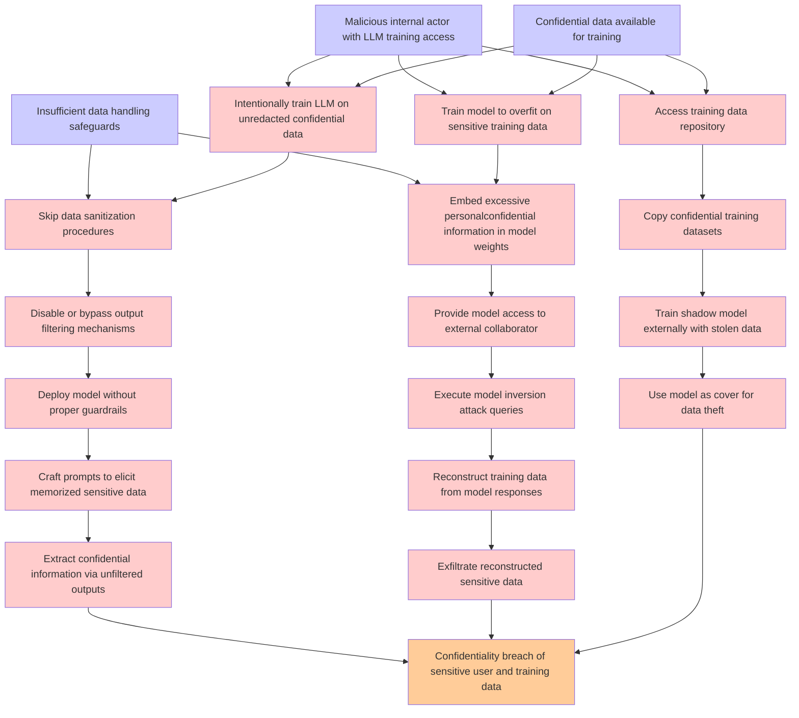

# Attack Tree: LLM02 SensitiveInfo Disclosure

**Threat ID**: f31ca02f-49a0-44df-8718-0e56d500ed4f
**Statement**: A malicious internal actor who trains an LLM on confidential data without proper safeguards can expose that data, which leads to unfiltered model outputs or model inversion attacks, resulting in reduced confidentiality of sensitive user and training data

## Attack Tree Diagram

## MITRE ATT&CK Mapping

This attack tree has been mapped to MITRE ATT&CK techniques:

### Craft prompts to elicit memorized sensitive data

- **Technique**: [T1056](https://attack.mitre.org/techniques/T1056/) - Input Capture
- **Tactic**: Collection, Credential Access
- **Similarity Score**: 48.97%

### Reconstruct training data from model responses

- **Technique**: [T1560](https://attack.mitre.org/techniques/T1560/) - Archive Collected Data
- **Tactic**: Collection
- **Similarity Score**: 44.68%
- **Mitigations (1):**
  - 🛡️ **Audit**
    Auditing is the process of recording activity and systematically reviewing and analyzing the activity and system configu...

### Train shadow model externally with stolen data

- **Technique**: [T1567.001](https://attack.mitre.org/techniques/T1567/001/) - Exfiltration to Code Repository
- **Tactic**: Exfiltration
- **Similarity Score**: 42.97%
- **Mitigations (1):**
  - 🛡️ **Restrict Web-Based Content**
    Restricting web-based content involves enforcing policies and technologies that limit access to potentially malicious we...

### Malicious internal actor with LLM training access

- **Technique**: [T1587](https://attack.mitre.org/techniques/T1587/) - Develop Capabilities
- **Tactic**: Resource Development
- **Similarity Score**: 39.96%
- **Mitigations (1):**
  - 🛡️ **Pre-compromise**
    Pre-compromise mitigations involve proactive measures and defenses implemented to prevent adversaries from successfully ...

### Deploy model without proper guardrails

- **Technique**: [T1480](https://attack.mitre.org/techniques/T1480/) - Execution Guardrails
- **Tactic**: Defense Evasion
- **Similarity Score**: 47.61%
- **Mitigations (1):**
  - 🛡️ **Do Not Mitigate**
    The Do Not Mitigate category highlights scenarios where attempting to mitigate a specific technique may inadvertently in...

### Exfiltrate reconstructed sensitive data

- **Technique**: [T1560.001](https://attack.mitre.org/techniques/T1560/001/) - Archive via Utility
- **Tactic**: Collection
- **Similarity Score**: 76.91%
- **Mitigations (1):**
  - 🛡️ **Audit**
    Auditing is the process of recording activity and systematically reviewing and analyzing the activity and system configu...

### Skip data sanitization procedures

- **Technique**: [T1560](https://attack.mitre.org/techniques/T1560/) - Archive Collected Data
- **Tactic**: Collection
- **Similarity Score**: 61.26%
- **Mitigations (1):**
  - 🛡️ **Audit**
    Auditing is the process of recording activity and systematically reviewing and analyzing the activity and system configu...

### Insufficient data handling safeguards

- **Technique**: [T1030](https://attack.mitre.org/techniques/T1030/) - Data Transfer Size Limits
- **Tactic**: Exfiltration
- **Similarity Score**: 58.94%
- **Mitigations (1):**
  - 🛡️ **Network Intrusion Prevention**
    Use intrusion detection signatures to block traffic at network boundaries.

### Train model to overfit on sensitive training data

- **Technique**: [T1565](https://attack.mitre.org/techniques/T1565/) - Data Manipulation
- **Tactic**: Impact
- **Similarity Score**: 36.89%
- **Mitigations (4):**
  - 🛡️ **Encrypt Sensitive Information**
    Protect sensitive information at rest, in transit, and during processing by using strong encryption algorithms. Encrypti...
  - 🛡️ **Remote Data Storage**
    Remote Data Storage focuses on moving critical data, such as security logs and sensitive files, to secure, off-host loca...
  - 🛡️ **Network Segmentation**
    Network segmentation involves dividing a network into smaller, isolated segments to control and limit the flow of traffi...
  - *1 more mitigation(s) available*

### Disable or bypass output filtering mechanisms

- **Technique**: [T1001.002](https://attack.mitre.org/techniques/T1001/002/) - Steganography
- **Tactic**: Command And Control
- **Similarity Score**: 46.45%
- **Mitigations (1):**
  - 🛡️ **Network Intrusion Prevention**
    Use intrusion detection signatures to block traffic at network boundaries.

### Execute model inversion attack queries

- **Technique**: [T1590.006](https://attack.mitre.org/techniques/T1590/006/) - Network Security Appliances
- **Tactic**: Reconnaissance
- **Similarity Score**: 38.03%
- **Mitigations (1):**
  - 🛡️ **Pre-compromise**
    Pre-compromise mitigations involve proactive measures and defenses implemented to prevent adversaries from successfully ...

### Confidentiality breach of sensitive user and training data

- **Technique**: [T1565](https://attack.mitre.org/techniques/T1565/) - Data Manipulation
- **Tactic**: Impact
- **Similarity Score**: 63.87%
- **Mitigations (4):**
  - 🛡️ **Encrypt Sensitive Information**
    Protect sensitive information at rest, in transit, and during processing by using strong encryption algorithms. Encrypti...
  - 🛡️ **Remote Data Storage**
    Remote Data Storage focuses on moving critical data, such as security logs and sensitive files, to secure, off-host loca...
  - 🛡️ **Network Segmentation**
    Network segmentation involves dividing a network into smaller, isolated segments to control and limit the flow of traffi...
  - *1 more mitigation(s) available*

### Use model as cover for data theft

- **Technique**: [T1022](https://attack.mitre.org/techniques/T1022/) - Data Encrypted
- **Tactic**: Exfiltration
- **Similarity Score**: 60.97%

### Copy confidential training datasets

- **Technique**: [T1567.001](https://attack.mitre.org/techniques/T1567/001/) - Exfiltration to Code Repository
- **Tactic**: Exfiltration
- **Similarity Score**: 65.08%
- **Mitigations (1):**
  - 🛡️ **Restrict Web-Based Content**
    Restricting web-based content involves enforcing policies and technologies that limit access to potentially malicious we...

### Provide model access to external collaborator

- **Technique**: [T1199](https://attack.mitre.org/techniques/T1199/) - Trusted Relationship
- **Tactic**: Initial Access
- **Similarity Score**: 58.50%
- **Mitigations (3):**
  - 🛡️ **Multi-factor Authentication**
    Multi-Factor Authentication (MFA) enhances security by requiring users to provide at least two forms of verification to ...
  - 🛡️ **User Account Management**
    User Account Management involves implementing and enforcing policies for the lifecycle of user accounts, including creat...
  - 🛡️ **Network Segmentation**
    Network segmentation involves dividing a network into smaller, isolated segments to control and limit the flow of traffi...

### Extract confidential information via unfiltered outputs

- **Technique**: [T1567.003](https://attack.mitre.org/techniques/T1567/003/) - Exfiltration to Text Storage Sites
- **Tactic**: Exfiltration
- **Similarity Score**: 56.03%
- **Mitigations (1):**
  - 🛡️ **Restrict Web-Based Content**
    Restricting web-based content involves enforcing policies and technologies that limit access to potentially malicious we...

### Intentionally train LLM on unredacted confidential data

- **Technique**: [T1567.003](https://attack.mitre.org/techniques/T1567/003/) - Exfiltration to Text Storage Sites
- **Tactic**: Exfiltration
- **Similarity Score**: 48.10%
- **Mitigations (1):**
  - 🛡️ **Restrict Web-Based Content**
    Restricting web-based content involves enforcing policies and technologies that limit access to potentially malicious we...

### Confidential data available for training

- **Technique**: [T1597.002](https://attack.mitre.org/techniques/T1597/002/) - Purchase Technical Data
- **Tactic**: Reconnaissance
- **Similarity Score**: 66.54%
- **Mitigations (1):**
  - 🛡️ **Pre-compromise**
    Pre-compromise mitigations involve proactive measures and defenses implemented to prevent adversaries from successfully ...

### Access training data repository

- **Technique**: [T1213](https://attack.mitre.org/techniques/T1213/) - Data from Information Repositories
- **Tactic**: Collection
- **Similarity Score**: 67.03%
- **Mitigations (7):**
  - 🛡️ **Multi-factor Authentication**
    Multi-Factor Authentication (MFA) enhances security by requiring users to provide at least two forms of verification to ...
  - 🛡️ **Out-of-Band Communications Channel**
    Establish secure out-of-band communication channels to ensure the continuity of critical communications during security ...
  - 🛡️ **User Training**
    User Training involves educating employees and contractors on recognizing, reporting, and preventing cyber threats that ...
  - *4 more mitigation(s) available*

### Embed excessive personalconfidential information in model weights

- **Technique**: [T1589](https://attack.mitre.org/techniques/T1589/) - Gather Victim Identity Information
- **Tactic**: Reconnaissance
- **Similarity Score**: 33.05%
- **Mitigations (1):**
  - 🛡️ **Pre-compromise**
    Pre-compromise mitigations involve proactive measures and defenses implemented to prevent adversaries from successfully ...

*Total technique mappings: 20 | Mitigations found: 32*

## Attack Path Analysis

Review this attack tree to:
1. Identify critical attack paths
2. Implement appropriate security controls
3. Monitor for indicators
4. Develop incident response procedures

---
*Generated by ThreatForest*
