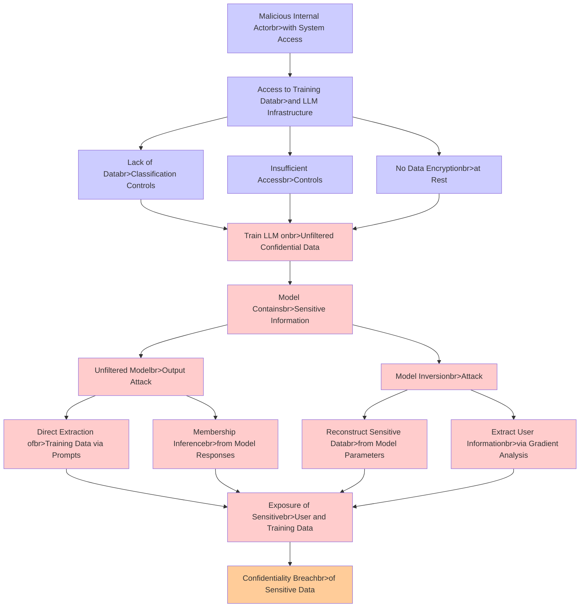

# Attack Tree: LLM02 SensitiveInfo Disclosure

**Threat ID**: f31ca02f-49a0-44df-8718-0e56d500ed4f
**Statement**: A malicious internal actor who trains an LLM on confidential data without proper safeguards can expose that data, which leads to unfiltered model outputs or model inversion attacks, resulting in reduced confidentiality of sensitive user and training data

## Attack Tree Diagram

## MITRE ATT&CK Mapping

This attack tree has been mapped to MITRE ATT&CK techniques:

### Malicious Internal Actorbr>with System Access

- **Technique**: [T1559.001](https://attack.mitre.org/techniques/T1559/001/) - Component Object Model
- **Tactic**: Execution
- **Similarity Score**: 56.51%
- **Mitigations (2):**
  - 🛡️ **Privileged Account Management**
    Privileged Account Management focuses on implementing policies, controls, and tools to securely manage privileged accoun...
  - 🛡️ **Application Isolation and Sandboxing**
    Application Isolation and Sandboxing refers to the technique of restricting the execution of code to a controlled and is...

### Extract User Informationbr>via Gradient Analysis

- **Technique**: [T1589](https://attack.mitre.org/techniques/T1589/) - Gather Victim Identity Information
- **Tactic**: Reconnaissance
- **Similarity Score**: 60.79%
- **Mitigations (1):**
  - 🛡️ **Pre-compromise**
    Pre-compromise mitigations involve proactive measures and defenses implemented to prevent adversaries from successfully ...

### Exposure of Sensitivebr>User and Training Data

- **Technique**: [T1213.006](https://attack.mitre.org/techniques/T1213/006/) - Databases
- **Tactic**: Collection
- **Similarity Score**: 50.38%
- **Mitigations (5):**
  - 🛡️ **User Training**
    User Training involves educating employees and contractors on recognizing, reporting, and preventing cyber threats that ...
  - 🛡️ **Encrypt Sensitive Information**
    Protect sensitive information at rest, in transit, and during processing by using strong encryption algorithms. Encrypti...
  - 🛡️ **Software Configuration**
    Software configuration refers to making security-focused adjustments to the settings of applications, middleware, databa...
  - *2 more mitigation(s) available*

### Reconstruct Sensitive Databr>from Model Parameters

- **Technique**: [T1560](https://attack.mitre.org/techniques/T1560/) - Archive Collected Data
- **Tactic**: Collection
- **Similarity Score**: 52.00%
- **Mitigations (1):**
  - 🛡️ **Audit**
    Auditing is the process of recording activity and systematically reviewing and analyzing the activity and system configu...

### Insufficient Accessbr>Controls

- **Technique**: [T1548](https://attack.mitre.org/techniques/T1548/) - Abuse Elevation Control Mechanism
- **Tactic**: Privilege Escalation, Defense Evasion
- **Similarity Score**: 58.83%
- **Mitigations (8):**
  - 🛡️ **Execution Prevention**
    Prevent the execution of unauthorized or malicious code on systems by implementing application control, script blocking,...
  - 🛡️ **Operating System Configuration**
    Operating System Configuration involves adjusting system settings and hardening the default configurations of an operati...
  - 🛡️ **Update Software**
    Software updates ensure systems are protected against known vulnerabilities by applying patches and upgrades provided by...
  - *5 more mitigation(s) available*

### Access to Training Databr>and LLM Infrastructure

- **Technique**: [T1213](https://attack.mitre.org/techniques/T1213/) - Data from Information Repositories
- **Tactic**: Collection
- **Similarity Score**: 38.70%
- **Mitigations (7):**
  - 🛡️ **Multi-factor Authentication**
    Multi-Factor Authentication (MFA) enhances security by requiring users to provide at least two forms of verification to ...
  - 🛡️ **Out-of-Band Communications Channel**
    Establish secure out-of-band communication channels to ensure the continuity of critical communications during security ...
  - 🛡️ **User Training**
    User Training involves educating employees and contractors on recognizing, reporting, and preventing cyber threats that ...
  - *4 more mitigation(s) available*

### Membership Inferencebr>from Model Responses

- **Technique**: [T1069](https://attack.mitre.org/techniques/T1069/) - Permission Groups Discovery
- **Tactic**: Discovery
- **Similarity Score**: 44.60%

### Direct Extraction ofbr>Training Data via Prompts

- **Technique**: [T1074.001](https://attack.mitre.org/techniques/T1074/001/) - Local Data Staging
- **Tactic**: Collection
- **Similarity Score**: 42.33%

### Confidentiality Breachbr>of Sensitive Data

- **Technique**: [T1565](https://attack.mitre.org/techniques/T1565/) - Data Manipulation
- **Tactic**: Impact
- **Similarity Score**: 61.81%
- **Mitigations (4):**
  - 🛡️ **Encrypt Sensitive Information**
    Protect sensitive information at rest, in transit, and during processing by using strong encryption algorithms. Encrypti...
  - 🛡️ **Remote Data Storage**
    Remote Data Storage focuses on moving critical data, such as security logs and sensitive files, to secure, off-host loca...
  - 🛡️ **Network Segmentation**
    Network segmentation involves dividing a network into smaller, isolated segments to control and limit the flow of traffi...
  - *1 more mitigation(s) available*

### Model Inversionbr>Attack

- **Technique**: [T1498.002](https://attack.mitre.org/techniques/T1498/002/) - Reflection Amplification
- **Tactic**: Impact
- **Similarity Score**: 40.31%
- **Mitigations (1):**
  - 🛡️ **Filter Network Traffic**
    Employ network appliances and endpoint software to filter ingress, egress, and lateral network traffic. This includes pr...

### No Data Encryptionbr>at Rest

- **Technique**: [T1027.013](https://attack.mitre.org/techniques/T1027/013/) - Encrypted/Encoded File
- **Tactic**: Defense Evasion
- **Similarity Score**: 79.06%
- **Mitigations (2):**
  - 🛡️ **Antivirus/Antimalware**
    Antivirus/Antimalware solutions utilize signatures, heuristics, and behavioral analysis to detect, block, and remediate ...
  - 🛡️ **Behavior Prevention on Endpoint**
    Behavior Prevention on Endpoint refers to the use of technologies and strategies to detect and block potentially malicio...

### Model Containsbr>Sensitive Information

- **Technique**: [T1595.003](https://attack.mitre.org/techniques/T1595/003/) - Wordlist Scanning
- **Tactic**: Reconnaissance
- **Similarity Score**: 49.52%
- **Mitigations (2):**
  - 🛡️ **Disable or Remove Feature or Program**
    Disable or remove unnecessary and potentially vulnerable software, features, or services to reduce the attack surface an...
  - 🛡️ **Pre-compromise**
    Pre-compromise mitigations involve proactive measures and defenses implemented to prevent adversaries from successfully ...

### Train LLM onbr>Unfiltered Confidential Data

- **Technique**: [T1048.003](https://attack.mitre.org/techniques/T1048/003/) - Exfiltration Over Unencrypted Non-C2 Protocol
- **Tactic**: Exfiltration
- **Similarity Score**: 56.43%
- **Mitigations (4):**
  - 🛡️ **Network Intrusion Prevention**
    Use intrusion detection signatures to block traffic at network boundaries.
  - 🛡️ **Data Loss Prevention**
    Data Loss Prevention (DLP) involves implementing strategies and technologies to identify, categorize, monitor, and contr...
  - 🛡️ **Filter Network Traffic**
    Employ network appliances and endpoint software to filter ingress, egress, and lateral network traffic. This includes pr...
  - *1 more mitigation(s) available*

### Unfiltered Modelbr>Output Attack

- **Technique**: [T1001.001](https://attack.mitre.org/techniques/T1001/001/) - Junk Data
- **Tactic**: Command And Control
- **Similarity Score**: 44.73%
- **Mitigations (1):**
  - 🛡️ **Network Intrusion Prevention**
    Use intrusion detection signatures to block traffic at network boundaries.

### Lack of Databr>Classification Controls

- **Technique**: [T1564.004](https://attack.mitre.org/techniques/T1564/004/) - NTFS File Attributes
- **Tactic**: Defense Evasion
- **Similarity Score**: 35.56%
- **Mitigations (1):**
  - 🛡️ **Restrict File and Directory Permissions**
    Restricting file and directory permissions involves setting access controls at the file system level to limit which user...

*Total technique mappings: 15 | Mitigations found: 39*

## Attack Path Analysis

Review this attack tree to:
1. Identify critical attack paths
2. Implement appropriate security controls
3. Monitor for indicators
4. Develop incident response procedures

---
*Generated by ThreatForest*
