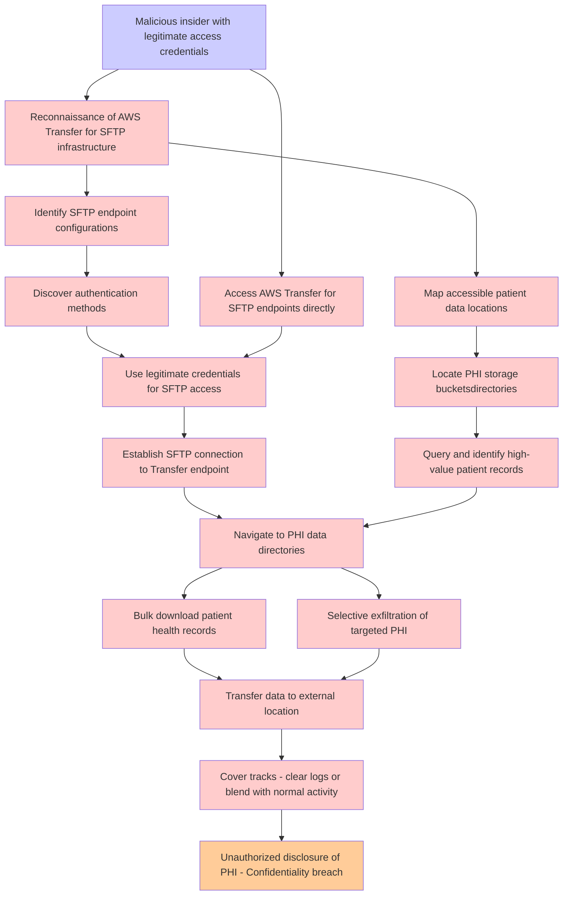

# Attack Tree: Data Breach

**Threat ID**: T001  
**Associated threat statement**: T001 - Data Breach

- **Threat Source**: malicious insider
- **Prerequisites**: legitimate access credentials
- **Threat Action**: exfiltrate sensitive patient data through AWS Transfer for SFTP endpoints
- **Threat Impact**: unauthorized disclosure of PHI
- **Reduced Goal**: confidentiality
- **Impacted Assets**: patient health records
- **Priority**: High
- **Category**: Data Breach

---

## Attack Tree Diagram

## Attack Path Analysis

This attack tree represents the potential attack paths for the identified threat. Each node in the tree represents either:
- **Attack Goal** (orange): The ultimate objective
- **Attack Step** (red): Individual attack actions
- **Fact/Condition** (blue): Prerequisites or conditions
- **Mitigation** (green): Defensive measures

Review this attack tree to:
1. Identify critical attack paths
2. Implement appropriate security controls
3. Monitor for indicators of these attack patterns
4. Develop incident response procedures

---
*Generated by ThreatForest - Attack Tree Analysis*
