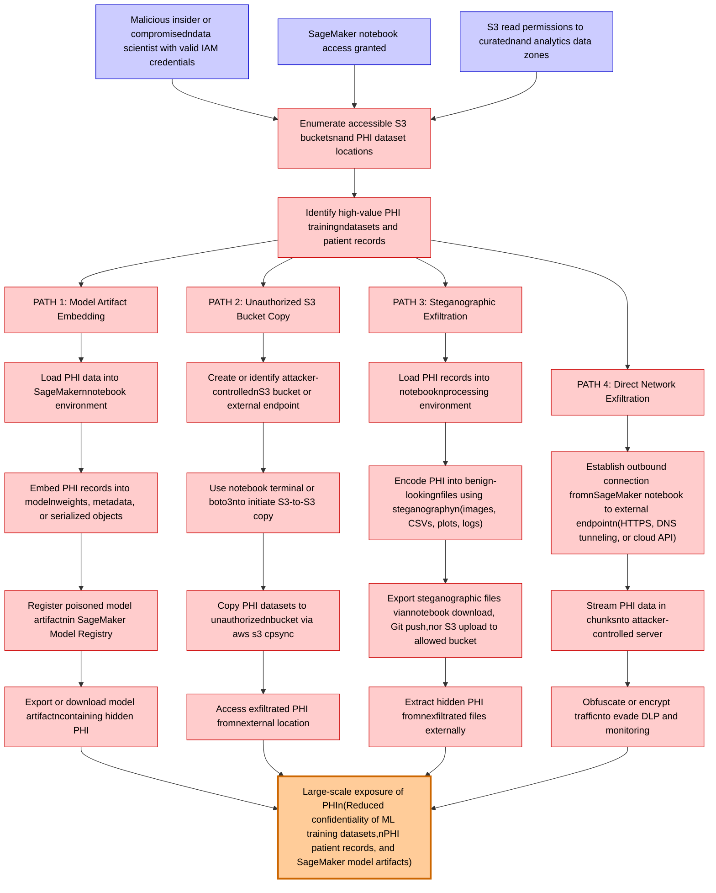

# Attack Tree: Data Exfiltration

**Threat ID**: T001
**Statement**: A malicious insider or compromised data scientist with SageMaker notebook access and S3 read permissions, can exfiltrate PHI training datasets by embedding sensitive patient data within model artifacts, copying data to unauthorized S3 buckets, or using steganographic techniques in exported files, which leads to large-scale exposure of protected health information, resulting in reduced confidentiality of machine learning training datasets, PHI patient records, and SageMaker model artifacts.

## Attack Tree Diagram

## MITRE ATT&CK Mapping

This attack tree has been mapped to MITRE ATT&CK techniques:

### Identify high-value PHI trainingndatasets and patient records

- **Technique**: [T1593.002](https://attack.mitre.org/techniques/T1593/002/) - Search Engines
- **Tactic**: Reconnaissance
- **Similarity Score**: 69.41%
- **Mitigations (1):**
  - 🛡️ **Pre-compromise**
    Pre-compromise mitigations involve proactive measures and defenses implemented to prevent adversaries from successfully ...

### Create or identify attacker-controllednS3 bucket or external endpoint

- **Technique**: [T1584.007](https://attack.mitre.org/techniques/T1584/007/) - Serverless
- **Tactic**: Resource Development
- **Similarity Score**: 52.78%
- **Mitigations (1):**
  - 🛡️ **Pre-compromise**
    Pre-compromise mitigations involve proactive measures and defenses implemented to prevent adversaries from successfully ...

### Copy PHI datasets to unauthorizednbucket via aws s3 cpsync

- **Technique**: [T1074](https://attack.mitre.org/techniques/T1074/) - Data Staged
- **Tactic**: Collection
- **Similarity Score**: 72.97%

### PATH 4: Direct Network Exfiltration

- **Technique**: [T1011](https://attack.mitre.org/techniques/T1011/) - Exfiltration Over Other Network Medium
- **Tactic**: Exfiltration
- **Similarity Score**: 70.23%
- **Mitigations (2):**
  - 🛡️ **Disable or Remove Feature or Program**
    Disable or remove unnecessary and potentially vulnerable software, features, or services to reduce the attack surface an...
  - 🛡️ **Operating System Configuration**
    Operating System Configuration involves adjusting system settings and hardening the default configurations of an operati...

### Export steganographic files viannotebook download, Git push,nor S3 upload to allowed bucket

- **Technique**: [T1560.001](https://attack.mitre.org/techniques/T1560/001/) - Archive via Utility
- **Tactic**: Collection
- **Similarity Score**: 66.77%
- **Mitigations (1):**
  - 🛡️ **Audit**
    Auditing is the process of recording activity and systematically reviewing and analyzing the activity and system configu...

### Malicious insider or compromisedndata scientist with valid IAM credentials

- **Technique**: [T1556](https://attack.mitre.org/techniques/T1556/) - Modify Authentication Process
- **Tactic**: Credential Access, Defense Evasion, Persistence
- **Similarity Score**: 68.34%
- **Mitigations (9):**
  - 🛡️ **Restrict Registry Permissions**
    Restricting registry permissions involves configuring access control settings for sensitive registry keys and hives to e...
  - 🛡️ **Multi-factor Authentication**
    Multi-Factor Authentication (MFA) enhances security by requiring users to provide at least two forms of verification to ...
  - 🛡️ **Password Policies**
    Set and enforce secure password policies for accounts to reduce the likelihood of unauthorized access. Strong password p...
  - *6 more mitigation(s) available*

### Embed PHI records into modelnweights, metadata, or serialized objects

- **Technique**: [T1602](https://attack.mitre.org/techniques/T1602/) - Data from Configuration Repository
- **Tactic**: Collection
- **Similarity Score**: 38.50%
- **Mitigations (6):**
  - 🛡️ **Update Software**
    Software updates ensure systems are protected against known vulnerabilities by applying patches and upgrades provided by...
  - 🛡️ **Software Configuration**
    Software configuration refers to making security-focused adjustments to the settings of applications, middleware, databa...
  - 🛡️ **Network Segmentation**
    Network segmentation involves dividing a network into smaller, isolated segments to control and limit the flow of traffi...
  - *3 more mitigation(s) available*

### S3 read permissions to curatednand analytics data zones

- **Technique**: [T1530](https://attack.mitre.org/techniques/T1530/) - Data from Cloud Storage
- **Tactic**: Collection
- **Similarity Score**: 67.30%
- **Mitigations (6):**
  - 🛡️ **User Account Management**
    User Account Management involves implementing and enforcing policies for the lifecycle of user accounts, including creat...
  - 🛡️ **Encrypt Sensitive Information**
    Protect sensitive information at rest, in transit, and during processing by using strong encryption algorithms. Encrypti...
  - 🛡️ **Restrict File and Directory Permissions**
    Restricting file and directory permissions involves setting access controls at the file system level to limit which user...
  - *3 more mitigation(s) available*

### Register poisoned model artifactnin SageMaker Model Registry

- **Technique**: [T1112](https://attack.mitre.org/techniques/T1112/) - Modify Registry
- **Tactic**: Defense Evasion, Persistence
- **Similarity Score**: 60.14%
- **Mitigations (1):**
  - 🛡️ **Restrict Registry Permissions**
    Restricting registry permissions involves configuring access control settings for sensitive registry keys and hives to e...

### Extract hidden PHI fromnexfiltrated files externally

- **Technique**: [T1560.001](https://attack.mitre.org/techniques/T1560/001/) - Archive via Utility
- **Tactic**: Collection
- **Similarity Score**: 70.36%
- **Mitigations (1):**
  - 🛡️ **Audit**
    Auditing is the process of recording activity and systematically reviewing and analyzing the activity and system configu...

### PATH 1: Model Artifact Embedding

- **Technique**: [T1027.009](https://attack.mitre.org/techniques/T1027/009/) - Embedded Payloads
- **Tactic**: Defense Evasion
- **Similarity Score**: 42.48%
- **Mitigations (2):**
  - 🛡️ **Antivirus/Antimalware**
    Antivirus/Antimalware solutions utilize signatures, heuristics, and behavioral analysis to detect, block, and remediate ...
  - 🛡️ **Behavior Prevention on Endpoint**
    Behavior Prevention on Endpoint refers to the use of technologies and strategies to detect and block potentially malicio...

### Establish outbound connection fromnSageMaker notebook to external endpointn(HTTPS, DNS tunneling, or cloud API)

- **Technique**: [T1090.002](https://attack.mitre.org/techniques/T1090/002/) - External Proxy
- **Tactic**: Command And Control
- **Similarity Score**: 75.29%
- **Mitigations (1):**
  - 🛡️ **Network Intrusion Prevention**
    Use intrusion detection signatures to block traffic at network boundaries.

### PATH 2: Unauthorized S3 Bucket Copy

- **Technique**: [T1119](https://attack.mitre.org/techniques/T1119/) - Automated Collection
- **Tactic**: Collection
- **Similarity Score**: 68.94%
- **Mitigations (2):**
  - 🛡️ **Remote Data Storage**
    Remote Data Storage focuses on moving critical data, such as security logs and sensitive files, to secure, off-host loca...
  - 🛡️ **Encrypt Sensitive Information**
    Protect sensitive information at rest, in transit, and during processing by using strong encryption algorithms. Encrypti...

### Obfuscate or encrypt trafficnto evade DLP and monitoring

- **Technique**: [T1001](https://attack.mitre.org/techniques/T1001/) - Data Obfuscation
- **Tactic**: Command And Control
- **Similarity Score**: 83.20%
- **Mitigations (1):**
  - 🛡️ **Network Intrusion Prevention**
    Use intrusion detection signatures to block traffic at network boundaries.

### Load PHI data into SageMakernnotebook environment

- **Technique**: [T1559.002](https://attack.mitre.org/techniques/T1559/002/) - Dynamic Data Exchange
- **Tactic**: Execution
- **Similarity Score**: 46.12%
- **Mitigations (4):**
  - 🛡️ **Behavior Prevention on Endpoint**
    Behavior Prevention on Endpoint refers to the use of technologies and strategies to detect and block potentially malicio...
  - 🛡️ **Application Isolation and Sandboxing**
    Application Isolation and Sandboxing refers to the technique of restricting the execution of code to a controlled and is...
  - 🛡️ **Software Configuration**
    Software configuration refers to making security-focused adjustments to the settings of applications, middleware, databa...
  - *1 more mitigation(s) available*

### Stream PHI data in chunksnto attacker-controlled server

- **Technique**: [T1030](https://attack.mitre.org/techniques/T1030/) - Data Transfer Size Limits
- **Tactic**: Exfiltration
- **Similarity Score**: 59.91%
- **Mitigations (1):**
  - 🛡️ **Network Intrusion Prevention**
    Use intrusion detection signatures to block traffic at network boundaries.

### SageMaker notebook access granted

- **Technique**: [T1219](https://attack.mitre.org/techniques/T1219/) - Remote Access Tools
- **Tactic**: Command And Control
- **Similarity Score**: 52.25%
- **Mitigations (5):**
  - 🛡️ **Execution Prevention**
    Prevent the execution of unauthorized or malicious code on systems by implementing application control, script blocking,...
  - 🛡️ **Filter Network Traffic**
    Employ network appliances and endpoint software to filter ingress, egress, and lateral network traffic. This includes pr...
  - 🛡️ **Limit Hardware Installation**
    Prevent unauthorized users or groups from installing or using hardware, such as external drives, peripheral devices, or ...
  - *2 more mitigation(s) available*

### Export or download model artifactncontaining hidden PHI

- **Technique**: [T1602](https://attack.mitre.org/techniques/T1602/) - Data from Configuration Repository
- **Tactic**: Collection
- **Similarity Score**: 45.46%
- **Mitigations (6):**
  - 🛡️ **Update Software**
    Software updates ensure systems are protected against known vulnerabilities by applying patches and upgrades provided by...
  - 🛡️ **Software Configuration**
    Software configuration refers to making security-focused adjustments to the settings of applications, middleware, databa...
  - 🛡️ **Network Segmentation**
    Network segmentation involves dividing a network into smaller, isolated segments to control and limit the flow of traffi...
  - *3 more mitigation(s) available*

### PATH 3: Steganographic Exfiltration

- **Technique**: [T1027.003](https://attack.mitre.org/techniques/T1027/003/) - Steganography
- **Tactic**: Defense Evasion
- **Similarity Score**: 76.66%

### Encode PHI into benign-lookingnfiles using steganographyn(images, CSVs, plots, logs)

- **Technique**: [T1027.003](https://attack.mitre.org/techniques/T1027/003/) - Steganography
- **Tactic**: Defense Evasion
- **Similarity Score**: 77.74%

### Use notebook terminal or boto3nto initiate S3-to-S3 copy

- **Technique**: [T1570](https://attack.mitre.org/techniques/T1570/) - Lateral Tool Transfer
- **Tactic**: Lateral Movement
- **Similarity Score**: 69.61%
- **Mitigations (2):**
  - 🛡️ **Filter Network Traffic**
    Employ network appliances and endpoint software to filter ingress, egress, and lateral network traffic. This includes pr...
  - 🛡️ **Network Intrusion Prevention**
    Use intrusion detection signatures to block traffic at network boundaries.

### Large-scale exposure of PHIn(Reduced confidentiality of ML training datasets,nPHI patient records, and SageMaker model artifacts)

- **Technique**: [T1213](https://attack.mitre.org/techniques/T1213/) - Data from Information Repositories
- **Tactic**: Collection
- **Similarity Score**: 56.62%
- **Mitigations (7):**
  - 🛡️ **Multi-factor Authentication**
    Multi-Factor Authentication (MFA) enhances security by requiring users to provide at least two forms of verification to ...
  - 🛡️ **Out-of-Band Communications Channel**
    Establish secure out-of-band communication channels to ensure the continuity of critical communications during security ...
  - 🛡️ **User Training**
    User Training involves educating employees and contractors on recognizing, reporting, and preventing cyber threats that ...
  - *4 more mitigation(s) available*

### Enumerate accessible S3 bucketsnand PHI dataset locations

- **Technique**: [T1619](https://attack.mitre.org/techniques/T1619/) - Cloud Storage Object Discovery
- **Tactic**: Discovery
- **Similarity Score**: 79.27%
- **Mitigations (1):**
  - 🛡️ **User Account Management**
    User Account Management involves implementing and enforcing policies for the lifecycle of user accounts, including creat...

### Load PHI records into notebooknprocessing environment

- **Technique**: [T1556.008](https://attack.mitre.org/techniques/T1556/008/) - Network Provider DLL
- **Tactic**: Credential Access, Defense Evasion, Persistence
- **Similarity Score**: 42.43%
- **Mitigations (3):**
  - 🛡️ **Restrict Registry Permissions**
    Restricting registry permissions involves configuring access control settings for sensitive registry keys and hives to e...
  - 🛡️ **Audit**
    Auditing is the process of recording activity and systematically reviewing and analyzing the activity and system configu...
  - 🛡️ **Operating System Configuration**
    Operating System Configuration involves adjusting system settings and hardening the default configurations of an operati...

### Access exfiltrated PHI fromnexternal location

- **Technique**: [T1048](https://attack.mitre.org/techniques/T1048/) - Exfiltration Over Alternative Protocol
- **Tactic**: Exfiltration
- **Similarity Score**: 69.31%
- **Mitigations (6):**
  - 🛡️ **Network Segmentation**
    Network segmentation involves dividing a network into smaller, isolated segments to control and limit the flow of traffi...
  - 🛡️ **Data Loss Prevention**
    Data Loss Prevention (DLP) involves implementing strategies and technologies to identify, categorize, monitor, and contr...
  - 🛡️ **Filter Network Traffic**
    Employ network appliances and endpoint software to filter ingress, egress, and lateral network traffic. This includes pr...
  - *3 more mitigation(s) available*

*Total technique mappings: 25 | Mitigations found: 69*

## Attack Path Analysis

Review this attack tree to:
1. Identify critical attack paths
2. Implement appropriate security controls
3. Monitor for indicators
4. Develop incident response procedures

---
*Generated by ThreatForest*
