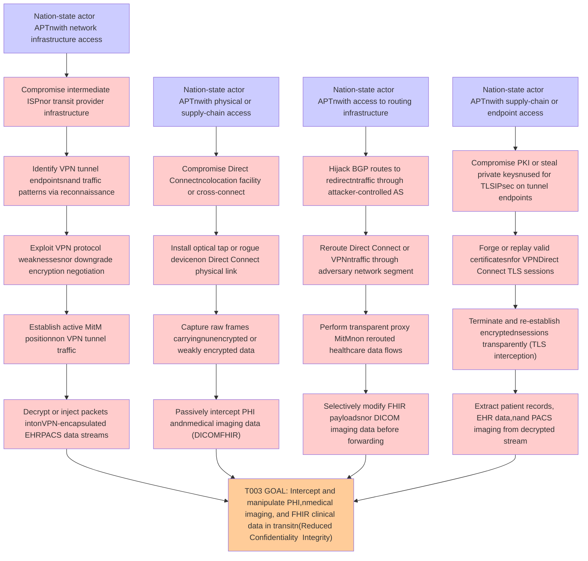

# Attack Tree: Man-in-the-Middle

**Threat ID**: T003
**Statement**: A nation-state actor or advanced persistent threat with the ability to compromise network infrastructure between customer-hosted facilities and AWS, can perform man-in-the-middle attacks on VPN or Direct Connect tunnels carrying EHR and PACS data, which leads to interception and potential manipulation of patient medical records and medical imaging data in transit, resulting in reduced confidentiality and integrity of Protected Health Information, medical imaging data, and FHIR clinical data.

## Attack Tree Diagram

## MITRE ATT&CK Mapping

This attack tree has been mapped to MITRE ATT&CK techniques:

### Perform transparent proxy MitMnon rerouted healthcare data flows

- **Technique**: [T1090.002](https://attack.mitre.org/techniques/T1090/002/) - External Proxy
- **Tactic**: Command And Control
- **Similarity Score**: 74.08%
- **Mitigations (1):**
  - 🛡️ **Network Intrusion Prevention**
    Use intrusion detection signatures to block traffic at network boundaries.

### Capture raw frames carryingnunencrypted or weakly encrypted data

- **Technique**: [T1048.003](https://attack.mitre.org/techniques/T1048/003/) - Exfiltration Over Unencrypted Non-C2 Protocol
- **Tactic**: Exfiltration
- **Similarity Score**: 59.38%
- **Mitigations (4):**
  - 🛡️ **Network Intrusion Prevention**
    Use intrusion detection signatures to block traffic at network boundaries.
  - 🛡️ **Data Loss Prevention**
    Data Loss Prevention (DLP) involves implementing strategies and technologies to identify, categorize, monitor, and contr...
  - 🛡️ **Filter Network Traffic**
    Employ network appliances and endpoint software to filter ingress, egress, and lateral network traffic. This includes pr...
  - *1 more mitigation(s) available*

### Nation-state actor  APTnwith access to routing infrastructure

- **Technique**: [T1584](https://attack.mitre.org/techniques/T1584/) - Compromise Infrastructure
- **Tactic**: Resource Development
- **Similarity Score**: 70.06%
- **Mitigations (1):**
  - 🛡️ **Pre-compromise**
    Pre-compromise mitigations involve proactive measures and defenses implemented to prevent adversaries from successfully ...

### Reroute Direct Connect or VPNntraffic through adversary network segment

- **Technique**: [T1599](https://attack.mitre.org/techniques/T1599/) - Network Boundary Bridging
- **Tactic**: Defense Evasion
- **Similarity Score**: 72.39%
- **Mitigations (5):**
  - 🛡️ **Multi-factor Authentication**
    Multi-Factor Authentication (MFA) enhances security by requiring users to provide at least two forms of verification to ...
  - 🛡️ **Password Policies**
    Set and enforce secure password policies for accounts to reduce the likelihood of unauthorized access. Strong password p...
  - 🛡️ **Privileged Account Management**
    Privileged Account Management focuses on implementing policies, controls, and tools to securely manage privileged accoun...
  - *2 more mitigation(s) available*

### Selectively modify FHIR payloadsnor DICOM imaging data before forwarding

- **Technique**: [T1601.001](https://attack.mitre.org/techniques/T1601/001/) - Patch System Image
- **Tactic**: Defense Evasion
- **Similarity Score**: 50.79%
- **Mitigations (6):**
  - 🛡️ **Boot Integrity**
    Boot Integrity ensures that a system starts securely by verifying the integrity of its boot process, operating system, a...
  - 🛡️ **Code Signing**
    Code Signing is a security process that ensures the authenticity and integrity of software by digitally signing executab...
  - 🛡️ **Credential Access Protection**
    Credential Access Protection focuses on implementing measures to prevent adversaries from obtaining credentials, such as...
  - *3 more mitigation(s) available*

### Passively intercept PHI andnmedical imaging data (DICOMFHIR)

- **Technique**: [T1125](https://attack.mitre.org/techniques/T1125/) - Video Capture
- **Tactic**: Collection
- **Similarity Score**: 50.47%

### Establish active MitM positionnon VPN tunnel traffic

- **Technique**: [T1572](https://attack.mitre.org/techniques/T1572/) - Protocol Tunneling
- **Tactic**: Command And Control
- **Similarity Score**: 76.88%
- **Mitigations (2):**
  - 🛡️ **Filter Network Traffic**
    Employ network appliances and endpoint software to filter ingress, egress, and lateral network traffic. This includes pr...
  - 🛡️ **Network Intrusion Prevention**
    Use intrusion detection signatures to block traffic at network boundaries.

### Forge or replay valid certificatesnfor VPNDirect Connect TLS sessions

- **Technique**: [T1649](https://attack.mitre.org/techniques/T1649/) - Steal or Forge Authentication Certificates
- **Tactic**: Credential Access
- **Similarity Score**: 64.74%
- **Mitigations (4):**
  - 🛡️ **Active Directory Configuration**
    Implement robust Active Directory (AD) configurations using group policies to secure user accounts, control access, and ...
  - 🛡️ **Disable or Remove Feature or Program**
    Disable or remove unnecessary and potentially vulnerable software, features, or services to reduce the attack surface an...
  - 🛡️ **Encrypt Sensitive Information**
    Protect sensitive information at rest, in transit, and during processing by using strong encryption algorithms. Encrypti...
  - *1 more mitigation(s) available*

### Decrypt or inject packets intonVPN-encapsulated EHRPACS data streams

- **Technique**: [T1048.003](https://attack.mitre.org/techniques/T1048/003/) - Exfiltration Over Unencrypted Non-C2 Protocol
- **Tactic**: Exfiltration
- **Similarity Score**: 73.72%
- **Mitigations (4):**
  - 🛡️ **Network Intrusion Prevention**
    Use intrusion detection signatures to block traffic at network boundaries.
  - 🛡️ **Data Loss Prevention**
    Data Loss Prevention (DLP) involves implementing strategies and technologies to identify, categorize, monitor, and contr...
  - 🛡️ **Filter Network Traffic**
    Employ network appliances and endpoint software to filter ingress, egress, and lateral network traffic. This includes pr...
  - *1 more mitigation(s) available*

### Extract patient records, EHR data,nand PACS imaging from decrypted stream

- **Technique**: [T1560](https://attack.mitre.org/techniques/T1560/) - Archive Collected Data
- **Tactic**: Collection
- **Similarity Score**: 65.00%
- **Mitigations (1):**
  - 🛡️ **Audit**
    Auditing is the process of recording activity and systematically reviewing and analyzing the activity and system configu...

### T003 GOAL: Intercept and manipulate PHI,nmedical imaging, and FHIR clinical data in transitn(Reduced Confidentiality  Integrity)

- **Technique**: [T1565.002](https://attack.mitre.org/techniques/T1565/002/) - Transmitted Data Manipulation
- **Tactic**: Impact
- **Similarity Score**: 60.70%
- **Mitigations (1):**
  - 🛡️ **Encrypt Sensitive Information**
    Protect sensitive information at rest, in transit, and during processing by using strong encryption algorithms. Encrypti...

### Terminate and re-establish encryptednsessions transparently (TLS interception)

- **Technique**: [T1600.002](https://attack.mitre.org/techniques/T1600/002/) - Disable Crypto Hardware
- **Tactic**: Defense Evasion
- **Similarity Score**: 68.38%

### Identify VPN tunnel endpointsnand traffic patterns via reconnaissance

- **Technique**: [T1040](https://attack.mitre.org/techniques/T1040/) - Network Sniffing
- **Tactic**: Credential Access, Discovery
- **Similarity Score**: 66.61%
- **Mitigations (4):**
  - 🛡️ **User Account Management**
    User Account Management involves implementing and enforcing policies for the lifecycle of user accounts, including creat...
  - 🛡️ **Multi-factor Authentication**
    Multi-Factor Authentication (MFA) enhances security by requiring users to provide at least two forms of verification to ...
  - 🛡️ **Encrypt Sensitive Information**
    Protect sensitive information at rest, in transit, and during processing by using strong encryption algorithms. Encrypti...
  - *1 more mitigation(s) available*

### Nation-state actor  APTnwith physical or supply-chain access

- **Technique**: [T1650](https://attack.mitre.org/techniques/T1650/) - Acquire Access
- **Tactic**: Resource Development
- **Similarity Score**: 59.89%
- **Mitigations (1):**
  - 🛡️ **Pre-compromise**
    Pre-compromise mitigations involve proactive measures and defenses implemented to prevent adversaries from successfully ...

### Nation-state actor  APTnwith network infrastructure access

- **Technique**: [T1584](https://attack.mitre.org/techniques/T1584/) - Compromise Infrastructure
- **Tactic**: Resource Development
- **Similarity Score**: 66.28%
- **Mitigations (1):**
  - 🛡️ **Pre-compromise**
    Pre-compromise mitigations involve proactive measures and defenses implemented to prevent adversaries from successfully ...

### Hijack BGP routes to redirectntraffic through attacker-controlled AS

- **Technique**: [T1665](https://attack.mitre.org/techniques/T1665/) - Hide Infrastructure
- **Tactic**: Command And Control
- **Similarity Score**: 55.34%

### Compromise Direct Connectncolocation facility or cross-connect

- **Technique**: [T1568](https://attack.mitre.org/techniques/T1568/) - Dynamic Resolution
- **Tactic**: Command And Control
- **Similarity Score**: 53.04%
- **Mitigations (2):**
  - 🛡️ **Network Intrusion Prevention**
    Use intrusion detection signatures to block traffic at network boundaries.
  - 🛡️ **Restrict Web-Based Content**
    Restricting web-based content involves enforcing policies and technologies that limit access to potentially malicious we...

### Install optical tap or rogue devicenon Direct Connect physical link

- **Technique**: [T1091](https://attack.mitre.org/techniques/T1091/) - Replication Through Removable Media
- **Tactic**: Lateral Movement, Initial Access
- **Similarity Score**: 47.36%
- **Mitigations (3):**
  - 🛡️ **Disable or Remove Feature or Program**
    Disable or remove unnecessary and potentially vulnerable software, features, or services to reduce the attack surface an...
  - 🛡️ **Limit Hardware Installation**
    Prevent unauthorized users or groups from installing or using hardware, such as external drives, peripheral devices, or ...
  - 🛡️ **Behavior Prevention on Endpoint**
    Behavior Prevention on Endpoint refers to the use of technologies and strategies to detect and block potentially malicio...

### Nation-state actor  APTnwith supply-chain or endpoint access

- **Technique**: [T1584](https://attack.mitre.org/techniques/T1584/) - Compromise Infrastructure
- **Tactic**: Resource Development
- **Similarity Score**: 59.66%
- **Mitigations (1):**
  - 🛡️ **Pre-compromise**
    Pre-compromise mitigations involve proactive measures and defenses implemented to prevent adversaries from successfully ...

### Compromise intermediate ISPnor transit provider infrastructure

- **Technique**: [T1090](https://attack.mitre.org/techniques/T1090/) - Proxy
- **Tactic**: Command And Control
- **Similarity Score**: 72.90%
- **Mitigations (3):**
  - 🛡️ **Filter Network Traffic**
    Employ network appliances and endpoint software to filter ingress, egress, and lateral network traffic. This includes pr...
  - 🛡️ **Network Intrusion Prevention**
    Use intrusion detection signatures to block traffic at network boundaries.
  - 🛡️ **SSL/TLS Inspection**
    SSL/TLS inspection involves decrypting encrypted network traffic to examine its content for signs of malicious activity....

### Compromise PKI or steal private keysnused for TLSIPsec on tunnel endpoints

- **Technique**: [T1572](https://attack.mitre.org/techniques/T1572/) - Protocol Tunneling
- **Tactic**: Command And Control
- **Similarity Score**: 63.59%
- **Mitigations (2):**
  - 🛡️ **Filter Network Traffic**
    Employ network appliances and endpoint software to filter ingress, egress, and lateral network traffic. This includes pr...
  - 🛡️ **Network Intrusion Prevention**
    Use intrusion detection signatures to block traffic at network boundaries.

### Exploit VPN protocol weaknessesnor downgrade encryption negotiation

- **Technique**: [T1032](https://attack.mitre.org/techniques/T1032/) - Standard Cryptographic Protocol
- **Tactic**: Command And Control
- **Similarity Score**: 81.54%

*Total technique mappings: 22 | Mitigations found: 46*

## Attack Path Analysis

Review this attack tree to:
1. Identify critical attack paths
2. Implement appropriate security controls
3. Monitor for indicators
4. Develop incident response procedures

---
*Generated by ThreatForest*
