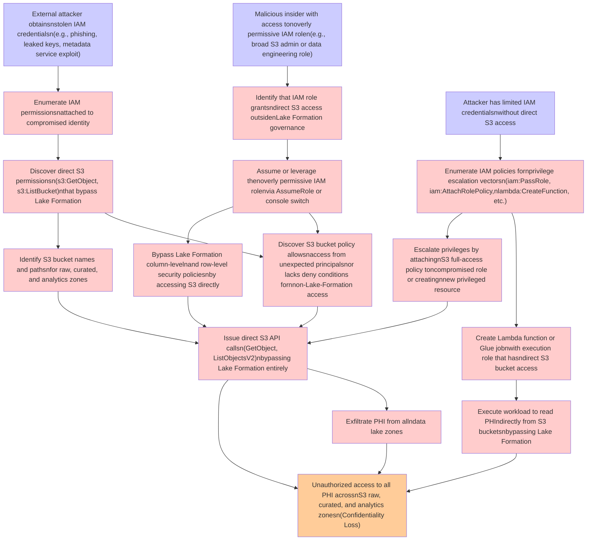

# Attack Tree: Privilege Escalation

**Threat ID**: T004
**Statement**: An external attacker or malicious insider with stolen or overly permissive IAM credentials, can escalate privileges to bypass AWS Lake Formation fine-grained access controls and directly access S3 buckets containing PHI using S3 API calls, which leads to unauthorized access to all data lake zones circumventing column-level and row-level security policies, resulting in reduced confidentiality of Protected Health Information across S3 raw, curated, and analytics zones.

## Attack Tree Diagram

## MITRE ATT&CK Mapping

This attack tree has been mapped to MITRE ATT&CK techniques:

### Escalate privileges by attachingnS3 full-access policy toncompromised role or creatingnnew privileged resource

- **Technique**: [T1548](https://attack.mitre.org/techniques/T1548/) - Abuse Elevation Control Mechanism
- **Tactic**: Privilege Escalation, Defense Evasion
- **Similarity Score**: 82.96%
- **Mitigations (8):**
  - 🛡️ **Execution Prevention**
    Prevent the execution of unauthorized or malicious code on systems by implementing application control, script blocking,...
  - 🛡️ **Operating System Configuration**
    Operating System Configuration involves adjusting system settings and hardening the default configurations of an operati...
  - 🛡️ **Update Software**
    Software updates ensure systems are protected against known vulnerabilities by applying patches and upgrades provided by...
  - *5 more mitigation(s) available*

### Identify that IAM role grantsndirect S3 access outsidenLake Formation governance

- **Technique**: [T1069.003](https://attack.mitre.org/techniques/T1069/003/) - Cloud Groups
- **Tactic**: Discovery
- **Similarity Score**: 74.62%

### Discover direct S3 permissionsn(s3:GetObject, s3:ListBucket)nthat bypass Lake Formation

- **Technique**: [T1619](https://attack.mitre.org/techniques/T1619/) - Cloud Storage Object Discovery
- **Tactic**: Discovery
- **Similarity Score**: 61.18%
- **Mitigations (1):**
  - 🛡️ **User Account Management**
    User Account Management involves implementing and enforcing policies for the lifecycle of user accounts, including creat...

### Exfiltrate PHI from allndata lake zones

- **Technique**: [T1048](https://attack.mitre.org/techniques/T1048/) - Exfiltration Over Alternative Protocol
- **Tactic**: Exfiltration
- **Similarity Score**: 71.86%
- **Mitigations (6):**
  - 🛡️ **Network Segmentation**
    Network segmentation involves dividing a network into smaller, isolated segments to control and limit the flow of traffi...
  - 🛡️ **Data Loss Prevention**
    Data Loss Prevention (DLP) involves implementing strategies and technologies to identify, categorize, monitor, and contr...
  - 🛡️ **Filter Network Traffic**
    Employ network appliances and endpoint software to filter ingress, egress, and lateral network traffic. This includes pr...
  - *3 more mitigation(s) available*

### Execute workload to read PHIndirectly from S3 bucketsnbypassing Lake Formation

- **Technique**: [T1119](https://attack.mitre.org/techniques/T1119/) - Automated Collection
- **Tactic**: Collection
- **Similarity Score**: 65.02%
- **Mitigations (2):**
  - 🛡️ **Remote Data Storage**
    Remote Data Storage focuses on moving critical data, such as security logs and sensitive files, to secure, off-host loca...
  - 🛡️ **Encrypt Sensitive Information**
    Protect sensitive information at rest, in transit, and during processing by using strong encryption algorithms. Encrypti...

### Create Lambda function or Glue jobnwith execution role that hasndirect S3 bucket access

- **Technique**: [T1648](https://attack.mitre.org/techniques/T1648/) - Serverless Execution
- **Tactic**: Execution
- **Similarity Score**: 69.55%
- **Mitigations (2):**
  - 🛡️ **Account Use Policies**
    Account Use Policies help mitigate unauthorized access by configuring and enforcing rules that govern how and when accou...
  - 🛡️ **User Account Management**
    User Account Management involves implementing and enforcing policies for the lifecycle of user accounts, including creat...

### Assume or leverage thenoverly permissive IAM rolenvia AssumeRole or console switch

- **Technique**: [T1088](https://attack.mitre.org/techniques/T1088/) - Bypass User Account Control
- **Tactic**: Defense Evasion, Privilege Escalation
- **Similarity Score**: 72.71%

### Enumerate IAM permissionsnattached to compromised identity

- **Technique**: [T1069.001](https://attack.mitre.org/techniques/T1069/001/) - Local Groups
- **Tactic**: Discovery
- **Similarity Score**: 75.06%

### Bypass Lake Formation column-levelnand row-level security policiesnby accessing S3 directly

- **Technique**: [T1619](https://attack.mitre.org/techniques/T1619/) - Cloud Storage Object Discovery
- **Tactic**: Discovery
- **Similarity Score**: 57.77%
- **Mitigations (1):**
  - 🛡️ **User Account Management**
    User Account Management involves implementing and enforcing policies for the lifecycle of user accounts, including creat...

### External attacker obtainsnstolen IAM credentialsn(e.g., phishing, leaked keys, metadata service exploit)

- **Technique**: [T1556.003](https://attack.mitre.org/techniques/T1556/003/) - Pluggable Authentication Modules
- **Tactic**: Credential Access, Defense Evasion, Persistence
- **Similarity Score**: 79.02%
- **Mitigations (2):**
  - 🛡️ **Multi-factor Authentication**
    Multi-Factor Authentication (MFA) enhances security by requiring users to provide at least two forms of verification to ...
  - 🛡️ **Privileged Account Management**
    Privileged Account Management focuses on implementing policies, controls, and tools to securely manage privileged accoun...

### Malicious insider with access tonoverly permissive IAM rolen(e.g., broad S3 admin or data engineering role)

- **Technique**: [T1548.005](https://attack.mitre.org/techniques/T1548/005/) - Temporary Elevated Cloud Access
- **Tactic**: Privilege Escalation, Defense Evasion
- **Similarity Score**: 91.29%
- **Mitigations (1):**
  - 🛡️ **User Account Management**
    User Account Management involves implementing and enforcing policies for the lifecycle of user accounts, including creat...

### Enumerate IAM policies fornprivilege escalation vectorsn(iam:PassRole, iam:AttachRolePolicy,nlambda:CreateFunction, etc.)

- **Technique**: [T1069.001](https://attack.mitre.org/techniques/T1069/001/) - Local Groups
- **Tactic**: Discovery
- **Similarity Score**: 68.20%

### Discover S3 bucket policy allowsnaccess from unexpected principalsnor lacks deny conditions fornnon-Lake-Formation access

- **Technique**: [T1619](https://attack.mitre.org/techniques/T1619/) - Cloud Storage Object Discovery
- **Tactic**: Discovery
- **Similarity Score**: 57.84%
- **Mitigations (1):**
  - 🛡️ **User Account Management**
    User Account Management involves implementing and enforcing policies for the lifecycle of user accounts, including creat...

### Identify S3 bucket names and pathsnfor raw, curated, and analytics zones

- **Technique**: [T1619](https://attack.mitre.org/techniques/T1619/) - Cloud Storage Object Discovery
- **Tactic**: Discovery
- **Similarity Score**: 72.94%
- **Mitigations (1):**
  - 🛡️ **User Account Management**
    User Account Management involves implementing and enforcing policies for the lifecycle of user accounts, including creat...

### Issue direct S3 API callsn(GetObject, ListObjectsV2)nbypassing Lake Formation entirely

- **Technique**: [T1119](https://attack.mitre.org/techniques/T1119/) - Automated Collection
- **Tactic**: Collection
- **Similarity Score**: 56.74%
- **Mitigations (2):**
  - 🛡️ **Remote Data Storage**
    Remote Data Storage focuses on moving critical data, such as security logs and sensitive files, to secure, off-host loca...
  - 🛡️ **Encrypt Sensitive Information**
    Protect sensitive information at rest, in transit, and during processing by using strong encryption algorithms. Encrypti...

### Unauthorized access to all PHI acrossnS3 raw, curated, and analytics zonesn(Confidentiality Loss)

- **Technique**: [T1530](https://attack.mitre.org/techniques/T1530/) - Data from Cloud Storage
- **Tactic**: Collection
- **Similarity Score**: 61.95%
- **Mitigations (6):**
  - 🛡️ **User Account Management**
    User Account Management involves implementing and enforcing policies for the lifecycle of user accounts, including creat...
  - 🛡️ **Encrypt Sensitive Information**
    Protect sensitive information at rest, in transit, and during processing by using strong encryption algorithms. Encrypti...
  - 🛡️ **Restrict File and Directory Permissions**
    Restricting file and directory permissions involves setting access controls at the file system level to limit which user...
  - *3 more mitigation(s) available*

### Attacker has limited IAM credentialsnwithout direct S3 access

- **Technique**: [T1187](https://attack.mitre.org/techniques/T1187/) - Forced Authentication
- **Tactic**: Credential Access
- **Similarity Score**: 70.87%
- **Mitigations (2):**
  - 🛡️ **Password Policies**
    Set and enforce secure password policies for accounts to reduce the likelihood of unauthorized access. Strong password p...
  - 🛡️ **Filter Network Traffic**
    Employ network appliances and endpoint software to filter ingress, egress, and lateral network traffic. This includes pr...

*Total technique mappings: 17 | Mitigations found: 35*

## Attack Path Analysis

Review this attack tree to:
1. Identify critical attack paths
2. Implement appropriate security controls
3. Monitor for indicators
4. Develop incident response procedures

---
*Generated by ThreatForest*
