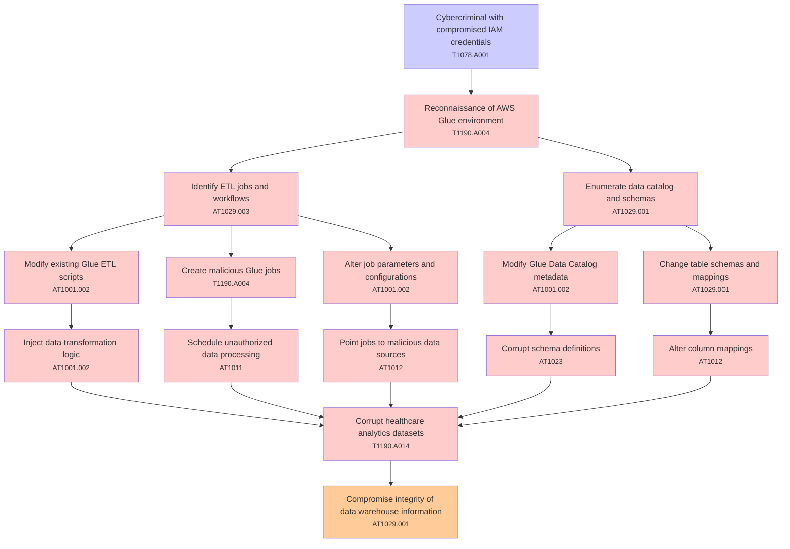

# Attack Tree: Data Integrity

**Threat ID**: T002  
**Associated threat statement**: T002 - Data Integrity

- **Threat Source**: cybercriminal
- **Prerequisites**: compromised IAM credentials
- **Threat Action**: manipulate data processing workflows in AWS Glue
- **Threat Impact**: corruption of healthcare analytics datasets
- **Reduced Goal**: integrity
- **Impacted Assets**: data warehouse information
- **Priority**: High
- **Category**: Data Integrity

---

## Attack Tree Diagram

## Attack Path Analysis

This attack tree represents the potential attack paths for the identified threat. Each node in the tree represents either:
- **Attack Goal** (orange): The ultimate objective
- **Attack Step** (red): Individual attack actions
- **Fact/Condition** (blue): Prerequisites or conditions
- **Mitigation** (green): Defensive measures

Review this attack tree to:
1. Identify critical attack paths
2. Implement appropriate security controls
3. Monitor for indicators of these attack patterns
4. Develop incident response procedures

---
*Generated by ThreatForest - Attack Tree Analysis*

## TTC Technique Mappings

| Attack Step | Technique ID | Technique Name | Confidence | Similarity |
|-------------|--------------|----------------|------------|------------|
| Modify existing Glue ETL scripts... | AT1001.002 | Modify Existing Lambda Function... | 🟡 medium | 0.589 |
| Inject data transformation logic... | AT1001.002 | Modify Existing Lambda Function... | 🔴 low | 0.414 |
| Compromise integrity of data warehouse information... | AT1029.001 | DynamoDB... | 🟡 medium | 0.645 |
| Cybercriminal with compromised IAM credentials... | T1078.A001 | IAM Entities... | 🟢 high | 0.878 |
| Modify Glue Data Catalog metadata... | AT1001.002 | Modify Existing Lambda Function... | 🔴 low | 0.486 |
| Alter job parameters and configurations... | AT1001.002 | Modify Existing Lambda Function... | 🔴 low | 0.476 |
| Alter column mappings... | AT1012 | Region Selection and Hopping... | 🔴 low | 0.484 |
| Corrupt schema definitions... | AT1023 | Cloud Database Discovery... | 🔴 low | 0.493 |
| Change table schemas and mappings... | AT1029.001 | DynamoDB... | 🟡 medium | 0.502 |
| Corrupt healthcare analytics datasets... | T1190.A014 | EMR Cluster... | 🟡 medium | 0.625 |
| Schedule unauthorized data processing... | AT1011 | Operation Rate Control... | 🟡 medium | 0.581 |
| Enumerate data catalog and schemas... | AT1029.001 | DynamoDB... | 🟡 medium | 0.604 |
| Create malicious Glue jobs... | T1190.A004 | S3 Glacier Vault... | 🟡 medium | 0.555 |
| Identify ETL jobs and workflows... | AT1029.003 | Redshift... | 🟡 medium | 0.588 |
| Reconnaissance of AWS Glue environment... | T1190.A004 | S3 Glacier Vault... | 🟢 high | 0.703 |
| Point jobs to malicious data sources... | AT1012 | Region Selection and Hopping... | 🟡 medium | 0.595 |
