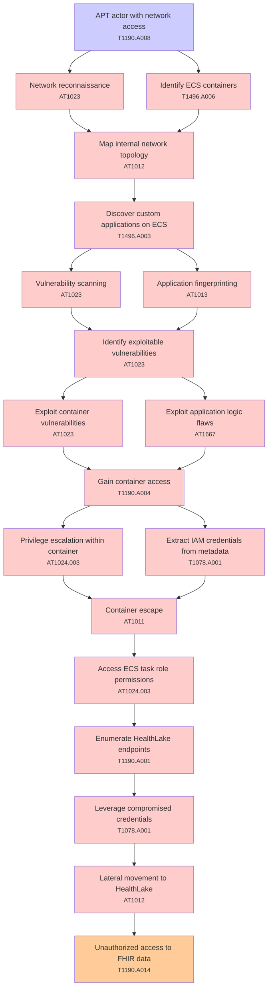

# Attack Tree: Lateral Movement

**Threat ID**: T003  
**Associated threat statement**: T003 - Lateral Movement

- **Threat Source**: advanced persistent threat actor
- **Prerequisites**: network access
- **Threat Action**: exploit vulnerabilities in custom applications running on Amazon ECS
- **Threat Impact**: lateral movement within the analytics platform
- **Reduced Goal**: confidentiality
- **Impacted Assets**: FHIR data in Amazon HealthLake
- **Priority**: High
- **Category**: Lateral Movement

---

## Attack Tree Diagram

## Attack Path Analysis

This attack tree represents the potential attack paths for the identified threat. Each node in the tree represents either:
- **Attack Goal** (orange): The ultimate objective
- **Attack Step** (red): Individual attack actions
- **Fact/Condition** (blue): Prerequisites or conditions
- **Mitigation** (green): Defensive measures

Review this attack tree to:
1. Identify critical attack paths
2. Implement appropriate security controls
3. Monitor for indicators of these attack patterns
4. Develop incident response procedures

---
*Generated by ThreatForest - Attack Tree Analysis*

## TTC Technique Mappings

| Attack Step | Technique ID | Technique Name | Confidence | Similarity |
|-------------|--------------|----------------|------------|------------|
| Vulnerability scanning... | AT1023 | Cloud Database Discovery... | 🟡 medium | 0.666 |
| Identify exploitable vulnerabilities... | AT1023 | Cloud Database Discovery... | 🟡 medium | 0.690 |
| Discover custom applications on ECS... | T1496.A003 | Compute Hijacking - EC2 Use... | 🟡 medium | 0.689 |
| Access ECS task role permissions... | AT1024.003 | IAM Role Hopping... | 🟡 medium | 0.668 |
| Container escape... | AT1011 | Operation Rate Control... | 🟡 medium | 0.560 |
| Extract IAM credentials from metadata... | T1078.A001 | IAM Entities... | 🟢 high | 0.789 |
| Exploit container vulnerabilities... | AT1023 | Cloud Database Discovery... | 🟡 medium | 0.651 |
| Lateral movement to HealthLake... | AT1012 | Region Selection and Hopping... | 🟡 medium | 0.605 |
| APT actor with network access... | T1190.A008 | CloudWatch Event Bus... | 🟡 medium | 0.541 |
| Gain container access... | T1190.A004 | S3 Glacier Vault... | 🟡 medium | 0.580 |
| Application fingerprinting... | AT1013 | User Agent Spoofing and Randomization... | 🟡 medium | 0.677 |
| Network reconnaissance... | AT1023 | Cloud Database Discovery... | 🟡 medium | 0.679 |
| Privilege escalation within container... | AT1024.003 | IAM Role Hopping... | 🟡 medium | 0.627 |
| Enumerate HealthLake endpoints... | T1190.A001 | Amazon Elasticsearch Service... | 🟡 medium | 0.507 |
| Unauthorized access to FHIR data... | T1190.A014 | EMR Cluster... | 🟡 medium | 0.656 |
| Map internal network topology... | AT1012 | Region Selection and Hopping... | 🟡 medium | 0.516 |
| Leverage compromised credentials... | T1078.A001 | IAM Entities... | 🟡 medium | 0.697 |
| Identify ECS containers... | T1496.A006 | Compute Hijacking - ECS... | 🟢 high | 0.716 |
| Exploit application logic flaws... | AT1667 | Application API Abuse... | 🟡 medium | 0.661 |
