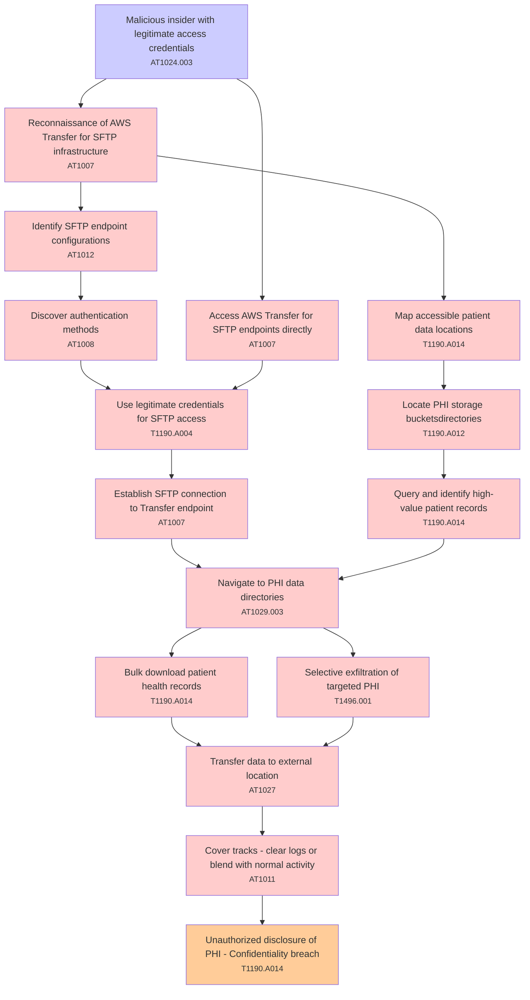

# Attack Tree: Data Breach

**Threat ID**: T001  
**Associated threat statement**: T001 - Data Breach

- **Threat Source**: malicious insider
- **Prerequisites**: legitimate access credentials
- **Threat Action**: exfiltrate sensitive patient data through AWS Transfer for SFTP endpoints
- **Threat Impact**: unauthorized disclosure of PHI
- **Reduced Goal**: confidentiality
- **Impacted Assets**: patient health records
- **Priority**: High
- **Category**: Data Breach

---

## Attack Tree Diagram

## Attack Path Analysis

This attack tree represents the potential attack paths for the identified threat. Each node in the tree represents either:
- **Attack Goal** (orange): The ultimate objective
- **Attack Step** (red): Individual attack actions
- **Fact/Condition** (blue): Prerequisites or conditions
- **Mitigation** (green): Defensive measures

Review this attack tree to:
1. Identify critical attack paths
2. Implement appropriate security controls
3. Monitor for indicators of these attack patterns
4. Develop incident response procedures

---
*Generated by ThreatForest - Attack Tree Analysis*

## TTC Technique Mappings

| Attack Step | Technique ID | Technique Name | Confidence | Similarity |
|-------------|--------------|----------------|------------|------------|
| Navigate to PHI data directories... | AT1029.003 | Redshift... | 🔴 low | 0.492 |
| Establish SFTP connection to Transfer endpoint... | AT1007 | Create or Modify AWS Service... | 🔴 low | 0.461 |
| Bulk download patient health records... | T1190.A014 | EMR Cluster... | 🟡 medium | 0.559 |
| Unauthorized disclosure of PHI - Confidentiality b... | T1190.A014 | EMR Cluster... | 🟡 medium | 0.629 |
| Discover authentication methods... | AT1008 | Golden SAML... | 🟡 medium | 0.577 |
| Cover tracks - clear logs or blend with normal act... | AT1011 | Operation Rate Control... | 🟡 medium | 0.565 |
| Use legitimate credentials for SFTP access... | T1190.A004 | S3 Glacier Vault... | 🟡 medium | 0.576 |
| Transfer data to external location... | AT1027 | Transfer Data out of Cloud Account... | 🟡 medium | 0.625 |
| Query and identify high-value patient records... | T1190.A014 | EMR Cluster... | 🟡 medium | 0.603 |
| Identify SFTP endpoint configurations... | AT1012 | Region Selection and Hopping... | 🟡 medium | 0.518 |
| Locate PHI storage bucketsdirectories... | T1190.A012 | S3 Bucket... | 🟡 medium | 0.641 |
| Access AWS Transfer for SFTP endpoints directly... | AT1007 | Create or Modify AWS Service... | 🟡 medium | 0.688 |
| Malicious insider with legitimate access credentia... | AT1024.003 | IAM Role Hopping... | 🟡 medium | 0.632 |
| Selective exfiltration of targeted PHI... | T1496.001 | Compute Hijacking... | 🟡 medium | 0.630 |
| Reconnaissance of AWS Transfer for SFTP infrastruc... | AT1007 | Create or Modify AWS Service... | 🟡 medium | 0.699 |
| Map accessible patient data locations... | T1190.A014 | EMR Cluster... | 🟡 medium | 0.600 |
