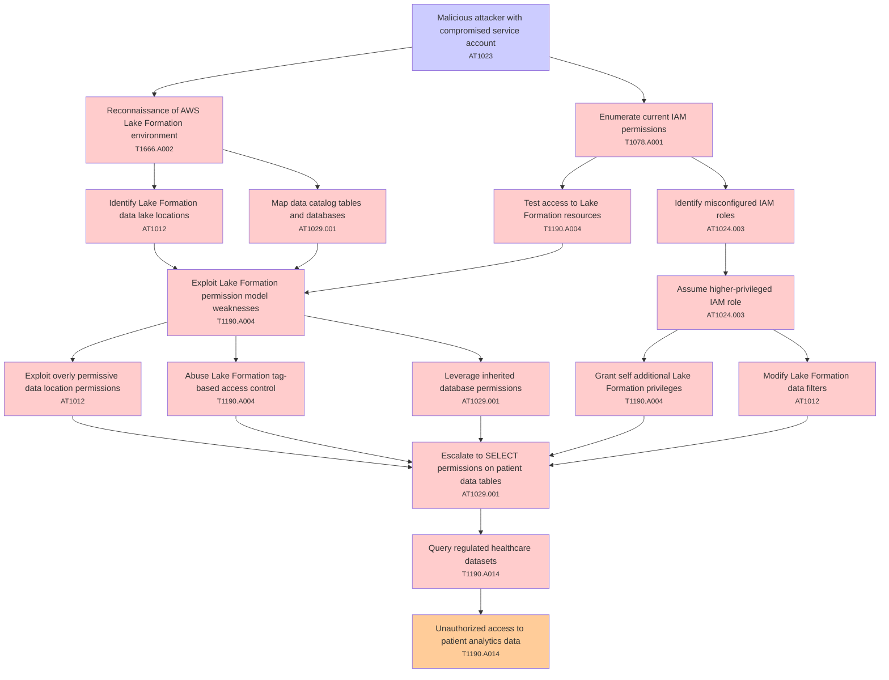

# Attack Tree: Privilege Escalation

**Threat ID**: T004  
**Associated threat statement**: T004 - Privilege Escalation

- **Threat Source**: malicious attacker
- **Prerequisites**: compromised service account
- **Threat Action**: perform privilege escalation attacks against AWS Lake Formation permissions
- **Threat Impact**: unauthorized access to regulated healthcare datasets
- **Reduced Goal**: confidentiality
- **Impacted Assets**: patient analytics data
- **Priority**: High
- **Category**: Privilege Escalation

---

## Attack Tree Diagram

## Attack Path Analysis

This attack tree represents the potential attack paths for the identified threat. Each node in the tree represents either:
- **Attack Goal** (orange): The ultimate objective
- **Attack Step** (red): Individual attack actions
- **Fact/Condition** (blue): Prerequisites or conditions
- **Mitigation** (green): Defensive measures

Review this attack tree to:
1. Identify critical attack paths
2. Implement appropriate security controls
3. Monitor for indicators of these attack patterns
4. Develop incident response procedures

---
*Generated by ThreatForest - Attack Tree Analysis*

## TTC Technique Mappings

| Attack Step | Technique ID | Technique Name | Confidence | Similarity |
|-------------|--------------|----------------|------------|------------|
| Identify misconfigured IAM roles... | AT1024.003 | IAM Role Hopping... | 🟢 high | 0.879 |
| Reconnaissance of AWS Lake Formation environment... | T1666.A002 | Leave AWS Organization... | 🟢 high | 0.763 |
| Identify Lake Formation data lake locations... | AT1012 | Region Selection and Hopping... | 🟡 medium | 0.586 |
| Leverage inherited database permissions... | AT1029.001 | DynamoDB... | 🟡 medium | 0.554 |
| Exploit Lake Formation permission model weaknesses... | T1190.A004 | S3 Glacier Vault... | 🟡 medium | 0.630 |
| Map data catalog tables and databases... | AT1029.001 | DynamoDB... | 🟡 medium | 0.644 |
| Malicious attacker with compromised service accoun... | AT1023 | Cloud Database Discovery... | 🟡 medium | 0.680 |
| Assume higher-privileged IAM role... | AT1024.003 | IAM Role Hopping... | 🟢 high | 0.856 |
| Exploit overly permissive data location permission... | AT1012 | Region Selection and Hopping... | 🟡 medium | 0.553 |
| Grant self additional Lake Formation privileges... | T1190.A004 | S3 Glacier Vault... | 🟡 medium | 0.574 |
| Abuse Lake Formation tag-based access control... | T1190.A004 | S3 Glacier Vault... | 🟡 medium | 0.649 |
| Escalate to SELECT permissions on patient data tab... | AT1029.001 | DynamoDB... | 🟡 medium | 0.515 |
| Query regulated healthcare datasets... | T1190.A014 | EMR Cluster... | 🟡 medium | 0.644 |
| Modify Lake Formation data filters... | AT1012 | Region Selection and Hopping... | 🟡 medium | 0.535 |
| Unauthorized access to patient analytics data... | T1190.A014 | EMR Cluster... | 🟡 medium | 0.673 |
| Test access to Lake Formation resources... | T1190.A004 | S3 Glacier Vault... | 🟡 medium | 0.572 |
| Enumerate current IAM permissions... | T1078.A001 | IAM Entities... | 🟢 high | 0.709 |
