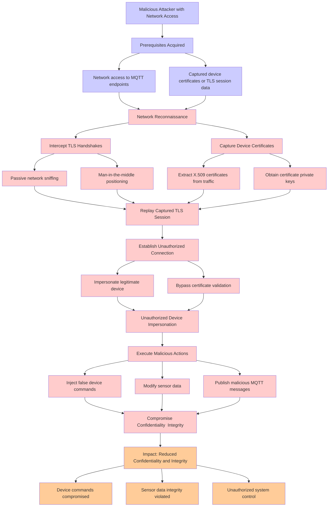

# Attack Tree: Authentication & Certificate Abuse

**Threat ID**: T001
**Statement**: A malicious attacker with network access to MQTT endpoints, can intercept and replay captured TLS handshakes and device certificates, which leads to unauthorized device impersonation, resulting in reduced confidentiality and integrity of device commands and sensor data.

## Attack Tree Diagram

## MITRE ATT&CK Mapping

This attack tree has been mapped to MITRE ATT&CK techniques:

### Network access to MQTT endpoints

- **Technique**: [T1071.005](https://attack.mitre.org/techniques/T1071/005/) - Publish/Subscribe Protocols
- **Tactic**: Command And Control
- **Similarity Score**: 60.97%
- **Mitigations (2):**
  - 🛡️ **Filter Network Traffic**
    Employ network appliances and endpoint software to filter ingress, egress, and lateral network traffic. This includes pr...
  - 🛡️ **Network Intrusion Prevention**
    Use intrusion detection signatures to block traffic at network boundaries.

### Extract X.509 certificates from traffic

- **Technique**: [T1608.003](https://attack.mitre.org/techniques/T1608/003/) - Install Digital Certificate
- **Tactic**: Resource Development
- **Similarity Score**: 62.61%
- **Mitigations (1):**
  - 🛡️ **Pre-compromise**
    Pre-compromise mitigations involve proactive measures and defenses implemented to prevent adversaries from successfully ...

### Publish malicious MQTT messages

- **Technique**: [T1071.005](https://attack.mitre.org/techniques/T1071/005/) - Publish/Subscribe Protocols
- **Tactic**: Command And Control
- **Similarity Score**: 75.13%
- **Mitigations (2):**
  - 🛡️ **Filter Network Traffic**
    Employ network appliances and endpoint software to filter ingress, egress, and lateral network traffic. This includes pr...
  - 🛡️ **Network Intrusion Prevention**
    Use intrusion detection signatures to block traffic at network boundaries.

### Inject false device commands

- **Technique**: [T1546.017](https://attack.mitre.org/techniques/T1546/017/) - Udev Rules
- **Tactic**: Persistence, Privilege Escalation
- **Similarity Score**: 67.14%

### Obtain certificate private keys

- **Technique**: [T1649](https://attack.mitre.org/techniques/T1649/) - Steal or Forge Authentication Certificates
- **Tactic**: Credential Access
- **Similarity Score**: 69.40%
- **Mitigations (4):**
  - 🛡️ **Active Directory Configuration**
    Implement robust Active Directory (AD) configurations using group policies to secure user accounts, control access, and ...
  - 🛡️ **Disable or Remove Feature or Program**
    Disable or remove unnecessary and potentially vulnerable software, features, or services to reduce the attack surface an...
  - 🛡️ **Encrypt Sensitive Information**
    Protect sensitive information at rest, in transit, and during processing by using strong encryption algorithms. Encrypti...
  - *1 more mitigation(s) available*

### Capture Device Certificates

- **Technique**: [T1552.004](https://attack.mitre.org/techniques/T1552/004/) - Private Keys
- **Tactic**: Credential Access
- **Similarity Score**: 55.20%
- **Mitigations (4):**
  - 🛡️ **Password Policies**
    Set and enforce secure password policies for accounts to reduce the likelihood of unauthorized access. Strong password p...
  - 🛡️ **Restrict File and Directory Permissions**
    Restricting file and directory permissions involves setting access controls at the file system level to limit which user...
  - 🛡️ **Audit**
    Auditing is the process of recording activity and systematically reviewing and analyzing the activity and system configu...
  - *1 more mitigation(s) available*

### Man-in-the-middle positioning

- **Technique**: [T1614](https://attack.mitre.org/techniques/T1614/) - System Location Discovery
- **Tactic**: Discovery
- **Similarity Score**: 40.16%

### Unauthorized Device Impersonation

- **Technique**: [T1091](https://attack.mitre.org/techniques/T1091/) - Replication Through Removable Media
- **Tactic**: Lateral Movement, Initial Access
- **Similarity Score**: 64.48%
- **Mitigations (3):**
  - 🛡️ **Disable or Remove Feature or Program**
    Disable or remove unnecessary and potentially vulnerable software, features, or services to reduce the attack surface an...
  - 🛡️ **Limit Hardware Installation**
    Prevent unauthorized users or groups from installing or using hardware, such as external drives, peripheral devices, or ...
  - 🛡️ **Behavior Prevention on Endpoint**
    Behavior Prevention on Endpoint refers to the use of technologies and strategies to detect and block potentially malicio...

### Replay Captured TLS Session

- **Technique**: [T1572](https://attack.mitre.org/techniques/T1572/) - Protocol Tunneling
- **Tactic**: Command And Control
- **Similarity Score**: 51.41%
- **Mitigations (2):**
  - 🛡️ **Filter Network Traffic**
    Employ network appliances and endpoint software to filter ingress, egress, and lateral network traffic. This includes pr...
  - 🛡️ **Network Intrusion Prevention**
    Use intrusion detection signatures to block traffic at network boundaries.

### Prerequisites Acquired

- **Technique**: [T1588](https://attack.mitre.org/techniques/T1588/) - Obtain Capabilities
- **Tactic**: Resource Development
- **Similarity Score**: 47.93%
- **Mitigations (1):**
  - 🛡️ **Pre-compromise**
    Pre-compromise mitigations involve proactive measures and defenses implemented to prevent adversaries from successfully ...

### Sensor data integrity violated

- **Technique**: [T1562.006](https://attack.mitre.org/techniques/T1562/006/) - Indicator Blocking
- **Tactic**: Defense Evasion
- **Similarity Score**: 51.07%
- **Mitigations (3):**
  - 🛡️ **Restrict File and Directory Permissions**
    Restricting file and directory permissions involves setting access controls at the file system level to limit which user...
  - 🛡️ **Software Configuration**
    Software configuration refers to making security-focused adjustments to the settings of applications, middleware, databa...
  - 🛡️ **User Account Management**
    User Account Management involves implementing and enforcing policies for the lifecycle of user accounts, including creat...

### Execute Malicious Actions

- **Technique**: [T1064](https://attack.mitre.org/techniques/T1064/) - Scripting
- **Tactic**: Defense Evasion, Execution
- **Similarity Score**: 69.79%

### Passive network sniffing

- **Technique**: [T1040](https://attack.mitre.org/techniques/T1040/) - Network Sniffing
- **Tactic**: Credential Access, Discovery
- **Similarity Score**: 79.93%
- **Mitigations (4):**
  - 🛡️ **User Account Management**
    User Account Management involves implementing and enforcing policies for the lifecycle of user accounts, including creat...
  - 🛡️ **Multi-factor Authentication**
    Multi-Factor Authentication (MFA) enhances security by requiring users to provide at least two forms of verification to ...
  - 🛡️ **Encrypt Sensitive Information**
    Protect sensitive information at rest, in transit, and during processing by using strong encryption algorithms. Encrypti...
  - *1 more mitigation(s) available*

### Impersonate legitimate device

- **Technique**: [T1091](https://attack.mitre.org/techniques/T1091/) - Replication Through Removable Media
- **Tactic**: Lateral Movement, Initial Access
- **Similarity Score**: 60.56%
- **Mitigations (3):**
  - 🛡️ **Disable or Remove Feature or Program**
    Disable or remove unnecessary and potentially vulnerable software, features, or services to reduce the attack surface an...
  - 🛡️ **Limit Hardware Installation**
    Prevent unauthorized users or groups from installing or using hardware, such as external drives, peripheral devices, or ...
  - 🛡️ **Behavior Prevention on Endpoint**
    Behavior Prevention on Endpoint refers to the use of technologies and strategies to detect and block potentially malicio...

### Network Reconnaissance

- **Technique**: [T1595.001](https://attack.mitre.org/techniques/T1595/001/) - Scanning IP Blocks
- **Tactic**: Reconnaissance
- **Similarity Score**: 70.93%
- **Mitigations (1):**
  - 🛡️ **Pre-compromise**
    Pre-compromise mitigations involve proactive measures and defenses implemented to prevent adversaries from successfully ...

### Device commands compromised

- **Technique**: [T1059.008](https://attack.mitre.org/techniques/T1059/008/) - Network Device CLI
- **Tactic**: Execution
- **Similarity Score**: 69.34%
- **Mitigations (3):**
  - 🛡️ **Execution Prevention**
    Prevent the execution of unauthorized or malicious code on systems by implementing application control, script blocking,...
  - 🛡️ **Privileged Account Management**
    Privileged Account Management focuses on implementing policies, controls, and tools to securely manage privileged accoun...
  - 🛡️ **User Account Management**
    User Account Management involves implementing and enforcing policies for the lifecycle of user accounts, including creat...

### Captured device certificates or TLS session data

- **Technique**: [T1552.004](https://attack.mitre.org/techniques/T1552/004/) - Private Keys
- **Tactic**: Credential Access
- **Similarity Score**: 51.34%
- **Mitigations (4):**
  - 🛡️ **Password Policies**
    Set and enforce secure password policies for accounts to reduce the likelihood of unauthorized access. Strong password p...
  - 🛡️ **Restrict File and Directory Permissions**
    Restricting file and directory permissions involves setting access controls at the file system level to limit which user...
  - 🛡️ **Audit**
    Auditing is the process of recording activity and systematically reviewing and analyzing the activity and system configu...
  - *1 more mitigation(s) available*

### Bypass certificate validation

- **Technique**: [T1587.002](https://attack.mitre.org/techniques/T1587/002/) - Code Signing Certificates
- **Tactic**: Resource Development
- **Similarity Score**: 71.22%
- **Mitigations (1):**
  - 🛡️ **Pre-compromise**
    Pre-compromise mitigations involve proactive measures and defenses implemented to prevent adversaries from successfully ...

### Malicious Attacker with Network Access

- **Technique**: [T1108](https://attack.mitre.org/techniques/T1108/) - Redundant Access
- **Tactic**: Defense Evasion, Persistence
- **Similarity Score**: 63.94%

### Establish Unauthorized Connection

- **Technique**: [T1133](https://attack.mitre.org/techniques/T1133/) - External Remote Services
- **Tactic**: Persistence, Initial Access
- **Similarity Score**: 54.60%
- **Mitigations (5):**
  - 🛡️ **Restrict Web-Based Content**
    Restricting web-based content involves enforcing policies and technologies that limit access to potentially malicious we...
  - 🛡️ **Network Segmentation**
    Network segmentation involves dividing a network into smaller, isolated segments to control and limit the flow of traffi...
  - 🛡️ **Disable or Remove Feature or Program**
    Disable or remove unnecessary and potentially vulnerable software, features, or services to reduce the attack surface an...
  - *2 more mitigation(s) available*

### Compromise Confidentiality  Integrity

- **Technique**: [T1565.002](https://attack.mitre.org/techniques/T1565/002/) - Transmitted Data Manipulation
- **Tactic**: Impact
- **Similarity Score**: 60.99%
- **Mitigations (1):**
  - 🛡️ **Encrypt Sensitive Information**
    Protect sensitive information at rest, in transit, and during processing by using strong encryption algorithms. Encrypti...

### Impact: Reduced Confidentiality and Integrity

- **Technique**: [T1565.002](https://attack.mitre.org/techniques/T1565/002/) - Transmitted Data Manipulation
- **Tactic**: Impact
- **Similarity Score**: 66.85%
- **Mitigations (1):**
  - 🛡️ **Encrypt Sensitive Information**
    Protect sensitive information at rest, in transit, and during processing by using strong encryption algorithms. Encrypti...

### Intercept TLS Handshakes

- **Technique**: [T1001.003](https://attack.mitre.org/techniques/T1001/003/) - Protocol or Service Impersonation
- **Tactic**: Command And Control
- **Similarity Score**: 75.56%
- **Mitigations (1):**
  - 🛡️ **Network Intrusion Prevention**
    Use intrusion detection signatures to block traffic at network boundaries.

### Unauthorized system control

- **Technique**: [T1177](https://attack.mitre.org/techniques/T1177/) - LSASS Driver
- **Tactic**: Execution, Persistence
- **Similarity Score**: 60.21%

### Modify sensor data

- **Technique**: [T1562.006](https://attack.mitre.org/techniques/T1562/006/) - Indicator Blocking
- **Tactic**: Defense Evasion
- **Similarity Score**: 54.18%
- **Mitigations (3):**
  - 🛡️ **Restrict File and Directory Permissions**
    Restricting file and directory permissions involves setting access controls at the file system level to limit which user...
  - 🛡️ **Software Configuration**
    Software configuration refers to making security-focused adjustments to the settings of applications, middleware, databa...
  - 🛡️ **User Account Management**
    User Account Management involves implementing and enforcing policies for the lifecycle of user accounts, including creat...

*Total technique mappings: 25 | Mitigations found: 49*

## Attack Path Analysis

Review this attack tree to:
1. Identify critical attack paths
2. Implement appropriate security controls
3. Monitor for indicators
4. Develop incident response procedures

---
*Generated by ThreatForest*
