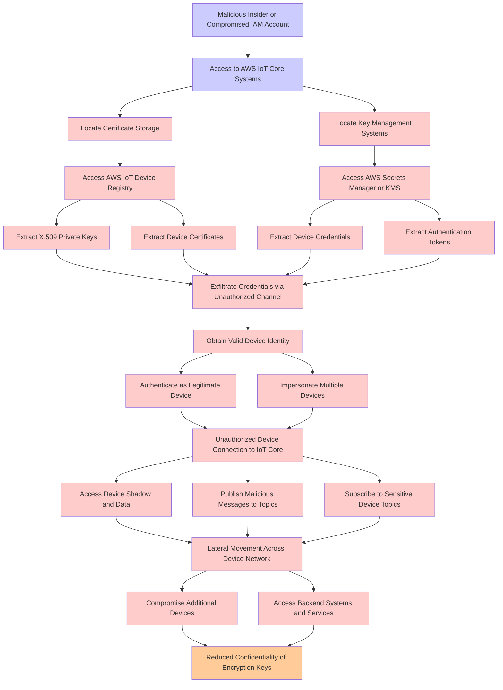

# Attack Tree: Credential Theft & Insider Threat

**Threat ID**: T002
**Statement**: A malicious insider with access to AWS IoT Core or certificate management systems, can extract and exfiltrate X.509 private keys and device credentials, which leads to unauthorized device authentication and lateral movement, resulting in reduced confidentiality of encryption keys and device authentication tokens.

## Attack Tree Diagram

## MITRE ATT&CK Mapping

This attack tree has been mapped to MITRE ATT&CK techniques:

### Extract Authentication Tokens

- **Technique**: [T1550](https://attack.mitre.org/techniques/T1550/) - Use Alternate Authentication Material
- **Tactic**: Defense Evasion, Lateral Movement
- **Similarity Score**: 63.08%
- **Mitigations (7):**
  - 🛡️ **Audit**
    Auditing is the process of recording activity and systematically reviewing and analyzing the activity and system configu...
  - 🛡️ **Password Policies**
    Set and enforce secure password policies for accounts to reduce the likelihood of unauthorized access. Strong password p...
  - 🛡️ **Account Use Policies**
    Account Use Policies help mitigate unauthorized access by configuring and enforcing rules that govern how and when accou...
  - *4 more mitigation(s) available*

### Malicious Insider or Compromised IAM Account

- **Technique**: [T1136](https://attack.mitre.org/techniques/T1136/) - Create Account
- **Tactic**: Persistence
- **Similarity Score**: 82.75%
- **Mitigations (4):**
  - 🛡️ **Network Segmentation**
    Network segmentation involves dividing a network into smaller, isolated segments to control and limit the flow of traffi...
  - 🛡️ **Operating System Configuration**
    Operating System Configuration involves adjusting system settings and hardening the default configurations of an operati...
  - 🛡️ **Multi-factor Authentication**
    Multi-Factor Authentication (MFA) enhances security by requiring users to provide at least two forms of verification to ...
  - *1 more mitigation(s) available*

### Extract Device Certificates

- **Technique**: [T1552.004](https://attack.mitre.org/techniques/T1552/004/) - Private Keys
- **Tactic**: Credential Access
- **Similarity Score**: 59.35%
- **Mitigations (4):**
  - 🛡️ **Password Policies**
    Set and enforce secure password policies for accounts to reduce the likelihood of unauthorized access. Strong password p...
  - 🛡️ **Restrict File and Directory Permissions**
    Restricting file and directory permissions involves setting access controls at the file system level to limit which user...
  - 🛡️ **Audit**
    Auditing is the process of recording activity and systematically reviewing and analyzing the activity and system configu...
  - *1 more mitigation(s) available*

### Authenticate as Legitimate Device

- **Technique**: [T1556.004](https://attack.mitre.org/techniques/T1556/004/) - Network Device Authentication
- **Tactic**: Credential Access, Defense Evasion, Persistence
- **Similarity Score**: 68.33%
- **Mitigations (2):**
  - 🛡️ **Privileged Account Management**
    Privileged Account Management focuses on implementing policies, controls, and tools to securely manage privileged accoun...
  - 🛡️ **Multi-factor Authentication**
    Multi-Factor Authentication (MFA) enhances security by requiring users to provide at least two forms of verification to ...

### Unauthorized Device Connection to IoT Core

- **Technique**: [T1059.008](https://attack.mitre.org/techniques/T1059/008/) - Network Device CLI
- **Tactic**: Execution
- **Similarity Score**: 55.46%
- **Mitigations (3):**
  - 🛡️ **Execution Prevention**
    Prevent the execution of unauthorized or malicious code on systems by implementing application control, script blocking,...
  - 🛡️ **Privileged Account Management**
    Privileged Account Management focuses on implementing policies, controls, and tools to securely manage privileged accoun...
  - 🛡️ **User Account Management**
    User Account Management involves implementing and enforcing policies for the lifecycle of user accounts, including creat...

### Locate Key Management Systems

- **Technique**: [T1145](https://attack.mitre.org/techniques/T1145/) - Private Keys
- **Tactic**: Credential Access
- **Similarity Score**: 73.68%

### Access AWS IoT Device Registry

- **Technique**: [T1059.008](https://attack.mitre.org/techniques/T1059/008/) - Network Device CLI
- **Tactic**: Execution
- **Similarity Score**: 61.20%
- **Mitigations (3):**
  - 🛡️ **Execution Prevention**
    Prevent the execution of unauthorized or malicious code on systems by implementing application control, script blocking,...
  - 🛡️ **Privileged Account Management**
    Privileged Account Management focuses on implementing policies, controls, and tools to securely manage privileged accoun...
  - 🛡️ **User Account Management**
    User Account Management involves implementing and enforcing policies for the lifecycle of user accounts, including creat...

### Compromise Additional Devices

- **Technique**: [T1091](https://attack.mitre.org/techniques/T1091/) - Replication Through Removable Media
- **Tactic**: Lateral Movement, Initial Access
- **Similarity Score**: 67.31%
- **Mitigations (3):**
  - 🛡️ **Disable or Remove Feature or Program**
    Disable or remove unnecessary and potentially vulnerable software, features, or services to reduce the attack surface an...
  - 🛡️ **Limit Hardware Installation**
    Prevent unauthorized users or groups from installing or using hardware, such as external drives, peripheral devices, or ...
  - 🛡️ **Behavior Prevention on Endpoint**
    Behavior Prevention on Endpoint refers to the use of technologies and strategies to detect and block potentially malicio...

### Impersonate Multiple Devices

- **Technique**: [T1091](https://attack.mitre.org/techniques/T1091/) - Replication Through Removable Media
- **Tactic**: Lateral Movement, Initial Access
- **Similarity Score**: 64.58%
- **Mitigations (3):**
  - 🛡️ **Disable or Remove Feature or Program**
    Disable or remove unnecessary and potentially vulnerable software, features, or services to reduce the attack surface an...
  - 🛡️ **Limit Hardware Installation**
    Prevent unauthorized users or groups from installing or using hardware, such as external drives, peripheral devices, or ...
  - 🛡️ **Behavior Prevention on Endpoint**
    Behavior Prevention on Endpoint refers to the use of technologies and strategies to detect and block potentially malicio...

### Locate Certificate Storage

- **Technique**: [T1649](https://attack.mitre.org/techniques/T1649/) - Steal or Forge Authentication Certificates
- **Tactic**: Credential Access
- **Similarity Score**: 65.69%
- **Mitigations (4):**
  - 🛡️ **Active Directory Configuration**
    Implement robust Active Directory (AD) configurations using group policies to secure user accounts, control access, and ...
  - 🛡️ **Disable or Remove Feature or Program**
    Disable or remove unnecessary and potentially vulnerable software, features, or services to reduce the attack surface an...
  - 🛡️ **Encrypt Sensitive Information**
    Protect sensitive information at rest, in transit, and during processing by using strong encryption algorithms. Encrypti...
  - *1 more mitigation(s) available*

### Publish Malicious Messages to Topics

- **Technique**: [T1667](https://attack.mitre.org/techniques/T1667/) - Email Bombing
- **Tactic**: Impact
- **Similarity Score**: 59.91%
- **Mitigations (2):**
  - 🛡️ **User Training**
    User Training involves educating employees and contractors on recognizing, reporting, and preventing cyber threats that ...
  - 🛡️ **Software Configuration**
    Software configuration refers to making security-focused adjustments to the settings of applications, middleware, databa...

### Access to AWS IoT Core Systems

- **Technique**: [T1021.008](https://attack.mitre.org/techniques/T1021/008/) - Direct Cloud VM Connections
- **Tactic**: Lateral Movement
- **Similarity Score**: 62.21%
- **Mitigations (2):**
  - 🛡️ **User Account Management**
    User Account Management involves implementing and enforcing policies for the lifecycle of user accounts, including creat...
  - 🛡️ **Disable or Remove Feature or Program**
    Disable or remove unnecessary and potentially vulnerable software, features, or services to reduce the attack surface an...

### Subscribe to Sensitive Device Topics

- **Technique**: [T1120](https://attack.mitre.org/techniques/T1120/) - Peripheral Device Discovery
- **Tactic**: Discovery
- **Similarity Score**: 54.98%

### Access Device Shadow and Data

- **Technique**: [T1025](https://attack.mitre.org/techniques/T1025/) - Data from Removable Media
- **Tactic**: Collection
- **Similarity Score**: 60.50%
- **Mitigations (1):**
  - 🛡️ **Data Loss Prevention**
    Data Loss Prevention (DLP) involves implementing strategies and technologies to identify, categorize, monitor, and contr...

### Access Backend Systems and Services

- **Technique**: [T1569](https://attack.mitre.org/techniques/T1569/) - System Services
- **Tactic**: Execution
- **Similarity Score**: 63.19%
- **Mitigations (4):**
  - 🛡️ **Privileged Account Management**
    Privileged Account Management focuses on implementing policies, controls, and tools to securely manage privileged accoun...
  - 🛡️ **User Account Management**
    User Account Management involves implementing and enforcing policies for the lifecycle of user accounts, including creat...
  - 🛡️ **Behavior Prevention on Endpoint**
    Behavior Prevention on Endpoint refers to the use of technologies and strategies to detect and block potentially malicio...
  - *1 more mitigation(s) available*

### Extract X.509 Private Keys

- **Technique**: [T1145](https://attack.mitre.org/techniques/T1145/) - Private Keys
- **Tactic**: Credential Access
- **Similarity Score**: 80.58%

### Extract Device Credentials

- **Technique**: [T1003](https://attack.mitre.org/techniques/T1003/) - OS Credential Dumping
- **Tactic**: Credential Access
- **Similarity Score**: 70.78%
- **Mitigations (9):**
  - 🛡️ **Encrypt Sensitive Information**
    Protect sensitive information at rest, in transit, and during processing by using strong encryption algorithms. Encrypti...
  - 🛡️ **Behavior Prevention on Endpoint**
    Behavior Prevention on Endpoint refers to the use of technologies and strategies to detect and block potentially malicio...
  - 🛡️ **Password Policies**
    Set and enforce secure password policies for accounts to reduce the likelihood of unauthorized access. Strong password p...
  - *6 more mitigation(s) available*

### Obtain Valid Device Identity

- **Technique**: [T1098.005](https://attack.mitre.org/techniques/T1098/005/) - Device Registration
- **Tactic**: Persistence, Privilege Escalation
- **Similarity Score**: 59.97%
- **Mitigations (1):**
  - 🛡️ **Multi-factor Authentication**
    Multi-Factor Authentication (MFA) enhances security by requiring users to provide at least two forms of verification to ...

### Exfiltrate Credentials via Unauthorized Channel

- **Technique**: [T1552.001](https://attack.mitre.org/techniques/T1552/001/) - Credentials In Files
- **Tactic**: Credential Access
- **Similarity Score**: 71.87%
- **Mitigations (4):**
  - 🛡️ **User Training**
    User Training involves educating employees and contractors on recognizing, reporting, and preventing cyber threats that ...
  - 🛡️ **Audit**
    Auditing is the process of recording activity and systematically reviewing and analyzing the activity and system configu...
  - 🛡️ **Restrict File and Directory Permissions**
    Restricting file and directory permissions involves setting access controls at the file system level to limit which user...
  - *1 more mitigation(s) available*

### Lateral Movement Across Device Network

- **Technique**: [T1092](https://attack.mitre.org/techniques/T1092/) - Communication Through Removable Media
- **Tactic**: Command And Control
- **Similarity Score**: 73.10%
- **Mitigations (2):**
  - 🛡️ **Disable or Remove Feature or Program**
    Disable or remove unnecessary and potentially vulnerable software, features, or services to reduce the attack surface an...
  - 🛡️ **Operating System Configuration**
    Operating System Configuration involves adjusting system settings and hardening the default configurations of an operati...

### Reduced Confidentiality of Encryption Keys

- **Technique**: [T1600.001](https://attack.mitre.org/techniques/T1600/001/) - Reduce Key Space
- **Tactic**: Defense Evasion
- **Similarity Score**: 78.12%

### Access AWS Secrets Manager or KMS

- **Technique**: [T1555.006](https://attack.mitre.org/techniques/T1555/006/) - Cloud Secrets Management Stores
- **Tactic**: Credential Access
- **Similarity Score**: 98.40%
- **Mitigations (1):**
  - 🛡️ **Privileged Account Management**
    Privileged Account Management focuses on implementing policies, controls, and tools to securely manage privileged accoun...

*Total technique mappings: 22 | Mitigations found: 59*

## Attack Path Analysis

Review this attack tree to:
1. Identify critical attack paths
2. Implement appropriate security controls
3. Monitor for indicators
4. Develop incident response procedures

---
*Generated by ThreatForest*
