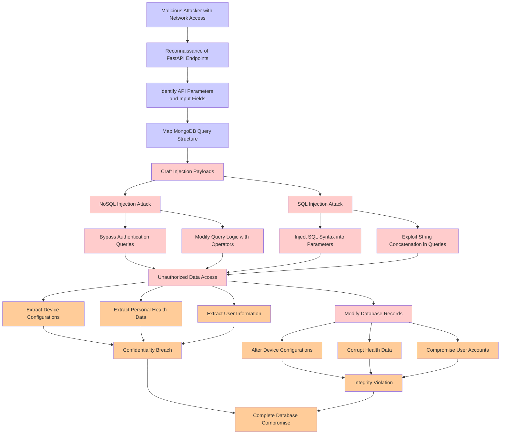

# Attack Tree: Injection Attack

**Threat ID**: T003
**Statement**: A malicious attacker with access to the FastAPI REST API endpoints, can perform SQL injection or NoSQL injection attacks against MongoDB, which leads to unauthorized data extraction and modification, resulting in reduced confidentiality and integrity of device configurations, personal health data, and user information.

## Attack Tree Diagram

## MITRE ATT&CK Mapping

This attack tree has been mapped to MITRE ATT&CK techniques:

### Exploit String Concatenation in Queries

- **Technique**: [T1595.003](https://attack.mitre.org/techniques/T1595/003/) - Wordlist Scanning
- **Tactic**: Reconnaissance
- **Similarity Score**: 31.81%
- **Mitigations (2):**
  - 🛡️ **Disable or Remove Feature or Program**
    Disable or remove unnecessary and potentially vulnerable software, features, or services to reduce the attack surface an...
  - 🛡️ **Pre-compromise**
    Pre-compromise mitigations involve proactive measures and defenses implemented to prevent adversaries from successfully ...

### Map MongoDB Query Structure

- **Technique**: [T1595.003](https://attack.mitre.org/techniques/T1595/003/) - Wordlist Scanning
- **Tactic**: Reconnaissance
- **Similarity Score**: 47.77%
- **Mitigations (2):**
  - 🛡️ **Disable or Remove Feature or Program**
    Disable or remove unnecessary and potentially vulnerable software, features, or services to reduce the attack surface an...
  - 🛡️ **Pre-compromise**
    Pre-compromise mitigations involve proactive measures and defenses implemented to prevent adversaries from successfully ...

### SQL Injection Attack

- **Technique**: [T1659](https://attack.mitre.org/techniques/T1659/) - Content Injection
- **Tactic**: Initial Access, Command And Control
- **Similarity Score**: 42.83%
- **Mitigations (2):**
  - 🛡️ **Restrict Web-Based Content**
    Restricting web-based content involves enforcing policies and technologies that limit access to potentially malicious we...
  - 🛡️ **Encrypt Sensitive Information**
    Protect sensitive information at rest, in transit, and during processing by using strong encryption algorithms. Encrypti...

### Corrupt Health Data

- **Technique**: [T1565.003](https://attack.mitre.org/techniques/T1565/003/) - Runtime Data Manipulation
- **Tactic**: Impact
- **Similarity Score**: 52.59%
- **Mitigations (2):**
  - 🛡️ **Network Segmentation**
    Network segmentation involves dividing a network into smaller, isolated segments to control and limit the flow of traffi...
  - 🛡️ **Restrict File and Directory Permissions**
    Restricting file and directory permissions involves setting access controls at the file system level to limit which user...

### Modify Database Records

- **Technique**: [T1492](https://attack.mitre.org/techniques/T1492/) - Stored Data Manipulation
- **Tactic**: Impact
- **Similarity Score**: 69.40%

### Modify Query Logic with Operators

- **Technique**: [T1595](https://attack.mitre.org/techniques/T1595/) - Active Scanning
- **Tactic**: Reconnaissance
- **Similarity Score**: 32.74%
- **Mitigations (1):**
  - 🛡️ **Pre-compromise**
    Pre-compromise mitigations involve proactive measures and defenses implemented to prevent adversaries from successfully ...

### Integrity Violation

- **Technique**: [T1565.003](https://attack.mitre.org/techniques/T1565/003/) - Runtime Data Manipulation
- **Tactic**: Impact
- **Similarity Score**: 56.07%
- **Mitigations (2):**
  - 🛡️ **Network Segmentation**
    Network segmentation involves dividing a network into smaller, isolated segments to control and limit the flow of traffi...
  - 🛡️ **Restrict File and Directory Permissions**
    Restricting file and directory permissions involves setting access controls at the file system level to limit which user...

### Reconnaissance of FastAPI Endpoints

- **Technique**: [T1016.001](https://attack.mitre.org/techniques/T1016/001/) - Internet Connection Discovery
- **Tactic**: Discovery
- **Similarity Score**: 54.26%

### Complete Database Compromise

- **Technique**: [T1213.006](https://attack.mitre.org/techniques/T1213/006/) - Databases
- **Tactic**: Collection
- **Similarity Score**: 64.28%
- **Mitigations (5):**
  - 🛡️ **User Training**
    User Training involves educating employees and contractors on recognizing, reporting, and preventing cyber threats that ...
  - 🛡️ **Encrypt Sensitive Information**
    Protect sensitive information at rest, in transit, and during processing by using strong encryption algorithms. Encrypti...
  - 🛡️ **Software Configuration**
    Software configuration refers to making security-focused adjustments to the settings of applications, middleware, databa...
  - *2 more mitigation(s) available*

### Alter Device Configurations

- **Technique**: [T1542.004](https://attack.mitre.org/techniques/T1542/004/) - ROMMONkit
- **Tactic**: Defense Evasion, Persistence
- **Similarity Score**: 68.56%
- **Mitigations (3):**
  - 🛡️ **Boot Integrity**
    Boot Integrity ensures that a system starts securely by verifying the integrity of its boot process, operating system, a...
  - 🛡️ **Audit**
    Auditing is the process of recording activity and systematically reviewing and analyzing the activity and system configu...
  - 🛡️ **Network Intrusion Prevention**
    Use intrusion detection signatures to block traffic at network boundaries.

### Unauthorized Data Access

- **Technique**: [T1530](https://attack.mitre.org/techniques/T1530/) - Data from Cloud Storage
- **Tactic**: Collection
- **Similarity Score**: 56.23%
- **Mitigations (6):**
  - 🛡️ **User Account Management**
    User Account Management involves implementing and enforcing policies for the lifecycle of user accounts, including creat...
  - 🛡️ **Encrypt Sensitive Information**
    Protect sensitive information at rest, in transit, and during processing by using strong encryption algorithms. Encrypti...
  - 🛡️ **Restrict File and Directory Permissions**
    Restricting file and directory permissions involves setting access controls at the file system level to limit which user...
  - *3 more mitigation(s) available*

### Confidentiality Breach

- **Technique**: [T1565](https://attack.mitre.org/techniques/T1565/) - Data Manipulation
- **Tactic**: Impact
- **Similarity Score**: 49.82%
- **Mitigations (4):**
  - 🛡️ **Encrypt Sensitive Information**
    Protect sensitive information at rest, in transit, and during processing by using strong encryption algorithms. Encrypti...
  - 🛡️ **Remote Data Storage**
    Remote Data Storage focuses on moving critical data, such as security logs and sensitive files, to secure, off-host loca...
  - 🛡️ **Network Segmentation**
    Network segmentation involves dividing a network into smaller, isolated segments to control and limit the flow of traffi...
  - *1 more mitigation(s) available*

### Bypass Authentication Queries

- **Technique**: [T1550](https://attack.mitre.org/techniques/T1550/) - Use Alternate Authentication Material
- **Tactic**: Defense Evasion, Lateral Movement
- **Similarity Score**: 81.86%
- **Mitigations (7):**
  - 🛡️ **Audit**
    Auditing is the process of recording activity and systematically reviewing and analyzing the activity and system configu...
  - 🛡️ **Password Policies**
    Set and enforce secure password policies for accounts to reduce the likelihood of unauthorized access. Strong password p...
  - 🛡️ **Account Use Policies**
    Account Use Policies help mitigate unauthorized access by configuring and enforcing rules that govern how and when accou...
  - *4 more mitigation(s) available*

### Craft Injection Payloads

- **Technique**: [T1218.013](https://attack.mitre.org/techniques/T1218/013/) - Mavinject
- **Tactic**: Defense Evasion
- **Similarity Score**: 50.42%
- **Mitigations (2):**
  - 🛡️ **Disable or Remove Feature or Program**
    Disable or remove unnecessary and potentially vulnerable software, features, or services to reduce the attack surface an...
  - 🛡️ **Execution Prevention**
    Prevent the execution of unauthorized or malicious code on systems by implementing application control, script blocking,...

### Extract Personal Health Data

- **Technique**: [T1213.006](https://attack.mitre.org/techniques/T1213/006/) - Databases
- **Tactic**: Collection
- **Similarity Score**: 48.03%
- **Mitigations (5):**
  - 🛡️ **User Training**
    User Training involves educating employees and contractors on recognizing, reporting, and preventing cyber threats that ...
  - 🛡️ **Encrypt Sensitive Information**
    Protect sensitive information at rest, in transit, and during processing by using strong encryption algorithms. Encrypti...
  - 🛡️ **Software Configuration**
    Software configuration refers to making security-focused adjustments to the settings of applications, middleware, databa...
  - *2 more mitigation(s) available*

### Extract Device Configurations

- **Technique**: [T1602.002](https://attack.mitre.org/techniques/T1602/002/) - Network Device Configuration Dump
- **Tactic**: Collection
- **Similarity Score**: 74.79%
- **Mitigations (6):**
  - 🛡️ **Encrypt Sensitive Information**
    Protect sensitive information at rest, in transit, and during processing by using strong encryption algorithms. Encrypti...
  - 🛡️ **Network Segmentation**
    Network segmentation involves dividing a network into smaller, isolated segments to control and limit the flow of traffi...
  - 🛡️ **Network Intrusion Prevention**
    Use intrusion detection signatures to block traffic at network boundaries.
  - *3 more mitigation(s) available*

### Identify API Parameters and Input Fields

- **Technique**: [T1056](https://attack.mitre.org/techniques/T1056/) - Input Capture
- **Tactic**: Collection, Credential Access
- **Similarity Score**: 49.67%

### Inject SQL Syntax into Parameters

- **Technique**: [T1505.001](https://attack.mitre.org/techniques/T1505/001/) - SQL Stored Procedures
- **Tactic**: Persistence
- **Similarity Score**: 43.33%
- **Mitigations (3):**
  - 🛡️ **Audit**
    Auditing is the process of recording activity and systematically reviewing and analyzing the activity and system configu...
  - 🛡️ **Code Signing**
    Code Signing is a security process that ensures the authenticity and integrity of software by digitally signing executab...
  - 🛡️ **Privileged Account Management**
    Privileged Account Management focuses on implementing policies, controls, and tools to securely manage privileged accoun...

### Malicious Attacker with Network Access

- **Technique**: [T1108](https://attack.mitre.org/techniques/T1108/) - Redundant Access
- **Tactic**: Defense Evasion, Persistence
- **Similarity Score**: 63.94%

### Extract User Information

- **Technique**: [T1087](https://attack.mitre.org/techniques/T1087/) - Account Discovery
- **Tactic**: Discovery
- **Similarity Score**: 62.95%
- **Mitigations (2):**
  - 🛡️ **Operating System Configuration**
    Operating System Configuration involves adjusting system settings and hardening the default configurations of an operati...
  - 🛡️ **User Account Management**
    User Account Management involves implementing and enforcing policies for the lifecycle of user accounts, including creat...

### Compromise User Accounts

- **Technique**: [T1098](https://attack.mitre.org/techniques/T1098/) - Account Manipulation
- **Tactic**: Persistence, Privilege Escalation
- **Similarity Score**: 73.52%
- **Mitigations (7):**
  - 🛡️ **Network Segmentation**
    Network segmentation involves dividing a network into smaller, isolated segments to control and limit the flow of traffi...
  - 🛡️ **Disable or Remove Feature or Program**
    Disable or remove unnecessary and potentially vulnerable software, features, or services to reduce the attack surface an...
  - 🛡️ **User Account Management**
    User Account Management involves implementing and enforcing policies for the lifecycle of user accounts, including creat...
  - *4 more mitigation(s) available*

### NoSQL Injection Attack

- **Technique**: [T1659](https://attack.mitre.org/techniques/T1659/) - Content Injection
- **Tactic**: Initial Access, Command And Control
- **Similarity Score**: 45.83%
- **Mitigations (2):**
  - 🛡️ **Restrict Web-Based Content**
    Restricting web-based content involves enforcing policies and technologies that limit access to potentially malicious we...
  - 🛡️ **Encrypt Sensitive Information**
    Protect sensitive information at rest, in transit, and during processing by using strong encryption algorithms. Encrypti...

*Total technique mappings: 22 | Mitigations found: 63*

## Attack Path Analysis

Review this attack tree to:
1. Identify critical attack paths
2. Implement appropriate security controls
3. Monitor for indicators
4. Develop incident response procedures

---
*Generated by ThreatForest*
