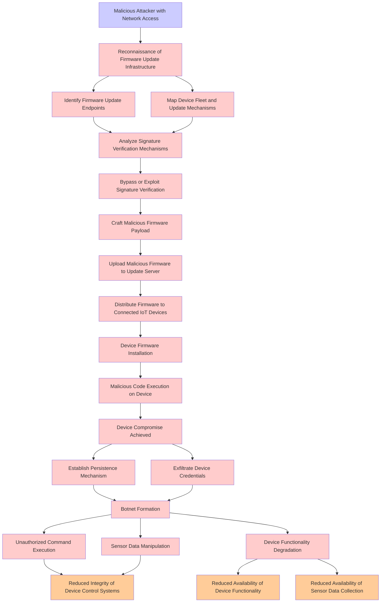

# Attack Tree: Malicious Code & Supply Chain Attack

**Threat ID**: T004
**Statement**: A malicious attacker with network access to firmware update endpoints, can upload and distribute malicious firmware to IoT devices, which leads to device compromise and botnet formation, resulting in reduced integrity and availability of device functionality and sensor data collection.

## Attack Tree Diagram

## MITRE ATT&CK Mapping

This attack tree has been mapped to MITRE ATT&CK techniques:

### Establish Persistence Mechanism

- **Technique**: [T1037.005](https://attack.mitre.org/techniques/T1037/005/) - Startup Items
- **Tactic**: Persistence, Privilege Escalation
- **Similarity Score**: 78.58%
- **Mitigations (1):**
  - 🛡️ **Restrict File and Directory Permissions**
    Restricting file and directory permissions involves setting access controls at the file system level to limit which user...

### Unauthorized Command Execution

- **Technique**: [T1202](https://attack.mitre.org/techniques/T1202/) - Indirect Command Execution
- **Tactic**: Defense Evasion
- **Similarity Score**: 71.59%

### Map Device Fleet and Update Mechanisms

- **Technique**: [T1120](https://attack.mitre.org/techniques/T1120/) - Peripheral Device Discovery
- **Tactic**: Discovery
- **Similarity Score**: 71.79%

### Analyze Signature Verification Mechanisms

- **Technique**: [T1036.001](https://attack.mitre.org/techniques/T1036/001/) - Invalid Code Signature
- **Tactic**: Defense Evasion
- **Similarity Score**: 72.24%
- **Mitigations (1):**
  - 🛡️ **Code Signing**
    Code Signing is a security process that ensures the authenticity and integrity of software by digitally signing executab...

### Device Functionality Degradation

- **Technique**: [T1495](https://attack.mitre.org/techniques/T1495/) - Firmware Corruption
- **Tactic**: Impact
- **Similarity Score**: 58.83%
- **Mitigations (3):**
  - 🛡️ **Update Software**
    Software updates ensure systems are protected against known vulnerabilities by applying patches and upgrades provided by...
  - 🛡️ **Privileged Account Management**
    Privileged Account Management focuses on implementing policies, controls, and tools to securely manage privileged accoun...
  - 🛡️ **Boot Integrity**
    Boot Integrity ensures that a system starts securely by verifying the integrity of its boot process, operating system, a...

### Upload Malicious Firmware to Update Server

- **Technique**: [T1542.001](https://attack.mitre.org/techniques/T1542/001/) - System Firmware
- **Tactic**: Persistence, Defense Evasion
- **Similarity Score**: 74.35%
- **Mitigations (3):**
  - 🛡️ **Boot Integrity**
    Boot Integrity ensures that a system starts securely by verifying the integrity of its boot process, operating system, a...
  - 🛡️ **Update Software**
    Software updates ensure systems are protected against known vulnerabilities by applying patches and upgrades provided by...
  - 🛡️ **Privileged Account Management**
    Privileged Account Management focuses on implementing policies, controls, and tools to securely manage privileged accoun...

### Distribute Firmware to Connected IoT Devices

- **Technique**: [T1542.001](https://attack.mitre.org/techniques/T1542/001/) - System Firmware
- **Tactic**: Persistence, Defense Evasion
- **Similarity Score**: 69.73%
- **Mitigations (3):**
  - 🛡️ **Boot Integrity**
    Boot Integrity ensures that a system starts securely by verifying the integrity of its boot process, operating system, a...
  - 🛡️ **Update Software**
    Software updates ensure systems are protected against known vulnerabilities by applying patches and upgrades provided by...
  - 🛡️ **Privileged Account Management**
    Privileged Account Management focuses on implementing policies, controls, and tools to securely manage privileged accoun...

### Malicious Code Execution on Device

- **Technique**: [T1091](https://attack.mitre.org/techniques/T1091/) - Replication Through Removable Media
- **Tactic**: Lateral Movement, Initial Access
- **Similarity Score**: 54.11%
- **Mitigations (3):**
  - 🛡️ **Disable or Remove Feature or Program**
    Disable or remove unnecessary and potentially vulnerable software, features, or services to reduce the attack surface an...
  - 🛡️ **Limit Hardware Installation**
    Prevent unauthorized users or groups from installing or using hardware, such as external drives, peripheral devices, or ...
  - 🛡️ **Behavior Prevention on Endpoint**
    Behavior Prevention on Endpoint refers to the use of technologies and strategies to detect and block potentially malicio...

### Botnet Formation

- **Technique**: [T1583.005](https://attack.mitre.org/techniques/T1583/005/) - Botnet
- **Tactic**: Resource Development
- **Similarity Score**: 70.90%
- **Mitigations (1):**
  - 🛡️ **Pre-compromise**
    Pre-compromise mitigations involve proactive measures and defenses implemented to prevent adversaries from successfully ...

### Craft Malicious Firmware Payload

- **Technique**: [T1542.001](https://attack.mitre.org/techniques/T1542/001/) - System Firmware
- **Tactic**: Persistence, Defense Evasion
- **Similarity Score**: 76.75%
- **Mitigations (3):**
  - 🛡️ **Boot Integrity**
    Boot Integrity ensures that a system starts securely by verifying the integrity of its boot process, operating system, a...
  - 🛡️ **Update Software**
    Software updates ensure systems are protected against known vulnerabilities by applying patches and upgrades provided by...
  - 🛡️ **Privileged Account Management**
    Privileged Account Management focuses on implementing policies, controls, and tools to securely manage privileged accoun...

### Identify Firmware Update Endpoints

- **Technique**: [T1019](https://attack.mitre.org/techniques/T1019/) - System Firmware
- **Tactic**: Persistence
- **Similarity Score**: 70.26%

### Reconnaissance of Firmware Update Infrastructure

- **Technique**: [T1019](https://attack.mitre.org/techniques/T1019/) - System Firmware
- **Tactic**: Persistence
- **Similarity Score**: 73.14%

### Device Compromise Achieved

- **Technique**: [T1091](https://attack.mitre.org/techniques/T1091/) - Replication Through Removable Media
- **Tactic**: Lateral Movement, Initial Access
- **Similarity Score**: 67.79%
- **Mitigations (3):**
  - 🛡️ **Disable or Remove Feature or Program**
    Disable or remove unnecessary and potentially vulnerable software, features, or services to reduce the attack surface an...
  - 🛡️ **Limit Hardware Installation**
    Prevent unauthorized users or groups from installing or using hardware, such as external drives, peripheral devices, or ...
  - 🛡️ **Behavior Prevention on Endpoint**
    Behavior Prevention on Endpoint refers to the use of technologies and strategies to detect and block potentially malicio...

### Bypass or Exploit Signature Verification

- **Technique**: [T1036.001](https://attack.mitre.org/techniques/T1036/001/) - Invalid Code Signature
- **Tactic**: Defense Evasion
- **Similarity Score**: 79.15%
- **Mitigations (1):**
  - 🛡️ **Code Signing**
    Code Signing is a security process that ensures the authenticity and integrity of software by digitally signing executab...

### Exfiltrate Device Credentials

- **Technique**: [T1552.001](https://attack.mitre.org/techniques/T1552/001/) - Credentials In Files
- **Tactic**: Credential Access
- **Similarity Score**: 68.10%
- **Mitigations (4):**
  - 🛡️ **User Training**
    User Training involves educating employees and contractors on recognizing, reporting, and preventing cyber threats that ...
  - 🛡️ **Audit**
    Auditing is the process of recording activity and systematically reviewing and analyzing the activity and system configu...
  - 🛡️ **Restrict File and Directory Permissions**
    Restricting file and directory permissions involves setting access controls at the file system level to limit which user...
  - *1 more mitigation(s) available*

### Device Firmware Installation

- **Technique**: [T1019](https://attack.mitre.org/techniques/T1019/) - System Firmware
- **Tactic**: Persistence
- **Similarity Score**: 81.01%

### Sensor Data Manipulation

- **Technique**: [T1054](https://attack.mitre.org/techniques/T1054/) - Indicator Blocking
- **Tactic**: Defense Evasion
- **Similarity Score**: 47.84%

### Reduced Availability of Device Functionality

- **Technique**: [T1601.002](https://attack.mitre.org/techniques/T1601/002/) - Downgrade System Image
- **Tactic**: Defense Evasion
- **Similarity Score**: 64.31%
- **Mitigations (6):**
  - 🛡️ **Multi-factor Authentication**
    Multi-Factor Authentication (MFA) enhances security by requiring users to provide at least two forms of verification to ...
  - 🛡️ **Code Signing**
    Code Signing is a security process that ensures the authenticity and integrity of software by digitally signing executab...
  - 🛡️ **Credential Access Protection**
    Credential Access Protection focuses on implementing measures to prevent adversaries from obtaining credentials, such as...
  - *3 more mitigation(s) available*

### Malicious Attacker with Network Access

- **Technique**: [T1108](https://attack.mitre.org/techniques/T1108/) - Redundant Access
- **Tactic**: Defense Evasion, Persistence
- **Similarity Score**: 63.94%

### Reduced Integrity of Device Control Systems

- **Technique**: [T1495](https://attack.mitre.org/techniques/T1495/) - Firmware Corruption
- **Tactic**: Impact
- **Similarity Score**: 73.35%
- **Mitigations (3):**
  - 🛡️ **Update Software**
    Software updates ensure systems are protected against known vulnerabilities by applying patches and upgrades provided by...
  - 🛡️ **Privileged Account Management**
    Privileged Account Management focuses on implementing policies, controls, and tools to securely manage privileged accoun...
  - 🛡️ **Boot Integrity**
    Boot Integrity ensures that a system starts securely by verifying the integrity of its boot process, operating system, a...

### Reduced Availability of Sensor Data Collection

- **Technique**: [T1562.006](https://attack.mitre.org/techniques/T1562/006/) - Indicator Blocking
- **Tactic**: Defense Evasion
- **Similarity Score**: 63.18%
- **Mitigations (3):**
  - 🛡️ **Restrict File and Directory Permissions**
    Restricting file and directory permissions involves setting access controls at the file system level to limit which user...
  - 🛡️ **Software Configuration**
    Software configuration refers to making security-focused adjustments to the settings of applications, middleware, databa...
  - 🛡️ **User Account Management**
    User Account Management involves implementing and enforcing policies for the lifecycle of user accounts, including creat...

*Total technique mappings: 21 | Mitigations found: 38*

## Attack Path Analysis

Review this attack tree to:
1. Identify critical attack paths
2. Implement appropriate security controls
3. Monitor for indicators
4. Develop incident response procedures

---
*Generated by ThreatForest*
