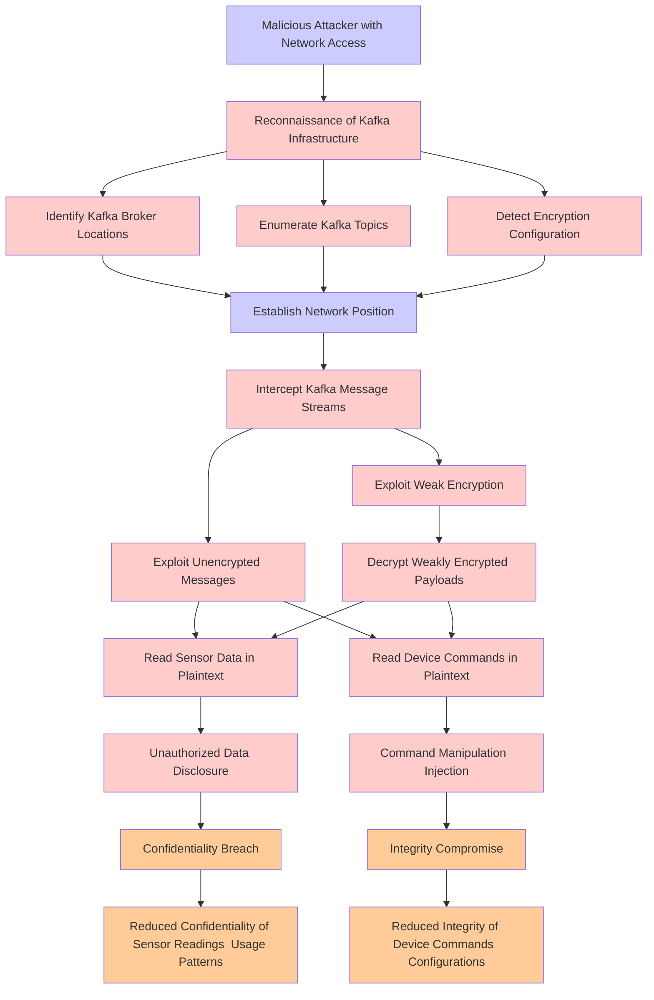

# Attack Tree: Data Interception & Man-in-the-Middle

**Threat ID**: T005
**Statement**: A malicious attacker with access to Apache Kafka message streams, can intercept unencrypted or weakly encrypted sensor data and device commands, which leads to unauthorized data disclosure and command manipulation, resulting in reduced confidentiality and integrity of sensor readings and device configurations.

## Attack Tree Diagram

## MITRE ATT&CK Mapping

This attack tree has been mapped to MITRE ATT&CK techniques:

### Reduced Confidentiality of Sensor Readings  Usage Patterns

- **Technique**: [T1054](https://attack.mitre.org/techniques/T1054/) - Indicator Blocking
- **Tactic**: Defense Evasion
- **Similarity Score**: 57.09%

### Identify Kafka Broker Locations

- **Technique**: [T1619](https://attack.mitre.org/techniques/T1619/) - Cloud Storage Object Discovery
- **Tactic**: Discovery
- **Similarity Score**: 41.91%
- **Mitigations (1):**
  - 🛡️ **User Account Management**
    User Account Management involves implementing and enforcing policies for the lifecycle of user accounts, including creat...

### Reconnaissance of Kafka Infrastructure

- **Technique**: [T1654](https://attack.mitre.org/techniques/T1654/) - Log Enumeration
- **Tactic**: Discovery
- **Similarity Score**: 41.64%
- **Mitigations (1):**
  - 🛡️ **User Account Management**
    User Account Management involves implementing and enforcing policies for the lifecycle of user accounts, including creat...

### Exploit Unencrypted Messages

- **Technique**: [T1032](https://attack.mitre.org/techniques/T1032/) - Standard Cryptographic Protocol
- **Tactic**: Command And Control
- **Similarity Score**: 72.86%

### Integrity Compromise

- **Technique**: [T1565.003](https://attack.mitre.org/techniques/T1565/003/) - Runtime Data Manipulation
- **Tactic**: Impact
- **Similarity Score**: 59.74%
- **Mitigations (2):**
  - 🛡️ **Network Segmentation**
    Network segmentation involves dividing a network into smaller, isolated segments to control and limit the flow of traffi...
  - 🛡️ **Restrict File and Directory Permissions**
    Restricting file and directory permissions involves setting access controls at the file system level to limit which user...

### Command Manipulation  Injection

- **Technique**: [T1059](https://attack.mitre.org/techniques/T1059/) - Command and Scripting Interpreter
- **Tactic**: Execution
- **Similarity Score**: 57.31%
- **Mitigations (9):**
  - 🛡️ **Limit Software Installation**
    Prevent users or groups from installing unauthorized or unapproved software to reduce the risk of introducing malicious ...
  - 🛡️ **Code Signing**
    Code Signing is a security process that ensures the authenticity and integrity of software by digitally signing executab...
  - 🛡️ **Disable or Remove Feature or Program**
    Disable or remove unnecessary and potentially vulnerable software, features, or services to reduce the attack surface an...
  - *6 more mitigation(s) available*

### Decrypt Weakly Encrypted Payloads

- **Technique**: [T1027.013](https://attack.mitre.org/techniques/T1027/013/) - Encrypted/Encoded File
- **Tactic**: Defense Evasion
- **Similarity Score**: 78.00%
- **Mitigations (2):**
  - 🛡️ **Antivirus/Antimalware**
    Antivirus/Antimalware solutions utilize signatures, heuristics, and behavioral analysis to detect, block, and remediate ...
  - 🛡️ **Behavior Prevention on Endpoint**
    Behavior Prevention on Endpoint refers to the use of technologies and strategies to detect and block potentially malicio...

### Exploit Weak Encryption

- **Technique**: [T1600.002](https://attack.mitre.org/techniques/T1600/002/) - Disable Crypto Hardware
- **Tactic**: Defense Evasion
- **Similarity Score**: 78.72%

### Unauthorized Data Disclosure

- **Technique**: [T1565.002](https://attack.mitre.org/techniques/T1565/002/) - Transmitted Data Manipulation
- **Tactic**: Impact
- **Similarity Score**: 63.62%
- **Mitigations (1):**
  - 🛡️ **Encrypt Sensitive Information**
    Protect sensitive information at rest, in transit, and during processing by using strong encryption algorithms. Encrypti...

### Malicious Attacker with Network Access

- **Technique**: [T1108](https://attack.mitre.org/techniques/T1108/) - Redundant Access
- **Tactic**: Defense Evasion, Persistence
- **Similarity Score**: 63.94%

### Establish Network Position

- **Technique**: [T1018](https://attack.mitre.org/techniques/T1018/) - Remote System Discovery
- **Tactic**: Discovery
- **Similarity Score**: 64.72%

### Enumerate Kafka Topics

- **Technique**: [T1654](https://attack.mitre.org/techniques/T1654/) - Log Enumeration
- **Tactic**: Discovery
- **Similarity Score**: 40.23%
- **Mitigations (1):**
  - 🛡️ **User Account Management**
    User Account Management involves implementing and enforcing policies for the lifecycle of user accounts, including creat...

### Detect Encryption Configuration

- **Technique**: [T1600.002](https://attack.mitre.org/techniques/T1600/002/) - Disable Crypto Hardware
- **Tactic**: Defense Evasion
- **Similarity Score**: 73.30%

### Intercept Kafka Message Streams

- **Technique**: [T1071.005](https://attack.mitre.org/techniques/T1071/005/) - Publish/Subscribe Protocols
- **Tactic**: Command And Control
- **Similarity Score**: 50.83%
- **Mitigations (2):**
  - 🛡️ **Filter Network Traffic**
    Employ network appliances and endpoint software to filter ingress, egress, and lateral network traffic. This includes pr...
  - 🛡️ **Network Intrusion Prevention**
    Use intrusion detection signatures to block traffic at network boundaries.

### Read Sensor Data in Plaintext

- **Technique**: [T1048.003](https://attack.mitre.org/techniques/T1048/003/) - Exfiltration Over Unencrypted Non-C2 Protocol
- **Tactic**: Exfiltration
- **Similarity Score**: 51.98%
- **Mitigations (4):**
  - 🛡️ **Network Intrusion Prevention**
    Use intrusion detection signatures to block traffic at network boundaries.
  - 🛡️ **Data Loss Prevention**
    Data Loss Prevention (DLP) involves implementing strategies and technologies to identify, categorize, monitor, and contr...
  - 🛡️ **Filter Network Traffic**
    Employ network appliances and endpoint software to filter ingress, egress, and lateral network traffic. This includes pr...
  - *1 more mitigation(s) available*

### Confidentiality Breach

- **Technique**: [T1565](https://attack.mitre.org/techniques/T1565/) - Data Manipulation
- **Tactic**: Impact
- **Similarity Score**: 49.82%
- **Mitigations (4):**
  - 🛡️ **Encrypt Sensitive Information**
    Protect sensitive information at rest, in transit, and during processing by using strong encryption algorithms. Encrypti...
  - 🛡️ **Remote Data Storage**
    Remote Data Storage focuses on moving critical data, such as security logs and sensitive files, to secure, off-host loca...
  - 🛡️ **Network Segmentation**
    Network segmentation involves dividing a network into smaller, isolated segments to control and limit the flow of traffi...
  - *1 more mitigation(s) available*

### Read Device Commands in Plaintext

- **Technique**: [T1120](https://attack.mitre.org/techniques/T1120/) - Peripheral Device Discovery
- **Tactic**: Discovery
- **Similarity Score**: 63.55%

### Reduced Integrity of Device Commands  Configurations

- **Technique**: [T1542.004](https://attack.mitre.org/techniques/T1542/004/) - ROMMONkit
- **Tactic**: Defense Evasion, Persistence
- **Similarity Score**: 71.17%
- **Mitigations (3):**
  - 🛡️ **Boot Integrity**
    Boot Integrity ensures that a system starts securely by verifying the integrity of its boot process, operating system, a...
  - 🛡️ **Audit**
    Auditing is the process of recording activity and systematically reviewing and analyzing the activity and system configu...
  - 🛡️ **Network Intrusion Prevention**
    Use intrusion detection signatures to block traffic at network boundaries.

*Total technique mappings: 18 | Mitigations found: 30*

## Attack Path Analysis

Review this attack tree to:
1. Identify critical attack paths
2. Implement appropriate security controls
3. Monitor for indicators
4. Develop incident response procedures

---
*Generated by ThreatForest*
