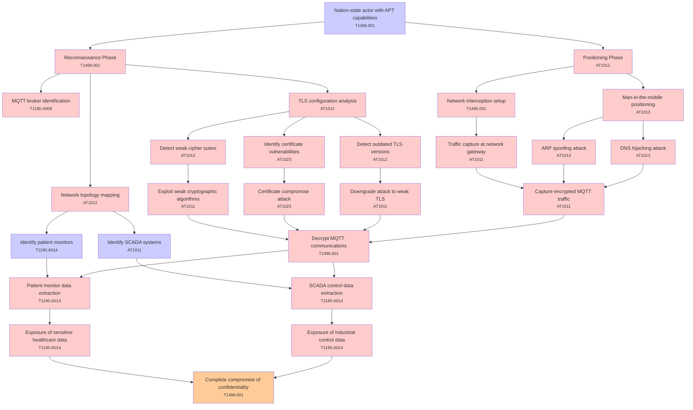

# Attack Tree: Cryptographic Failures

**Threat ID**: T002  
**Associated threat statement**: T002 - Cryptographic Failures

- **Threat Source**: nation-state actor
- **Prerequisites**: advanced persistent threat capabilities
- **Threat Action**: intercept and decrypt MQTT over TLS communications
- **Threat Impact**: exposure of sensitive healthcare and industrial data
- **Reduced Goal**: confidentiality
- **Impacted Assets**: patient monitors and SCADA systems
- **Priority**: High
- **Category**: Cryptographic Failures

---

## Attack Tree Diagram

## Attack Path Analysis

This attack tree represents the potential attack paths for the identified threat. Each node in the tree represents either:
- **Attack Goal** (orange): The ultimate objective
- **Attack Step** (red): Individual attack actions
- **Fact/Condition** (blue): Prerequisites or conditions
- **Mitigation** (green): Defensive measures

Review this attack tree to:
1. Identify critical attack paths
2. Implement appropriate security controls
3. Monitor for indicators of these attack patterns
4. Develop incident response procedures

---
*Generated by ThreatForest - Attack Tree Analysis*

## TTC Technique Mappings

| Attack Step | Technique ID | Technique Name | Confidence | Similarity |
|-------------|--------------|----------------|------------|------------|
| TLS configuration analysis... | AT1012 | Region Selection and Hopping... | 🟡 medium | 0.586 |
| MQTT broker identification... | T1190.A008 | CloudWatch Event Bus... | 🟡 medium | 0.537 |
| Patient monitor data extraction... | T1190.A014 | EMR Cluster... | 🟡 medium | 0.571 |
| Exposure of sensitive healthcare data... | T1190.A014 | EMR Cluster... | 🟡 medium | 0.673 |
| Identify SCADA systems... | AT1011 | Operation Rate Control... | 🟡 medium | 0.539 |
| Detect weak cipher suites... | AT1012 | Region Selection and Hopping... | 🟡 medium | 0.580 |
| Identify certificate vulnerabilities... | AT1023 | Cloud Database Discovery... | 🟡 medium | 0.570 |
| Capture encrypted MQTT traffic... | AT1011 | Operation Rate Control... | 🟡 medium | 0.554 |
| Downgrade attack to weak TLS... | AT1011 | Operation Rate Control... | 🟡 medium | 0.579 |
| Decrypt MQTT communications... | T1496.001 | Compute Hijacking... | 🟡 medium | 0.534 |
| Detect outdated TLS versions... | AT1012 | Region Selection and Hopping... | 🟡 medium | 0.530 |
| ARP spoofing attack... | AT1013 | User Agent Spoofing and Randomization... | 🟢 high | 0.705 |
| Exposure of industrial control data... | T1190.A014 | EMR Cluster... | 🟡 medium | 0.642 |
| Certificate compromise attack... | AT1023 | Cloud Database Discovery... | 🟡 medium | 0.642 |
| Positioning Phase... | AT1012 | Region Selection and Hopping... | 🟡 medium | 0.571 |
| Complete compromise of confidentiality... | T1496.001 | Compute Hijacking... | 🟡 medium | 0.575 |
| Network interception setup... | T1496.001 | Compute Hijacking... | 🟡 medium | 0.609 |
| Identify patient monitors... | T1190.A014 | EMR Cluster... | 🟡 medium | 0.552 |
| Network topology mapping... | AT1012 | Region Selection and Hopping... | 🟡 medium | 0.565 |
| Man-in-the-middle positioning... | AT1013 | User Agent Spoofing and Randomization... | 🟡 medium | 0.635 |
| Exploit weak cryptographic algorithms... | AT1011 | Operation Rate Control... | 🟡 medium | 0.586 |
| SCADA control data extraction... | T1190.A014 | EMR Cluster... | 🟡 medium | 0.559 |
| Reconnaissance Phase... | T1496.001 | Compute Hijacking... | 🟡 medium | 0.629 |
| Nation-state actor with APT capabilities... | T1496.001 | Compute Hijacking... | 🟡 medium | 0.611 |
| DNS hijacking attack... | AT1013 | User Agent Spoofing and Randomization... | 🟡 medium | 0.678 |
| Traffic capture at network gateway... | AT1011 | Operation Rate Control... | 🟡 medium | 0.677 |
