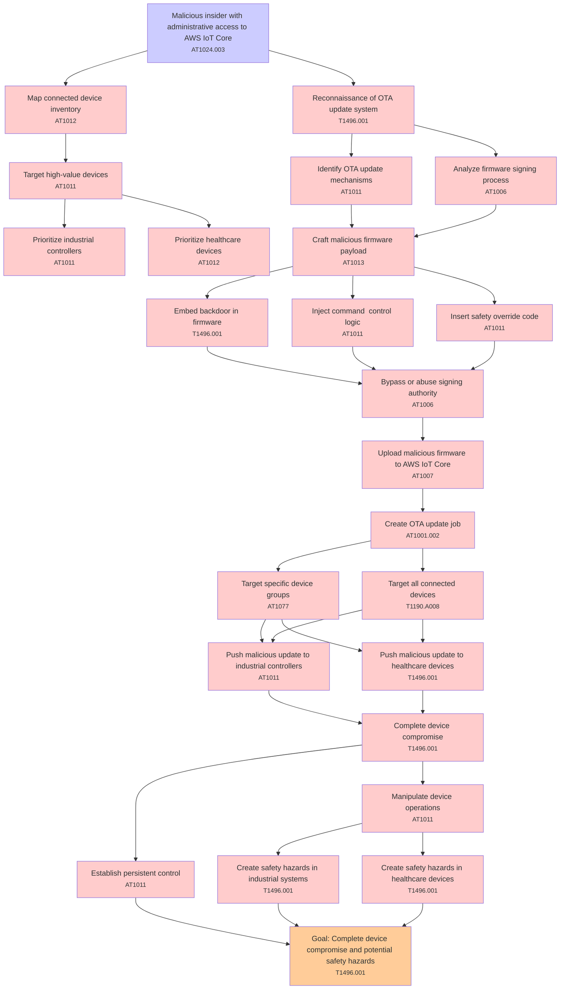

# Attack Tree: Supply Chain

**Threat ID**: T003  
**Associated threat statement**: T003 - Supply Chain

- **Threat Source**: malicious insider
- **Prerequisites**: administrative access to AWS IoT Core
- **Threat Action**: push malicious firmware updates through the OTA system
- **Threat Impact**: complete device compromise and potential safety hazards
- **Reduced Goal**: integrity
- **Impacted Assets**: industrial controllers and healthcare devices
- **Priority**: High
- **Category**: Supply Chain

---

## Attack Tree Diagram

## Attack Path Analysis

This attack tree represents the potential attack paths for the identified threat. Each node in the tree represents either:
- **Attack Goal** (orange): The ultimate objective
- **Attack Step** (red): Individual attack actions
- **Fact/Condition** (blue): Prerequisites or conditions
- **Mitigation** (green): Defensive measures

Review this attack tree to:
1. Identify critical attack paths
2. Implement appropriate security controls
3. Monitor for indicators of these attack patterns
4. Develop incident response procedures

---
*Generated by ThreatForest - Attack Tree Analysis*

## TTC Technique Mappings

| Attack Step | Technique ID | Technique Name | Confidence | Similarity |
|-------------|--------------|----------------|------------|------------|
| Insert safety override code... | AT1011 | Operation Rate Control... | 🔴 low | 0.473 |
| Inject command  control logic... | AT1011 | Operation Rate Control... | 🔴 low | 0.438 |
| Prioritize industrial controllers... | AT1011 | Operation Rate Control... | 🟡 medium | 0.580 |
| Reconnaissance of OTA update system... | T1496.001 | Compute Hijacking... | 🟡 medium | 0.609 |
| Target high-value devices... | AT1011 | Operation Rate Control... | 🟡 medium | 0.560 |
| Create OTA update job... | AT1001.002 | Modify Existing Lambda Function... | 🔴 low | 0.447 |
| Map connected device inventory... | AT1012 | Region Selection and Hopping... | 🟡 medium | 0.535 |
| Craft malicious firmware payload... | AT1013 | User Agent Spoofing and Randomization... | 🟡 medium | 0.580 |
| Target all connected devices... | T1190.A008 | CloudWatch Event Bus... | 🔴 low | 0.412 |
| Goal: Complete device compromise and potential saf... | T1496.001 | Compute Hijacking... | 🟡 medium | 0.628 |
| Analyze firmware signing process... | AT1006 | Pre-Signed URLs... | 🟡 medium | 0.529 |
| Embed backdoor in firmware... | T1496.001 | Compute Hijacking... | 🟡 medium | 0.569 |
| Upload malicious firmware to AWS IoT Core... | AT1007 | Create or Modify AWS Service... | 🟡 medium | 0.680 |
| Push malicious update to healthcare devices... | T1496.001 | Compute Hijacking... | 🟡 medium | 0.550 |
| Prioritize healthcare devices... | AT1012 | Region Selection and Hopping... | 🟡 medium | 0.526 |
| Push malicious update to industrial controllers... | AT1011 | Operation Rate Control... | 🟡 medium | 0.583 |
| Bypass or abuse signing authority... | AT1006 | Pre-Signed URLs... | 🟡 medium | 0.612 |
| Manipulate device operations... | AT1011 | Operation Rate Control... | 🟡 medium | 0.527 |
| Malicious insider with administrative access to AW... | AT1024.003 | IAM Role Hopping... | 🟢 high | 0.793 |
| Establish persistent control... | AT1011 | Operation Rate Control... | 🟡 medium | 0.502 |
| Create safety hazards in healthcare devices... | T1496.001 | Compute Hijacking... | 🟡 medium | 0.551 |
| Create safety hazards in industrial systems... | T1496.001 | Compute Hijacking... | 🟡 medium | 0.562 |
| Target specific device groups... | AT1077 | Authorize VPC Security Groups... | 🟡 medium | 0.566 |
| Complete device compromise... | T1496.001 | Compute Hijacking... | 🟡 medium | 0.679 |
| Identify OTA update mechanisms... | AT1011 | Operation Rate Control... | 🟡 medium | 0.558 |
