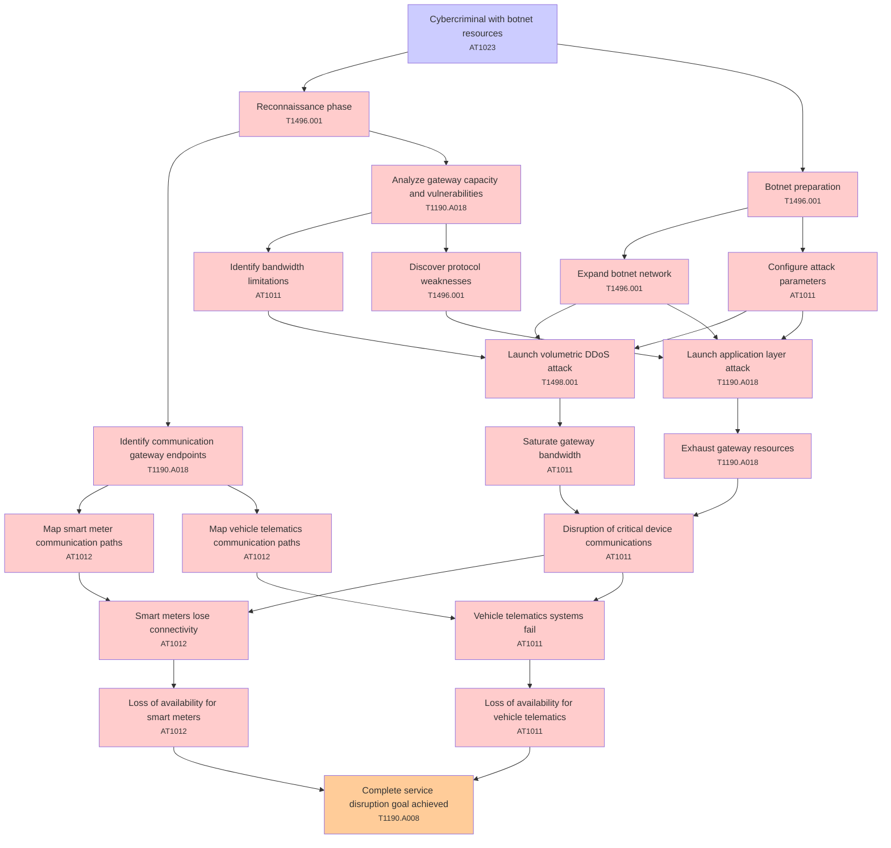

# Attack Tree: Denial of Service

**Threat ID**: T004  
**Associated threat statement**: T004 - Denial of Service

- **Threat Source**: cybercriminal
- **Prerequisites**: botnet resources
- **Threat Action**: launch distributed denial-of-service attacks against the communication gateway
- **Threat Impact**: disruption of critical device communications
- **Reduced Goal**: availability
- **Impacted Assets**: smart meters and vehicle telematics systems
- **Priority**: High
- **Category**: Denial of Service

---

## Attack Tree Diagram

## Attack Path Analysis

This attack tree represents the potential attack paths for the identified threat. Each node in the tree represents either:
- **Attack Goal** (orange): The ultimate objective
- **Attack Step** (red): Individual attack actions
- **Fact/Condition** (blue): Prerequisites or conditions
- **Mitigation** (green): Defensive measures

Review this attack tree to:
1. Identify critical attack paths
2. Implement appropriate security controls
3. Monitor for indicators of these attack patterns
4. Develop incident response procedures

---
*Generated by ThreatForest - Attack Tree Analysis*

## TTC Technique Mappings

| Attack Step | Technique ID | Technique Name | Confidence | Similarity |
|-------------|--------------|----------------|------------|------------|
| Reconnaissance phase... | T1496.001 | Compute Hijacking... | 🟡 medium | 0.628 |
| Vehicle telematics systems fail... | AT1011 | Operation Rate Control... | 🟡 medium | 0.512 |
| Map vehicle telematics communication paths... | AT1012 | Region Selection and Hopping... | 🟡 medium | 0.562 |
| Discover protocol weaknesses... | T1496.001 | Compute Hijacking... | 🟡 medium | 0.658 |
| Configure attack parameters... | AT1011 | Operation Rate Control... | 🟡 medium | 0.515 |
| Botnet preparation... | T1496.001 | Compute Hijacking... | 🟡 medium | 0.664 |
| Disruption of critical device communications... | AT1011 | Operation Rate Control... | 🟡 medium | 0.608 |
| Expand botnet network... | T1496.001 | Compute Hijacking... | 🟡 medium | 0.605 |
| Map smart meter communication paths... | AT1012 | Region Selection and Hopping... | 🟡 medium | 0.544 |
| Launch volumetric DDoS attack... | T1498.001 | Direct Network Flood... | 🟡 medium | 0.629 |
| Loss of availability for smart meters... | AT1012 | Region Selection and Hopping... | 🟡 medium | 0.506 |
| Exhaust gateway resources... | T1190.A018 | API Gateway... | 🟡 medium | 0.596 |
| Analyze gateway capacity and vulnerabilities... | T1190.A018 | API Gateway... | 🟢 high | 0.792 |
| Cybercriminal with botnet resources... | AT1023 | Cloud Database Discovery... | 🟡 medium | 0.586 |
| Loss of availability for vehicle telematics... | AT1011 | Operation Rate Control... | 🟡 medium | 0.561 |
| Smart meters lose connectivity... | AT1012 | Region Selection and Hopping... | 🔴 low | 0.463 |
| Identify bandwidth limitations... | AT1011 | Operation Rate Control... | 🟡 medium | 0.616 |
| Launch application layer attack... | T1190.A018 | API Gateway... | 🟡 medium | 0.599 |
| Complete service disruption goal achieved... | T1190.A008 | CloudWatch Event Bus... | 🟡 medium | 0.543 |
| Saturate gateway bandwidth... | AT1011 | Operation Rate Control... | 🟡 medium | 0.617 |
| Identify communication gateway endpoints... | T1190.A018 | API Gateway... | 🟡 medium | 0.617 |
