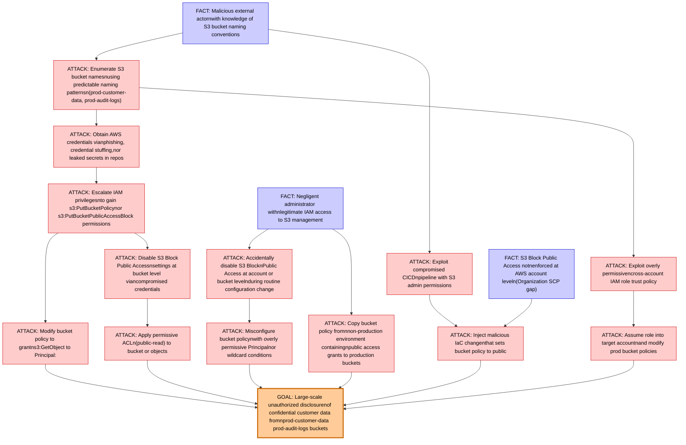

# Attack Tree: Data Exposure

**Threat ID**: T001
**Statement**: A malicious external actor or negligent administrator with knowledge of S3 bucket naming conventions, can modify bucket policies or disable S3 Block Public Access settings to expose objects to the internet, which leads to large-scale unauthorized disclosure of confidential customer data, resulting in reduced confidentiality of customer data stored in `prod-customer-data` and `prod-audit-logs` buckets.

## Attack Tree Diagram

## MITRE ATT&CK Mapping

This attack tree has been mapped to MITRE ATT&CK techniques:

### ATTACK: Obtain AWS credentials vianphishing, credential stuffing,nor leaked secrets in repos

- **Technique**: [T1555.006](https://attack.mitre.org/techniques/T1555/006/) - Cloud Secrets Management Stores
- **Tactic**: Credential Access
- **Similarity Score**: 90.82%
- **Mitigations (1):**
  - 🛡️ **Privileged Account Management**
    Privileged Account Management focuses on implementing policies, controls, and tools to securely manage privileged accoun...

### ATTACK: Escalate IAM privilegesnto gain s3:PutBucketPolicynor s3:PutBucketPublicAccessBlock permissions

- **Technique**: [T1222.002](https://attack.mitre.org/techniques/T1222/002/) - Linux and Mac File and Directory Permissions Modification
- **Tactic**: Defense Evasion
- **Similarity Score**: 73.48%
- **Mitigations (2):**
  - 🛡️ **Restrict File and Directory Permissions**
    Restricting file and directory permissions involves setting access controls at the file system level to limit which user...
  - 🛡️ **Privileged Account Management**
    Privileged Account Management focuses on implementing policies, controls, and tools to securely manage privileged accoun...

### ATTACK: Copy bucket policy fromnnon-production environment containingnpublic access grants to production buckets

- **Technique**: [T1484.001](https://attack.mitre.org/techniques/T1484/001/) - Group Policy Modification
- **Tactic**: Defense Evasion, Privilege Escalation
- **Similarity Score**: 56.37%
- **Mitigations (2):**
  - 🛡️ **Audit**
    Auditing is the process of recording activity and systematically reviewing and analyzing the activity and system configu...
  - 🛡️ **User Account Management**
    User Account Management involves implementing and enforcing policies for the lifecycle of user accounts, including creat...

### ATTACK: Disable S3 Block Public Accessnsettings at bucket level viancompromised credentials

- **Technique**: [T1098.001](https://attack.mitre.org/techniques/T1098/001/) - Additional Cloud Credentials
- **Tactic**: Persistence, Privilege Escalation
- **Similarity Score**: 57.02%
- **Mitigations (5):**
  - 🛡️ **Multi-factor Authentication**
    Multi-Factor Authentication (MFA) enhances security by requiring users to provide at least two forms of verification to ...
  - 🛡️ **User Account Management**
    User Account Management involves implementing and enforcing policies for the lifecycle of user accounts, including creat...
  - 🛡️ **Network Segmentation**
    Network segmentation involves dividing a network into smaller, isolated segments to control and limit the flow of traffi...
  - *2 more mitigation(s) available*

### GOAL: Large-scale unauthorized disclosurenof confidential customer data fromnprod-customer-data  prod-audit-logs buckets

- **Technique**: [T1213.006](https://attack.mitre.org/techniques/T1213/006/) - Databases
- **Tactic**: Collection
- **Similarity Score**: 67.35%
- **Mitigations (5):**
  - 🛡️ **User Training**
    User Training involves educating employees and contractors on recognizing, reporting, and preventing cyber threats that ...
  - 🛡️ **Encrypt Sensitive Information**
    Protect sensitive information at rest, in transit, and during processing by using strong encryption algorithms. Encrypti...
  - 🛡️ **Software Configuration**
    Software configuration refers to making security-focused adjustments to the settings of applications, middleware, databa...
  - *2 more mitigation(s) available*

### ATTACK: Accidentally disable S3 BlocknPublic Access at account or bucket levelnduring routine configuration change

- **Technique**: [T1485.001](https://attack.mitre.org/techniques/T1485/001/) - Lifecycle-Triggered Deletion
- **Tactic**: Impact
- **Similarity Score**: 77.42%
- **Mitigations (2):**
  - 🛡️ **User Account Management**
    User Account Management involves implementing and enforcing policies for the lifecycle of user accounts, including creat...
  - 🛡️ **Data Backup**
    Data Backup involves taking and securely storing backups of data from end-user systems and critical servers. It ensures ...

### ATTACK: Inject malicious IaC changenthat sets bucket policy to public

- **Technique**: [T1666](https://attack.mitre.org/techniques/T1666/) - Modify Cloud Resource Hierarchy
- **Tactic**: Defense Evasion
- **Similarity Score**: 59.76%
- **Mitigations (3):**
  - 🛡️ **Software Configuration**
    Software configuration refers to making security-focused adjustments to the settings of applications, middleware, databa...
  - 🛡️ **User Account Management**
    User Account Management involves implementing and enforcing policies for the lifecycle of user accounts, including creat...
  - 🛡️ **Audit**
    Auditing is the process of recording activity and systematically reviewing and analyzing the activity and system configu...

### ATTACK: Apply permissive ACLn(public-read) to bucket or objects

- **Technique**: [T1530](https://attack.mitre.org/techniques/T1530/) - Data from Cloud Storage
- **Tactic**: Collection
- **Similarity Score**: 58.96%
- **Mitigations (6):**
  - 🛡️ **User Account Management**
    User Account Management involves implementing and enforcing policies for the lifecycle of user accounts, including creat...
  - 🛡️ **Encrypt Sensitive Information**
    Protect sensitive information at rest, in transit, and during processing by using strong encryption algorithms. Encrypti...
  - 🛡️ **Restrict File and Directory Permissions**
    Restricting file and directory permissions involves setting access controls at the file system level to limit which user...
  - *3 more mitigation(s) available*

### ATTACK: Enumerate S3 bucket namesnusing predictable naming patternsn(prod-customer-data, prod-audit-logs)

- **Technique**: [T1619](https://attack.mitre.org/techniques/T1619/) - Cloud Storage Object Discovery
- **Tactic**: Discovery
- **Similarity Score**: 71.55%
- **Mitigations (1):**
  - 🛡️ **User Account Management**
    User Account Management involves implementing and enforcing policies for the lifecycle of user accounts, including creat...

### FACT: Malicious external actornwith knowledge of S3 bucket naming conventions

- **Technique**: [T1619](https://attack.mitre.org/techniques/T1619/) - Cloud Storage Object Discovery
- **Tactic**: Discovery
- **Similarity Score**: 71.56%
- **Mitigations (1):**
  - 🛡️ **User Account Management**
    User Account Management involves implementing and enforcing policies for the lifecycle of user accounts, including creat...

### ATTACK: Misconfigure bucket policynwith overly permissive Principalnor wildcard conditions

- **Technique**: [T1556.009](https://attack.mitre.org/techniques/T1556/009/) - Conditional Access Policies
- **Tactic**: Credential Access, Defense Evasion, Persistence
- **Similarity Score**: 51.28%
- **Mitigations (1):**
  - 🛡️ **User Account Management**
    User Account Management involves implementing and enforcing policies for the lifecycle of user accounts, including creat...

### FACT: S3 Block Public Access notnenforced at AWS account leveln(Organization SCP gap)

- **Technique**: [T1537](https://attack.mitre.org/techniques/T1537/) - Transfer Data to Cloud Account
- **Tactic**: Exfiltration
- **Similarity Score**: 69.80%
- **Mitigations (4):**
  - 🛡️ **Data Loss Prevention**
    Data Loss Prevention (DLP) involves implementing strategies and technologies to identify, categorize, monitor, and contr...
  - 🛡️ **User Account Management**
    User Account Management involves implementing and enforcing policies for the lifecycle of user accounts, including creat...
  - 🛡️ **Software Configuration**
    Software configuration refers to making security-focused adjustments to the settings of applications, middleware, databa...
  - *1 more mitigation(s) available*

### ATTACK: Assume role into target accountnand modify prod bucket policies

- **Technique**: [T1098.003](https://attack.mitre.org/techniques/T1098/003/) - Additional Cloud Roles
- **Tactic**: Persistence, Privilege Escalation
- **Similarity Score**: 82.80%
- **Mitigations (3):**
  - 🛡️ **Privileged Account Management**
    Privileged Account Management focuses on implementing policies, controls, and tools to securely manage privileged accoun...
  - 🛡️ **Multi-factor Authentication**
    Multi-Factor Authentication (MFA) enhances security by requiring users to provide at least two forms of verification to ...
  - 🛡️ **User Account Management**
    User Account Management involves implementing and enforcing policies for the lifecycle of user accounts, including creat...

### ATTACK: Exploit compromised CICDnpipeline with S3 admin permissions

- **Technique**: [T1222.002](https://attack.mitre.org/techniques/T1222/002/) - Linux and Mac File and Directory Permissions Modification
- **Tactic**: Defense Evasion
- **Similarity Score**: 54.27%
- **Mitigations (2):**
  - 🛡️ **Restrict File and Directory Permissions**
    Restricting file and directory permissions involves setting access controls at the file system level to limit which user...
  - 🛡️ **Privileged Account Management**
    Privileged Account Management focuses on implementing policies, controls, and tools to securely manage privileged accoun...

### FACT: Negligent administrator withnlegitimate IAM access to S3 management

- **Technique**: [T1530](https://attack.mitre.org/techniques/T1530/) - Data from Cloud Storage
- **Tactic**: Collection
- **Similarity Score**: 71.76%
- **Mitigations (6):**
  - 🛡️ **User Account Management**
    User Account Management involves implementing and enforcing policies for the lifecycle of user accounts, including creat...
  - 🛡️ **Encrypt Sensitive Information**
    Protect sensitive information at rest, in transit, and during processing by using strong encryption algorithms. Encrypti...
  - 🛡️ **Restrict File and Directory Permissions**
    Restricting file and directory permissions involves setting access controls at the file system level to limit which user...
  - *3 more mitigation(s) available*

### ATTACK: Modify bucket policy to grantns3:GetObject to Principal:

- **Technique**: [T1666](https://attack.mitre.org/techniques/T1666/) - Modify Cloud Resource Hierarchy
- **Tactic**: Defense Evasion
- **Similarity Score**: 52.50%
- **Mitigations (3):**
  - 🛡️ **Software Configuration**
    Software configuration refers to making security-focused adjustments to the settings of applications, middleware, databa...
  - 🛡️ **User Account Management**
    User Account Management involves implementing and enforcing policies for the lifecycle of user accounts, including creat...
  - 🛡️ **Audit**
    Auditing is the process of recording activity and systematically reviewing and analyzing the activity and system configu...

### ATTACK: Exploit overly permissivencross-account IAM role trust policy

- **Technique**: [T1484.002](https://attack.mitre.org/techniques/T1484/002/) - Trust Modification
- **Tactic**: Defense Evasion, Privilege Escalation
- **Similarity Score**: 77.60%
- **Mitigations (2):**
  - 🛡️ **Privileged Account Management**
    Privileged Account Management focuses on implementing policies, controls, and tools to securely manage privileged accoun...
  - 🛡️ **User Account Management**
    User Account Management involves implementing and enforcing policies for the lifecycle of user accounts, including creat...

*Total technique mappings: 17 | Mitigations found: 49*

## Attack Path Analysis

Review this attack tree to:
1. Identify critical attack paths
2. Implement appropriate security controls
3. Monitor for indicators
4. Develop incident response procedures

---
*Generated by ThreatForest*
