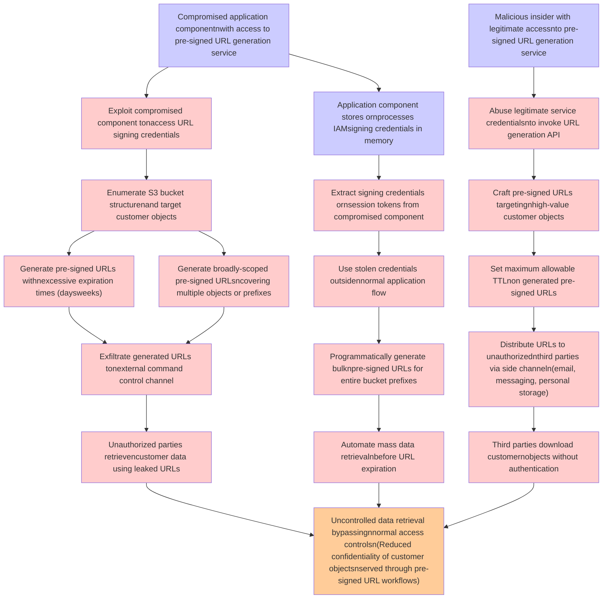

# Attack Tree: Data Exfiltration

**Threat ID**: T002
**Statement**: A compromised application component or malicious insider with access to the pre-signed URL generation service, can generate long-lived or broadly-scoped pre-signed URLs and distribute them to unauthorized parties, which leads to uncontrolled data retrieval bypassing normal access controls, resulting in reduced confidentiality of customer objects served through pre-signed URL workflows.

## Attack Tree Diagram

## MITRE ATT&CK Mapping

This attack tree has been mapped to MITRE ATT&CK techniques:

### Generate broadly-scoped pre-signed URLsncovering multiple objects or prefixes

- **Technique**: [T1583.001](https://attack.mitre.org/techniques/T1583/001/) - Domains
- **Tactic**: Resource Development
- **Similarity Score**: 51.77%
- **Mitigations (1):**
  - 🛡️ **Pre-compromise**
    Pre-compromise mitigations involve proactive measures and defenses implemented to prevent adversaries from successfully ...

### Unauthorized parties retrievencustomer data using leaked URLs

- **Technique**: [T1530](https://attack.mitre.org/techniques/T1530/) - Data from Cloud Storage
- **Tactic**: Collection
- **Similarity Score**: 53.83%
- **Mitigations (6):**
  - 🛡️ **User Account Management**
    User Account Management involves implementing and enforcing policies for the lifecycle of user accounts, including creat...
  - 🛡️ **Encrypt Sensitive Information**
    Protect sensitive information at rest, in transit, and during processing by using strong encryption algorithms. Encrypti...
  - 🛡️ **Restrict File and Directory Permissions**
    Restricting file and directory permissions involves setting access controls at the file system level to limit which user...
  - *3 more mitigation(s) available*

### Set maximum allowable TTLnon generated pre-signed URLs

- **Technique**: [T1090.004](https://attack.mitre.org/techniques/T1090/004/) - Domain Fronting
- **Tactic**: Command And Control
- **Similarity Score**: 51.60%
- **Mitigations (1):**
  - 🛡️ **SSL/TLS Inspection**
    SSL/TLS inspection involves decrypting encrypted network traffic to examine its content for signs of malicious activity....

### Craft pre-signed URLs targetingnhigh-value customer objects

- **Technique**: [T1598.003](https://attack.mitre.org/techniques/T1598/003/) - Spearphishing Link
- **Tactic**: Reconnaissance
- **Similarity Score**: 62.29%
- **Mitigations (2):**
  - 🛡️ **User Training**
    User Training involves educating employees and contractors on recognizing, reporting, and preventing cyber threats that ...
  - 🛡️ **Software Configuration**
    Software configuration refers to making security-focused adjustments to the settings of applications, middleware, databa...

### Application component stores ornprocesses IAMsigning credentials in memory

- **Technique**: [T1556.008](https://attack.mitre.org/techniques/T1556/008/) - Network Provider DLL
- **Tactic**: Credential Access, Defense Evasion, Persistence
- **Similarity Score**: 76.23%
- **Mitigations (3):**
  - 🛡️ **Restrict Registry Permissions**
    Restricting registry permissions involves configuring access control settings for sensitive registry keys and hives to e...
  - 🛡️ **Audit**
    Auditing is the process of recording activity and systematically reviewing and analyzing the activity and system configu...
  - 🛡️ **Operating System Configuration**
    Operating System Configuration involves adjusting system settings and hardening the default configurations of an operati...

### Automate mass data retrievalnbefore URL expiration

- **Technique**: [T1119](https://attack.mitre.org/techniques/T1119/) - Automated Collection
- **Tactic**: Collection
- **Similarity Score**: 51.74%
- **Mitigations (2):**
  - 🛡️ **Remote Data Storage**
    Remote Data Storage focuses on moving critical data, such as security logs and sensitive files, to secure, off-host loca...
  - 🛡️ **Encrypt Sensitive Information**
    Protect sensitive information at rest, in transit, and during processing by using strong encryption algorithms. Encrypti...

### Uncontrolled data retrieval bypassingnnormal access controlsn(Reduced confidentiality of customer objectsnserved through pre-signed URL workflows)

- **Technique**: [T1530](https://attack.mitre.org/techniques/T1530/) - Data from Cloud Storage
- **Tactic**: Collection
- **Similarity Score**: 59.88%
- **Mitigations (6):**
  - 🛡️ **User Account Management**
    User Account Management involves implementing and enforcing policies for the lifecycle of user accounts, including creat...
  - 🛡️ **Encrypt Sensitive Information**
    Protect sensitive information at rest, in transit, and during processing by using strong encryption algorithms. Encrypti...
  - 🛡️ **Restrict File and Directory Permissions**
    Restricting file and directory permissions involves setting access controls at the file system level to limit which user...
  - *3 more mitigation(s) available*

### Third parties download customernobjects without authentication

- **Technique**: [T1589.001](https://attack.mitre.org/techniques/T1589/001/) - Credentials
- **Tactic**: Reconnaissance
- **Similarity Score**: 65.29%
- **Mitigations (1):**
  - 🛡️ **Pre-compromise**
    Pre-compromise mitigations involve proactive measures and defenses implemented to prevent adversaries from successfully ...

### Exploit compromised component tonaccess URL signing credentials

- **Technique**: [T1606](https://attack.mitre.org/techniques/T1606/) - Forge Web Credentials
- **Tactic**: Credential Access
- **Similarity Score**: 64.27%
- **Mitigations (4):**
  - 🛡️ **Privileged Account Management**
    Privileged Account Management focuses on implementing policies, controls, and tools to securely manage privileged accoun...
  - 🛡️ **Software Configuration**
    Software configuration refers to making security-focused adjustments to the settings of applications, middleware, databa...
  - 🛡️ **Audit**
    Auditing is the process of recording activity and systematically reviewing and analyzing the activity and system configu...
  - *1 more mitigation(s) available*

### Distribute URLs to unauthorizednthird parties via side channeln(email, messaging, personal storage)

- **Technique**: [T1192](https://attack.mitre.org/techniques/T1192/) - Spearphishing Link
- **Tactic**: Initial Access
- **Similarity Score**: 70.64%

### Compromised application componentnwith access to pre-signed URL generation service

- **Technique**: [T1505.004](https://attack.mitre.org/techniques/T1505/004/) - IIS Components
- **Tactic**: Persistence
- **Similarity Score**: 46.07%
- **Mitigations (4):**
  - 🛡️ **Privileged Account Management**
    Privileged Account Management focuses on implementing policies, controls, and tools to securely manage privileged accoun...
  - 🛡️ **Execution Prevention**
    Prevent the execution of unauthorized or malicious code on systems by implementing application control, script blocking,...
  - 🛡️ **Audit**
    Auditing is the process of recording activity and systematically reviewing and analyzing the activity and system configu...
  - *1 more mitigation(s) available*

### Generate pre-signed URLs withnexcessive expiration times (daysweeks)

- **Technique**: [T1102.001](https://attack.mitre.org/techniques/T1102/001/) - Dead Drop Resolver
- **Tactic**: Command And Control
- **Similarity Score**: 37.33%
- **Mitigations (2):**
  - 🛡️ **Restrict Web-Based Content**
    Restricting web-based content involves enforcing policies and technologies that limit access to potentially malicious we...
  - 🛡️ **Network Intrusion Prevention**
    Use intrusion detection signatures to block traffic at network boundaries.

### Exfiltrate generated URLs tonexternal command  control channel

- **Technique**: [T1048](https://attack.mitre.org/techniques/T1048/) - Exfiltration Over Alternative Protocol
- **Tactic**: Exfiltration
- **Similarity Score**: 62.23%
- **Mitigations (6):**
  - 🛡️ **Network Segmentation**
    Network segmentation involves dividing a network into smaller, isolated segments to control and limit the flow of traffi...
  - 🛡️ **Data Loss Prevention**
    Data Loss Prevention (DLP) involves implementing strategies and technologies to identify, categorize, monitor, and contr...
  - 🛡️ **Filter Network Traffic**
    Employ network appliances and endpoint software to filter ingress, egress, and lateral network traffic. This includes pr...
  - *3 more mitigation(s) available*

### Programmatically generate bulknpre-signed URLs for entire bucket prefixes

- **Technique**: [T1595.003](https://attack.mitre.org/techniques/T1595/003/) - Wordlist Scanning
- **Tactic**: Reconnaissance
- **Similarity Score**: 47.16%
- **Mitigations (2):**
  - 🛡️ **Disable or Remove Feature or Program**
    Disable or remove unnecessary and potentially vulnerable software, features, or services to reduce the attack surface an...
  - 🛡️ **Pre-compromise**
    Pre-compromise mitigations involve proactive measures and defenses implemented to prevent adversaries from successfully ...

### Use stolen credentials outsidennormal application flow

- **Technique**: [T1550](https://attack.mitre.org/techniques/T1550/) - Use Alternate Authentication Material
- **Tactic**: Defense Evasion, Lateral Movement
- **Similarity Score**: 73.18%
- **Mitigations (7):**
  - 🛡️ **Audit**
    Auditing is the process of recording activity and systematically reviewing and analyzing the activity and system configu...
  - 🛡️ **Password Policies**
    Set and enforce secure password policies for accounts to reduce the likelihood of unauthorized access. Strong password p...
  - 🛡️ **Account Use Policies**
    Account Use Policies help mitigate unauthorized access by configuring and enforcing rules that govern how and when accou...
  - *4 more mitigation(s) available*

### Extract signing credentials ornsession tokens from compromised component

- **Technique**: [T1555.004](https://attack.mitre.org/techniques/T1555/004/) - Windows Credential Manager
- **Tactic**: Credential Access
- **Similarity Score**: 59.50%
- **Mitigations (1):**
  - 🛡️ **Disable or Remove Feature or Program**
    Disable or remove unnecessary and potentially vulnerable software, features, or services to reduce the attack surface an...

### Abuse legitimate service credentialsnto invoke URL generation API

- **Technique**: [T1606](https://attack.mitre.org/techniques/T1606/) - Forge Web Credentials
- **Tactic**: Credential Access
- **Similarity Score**: 66.46%
- **Mitigations (4):**
  - 🛡️ **Privileged Account Management**
    Privileged Account Management focuses on implementing policies, controls, and tools to securely manage privileged accoun...
  - 🛡️ **Software Configuration**
    Software configuration refers to making security-focused adjustments to the settings of applications, middleware, databa...
  - 🛡️ **Audit**
    Auditing is the process of recording activity and systematically reviewing and analyzing the activity and system configu...
  - *1 more mitigation(s) available*

### Enumerate S3 bucket structurenand target customer objects

- **Technique**: [T1619](https://attack.mitre.org/techniques/T1619/) - Cloud Storage Object Discovery
- **Tactic**: Discovery
- **Similarity Score**: 78.31%
- **Mitigations (1):**
  - 🛡️ **User Account Management**
    User Account Management involves implementing and enforcing policies for the lifecycle of user accounts, including creat...

### Malicious insider with legitimate accessnto pre-signed URL generation service

- **Technique**: [T1598.003](https://attack.mitre.org/techniques/T1598/003/) - Spearphishing Link
- **Tactic**: Reconnaissance
- **Similarity Score**: 45.60%
- **Mitigations (2):**
  - 🛡️ **User Training**
    User Training involves educating employees and contractors on recognizing, reporting, and preventing cyber threats that ...
  - 🛡️ **Software Configuration**
    Software configuration refers to making security-focused adjustments to the settings of applications, middleware, databa...

*Total technique mappings: 19 | Mitigations found: 55*

## Attack Path Analysis

Review this attack tree to:
1. Identify critical attack paths
2. Implement appropriate security controls
3. Monitor for indicators
4. Develop incident response procedures

---
*Generated by ThreatForest*
