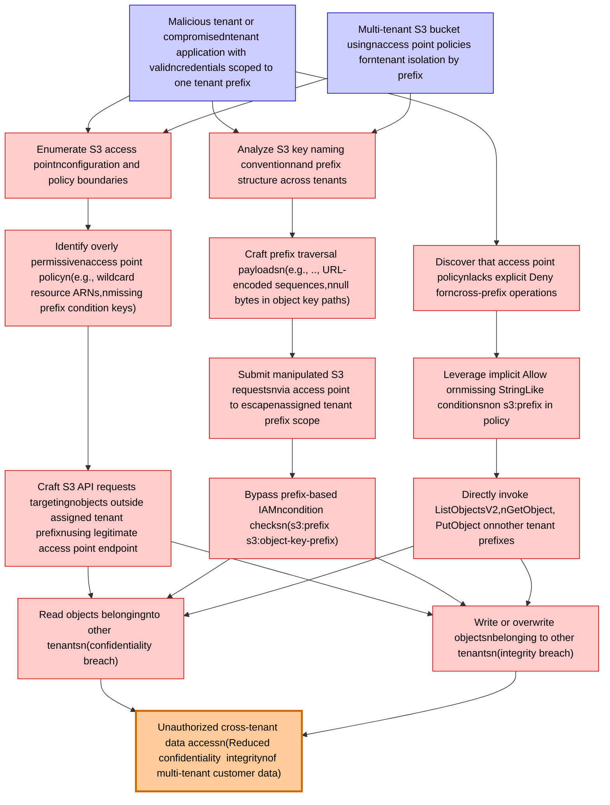

# Attack Tree: Multi-Tenancy Isolation

**Threat ID**: T003
**Statement**: A malicious tenant or compromised tenant application with valid credentials scoped to one tenant prefix, can exploit overly permissive access point policies or prefix traversal flaws to read or write objects belonging to other tenants, which leads to unauthorized cross-tenant data access, resulting in reduced confidentiality and integrity of multi-tenant customer data isolated by S3 access point policies.

## Attack Tree Diagram

## MITRE ATT&CK Mapping

This attack tree has been mapped to MITRE ATT&CK techniques:

### Enumerate S3 access pointnconfiguration and policy boundaries

- **Technique**: [T1602.001](https://attack.mitre.org/techniques/T1602/001/) - SNMP (MIB Dump)
- **Tactic**: Collection
- **Similarity Score**: 57.73%
- **Mitigations (6):**
  - 🛡️ **Software Configuration**
    Software configuration refers to making security-focused adjustments to the settings of applications, middleware, databa...
  - 🛡️ **Update Software**
    Software updates ensure systems are protected against known vulnerabilities by applying patches and upgrades provided by...
  - 🛡️ **Encrypt Sensitive Information**
    Protect sensitive information at rest, in transit, and during processing by using strong encryption algorithms. Encrypti...
  - *3 more mitigation(s) available*

### Multi-tenant S3 bucket usingnaccess point policies forntenant isolation by prefix

- **Technique**: [T1537](https://attack.mitre.org/techniques/T1537/) - Transfer Data to Cloud Account
- **Tactic**: Exfiltration
- **Similarity Score**: 63.51%
- **Mitigations (4):**
  - 🛡️ **Data Loss Prevention**
    Data Loss Prevention (DLP) involves implementing strategies and technologies to identify, categorize, monitor, and contr...
  - 🛡️ **User Account Management**
    User Account Management involves implementing and enforcing policies for the lifecycle of user accounts, including creat...
  - 🛡️ **Software Configuration**
    Software configuration refers to making security-focused adjustments to the settings of applications, middleware, databa...
  - *1 more mitigation(s) available*

### Analyze S3 key naming conventionnand prefix structure across tenants

- **Technique**: [T1595.003](https://attack.mitre.org/techniques/T1595/003/) - Wordlist Scanning
- **Tactic**: Reconnaissance
- **Similarity Score**: 59.80%
- **Mitigations (2):**
  - 🛡️ **Disable or Remove Feature or Program**
    Disable or remove unnecessary and potentially vulnerable software, features, or services to reduce the attack surface an...
  - 🛡️ **Pre-compromise**
    Pre-compromise mitigations involve proactive measures and defenses implemented to prevent adversaries from successfully ...

### Craft S3 API requests targetingnobjects outside assigned tenant prefixnusing legitimate access point endpoint

- **Technique**: [T1584.007](https://attack.mitre.org/techniques/T1584/007/) - Serverless
- **Tactic**: Resource Development
- **Similarity Score**: 48.08%
- **Mitigations (1):**
  - 🛡️ **Pre-compromise**
    Pre-compromise mitigations involve proactive measures and defenses implemented to prevent adversaries from successfully ...

### Discover that access point policynlacks explicit Deny forncross-prefix operations

- **Technique**: [T1557.004](https://attack.mitre.org/techniques/T1557/004/) - Evil Twin
- **Tactic**: Credential Access, Collection
- **Similarity Score**: 58.68%
- **Mitigations (2):**
  - 🛡️ **Network Intrusion Prevention**
    Use intrusion detection signatures to block traffic at network boundaries.
  - 🛡️ **User Training**
    User Training involves educating employees and contractors on recognizing, reporting, and preventing cyber threats that ...

### Bypass prefix-based IAMncondition checksn(s3:prefix  s3:object-key-prefix)

- **Technique**: [T1552.004](https://attack.mitre.org/techniques/T1552/004/) - Private Keys
- **Tactic**: Credential Access
- **Similarity Score**: 46.51%
- **Mitigations (4):**
  - 🛡️ **Password Policies**
    Set and enforce secure password policies for accounts to reduce the likelihood of unauthorized access. Strong password p...
  - 🛡️ **Restrict File and Directory Permissions**
    Restricting file and directory permissions involves setting access controls at the file system level to limit which user...
  - 🛡️ **Audit**
    Auditing is the process of recording activity and systematically reviewing and analyzing the activity and system configu...
  - *1 more mitigation(s) available*

### Write or overwrite objectsnbelonging to other tenantsn(integrity breach)

- **Technique**: [T1578.004](https://attack.mitre.org/techniques/T1578/004/) - Revert Cloud Instance
- **Tactic**: Defense Evasion
- **Similarity Score**: 60.67%

### Unauthorized cross-tenant data accessn(Reduced confidentiality  integritynof multi-tenant customer data)

- **Technique**: [T1530](https://attack.mitre.org/techniques/T1530/) - Data from Cloud Storage
- **Tactic**: Collection
- **Similarity Score**: 63.43%
- **Mitigations (6):**
  - 🛡️ **User Account Management**
    User Account Management involves implementing and enforcing policies for the lifecycle of user accounts, including creat...
  - 🛡️ **Encrypt Sensitive Information**
    Protect sensitive information at rest, in transit, and during processing by using strong encryption algorithms. Encrypti...
  - 🛡️ **Restrict File and Directory Permissions**
    Restricting file and directory permissions involves setting access controls at the file system level to limit which user...
  - *3 more mitigation(s) available*

### Identify overly permissivenaccess point policyn(e.g., wildcard resource ARNs,nmissing prefix condition keys)

- **Technique**: [T1615](https://attack.mitre.org/techniques/T1615/) - Group Policy Discovery
- **Tactic**: Discovery
- **Similarity Score**: 68.41%

### Leverage implicit Allow ornmissing StringLike conditionsnon s3:prefix in policy

- **Technique**: [T1564.014](https://attack.mitre.org/techniques/T1564/014/) - Extended Attributes
- **Tactic**: Defense Evasion
- **Similarity Score**: 44.93%
- **Mitigations (1):**
  - 🛡️ **Behavior Prevention on Endpoint**
    Behavior Prevention on Endpoint refers to the use of technologies and strategies to detect and block potentially malicio...

### Directly invoke ListObjectsV2,nGetObject, PutObject onnother tenant prefixes

- **Technique**: [T1547.015](https://attack.mitre.org/techniques/T1547/015/) - Login Items
- **Tactic**: Persistence, Privilege Escalation
- **Similarity Score**: 37.96%

### Read objects belongingnto other tenantsn(confidentiality breach)

- **Technique**: [T1530](https://attack.mitre.org/techniques/T1530/) - Data from Cloud Storage
- **Tactic**: Collection
- **Similarity Score**: 52.65%
- **Mitigations (6):**
  - 🛡️ **User Account Management**
    User Account Management involves implementing and enforcing policies for the lifecycle of user accounts, including creat...
  - 🛡️ **Encrypt Sensitive Information**
    Protect sensitive information at rest, in transit, and during processing by using strong encryption algorithms. Encrypti...
  - 🛡️ **Restrict File and Directory Permissions**
    Restricting file and directory permissions involves setting access controls at the file system level to limit which user...
  - *3 more mitigation(s) available*

### Malicious tenant or compromisedntenant application with validncredentials scoped to one tenant prefix

- **Technique**: [T1574.014](https://attack.mitre.org/techniques/T1574/014/) - AppDomainManager
- **Tactic**: Persistence, Privilege Escalation, Defense Evasion
- **Similarity Score**: 47.32%
- **Mitigations (1):**
  - 🛡️ **Restrict File and Directory Permissions**
    Restricting file and directory permissions involves setting access controls at the file system level to limit which user...

### Craft prefix traversal payloadsn(e.g., .., URL-encoded sequences,nnull bytes in object key paths)

- **Technique**: [T1036.002](https://attack.mitre.org/techniques/T1036/002/) - Right-to-Left Override
- **Tactic**: Defense Evasion
- **Similarity Score**: 50.47%

### Submit manipulated S3 requestsnvia access point to escapenassigned tenant prefix scope

- **Technique**: [T1568.001](https://attack.mitre.org/techniques/T1568/001/) - Fast Flux DNS
- **Tactic**: Command And Control
- **Similarity Score**: 48.61%

*Total technique mappings: 15 | Mitigations found: 33*

## Attack Path Analysis

Review this attack tree to:
1. Identify critical attack paths
2. Implement appropriate security controls
3. Monitor for indicators
4. Develop incident response procedures

---
*Generated by ThreatForest*
