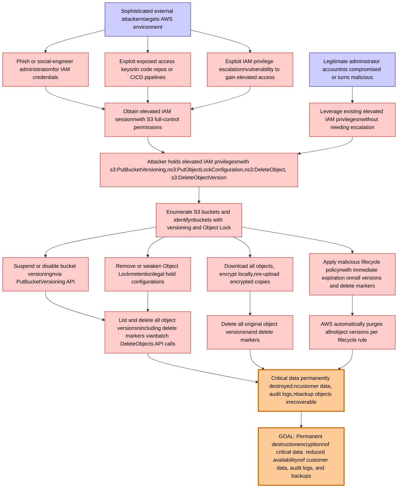

# Attack Tree: Data Destruction

**Threat ID**: T004
**Statement**: A sophisticated external attacker or compromised administrator with elevated IAM privileges, can disable bucket versioning, remove Object Lock configurations, or delete all object versions including delete markers, which leads to permanent destruction or encryption of critical data, resulting in reduced availability of customer data, audit logs, and backup objects protected by versioning and Object Lock.

## Attack Tree Diagram

## MITRE ATT&CK Mapping

This attack tree has been mapped to MITRE ATT&CK techniques:

### Phish or social-engineer administratornfor IAM credentials

- **Technique**: [T1556](https://attack.mitre.org/techniques/T1556/) - Modify Authentication Process
- **Tactic**: Credential Access, Defense Evasion, Persistence
- **Similarity Score**: 75.68%
- **Mitigations (9):**
  - 🛡️ **Restrict Registry Permissions**
    Restricting registry permissions involves configuring access control settings for sensitive registry keys and hives to e...
  - 🛡️ **Multi-factor Authentication**
    Multi-Factor Authentication (MFA) enhances security by requiring users to provide at least two forms of verification to ...
  - 🛡️ **Password Policies**
    Set and enforce secure password policies for accounts to reduce the likelihood of unauthorized access. Strong password p...
  - *6 more mitigation(s) available*

### Remove or weaken Object Locknretentionlegal hold configurations

- **Technique**: [T1653](https://attack.mitre.org/techniques/T1653/) - Power Settings
- **Tactic**: Persistence
- **Similarity Score**: 60.48%
- **Mitigations (1):**
  - 🛡️ **Audit**
    Auditing is the process of recording activity and systematically reviewing and analyzing the activity and system configu...

### Enumerate S3 buckets and identifynbuckets with versioning and Object Lock

- **Technique**: [T1619](https://attack.mitre.org/techniques/T1619/) - Cloud Storage Object Discovery
- **Tactic**: Discovery
- **Similarity Score**: 69.74%
- **Mitigations (1):**
  - 🛡️ **User Account Management**
    User Account Management involves implementing and enforcing policies for the lifecycle of user accounts, including creat...

### Exploit exposed access keysnin code repos or CICD pipelines

- **Technique**: [T1098.004](https://attack.mitre.org/techniques/T1098/004/) - SSH Authorized Keys
- **Tactic**: Persistence, Privilege Escalation
- **Similarity Score**: 54.53%
- **Mitigations (3):**
  - 🛡️ **User Account Management**
    User Account Management involves implementing and enforcing policies for the lifecycle of user accounts, including creat...
  - 🛡️ **Restrict File and Directory Permissions**
    Restricting file and directory permissions involves setting access controls at the file system level to limit which user...
  - 🛡️ **Disable or Remove Feature or Program**
    Disable or remove unnecessary and potentially vulnerable software, features, or services to reduce the attack surface an...

### Apply malicious lifecycle policynwith immediate expiration onnall versions and delete markers

- **Technique**: [T1070](https://attack.mitre.org/techniques/T1070/) - Indicator Removal
- **Tactic**: Defense Evasion
- **Similarity Score**: 59.98%
- **Mitigations (3):**
  - 🛡️ **Encrypt Sensitive Information**
    Protect sensitive information at rest, in transit, and during processing by using strong encryption algorithms. Encrypti...
  - 🛡️ **Remote Data Storage**
    Remote Data Storage focuses on moving critical data, such as security logs and sensitive files, to secure, off-host loca...
  - 🛡️ **Restrict File and Directory Permissions**
    Restricting file and directory permissions involves setting access controls at the file system level to limit which user...

### Critical data permanently destroyed:ncustomer data, audit logs,nbackup objects irrecoverable

- **Technique**: [T1485](https://attack.mitre.org/techniques/T1485/) - Data Destruction
- **Tactic**: Impact
- **Similarity Score**: 89.04%
- **Mitigations (3):**
  - 🛡️ **Multi-factor Authentication**
    Multi-Factor Authentication (MFA) enhances security by requiring users to provide at least two forms of verification to ...
  - 🛡️ **Data Backup**
    Data Backup involves taking and securely storing backups of data from end-user systems and critical servers. It ensures ...
  - 🛡️ **User Account Management**
    User Account Management involves implementing and enforcing policies for the lifecycle of user accounts, including creat...

### Suspend or disable bucket versioningnvia PutBucketVersioning API

- **Technique**: [T1485.001](https://attack.mitre.org/techniques/T1485/001/) - Lifecycle-Triggered Deletion
- **Tactic**: Impact
- **Similarity Score**: 68.94%
- **Mitigations (2):**
  - 🛡️ **User Account Management**
    User Account Management involves implementing and enforcing policies for the lifecycle of user accounts, including creat...
  - 🛡️ **Data Backup**
    Data Backup involves taking and securely storing backups of data from end-user systems and critical servers. It ensures ...

### Exploit IAM privilege escalationnvulnerability to gain elevated access

- **Technique**: [T1068](https://attack.mitre.org/techniques/T1068/) - Exploitation for Privilege Escalation
- **Tactic**: Privilege Escalation
- **Similarity Score**: 82.59%
- **Mitigations (5):**
  - 🛡️ **Update Software**
    Software updates ensure systems are protected against known vulnerabilities by applying patches and upgrades provided by...
  - 🛡️ **Exploit Protection**
    Deploy capabilities that detect, block, and mitigate conditions indicative of software exploits. These capabilities aim ...
  - 🛡️ **Application Isolation and Sandboxing**
    Application Isolation and Sandboxing refers to the technique of restricting the execution of code to a controlled and is...
  - *2 more mitigation(s) available*

### Leverage existing elevated IAM privilegesnwithout needing escalation

- **Technique**: [T1548.002](https://attack.mitre.org/techniques/T1548/002/) - Bypass User Account Control
- **Tactic**: Privilege Escalation, Defense Evasion
- **Similarity Score**: 86.40%
- **Mitigations (4):**
  - 🛡️ **Update Software**
    Software updates ensure systems are protected against known vulnerabilities by applying patches and upgrades provided by...
  - 🛡️ **Audit**
    Auditing is the process of recording activity and systematically reviewing and analyzing the activity and system configu...
  - 🛡️ **User Account Control**
    User Account Control (UAC) is a security feature in Microsoft Windows that prevents unauthorized changes to the operatin...
  - *1 more mitigation(s) available*

### List and delete all object versionsnincluding delete markers vianbatch DeleteObjects API calls

- **Technique**: [T1070.004](https://attack.mitre.org/techniques/T1070/004/) - File Deletion
- **Tactic**: Defense Evasion
- **Similarity Score**: 67.92%

### Download all objects, encrypt locally,nre-upload encrypted copies

- **Technique**: [T1560.001](https://attack.mitre.org/techniques/T1560/001/) - Archive via Utility
- **Tactic**: Collection
- **Similarity Score**: 78.55%
- **Mitigations (1):**
  - 🛡️ **Audit**
    Auditing is the process of recording activity and systematically reviewing and analyzing the activity and system configu...

### Delete all original object versionsnand delete markers

- **Technique**: [T1070.004](https://attack.mitre.org/techniques/T1070/004/) - File Deletion
- **Tactic**: Defense Evasion
- **Similarity Score**: 74.43%

### AWS automatically purges allnobject versions per lifecycle rule

- **Technique**: [T1485.001](https://attack.mitre.org/techniques/T1485/001/) - Lifecycle-Triggered Deletion
- **Tactic**: Impact
- **Similarity Score**: 75.59%
- **Mitigations (2):**
  - 🛡️ **User Account Management**
    User Account Management involves implementing and enforcing policies for the lifecycle of user accounts, including creat...
  - 🛡️ **Data Backup**
    Data Backup involves taking and securely storing backups of data from end-user systems and critical servers. It ensures ...

### GOAL: Permanent destructionencryptionnof critical data  reduced availabilitynof customer data, audit logs, and backups

- **Technique**: [T1485](https://attack.mitre.org/techniques/T1485/) - Data Destruction
- **Tactic**: Impact
- **Similarity Score**: 83.96%
- **Mitigations (3):**
  - 🛡️ **Multi-factor Authentication**
    Multi-Factor Authentication (MFA) enhances security by requiring users to provide at least two forms of verification to ...
  - 🛡️ **Data Backup**
    Data Backup involves taking and securely storing backups of data from end-user systems and critical servers. It ensures ...
  - 🛡️ **User Account Management**
    User Account Management involves implementing and enforcing policies for the lifecycle of user accounts, including creat...

### Sophisticated external attackerntargets AWS environment

- **Technique**: [T1583.007](https://attack.mitre.org/techniques/T1583/007/) - Serverless
- **Tactic**: Resource Development
- **Similarity Score**: 65.22%
- **Mitigations (1):**
  - 🛡️ **Pre-compromise**
    Pre-compromise mitigations involve proactive measures and defenses implemented to prevent adversaries from successfully ...

### Obtain elevated IAM sessionnwith S3 full-control permissions

- **Technique**: [T1134.005](https://attack.mitre.org/techniques/T1134/005/) - SID-History Injection
- **Tactic**: Defense Evasion, Privilege Escalation
- **Similarity Score**: 60.13%
- **Mitigations (1):**
  - 🛡️ **Active Directory Configuration**
    Implement robust Active Directory (AD) configurations using group policies to secure user accounts, control access, and ...

### Attacker holds elevated IAM privilegesnwith s3:PutBucketVersioning,ns3:PutObjectLockConfiguration,ns3:DeleteObject, s3:DeleteObjectVersion

- **Technique**: [T1548.006](https://attack.mitre.org/techniques/T1548/006/) - TCC Manipulation
- **Tactic**: Defense Evasion, Privilege Escalation
- **Similarity Score**: 71.53%
- **Mitigations (3):**
  - 🛡️ **Privileged Account Management**
    Privileged Account Management focuses on implementing policies, controls, and tools to securely manage privileged accoun...
  - 🛡️ **Audit**
    Auditing is the process of recording activity and systematically reviewing and analyzing the activity and system configu...
  - 🛡️ **Restrict File and Directory Permissions**
    Restricting file and directory permissions involves setting access controls at the file system level to limit which user...

### Legitimate administrator accountnis compromised or turns malicious

- **Technique**: [T1098](https://attack.mitre.org/techniques/T1098/) - Account Manipulation
- **Tactic**: Persistence, Privilege Escalation
- **Similarity Score**: 81.84%
- **Mitigations (7):**
  - 🛡️ **Network Segmentation**
    Network segmentation involves dividing a network into smaller, isolated segments to control and limit the flow of traffi...
  - 🛡️ **Disable or Remove Feature or Program**
    Disable or remove unnecessary and potentially vulnerable software, features, or services to reduce the attack surface an...
  - 🛡️ **User Account Management**
    User Account Management involves implementing and enforcing policies for the lifecycle of user accounts, including creat...
  - *4 more mitigation(s) available*

*Total technique mappings: 18 | Mitigations found: 49*

## Attack Path Analysis

Review this attack tree to:
1. Identify critical attack paths
2. Implement appropriate security controls
3. Monitor for indicators
4. Develop incident response procedures

---
*Generated by ThreatForest*
