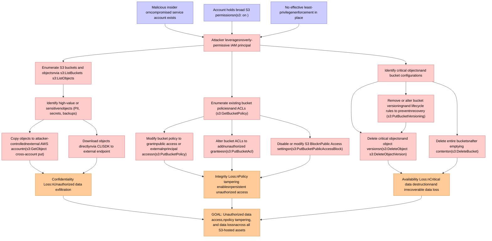

# Attack Tree: Insider Threat

**Threat ID**: T005
**Statement**: A malicious insider or compromised service account with broad S3 permissions (e.g., `s3:*` on `*`), can exfiltrate data to external accounts, modify bucket policies to grant unauthorized access, or delete critical objects, which leads to unauthorized data access, policy tampering, and data loss, resulting in reduced confidentiality, integrity, and availability of all S3-hosted assets.

## Attack Tree Diagram

## MITRE ATT&CK Mapping

This attack tree has been mapped to MITRE ATT&CK techniques:

### Identify high-value or sensitivenobjects (PII, secrets, backups)

- **Technique**: [T1005](https://attack.mitre.org/techniques/T1005/) - Data from Local System
- **Tactic**: Collection
- **Similarity Score**: 72.07%
- **Mitigations (1):**
  - 🛡️ **Data Loss Prevention**
    Data Loss Prevention (DLP) involves implementing strategies and technologies to identify, categorize, monitor, and contr...

### Enumerate S3 buckets and objectsnvia s3:ListBuckets  s3:ListObjects

- **Technique**: [T1619](https://attack.mitre.org/techniques/T1619/) - Cloud Storage Object Discovery
- **Tactic**: Discovery
- **Similarity Score**: 77.08%
- **Mitigations (1):**
  - 🛡️ **User Account Management**
    User Account Management involves implementing and enforcing policies for the lifecycle of user accounts, including creat...

### Attacker leveragesnoverly-permissive IAM principal

- **Technique**: [T1484](https://attack.mitre.org/techniques/T1484/) - Domain or Tenant Policy Modification
- **Tactic**: Defense Evasion, Privilege Escalation
- **Similarity Score**: 61.27%
- **Mitigations (3):**
  - 🛡️ **Audit**
    Auditing is the process of recording activity and systematically reviewing and analyzing the activity and system configu...
  - 🛡️ **Privileged Account Management**
    Privileged Account Management focuses on implementing policies, controls, and tools to securely manage privileged accoun...
  - 🛡️ **User Account Management**
    User Account Management involves implementing and enforcing policies for the lifecycle of user accounts, including creat...

### Disable or modify S3 BlocknPublic Access settingsn(s3:PutBucketPublicAccessBlock)

- **Technique**: [T1485.001](https://attack.mitre.org/techniques/T1485/001/) - Lifecycle-Triggered Deletion
- **Tactic**: Impact
- **Similarity Score**: 62.95%
- **Mitigations (2):**
  - 🛡️ **User Account Management**
    User Account Management involves implementing and enforcing policies for the lifecycle of user accounts, including creat...
  - 🛡️ **Data Backup**
    Data Backup involves taking and securely storing backups of data from end-user systems and critical servers. It ensures ...

### GOAL: Unauthorized data access,npolicy tampering, and data lossnacross all S3-hosted assets

- **Technique**: [T1567.002](https://attack.mitre.org/techniques/T1567/002/) - Exfiltration to Cloud Storage
- **Tactic**: Exfiltration
- **Similarity Score**: 66.55%
- **Mitigations (1):**
  - 🛡️ **Restrict Web-Based Content**
    Restricting web-based content involves enforcing policies and technologies that limit access to potentially malicious we...

### Delete critical objectsnand object versionsn(s3:DeleteObject  s3:DeleteObjectVersion)

- **Technique**: [T1070.004](https://attack.mitre.org/techniques/T1070/004/) - File Deletion
- **Tactic**: Defense Evasion
- **Similarity Score**: 80.10%

### Confidentiality Loss:nUnauthorized data exfiltration

- **Technique**: [T1020](https://attack.mitre.org/techniques/T1020/) - Automated Exfiltration
- **Tactic**: Exfiltration
- **Similarity Score**: 80.65%

### Availability Loss:nCritical data destructionnand irrecoverable data loss

- **Technique**: [T1485](https://attack.mitre.org/techniques/T1485/) - Data Destruction
- **Tactic**: Impact
- **Similarity Score**: 78.20%
- **Mitigations (3):**
  - 🛡️ **Multi-factor Authentication**
    Multi-Factor Authentication (MFA) enhances security by requiring users to provide at least two forms of verification to ...
  - 🛡️ **Data Backup**
    Data Backup involves taking and securely storing backups of data from end-user systems and critical servers. It ensures ...
  - 🛡️ **User Account Management**
    User Account Management involves implementing and enforcing policies for the lifecycle of user accounts, including creat...

### Modify bucket policy to grantnpublic access or externalnprincipal accessn(s3:PutBucketPolicy)

- **Technique**: [T1537](https://attack.mitre.org/techniques/T1537/) - Transfer Data to Cloud Account
- **Tactic**: Exfiltration
- **Similarity Score**: 57.59%
- **Mitigations (4):**
  - 🛡️ **Data Loss Prevention**
    Data Loss Prevention (DLP) involves implementing strategies and technologies to identify, categorize, monitor, and contr...
  - 🛡️ **User Account Management**
    User Account Management involves implementing and enforcing policies for the lifecycle of user accounts, including creat...
  - 🛡️ **Software Configuration**
    Software configuration refers to making security-focused adjustments to the settings of applications, middleware, databa...
  - *1 more mitigation(s) available*

### Copy objects to attacker-controllednexternal AWS accountn(s3:GetObject  cross-account put)

- **Technique**: [T1537](https://attack.mitre.org/techniques/T1537/) - Transfer Data to Cloud Account
- **Tactic**: Exfiltration
- **Similarity Score**: 79.40%
- **Mitigations (4):**
  - 🛡️ **Data Loss Prevention**
    Data Loss Prevention (DLP) involves implementing strategies and technologies to identify, categorize, monitor, and contr...
  - 🛡️ **User Account Management**
    User Account Management involves implementing and enforcing policies for the lifecycle of user accounts, including creat...
  - 🛡️ **Software Configuration**
    Software configuration refers to making security-focused adjustments to the settings of applications, middleware, databa...
  - *1 more mitigation(s) available*

### Download objects directlynvia CLISDK to external endpoint

- **Technique**: [T1105](https://attack.mitre.org/techniques/T1105/) - Ingress Tool Transfer
- **Tactic**: Command And Control
- **Similarity Score**: 64.01%
- **Mitigations (2):**
  - 🛡️ **Network Intrusion Prevention**
    Use intrusion detection signatures to block traffic at network boundaries.
  - 🛡️ **Filter Network Traffic**
    Employ network appliances and endpoint software to filter ingress, egress, and lateral network traffic. This includes pr...

### Alter bucket ACLs to addnunauthorized granteesn(s3:PutBucketAcl)

- **Technique**: [T1222.002](https://attack.mitre.org/techniques/T1222/002/) - Linux and Mac File and Directory Permissions Modification
- **Tactic**: Defense Evasion
- **Similarity Score**: 61.25%
- **Mitigations (2):**
  - 🛡️ **Restrict File and Directory Permissions**
    Restricting file and directory permissions involves setting access controls at the file system level to limit which user...
  - 🛡️ **Privileged Account Management**
    Privileged Account Management focuses on implementing policies, controls, and tools to securely manage privileged accoun...

### Delete entire bucketsnafter emptying contentsn(s3:DeleteBucket)

- **Technique**: [T1485.001](https://attack.mitre.org/techniques/T1485/001/) - Lifecycle-Triggered Deletion
- **Tactic**: Impact
- **Similarity Score**: 103.99%
- **Mitigations (2):**
  - 🛡️ **User Account Management**
    User Account Management involves implementing and enforcing policies for the lifecycle of user accounts, including creat...
  - 🛡️ **Data Backup**
    Data Backup involves taking and securely storing backups of data from end-user systems and critical servers. It ensures ...

### No effective least-privilegenenforcement in place

- **Technique**: [T1548.002](https://attack.mitre.org/techniques/T1548/002/) - Bypass User Account Control
- **Tactic**: Privilege Escalation, Defense Evasion
- **Similarity Score**: 77.71%
- **Mitigations (4):**
  - 🛡️ **Update Software**
    Software updates ensure systems are protected against known vulnerabilities by applying patches and upgrades provided by...
  - 🛡️ **Audit**
    Auditing is the process of recording activity and systematically reviewing and analyzing the activity and system configu...
  - 🛡️ **User Account Control**
    User Account Control (UAC) is a security feature in Microsoft Windows that prevents unauthorized changes to the operatin...
  - *1 more mitigation(s) available*

### Account holds broad S3 permissionsn(s3: on )

- **Technique**: [T1537](https://attack.mitre.org/techniques/T1537/) - Transfer Data to Cloud Account
- **Tactic**: Exfiltration
- **Similarity Score**: 61.02%
- **Mitigations (4):**
  - 🛡️ **Data Loss Prevention**
    Data Loss Prevention (DLP) involves implementing strategies and technologies to identify, categorize, monitor, and contr...
  - 🛡️ **User Account Management**
    User Account Management involves implementing and enforcing policies for the lifecycle of user accounts, including creat...
  - 🛡️ **Software Configuration**
    Software configuration refers to making security-focused adjustments to the settings of applications, middleware, databa...
  - *1 more mitigation(s) available*

### Malicious insider orncompromised service account exists

- **Technique**: [T1136](https://attack.mitre.org/techniques/T1136/) - Create Account
- **Tactic**: Persistence
- **Similarity Score**: 75.99%
- **Mitigations (4):**
  - 🛡️ **Network Segmentation**
    Network segmentation involves dividing a network into smaller, isolated segments to control and limit the flow of traffi...
  - 🛡️ **Operating System Configuration**
    Operating System Configuration involves adjusting system settings and hardening the default configurations of an operati...
  - 🛡️ **Multi-factor Authentication**
    Multi-Factor Authentication (MFA) enhances security by requiring users to provide at least two forms of verification to ...
  - *1 more mitigation(s) available*

### Identify critical objectsnand bucket configurations

- **Technique**: [T1619](https://attack.mitre.org/techniques/T1619/) - Cloud Storage Object Discovery
- **Tactic**: Discovery
- **Similarity Score**: 69.97%
- **Mitigations (1):**
  - 🛡️ **User Account Management**
    User Account Management involves implementing and enforcing policies for the lifecycle of user accounts, including creat...

### Remove or alter bucket versioningnand lifecycle rules to preventnrecovery (s3:PutBucketVersioning)

- **Technique**: [T1485.001](https://attack.mitre.org/techniques/T1485/001/) - Lifecycle-Triggered Deletion
- **Tactic**: Impact
- **Similarity Score**: 79.74%
- **Mitigations (2):**
  - 🛡️ **User Account Management**
    User Account Management involves implementing and enforcing policies for the lifecycle of user accounts, including creat...
  - 🛡️ **Data Backup**
    Data Backup involves taking and securely storing backups of data from end-user systems and critical servers. It ensures ...

### Enumerate existing bucket policiesnand ACLs (s3:GetBucketPolicy)

- **Technique**: [T1069.003](https://attack.mitre.org/techniques/T1069/003/) - Cloud Groups
- **Tactic**: Discovery
- **Similarity Score**: 72.42%

### Integrity Loss:nPolicy tampering enablesnpersistent unauthorized access

- **Technique**: [T1222](https://attack.mitre.org/techniques/T1222/) - File and Directory Permissions Modification
- **Tactic**: Defense Evasion
- **Similarity Score**: 62.04%
- **Mitigations (2):**
  - 🛡️ **Restrict File and Directory Permissions**
    Restricting file and directory permissions involves setting access controls at the file system level to limit which user...
  - 🛡️ **Privileged Account Management**
    Privileged Account Management focuses on implementing policies, controls, and tools to securely manage privileged accoun...

*Total technique mappings: 20 | Mitigations found: 42*

## Attack Path Analysis

Review this attack tree to:
1. Identify critical attack paths
2. Implement appropriate security controls
3. Monitor for indicators
4. Develop incident response procedures

---
*Generated by ThreatForest*
