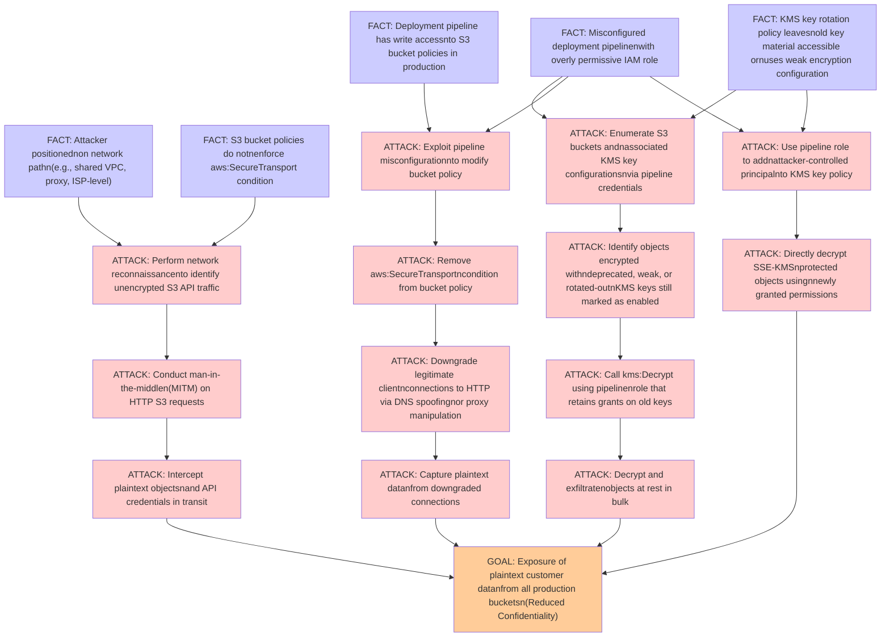

# Attack Tree: Encryption

**Threat ID**: T006
**Statement**: An attacker positioned on the network path or a misconfigured deployment pipeline, can intercept data in transit by exploiting missing TLS enforcement or access objects encrypted with weak or rotated-out KMS keys, which leads to exposure of plaintext customer data, resulting in reduced confidentiality of objects in transit and at rest across all production buckets.

## Attack Tree Diagram

## MITRE ATT&CK Mapping

This attack tree has been mapped to MITRE ATT&CK techniques:

### ATTACK: Use pipeline role to addnattacker-controlled principalnto KMS key policy

- **Technique**: [T1098.004](https://attack.mitre.org/techniques/T1098/004/) - SSH Authorized Keys
- **Tactic**: Persistence, Privilege Escalation
- **Similarity Score**: 54.22%
- **Mitigations (3):**
  - 🛡️ **User Account Management**
    User Account Management involves implementing and enforcing policies for the lifecycle of user accounts, including creat...
  - 🛡️ **Restrict File and Directory Permissions**
    Restricting file and directory permissions involves setting access controls at the file system level to limit which user...
  - 🛡️ **Disable or Remove Feature or Program**
    Disable or remove unnecessary and potentially vulnerable software, features, or services to reduce the attack surface an...

### ATTACK: Conduct man-in-the-middlen(MITM) on HTTP S3 requests

- **Technique**: [T1001.003](https://attack.mitre.org/techniques/T1001/003/) - Protocol or Service Impersonation
- **Tactic**: Command And Control
- **Similarity Score**: 52.17%
- **Mitigations (1):**
  - 🛡️ **Network Intrusion Prevention**
    Use intrusion detection signatures to block traffic at network boundaries.

### ATTACK: Identify objects encrypted withndeprecated, weak, or rotated-outnKMS keys still marked as enabled

- **Technique**: [T1480.001](https://attack.mitre.org/techniques/T1480/001/) - Environmental Keying
- **Tactic**: Defense Evasion
- **Similarity Score**: 73.64%
- **Mitigations (1):**
  - 🛡️ **Do Not Mitigate**
    The Do Not Mitigate category highlights scenarios where attempting to mitigate a specific technique may inadvertently in...

### ATTACK: Decrypt and exfiltratenobjects at rest in bulk

- **Technique**: [T1560.001](https://attack.mitre.org/techniques/T1560/001/) - Archive via Utility
- **Tactic**: Collection
- **Similarity Score**: 81.44%
- **Mitigations (1):**
  - 🛡️ **Audit**
    Auditing is the process of recording activity and systematically reviewing and analyzing the activity and system configu...

### ATTACK: Call kms:Decrypt using pipelinenrole that retains grants on old keys

- **Technique**: [T1480.001](https://attack.mitre.org/techniques/T1480/001/) - Environmental Keying
- **Tactic**: Defense Evasion
- **Similarity Score**: 57.02%
- **Mitigations (1):**
  - 🛡️ **Do Not Mitigate**
    The Do Not Mitigate category highlights scenarios where attempting to mitigate a specific technique may inadvertently in...

### FACT: Deployment pipeline has write accessnto S3 bucket policies in production

- **Technique**: [T1485.001](https://attack.mitre.org/techniques/T1485/001/) - Lifecycle-Triggered Deletion
- **Tactic**: Impact
- **Similarity Score**: 70.68%
- **Mitigations (2):**
  - 🛡️ **User Account Management**
    User Account Management involves implementing and enforcing policies for the lifecycle of user accounts, including creat...
  - 🛡️ **Data Backup**
    Data Backup involves taking and securely storing backups of data from end-user systems and critical servers. It ensures ...

### FACT: Misconfigured deployment pipelinenwith overly permissive IAM role

- **Technique**: [T1017](https://attack.mitre.org/techniques/T1017/) - Application Deployment Software
- **Tactic**: Lateral Movement
- **Similarity Score**: 56.59%

### FACT: S3 bucket policies do notnenforce aws:SecureTransport condition

- **Technique**: [T1537](https://attack.mitre.org/techniques/T1537/) - Transfer Data to Cloud Account
- **Tactic**: Exfiltration
- **Similarity Score**: 63.76%
- **Mitigations (4):**
  - 🛡️ **Data Loss Prevention**
    Data Loss Prevention (DLP) involves implementing strategies and technologies to identify, categorize, monitor, and contr...
  - 🛡️ **User Account Management**
    User Account Management involves implementing and enforcing policies for the lifecycle of user accounts, including creat...
  - 🛡️ **Software Configuration**
    Software configuration refers to making security-focused adjustments to the settings of applications, middleware, databa...
  - *1 more mitigation(s) available*

### GOAL: Exposure of plaintext customer datanfrom all production bucketsn(Reduced Confidentiality)

- **Technique**: [T1567.003](https://attack.mitre.org/techniques/T1567/003/) - Exfiltration to Text Storage Sites
- **Tactic**: Exfiltration
- **Similarity Score**: 73.83%
- **Mitigations (1):**
  - 🛡️ **Restrict Web-Based Content**
    Restricting web-based content involves enforcing policies and technologies that limit access to potentially malicious we...

### ATTACK: Intercept plaintext objectsnand API credentials in transit

- **Technique**: [T1552](https://attack.mitre.org/techniques/T1552/) - Unsecured Credentials
- **Tactic**: Credential Access
- **Similarity Score**: 70.14%
- **Mitigations (11):**
  - 🛡️ **Encrypt Sensitive Information**
    Protect sensitive information at rest, in transit, and during processing by using strong encryption algorithms. Encrypti...
  - 🛡️ **Update Software**
    Software updates ensure systems are protected against known vulnerabilities by applying patches and upgrades provided by...
  - 🛡️ **User Training**
    User Training involves educating employees and contractors on recognizing, reporting, and preventing cyber threats that ...
  - *8 more mitigation(s) available*

### ATTACK: Downgrade legitimate clientnconnections to HTTP via DNS spoofingnor proxy manipulation

- **Technique**: [T1090](https://attack.mitre.org/techniques/T1090/) - Proxy
- **Tactic**: Command And Control
- **Similarity Score**: 81.59%
- **Mitigations (3):**
  - 🛡️ **Filter Network Traffic**
    Employ network appliances and endpoint software to filter ingress, egress, and lateral network traffic. This includes pr...
  - 🛡️ **Network Intrusion Prevention**
    Use intrusion detection signatures to block traffic at network boundaries.
  - 🛡️ **SSL/TLS Inspection**
    SSL/TLS inspection involves decrypting encrypted network traffic to examine its content for signs of malicious activity....

### ATTACK: Remove aws:SecureTransportncondition from bucket policy

- **Technique**: [T1578](https://attack.mitre.org/techniques/T1578/) - Modify Cloud Compute Infrastructure
- **Tactic**: Defense Evasion
- **Similarity Score**: 59.01%
- **Mitigations (2):**
  - 🛡️ **User Account Management**
    User Account Management involves implementing and enforcing policies for the lifecycle of user accounts, including creat...
  - 🛡️ **Audit**
    Auditing is the process of recording activity and systematically reviewing and analyzing the activity and system configu...

### FACT: Attacker positionednon network pathn(e.g., shared VPC, proxy, ISP-level)

- **Technique**: [T1557](https://attack.mitre.org/techniques/T1557/) - Adversary-in-the-Middle
- **Tactic**: Credential Access, Collection
- **Similarity Score**: 67.64%
- **Mitigations (7):**
  - 🛡️ **Filter Network Traffic**
    Employ network appliances and endpoint software to filter ingress, egress, and lateral network traffic. This includes pr...
  - 🛡️ **Encrypt Sensitive Information**
    Protect sensitive information at rest, in transit, and during processing by using strong encryption algorithms. Encrypti...
  - 🛡️ **Limit Access to Resource Over Network**
    Restrict access to network resources, such as file shares, remote systems, and services, to only those users, accounts, ...
  - *4 more mitigation(s) available*

### ATTACK: Perform network reconnaissancento identify unencrypted S3 API traffic

- **Technique**: [T1040](https://attack.mitre.org/techniques/T1040/) - Network Sniffing
- **Tactic**: Credential Access, Discovery
- **Similarity Score**: 67.12%
- **Mitigations (4):**
  - 🛡️ **User Account Management**
    User Account Management involves implementing and enforcing policies for the lifecycle of user accounts, including creat...
  - 🛡️ **Multi-factor Authentication**
    Multi-Factor Authentication (MFA) enhances security by requiring users to provide at least two forms of verification to ...
  - 🛡️ **Encrypt Sensitive Information**
    Protect sensitive information at rest, in transit, and during processing by using strong encryption algorithms. Encrypti...
  - *1 more mitigation(s) available*

### ATTACK: Enumerate S3 buckets andnassociated KMS key configurationsnvia pipeline credentials

- **Technique**: [T1555.006](https://attack.mitre.org/techniques/T1555/006/) - Cloud Secrets Management Stores
- **Tactic**: Credential Access
- **Similarity Score**: 61.04%
- **Mitigations (1):**
  - 🛡️ **Privileged Account Management**
    Privileged Account Management focuses on implementing policies, controls, and tools to securely manage privileged accoun...

### ATTACK: Capture plaintext datanfrom downgraded connections

- **Technique**: [T1048.003](https://attack.mitre.org/techniques/T1048/003/) - Exfiltration Over Unencrypted Non-C2 Protocol
- **Tactic**: Exfiltration
- **Similarity Score**: 60.41%
- **Mitigations (4):**
  - 🛡️ **Network Intrusion Prevention**
    Use intrusion detection signatures to block traffic at network boundaries.
  - 🛡️ **Data Loss Prevention**
    Data Loss Prevention (DLP) involves implementing strategies and technologies to identify, categorize, monitor, and contr...
  - 🛡️ **Filter Network Traffic**
    Employ network appliances and endpoint software to filter ingress, egress, and lateral network traffic. This includes pr...
  - *1 more mitigation(s) available*

### ATTACK: Exploit pipeline misconfigurationnto modify bucket policy

- **Technique**: [T1578.005](https://attack.mitre.org/techniques/T1578/005/) - Modify Cloud Compute Configurations
- **Tactic**: Defense Evasion
- **Similarity Score**: 56.26%
- **Mitigations (2):**
  - 🛡️ **User Account Management**
    User Account Management involves implementing and enforcing policies for the lifecycle of user accounts, including creat...
  - 🛡️ **Audit**
    Auditing is the process of recording activity and systematically reviewing and analyzing the activity and system configu...

### FACT: KMS key rotation policy leavesnold key material accessible ornuses weak encryption configuration

- **Technique**: [T1145](https://attack.mitre.org/techniques/T1145/) - Private Keys
- **Tactic**: Credential Access
- **Similarity Score**: 67.77%

### ATTACK: Directly decrypt SSE-KMSnprotected objects usingnnewly granted permissions

- **Technique**: [T1140](https://attack.mitre.org/techniques/T1140/) - Deobfuscate/Decode Files or Information
- **Tactic**: Defense Evasion
- **Similarity Score**: 65.49%

*Total technique mappings: 19 | Mitigations found: 48*

## Attack Path Analysis

Review this attack tree to:
1. Identify critical attack paths
2. Implement appropriate security controls
3. Monitor for indicators
4. Develop incident response procedures

---
*Generated by ThreatForest*
