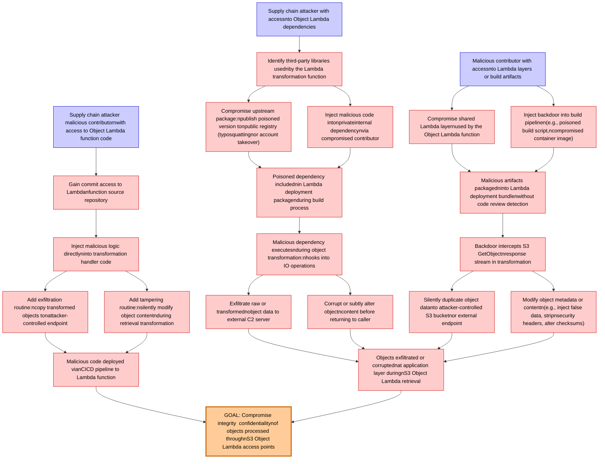

# Attack Tree: Supply Chain

**Threat ID**: T007
**Statement**: A supply chain attacker or malicious contributor with access to the Object Lambda function code or its dependencies, can inject malicious logic into the transformation pipeline to exfiltrate, modify, or corrupt objects during retrieval, which leads to data tampering and exfiltration at the application layer, resulting in reduced integrity and confidentiality of objects processed through S3 Object Lambda access points.

## Attack Tree Diagram

## MITRE ATT&CK Mapping

This attack tree has been mapped to MITRE ATT&CK techniques:

### Add tampering routine:nsilently modify object contentnduring retrieval transformation

- **Technique**: [T1565.003](https://attack.mitre.org/techniques/T1565/003/) - Runtime Data Manipulation
- **Tactic**: Impact
- **Similarity Score**: 55.26%
- **Mitigations (2):**
  - 🛡️ **Network Segmentation**
    Network segmentation involves dividing a network into smaller, isolated segments to control and limit the flow of traffi...
  - 🛡️ **Restrict File and Directory Permissions**
    Restricting file and directory permissions involves setting access controls at the file system level to limit which user...

### Backdoor intercepts S3 GetObjectnresponse stream in transformation

- **Technique**: [T1041](https://attack.mitre.org/techniques/T1041/) - Exfiltration Over C2 Channel
- **Tactic**: Exfiltration
- **Similarity Score**: 50.29%
- **Mitigations (2):**
  - 🛡️ **Network Intrusion Prevention**
    Use intrusion detection signatures to block traffic at network boundaries.
  - 🛡️ **Data Loss Prevention**
    Data Loss Prevention (DLP) involves implementing strategies and technologies to identify, categorize, monitor, and contr...

### Malicious code deployed vianCICD pipeline to Lambda function

- **Technique**: [T1677](https://attack.mitre.org/techniques/T1677/) - Poisoned Pipeline Execution
- **Tactic**: Execution
- **Similarity Score**: 42.92%
- **Mitigations (2):**
  - 🛡️ **User Account Management**
    User Account Management involves implementing and enforcing policies for the lifecycle of user accounts, including creat...
  - 🛡️ **Software Configuration**
    Software configuration refers to making security-focused adjustments to the settings of applications, middleware, databa...

### Inject malicious logic directlyninto transformation handler code

- **Technique**: [T1036](https://attack.mitre.org/techniques/T1036/) - Masquerading
- **Tactic**: Defense Evasion
- **Similarity Score**: 48.56%
- **Mitigations (8):**
  - 🛡️ **Audit**
    Auditing is the process of recording activity and systematically reviewing and analyzing the activity and system configu...
  - 🛡️ **User Account Management**
    User Account Management involves implementing and enforcing policies for the lifecycle of user accounts, including creat...
  - 🛡️ **User Training**
    User Training involves educating employees and contractors on recognizing, reporting, and preventing cyber threats that ...
  - *5 more mitigation(s) available*

### Malicious dependency executesnduring object transformation:nhooks into IO operations

- **Technique**: [T1179](https://attack.mitre.org/techniques/T1179/) - Hooking
- **Tactic**: Persistence, Privilege Escalation, Credential Access
- **Similarity Score**: 46.99%

### Objects exfiltrated or corruptednat application layer duringnS3 Object Lambda retrieval

- **Technique**: [T1020](https://attack.mitre.org/techniques/T1020/) - Automated Exfiltration
- **Tactic**: Exfiltration
- **Similarity Score**: 60.75%

### Corrupt or subtly alter objectncontent before returning to caller

- **Technique**: [T1122](https://attack.mitre.org/techniques/T1122/) - Component Object Model Hijacking
- **Tactic**: Defense Evasion, Persistence
- **Similarity Score**: 51.36%

### Modify object metadata or contentn(e.g., inject false data, stripnsecurity headers, alter checksums)

- **Technique**: [T1565.003](https://attack.mitre.org/techniques/T1565/003/) - Runtime Data Manipulation
- **Tactic**: Impact
- **Similarity Score**: 64.76%
- **Mitigations (2):**
  - 🛡️ **Network Segmentation**
    Network segmentation involves dividing a network into smaller, isolated segments to control and limit the flow of traffi...
  - 🛡️ **Restrict File and Directory Permissions**
    Restricting file and directory permissions involves setting access controls at the file system level to limit which user...

### Silently duplicate object datanto attacker-controlled S3 bucketnor external endpoint

- **Technique**: [T1074.002](https://attack.mitre.org/techniques/T1074/002/) - Remote Data Staging
- **Tactic**: Collection
- **Similarity Score**: 61.54%

### Supply chain attacker with accessnto Object Lambda dependencies

- **Technique**: [T1195](https://attack.mitre.org/techniques/T1195/) - Supply Chain Compromise
- **Tactic**: Initial Access
- **Similarity Score**: 52.82%
- **Mitigations (6):**
  - 🛡️ **Boot Integrity**
    Boot Integrity ensures that a system starts securely by verifying the integrity of its boot process, operating system, a...
  - 🛡️ **Application Developer Guidance**
    Application Developer Guidance focuses on providing developers with the knowledge, tools, and best practices needed to w...
  - 🛡️ **Update Software**
    Software updates ensure systems are protected against known vulnerabilities by applying patches and upgrades provided by...
  - *3 more mitigation(s) available*

### Add exfiltration routine:ncopy transformed objects tonattacker-controlled endpoint

- **Technique**: [T1020](https://attack.mitre.org/techniques/T1020/) - Automated Exfiltration
- **Tactic**: Exfiltration
- **Similarity Score**: 62.49%

### Supply chain attacker  malicious contributornwith access to Object Lambda function code

- **Technique**: [T1195](https://attack.mitre.org/techniques/T1195/) - Supply Chain Compromise
- **Tactic**: Initial Access
- **Similarity Score**: 46.89%
- **Mitigations (6):**
  - 🛡️ **Boot Integrity**
    Boot Integrity ensures that a system starts securely by verifying the integrity of its boot process, operating system, a...
  - 🛡️ **Application Developer Guidance**
    Application Developer Guidance focuses on providing developers with the knowledge, tools, and best practices needed to w...
  - 🛡️ **Update Software**
    Software updates ensure systems are protected against known vulnerabilities by applying patches and upgrades provided by...
  - *3 more mitigation(s) available*

### Exfiltrate raw or transformednobject data to external C2 server

- **Technique**: [T1048](https://attack.mitre.org/techniques/T1048/) - Exfiltration Over Alternative Protocol
- **Tactic**: Exfiltration
- **Similarity Score**: 79.48%
- **Mitigations (6):**
  - 🛡️ **Network Segmentation**
    Network segmentation involves dividing a network into smaller, isolated segments to control and limit the flow of traffi...
  - 🛡️ **Data Loss Prevention**
    Data Loss Prevention (DLP) involves implementing strategies and technologies to identify, categorize, monitor, and contr...
  - 🛡️ **Filter Network Traffic**
    Employ network appliances and endpoint software to filter ingress, egress, and lateral network traffic. This includes pr...
  - *3 more mitigation(s) available*

### Identify third-party libraries usednby the Lambda transformation function

- **Technique**: [T1027.008](https://attack.mitre.org/techniques/T1027/008/) - Stripped Payloads
- **Tactic**: Defense Evasion
- **Similarity Score**: 34.19%

### GOAL: Compromise integrity  confidentialitynof objects processed throughnS3 Object Lambda access points

- **Technique**: [T1565.002](https://attack.mitre.org/techniques/T1565/002/) - Transmitted Data Manipulation
- **Tactic**: Impact
- **Similarity Score**: 47.29%
- **Mitigations (1):**
  - 🛡️ **Encrypt Sensitive Information**
    Protect sensitive information at rest, in transit, and during processing by using strong encryption algorithms. Encrypti...

### Inject malicious code intonprivateinternal dependencynvia compromised contributor

- **Technique**: [T1195.001](https://attack.mitre.org/techniques/T1195/001/) - Compromise Software Dependencies and Development Tools
- **Tactic**: Initial Access
- **Similarity Score**: 66.64%
- **Mitigations (4):**
  - 🛡️ **Limit Software Installation**
    Prevent users or groups from installing unauthorized or unapproved software to reduce the risk of introducing malicious ...
  - 🛡️ **Vulnerability Scanning**
    Vulnerability scanning involves the automated or manual assessment of systems, applications, and networks to identify mi...
  - 🛡️ **Update Software**
    Software updates ensure systems are protected against known vulnerabilities by applying patches and upgrades provided by...
  - *1 more mitigation(s) available*

### Compromise shared Lambda layernused by the Object Lambda function

- **Technique**: [T1559.001](https://attack.mitre.org/techniques/T1559/001/) - Component Object Model
- **Tactic**: Execution
- **Similarity Score**: 37.14%
- **Mitigations (2):**
  - 🛡️ **Privileged Account Management**
    Privileged Account Management focuses on implementing policies, controls, and tools to securely manage privileged accoun...
  - 🛡️ **Application Isolation and Sandboxing**
    Application Isolation and Sandboxing refers to the technique of restricting the execution of code to a controlled and is...

### Malicious artifacts packagedninto Lambda deployment bundlenwithout code review detection

- **Technique**: [T1195.001](https://attack.mitre.org/techniques/T1195/001/) - Compromise Software Dependencies and Development Tools
- **Tactic**: Initial Access
- **Similarity Score**: 63.23%
- **Mitigations (4):**
  - 🛡️ **Limit Software Installation**
    Prevent users or groups from installing unauthorized or unapproved software to reduce the risk of introducing malicious ...
  - 🛡️ **Vulnerability Scanning**
    Vulnerability scanning involves the automated or manual assessment of systems, applications, and networks to identify mi...
  - 🛡️ **Update Software**
    Software updates ensure systems are protected against known vulnerabilities by applying patches and upgrades provided by...
  - *1 more mitigation(s) available*

### Inject backdoor into build pipelinen(e.g., poisoned build script,ncompromised container image)

- **Technique**: [T1127.001](https://attack.mitre.org/techniques/T1127/001/) - MSBuild
- **Tactic**: Defense Evasion
- **Similarity Score**: 66.24%
- **Mitigations (2):**
  - 🛡️ **Disable or Remove Feature or Program**
    Disable or remove unnecessary and potentially vulnerable software, features, or services to reduce the attack surface an...
  - 🛡️ **Execution Prevention**
    Prevent the execution of unauthorized or malicious code on systems by implementing application control, script blocking,...

### Gain commit access to Lambdanfunction source repository

- **Technique**: [T1677](https://attack.mitre.org/techniques/T1677/) - Poisoned Pipeline Execution
- **Tactic**: Execution
- **Similarity Score**: 56.39%
- **Mitigations (2):**
  - 🛡️ **User Account Management**
    User Account Management involves implementing and enforcing policies for the lifecycle of user accounts, including creat...
  - 🛡️ **Software Configuration**
    Software configuration refers to making security-focused adjustments to the settings of applications, middleware, databa...

### Compromise upstream package:npublish poisoned version tonpublic registry (typosquattingnor account takeover)

- **Technique**: [T1112](https://attack.mitre.org/techniques/T1112/) - Modify Registry
- **Tactic**: Defense Evasion, Persistence
- **Similarity Score**: 64.71%
- **Mitigations (1):**
  - 🛡️ **Restrict Registry Permissions**
    Restricting registry permissions involves configuring access control settings for sensitive registry keys and hives to e...

### Poisoned dependency includednin Lambda deployment packagenduring build process

- **Technique**: [T1195.001](https://attack.mitre.org/techniques/T1195/001/) - Compromise Software Dependencies and Development Tools
- **Tactic**: Initial Access
- **Similarity Score**: 62.45%
- **Mitigations (4):**
  - 🛡️ **Limit Software Installation**
    Prevent users or groups from installing unauthorized or unapproved software to reduce the risk of introducing malicious ...
  - 🛡️ **Vulnerability Scanning**
    Vulnerability scanning involves the automated or manual assessment of systems, applications, and networks to identify mi...
  - 🛡️ **Update Software**
    Software updates ensure systems are protected against known vulnerabilities by applying patches and upgrades provided by...
  - *1 more mitigation(s) available*

### Malicious contributor with accessnto Lambda layers or build artifacts

- **Technique**: [T1677](https://attack.mitre.org/techniques/T1677/) - Poisoned Pipeline Execution
- **Tactic**: Execution
- **Similarity Score**: 59.37%
- **Mitigations (2):**
  - 🛡️ **User Account Management**
    User Account Management involves implementing and enforcing policies for the lifecycle of user accounts, including creat...
  - 🛡️ **Software Configuration**
    Software configuration refers to making security-focused adjustments to the settings of applications, middleware, databa...

*Total technique mappings: 23 | Mitigations found: 56*

## Attack Path Analysis

Review this attack tree to:
1. Identify critical attack paths
2. Implement appropriate security controls
3. Monitor for indicators
4. Develop incident response procedures

---
*Generated by ThreatForest*
